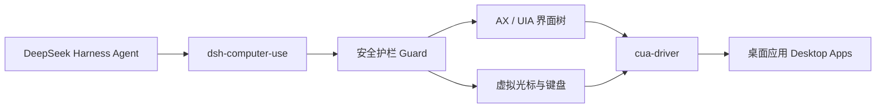

# dsh-computer-use

> **让 DeepSeek Harness 像人一样操作桌面。** 观察屏幕、定位界面元素、移动独立虚拟光标、点击、输入、滚动和拖拽。
>
> **Give DeepSeek Harness a safe, observable Computer Use layer.** Observe desktop applications, locate UI elements, and act through an isolated virtual cursor.

[](https://github.com/988hj7tczd-oss/dsh-computer-use/actions/workflows/ci.yml)
[](https://www.npmjs.com/package/dsh-computer-use)
[](https://www.npmjs.com/package/dsh-computer-use)
[](https://github.com/988hj7tczd-oss/dsh-computer-use)
[](LICENSE)
[](https://nodejs.org/)
[](#platform-support--平台支持)


> **真实演示 · Real demo:** a local, non-sensitive page was observed, filled, clicked, and verified through the Computer Use action loop.

**中文文档 · English documentation**

- [中文文档](#中文文档)
- [English Documentation](#english-documentation)

## 生态入口 · Ecosystem

| 入口 | 作用 | Link |
|---|---|---|
| **harness-desktop** | 开箱即用的 DeepSeek Harness 桌面客户端 · Ready-to-use desktop client | [下载 / Download](https://github.com/988hj7tczd-oss/harness-desktop/releases) |
| **AI House** | 发现 AI 工具、模型和 Agent · Discover AI tools and agents | [工具中心 / Tools](https://www.aibunkhouse.com/tools) |
| **npm** | 安装和查看包信息 · Install and inspect the package | [dsh-computer-use](https://www.npmjs.com/package/dsh-computer-use) |
| **awesome-dsh-plugin** | 发现更多 DeepSeek Harness 插件 · Discover more plugins | [Plugin list](https://github.com/988hj7tczd-oss/awesome-dsh-plugin) |
| **Gitee 镜像** | 国内访问入口 · China mirror | [Gitee](https://gitee.com/jerryweizhihao/dsh-computer-use) |

---

# 中文文档

## 这是什么？

`dsh-computer-use` 是 DeepSeek Harness 的跨平台 Computer Use 插件，为 AI Agent 增加一套可观察、可约束、可验证的桌面操作能力。

它不是传统的鼠标宏：Agent 必须先观察目标窗口，再基于新鲜快照执行动作。点击、双击和右键操作通过 cua-driver 的独立虚拟光标完成，用户可以看到操作过程，而不是让程序悄悄发送一串不可见事件。

适合用于：

- 让 DeepSeek Harness 操作原生 macOS、Windows 和 Linux 桌面应用；
- 操作 Electron、Canvas 或游戏等 Accessibility/AX 信息不完整的界面；
- 构建“打开应用 → 观察 → 点击 → 输入 → 再观察验证”的 Agent 闭环；
- 为桌面自动化、内部工具和个人工作流增加可审计的 Computer Use 执行层；
- 研究 Computer Use、视觉定位和安全护栏。

> 本项目是开源社区插件，不是 DeepSeek 官方产品，也不代表 DeepSeek 的官方立场。

## 为什么需要它？

普通文本 Agent 可以生成答案，但无法直接完成很多桌面任务。`dsh-computer-use` 把桌面交互拆成三个阶段：

```text
观察 Observation → 决策 Decision → 受约束执行 Guarded Action
```



核心原则：

1. **先观察，再操作**：没有新鲜观察快照时，动作会被拒绝；
2. **模型所见即所点**：元素编号和坐标来自同一窗口截图空间；
3. **语义优先**：优先使用 `element` 编号，坐标模式保留视觉操作自由度；
4. **失败关闭**：目标不明确、快照过期、应用不在白名单时不继续执行。

## 能力一览

| 能力 | 说明 |
|---|---|
| 屏幕观察 | 读取目标窗口元数据、Accessibility/AX/UIA 元素和坐标 |
| 三种观察模式 | `ax` 零视觉 Token、`native` 主模型直读图片、`vision` 视觉观察者 |
| 独立虚拟光标 | 点击、双击、右键会显示虚拟光标移动和操作过程，不抢用户真实鼠标 |
| 文本与快捷键 | 输入文本、发送 `return`、`cmd+c`、`ctrl+shift+p` 等按键 |
| 滚动与拖拽 | 支持上下左右滚动和窗口本地截图坐标拖拽 |
| 应用管理 | 列出运行中的应用，后台启动应用，按需前置窗口 |
| 安全护栏 | 快照 TTL、应用白名单、危险操作审批、密码框保护 |
| 跨平台 | macOS、Windows、Linux 均已完成插件测试 |

## 12 个模型工具

| 工具 | 作用 | 主要参数 |
|---|---|---|
| `screen_observe` | 获取窗口、AX/UIA 元素、坐标或截图 | `window`, `mode`, `query`, `maxElements` |
| `screen_zoom` | 截取并放大窗口局部区域 | `window_id`, `pid`, `x1`, `y1`, `x2`, `y2` |
| `computer_click` | 点击元素或截图坐标 | `element` 或 `x,y`，可选 `count` |
| `computer_double_click` | 双击元素或坐标 | `element` 或 `x,y` |
| `computer_right_click` | 右键点击元素或坐标 | `element` 或 `x,y` |
| `computer_type` | 向焦点或指定元素输入文本 | `text`, 可选 `element` |
| `computer_key` | 发送按键或快捷键 | `key`，例如 `return`、`cmd+c` |
| `computer_scroll` | 在目标窗口滚动 | `direction`, `amount`, 可选 `element` |
| `computer_drag` | 拖拽窗口中的区域 | `from_x`, `from_y`, `to_x`, `to_y` |
| `computer_wait` | 等待界面加载或动画完成 | `ms`，最大 60000 |
| `app_list` | 列出正在运行的应用 | 无 |
| `app_launch` | 启动应用 | `name` 或 `bundle_id`，可选 `bring_to_front` |

## 快速开始

### 方式一：使用 harness-desktop

普通桌面用户建议先下载 [harness-desktop](https://github.com/988hj7tczd-oss/harness-desktop/releases)。它是一个开箱即用的 DeepSeek Harness 桌面客户端，支持 macOS、Windows 和 Linux。

```text
1. 下载并启动 harness-desktop
2. 完成首启配置
3. 安装本插件
4. 重启 harness-desktop
5. 在对话中让 Agent 操作桌面
```

### 方式二：从 GitHub 源码安装

```bash
git clone https://github.com/988hj7tczd-oss/dsh-computer-use.git
cd dsh-computer-use

# 先预演，不写入配置
./install.sh --dry-run

# 安装到用户级 patch 层
./install.sh

# 安装后重启 harness-desktop
```

安装脚本只做两件事：

1. 将插件链接到 `$DSH_HOME/profiles/web/node_modules/dsh-computer-use`；
2. 在 `$DSH_HOME/cordis.patch.yml` 注册插件。

脚本使用用户级 patch 层，不修改项目代码，也不修改其他 profile 的配置。

### Windows / Linux

`install.sh` 默认使用 macOS 的 `DSH_HOME` 路径。Windows 或 Linux 用户请先指定自己的 DSH home：

```bash
export DSH_HOME="/path/to/your/dsh-home"
./install.sh --dry-run
./install.sh
```

如果系统不支持符号链接，请使用宿主 DSH 的插件管理方式，或按照 `docs/store-evidence.md` 中的手动安装说明操作。

### 方式三：npm 包

```bash
npm install -g dsh-computer-use
```

安装后仍需要让 DSH profile 加载该 bundle，并确认 `cua-driver` 已经安装且在 `PATH` 中，或设置：

```bash
export CUA_DRIVER_BIN=/path/to/cua-driver
```

安装完成后重启宿主，再通过 `app_list` 或 `screen_observe` 验证工具是否出现。

## 第一个完整任务

安装并授权后，可以让 Agent 执行下面的任务：

```text
请完成以下桌面任务：

1. 使用 app_list 列出正在运行的应用；
2. 使用 app_launch 打开一个普通桌面应用；
3. 使用 screen_observe 观察目标窗口；
4. 找到目标按钮，优先使用 element 编号点击；
5. 使用 computer_type 输入一段非敏感测试文本；
6. 再次使用 screen_observe 验证文本已经出现；
7. 如果界面发生变化，请重新观察，不要使用旧元素编号继续操作；
8. 如果动作被安全护栏拒绝，请报告拒绝原因，不要绕过护栏。
```

### 推荐的操作循环

```text
app_list / app_launch
        ↓
screen_observe
        ↓
computer_click / computer_type / computer_key
        ↓
computer_wait（如需等待）
        ↓
screen_observe 验证结果
```

每一次界面明显变化后，都应重新调用 `screen_observe`。元素编号属于某一次观察快照，不应跨页面、弹窗或长时间等待复用。

## 观察模式

`screen_observe` 的 `mode` 有三种选择：

| 模式 | 原理 | 成本 | 适用场景 |
|---|---|---|---|
| `ax`（默认） | 读取 AX/UIA 界面树并返回编号和坐标 | 不消耗视觉 Token | 原生应用、元素树完整的界面 |
| `native` | 将截图作为图片块交给当前对话模型 | 图片 Token；不额外调用视觉观察者 | Canvas、游戏、Electron 或 AX 树为空的界面 |
| `vision` | 通过 Harness 的 `ctx.llm` 调用视觉模型，返回结构化元素列表 | 额外一次视觉模型调用 | 当前主模型不支持图片输入时 |

### `native` 模式

当前对话模型必须声明支持 `image` 输入，例如视觉模型。插件通过 Harness attachments 传递图片，不额外发起独立视觉 API 请求。

```text
screen_observe(mode="native")
```

### `vision` 模式

默认观察模型为：

```text
provider: deepseek-official
model: deepseek-v4-flash-vision-exp
```

老版本 Harness 需要在模型配置中声明：

```yaml
models:
  - id: deepseek-v4-flash-vision-exp
    input: [text, image]
```

当 DeepSeek 视觉观察者不可用时，插件可以尝试 GLM 视觉兜底。GLM 兜底需要 `ZHIPU_API_KEY`，并可能受到免费模型访问量限制。

### 自动降级

当 AX/UIA 树为空时，插件会尝试：

```text
native（当前路由支持图片时）
  → vision（宿主存在可用视觉模型时）
  → ax（返回可用的界面树信息或明确错误）
```

## 坐标语义

从 v0.2.0 起，所有坐标均为：

> **窗口本地截图像素（window-local screenshot pixels）**

这意味着：

- 坐标原点在目标窗口左上角；
- `screen_observe` 输出的 `@(x,y)` 与 `computer_click(x=,y=)` 使用同一坐标系；
- 不需要乘以 2；
- 不需要加屏幕坐标或窗口偏移；
- 使用 `screen_zoom` 时，返回图片是局部区域，但点击仍应使用整窗截图坐标。

优先使用：

```text
computer_click(element=5)
```

只有在元素无法通过 AX/UIA 识别，或视觉模式给出坐标时，才使用：

```text
computer_click(x=640, y=420)
```

## 安全模型

### 已内置的安全机制

1. **无快照拒绝**：没有先调用 `screen_observe`，动作不会执行；
2. **观察快照 TTL**：快照过期后动作被拒绝，必须重新观察；
3. **应用白名单**：配置 `allowedApps` 后，只允许指定应用接受操作；
4. **危险操作审批**：元素标签命中删除、支付、购买、转账、退出登录等词时请求用户确认；
5. **密码框保护**：检测到 `AXSecureTextField` / `AXPasswordField` 时拒绝自动输入；
6. **固定 argv 调用**：通过宿主以非 shell 方式启动 `cua-driver`；
7. **权限边界声明**：插件本身不读取用户文件、不读取凭据、不发起普通网络请求，也没有 npm lifecycle 安装脚本。

### 重要限制

语义安全检测依赖观察到的元素标签，主要对 `element` 编号模式有效：

- `x/y` 坐标模式无法提前知道目标语义，主要依赖快照 TTL 和可见操作；
- `computer_type` 和 `computer_key` 作用于当前焦点时，无法预判最终目标内容；
- `computer_key` 不会阻止 `cmd+q`、`ctrl+alt+delete` 等系统快捷键；
- 不要把本插件的操作权限授予不可信 Agent；
- 密码、API Key 和其他敏感信息必须由用户本人输入。

## 配置

插件配置位于 DSH 的用户级 patch 层：

```yaml
- id: dsh-computer-use
  config:
    ttlMs: 30000
    maxElements: 500
    allowedApps: []
    cursorTheme: com.dsh.computeruse.rainbow
    nativeImage: auto
    visionProvider: deepseek-official
    visionModel: deepseek-v4-flash-vision-exp
```

| 配置项 | 默认值 | 说明 |
|---|---:|---|
| `ttlMs` | `30000` | 观察快照有效期，单位毫秒；多步任务建议显式设置 30000-60000 |
| `maxElements` | `500` | 单次观察最多返回的编号元素数量 |
| `allowedApps` | `[]` | 空数组表示不限制；非空时只允许列表中的应用 |
| `cursorTheme` | `com.dsh.computeruse.rainbow` | 虚拟光标主题；空字符串使用引擎默认主题 |
| `nativeImage` | `auto` | `auto` 自动降级；`full` 原图；`compact` 始终使用小图 |
| `visionProvider` | `deepseek-official` | `vision` 模式使用的 provider |
| `visionModel` | `deepseek-v4-flash-vision-exp` | `vision` 模式使用的视觉模型 |

> 安装脚本或 bundle patch 可能覆盖代码层默认值。请以实际生成的 `$DSH_HOME/cordis.patch.yml` 为准；多步任务建议显式写入 `ttlMs`，不要依赖隐式默认值。

## 平台支持 · Platform Support

| 平台 | 状态 | 说明 |
|---|---|---|
| macOS | ✅ 已测试 | 可能需要 Accessibility 和 Screen Recording 权限 |
| Windows | ✅ 已测试 | 使用普通用户桌面会话；管理员权限窗口属于系统边界 |
| Linux | ✅ 已测试 | 桌面环境、Accessibility 栈和窗口管理器可能影响元素识别 |

测试通过不代表所有应用的界面树都完全一致。AX/UIA 不完整时，请使用 `native` 或 `vision` 模式，并在提交问题时附上操作系统、目标应用和 `screen_observe` 输出。

## 故障排查

| 现象 | 常见原因 | 处理方式 |
|---|---|---|
| `cua-driver not found` | 引擎不在 PATH | 安装 cua-driver，或设置 `CUA_DRIVER_BIN` |
| 没有可见窗口 | 图形会话或窗口权限不可用 | 确认目标应用正在运行并重新观察 |
| 快照已过期 | 超过 `ttlMs` | 重新调用 `screen_observe` |
| 元素编号点击失败 | 界面已经变化 | 重新观察后再使用新编号 |
| AX/UIA 树为空 | Canvas、游戏、Electron 或特殊窗口 | 使用 `native` 或 `vision` |
| native 被拒绝 | 当前主模型没有 image 输入能力 | 切换视觉模型或使用 `vision` |
| vision 模型不可用 | provider/model 未注册 image 输入 | 配置 `visionProvider` / `visionModel` |
| GLM fallback 不可用 | 没有 `ZHIPU_API_KEY` 或遇到限流 | 配置 Key，或使用 Harness 视觉模型 |
| 危险操作被拒绝 | 需要用户审批 | 检查审批提示，不要绕过安全护栏 |
| Windows 管理员窗口无法操作 | 目标窗口权限级别更高 | 使用普通用户窗口 |

## 开发与验证

项目使用隔离 profile 开发，避免污染真实 GUI 配置：

```bash
npm install
npm run check

# 运行时验证需要已安装 harness-desktop 和 cua-driver
node verify-runtime.mjs
```

macOS headless 验证示例：

```bash
DSH_HOME=$PWD/.dsh-p0 ELECTRON_RUN_AS_NODE=1 \
  /Applications/harness-desktop.app/Contents/MacOS/harness-desktop --expose-internals \
  /Applications/harness-desktop.app/Contents/Resources/app/node_modules/@deepseek-ai/dsh/lib/bin.js \
  --profile test "请调用 screen_observe 观察当前窗口并报告"
```

更多证据：

- [权限声明](PERMISSIONS.md)
- [验证报告](VERIFICATION.md)
- [Windows 测试指南](WINDOWS_TEST.md)
- [Store 安装证据](docs/store-evidence.md)
- [运行时验证脚本](verify-runtime.mjs)

## 相关项目

- [harness-desktop](https://github.com/988hj7tczd-oss/harness-desktop)：开箱即用的 DeepSeek Harness 桌面客户端；
- [awesome-dsh-plugin](https://github.com/988hj7tczd-oss/awesome-dsh-plugin)：DeepSeek Harness 插件精选列表；
- [AI House 工具中心](https://www.aibunkhouse.com/tools)：发现更多 AI 工具、模型和 Agent；
- [cua-driver](https://github.com/trycua/cua)：底层跨平台桌面驱动；
- [npm package](https://www.npmjs.com/package/dsh-computer-use)：安装包和版本信息；
- [Gitee mirror](https://gitee.com/jerryweizhihao/dsh-computer-use)：国内镜像。

## License

[MIT License](LICENSE)

---

# English Documentation

## What is dsh-computer-use?

`dsh-computer-use` is a cross-platform Computer Use plugin for DeepSeek Harness. It gives an AI agent an observable, guarded, and verifiable desktop action layer.

The plugin is designed around an explicit loop:

```text
Observe → Decide → Execute with Guardrails → Observe and Verify
```

It can inspect desktop windows, expose actionable AX/UIA elements, use a screenshot-based visual fallback, and operate through an isolated virtual cursor. It is useful for desktop automation, Computer Use research, internal workflows, and agentic applications that need bounded desktop actions.

> This is a community plugin, not an official DeepSeek product and not affiliated with DeepSeek.

## Highlights

- Observe native desktop windows and accessibility trees;
- Use `ax`, `native`, or `vision` observation modes;
- Click, double-click, right-click, type, press keys, scroll, and drag;
- Launch applications and list running applications;
- Bind actions to fresh observation snapshots;
- Restrict actions to an application allowlist;
- Request approval for risky semantic targets;
- Refuse automated typing into password fields;
- Fall back to screenshots when AX/UIA data is incomplete;
- Tested on macOS, Windows, and Linux.

## Quick Start

### Recommended desktop experience

Download [harness-desktop](https://github.com/988hj7tczd-oss/harness-desktop/releases), the ready-to-use DeepSeek Harness desktop client. After the host is installed, install this plugin and restart the host.

### Install from source

```bash
git clone https://github.com/988hj7tczd-oss/dsh-computer-use.git
cd dsh-computer-use

./install.sh --dry-run
./install.sh
```

The installer creates a user-level plugin link and registers the bundle in the DSH home patch layer. It does not modify project source files or other profiles.

On Windows or Linux, set `DSH_HOME` to the actual DSH home directory before running the script:

```bash
export DSH_HOME="/path/to/your/dsh-home"
./install.sh
```

### Install the npm package

```bash
npm install -g dsh-computer-use
```

Make sure the host loads the bundle and that `cua-driver` is available in `PATH`, or set `CUA_DRIVER_BIN` to its absolute path.

## Tools

| Tool | Purpose | Main parameters |
|---|---|---|
| `screen_observe` | Observe a window, AX/UIA elements, coordinates, or a screenshot | `window`, `mode`, `query`, `maxElements` |
| `screen_zoom` | Capture a smaller region for visual inspection | `window_id`, `pid`, `x1`, `y1`, `x2`, `y2` |
| `computer_click` | Click an element or screenshot coordinate | `element` or `x,y`; optional `count` |
| `computer_double_click` | Double-click an element or coordinate | `element` or `x,y` |
| `computer_right_click` | Right-click an element or coordinate | `element` or `x,y` |
| `computer_type` | Type into the focused or selected field | `text`, optional `element` |
| `computer_key` | Send a key or shortcut | `key`, e.g. `return`, `cmd+c` |
| `computer_scroll` | Scroll a target window | `direction`, `amount`, optional `element` |
| `computer_drag` | Drag between screenshot coordinates | `from_x`, `from_y`, `to_x`, `to_y` |
| `computer_wait` | Wait for a page load or animation | `ms`, max 60000 |
| `app_list` | List running applications | none |
| `app_launch` | Launch an application | `name` or `bundle_id`; optional `bring_to_front` |

## The standard action loop

```text
app_list / app_launch
        ↓
screen_observe
        ↓
computer_click / computer_type / computer_key
        ↓
computer_wait
        ↓
screen_observe to verify the result
```

A snapshot is observation-local. If the UI changes, observe again before using an element index or coordinate from the previous state.

## Observation modes

| Mode | How it works | Best for |
|---|---|---|
| `ax` | Returns a compact AX/UIA tree with indexed elements and coordinates | Native applications with usable accessibility data |
| `native` | Returns the screenshot as an image block for the current multimodal model | Canvas, games, Electron, or windows with incomplete AX/UIA data |
| `vision` | Uses a Harness `ctx.llm` vision model to describe the screenshot | Text-only main models that need a separate observer |

`native` requires the current route to declare image input support. `vision` uses the configured `visionProvider` and `visionModel`; the default model is `deepseek-v4-flash-vision-exp`. The optional GLM fallback requires `ZHIPU_API_KEY` and may be rate-limited.

When the accessibility tree is empty, the fallback order is:

```text
native → vision → ax
```

The plugin chooses a path that is available and returns an explicit error when no visual route can be used.

## Coordinate semantics

Since v0.2.0, all coordinates are **window-local screenshot pixels**:

- the origin is the top-left corner of the target window;
- coordinates returned by `screen_observe` and coordinates accepted by `computer_click` share the same space;
- do not multiply by two;
- do not add a screen or window offset;
- `screen_zoom` returns a cropped image, but click coordinates remain coordinates in the full-window screenshot space.

Prefer semantic element actions:

```text
computer_click(element=5)
```

Use `x,y` when the target is not exposed through AX/UIA or when a visual observer provides coordinates.

## Security model

The plugin includes:

1. **Observe-before-act**: actions without a fresh observation are rejected;
2. **Snapshot TTL**: expired snapshots require a new observation;
3. **Application allowlists**: `allowedApps` can restrict the operation scope;
4. **Risky-action approval**: labels such as delete, pay, purchase, transfer, or sign out can require user approval;
5. **Password-field protection**: automated typing into password fields is refused;
6. **Fixed non-shell driver invocation**: the host starts `cua-driver` with fixed argv;
7. **Explicit permission boundaries**: the plugin does not read user files, credentials, or use npm lifecycle scripts.

Semantic checks are strongest for `element`-based actions. Coordinate actions and unfocused `computer_type`/`computer_key` calls cannot predict the final semantic target. `computer_key` does not validate system shortcuts. Do not give this capability to an untrusted agent, and always type passwords and secrets yourself.

## Configuration

```yaml
- id: dsh-computer-use
  config:
    ttlMs: 30000
    maxElements: 500
    allowedApps: []
    cursorTheme: com.dsh.computeruse.rainbow
    nativeImage: auto
    visionProvider: deepseek-official
    visionModel: deepseek-v4-flash-vision-exp
```

| Option | Default | Description |
|---|---:|---|
| `ttlMs` | `30000` | Observation lifetime in milliseconds |
| `maxElements` | `500` | Maximum indexed elements returned by observation |
| `allowedApps` | `[]` | Empty means unrestricted; otherwise only listed apps are allowed |
| `cursorTheme` | `com.dsh.computeruse.rainbow` | Virtual cursor theme; empty uses the engine default |
| `nativeImage` | `auto` | `auto`, `full`, or `compact` screenshot strategy |
| `visionProvider` | `deepseek-official` | Provider used by `vision` mode |
| `visionModel` | `deepseek-v4-flash-vision-exp` | Image-capable observer model |

If an installer or bundle patch overrides the code-level default, the generated `$DSH_HOME/cordis.patch.yml` is authoritative. For multi-step tasks, set `ttlMs` explicitly instead of relying on an implicit default.

## Platform support

| Platform | Status | Notes |
|---|---|---|
| macOS | ✅ Tested | Accessibility and Screen Recording permissions may be required |
| Windows | ✅ Tested | Use a regular-user desktop session; elevated windows remain a system boundary |
| Linux | ✅ Tested | Desktop environment, accessibility stack, and window manager can affect element discovery |

All three platforms have passed plugin testing. This does not mean every application exposes an identical accessibility tree. For incomplete AX/UIA data, use `native` or `vision` and include the OS, target application, and observation output in bug reports.

## Troubleshooting

| Symptom | Likely cause | Action |
|---|---|---|
| `cua-driver not found` | Driver is not in `PATH` | Install it or set `CUA_DRIVER_BIN` |
| No visible windows | Missing graphical session or permission | Confirm the target app is visible and observe again |
| Snapshot expired | `ttlMs` elapsed | Call `screen_observe` again |
| Element click failed | The UI changed | Observe again and use the new index |
| Empty AX/UIA tree | Canvas, game, Electron, or special window | Use `native` or `vision` |
| `native` rejected | Main route is not image-capable | Switch to an image-capable model or use `vision` |
| Vision model unavailable | Provider/model lacks image input declaration | Configure `visionProvider` / `visionModel` |
| GLM fallback unavailable | Missing `ZHIPU_API_KEY` or rate limit | Configure the key or use a Harness vision model |
| Risky action rejected | User approval was not granted | Follow the approval result; do not bypass the guard |
| Windows elevated window rejected | Target has a higher privilege level | Use a regular-user window |

## Development and verification

```bash
npm install
npm run check
node verify-runtime.mjs
```

The runtime verification requires a working `harness-desktop` installation and `cua-driver`. Additional evidence is available in:

- [PERMISSIONS.md](PERMISSIONS.md)
- [VERIFICATION.md](VERIFICATION.md)
- [WINDOWS_TEST.md](WINDOWS_TEST.md)
- [docs/store-evidence.md](docs/store-evidence.md)
- [verify-runtime.mjs](verify-runtime.mjs)

## Ecosystem

- [harness-desktop](https://github.com/988hj7tczd-oss/harness-desktop) — a ready-to-use DeepSeek Harness desktop client;
- [awesome-dsh-plugin](https://github.com/988hj7tczd-oss/awesome-dsh-plugin) — a curated list of DeepSeek Harness plugins;
- [AI House Tools](https://www.aibunkhouse.com/tools) — discover AI tools, models, and agents;
- [cua-driver](https://github.com/trycua/cua) — the underlying cross-platform desktop driver;
- [npm package](https://www.npmjs.com/package/dsh-computer-use) — package versions and downloads;
- [Gitee mirror](https://gitee.com/jerryweizhihao/dsh-computer-use) — China mirror.

## License

[MIT License](LICENSE)

---

Not affiliated with DeepSeek. DeepSeek Harness is an open-source project by [DeepSeek AI](https://deepseek.com).
