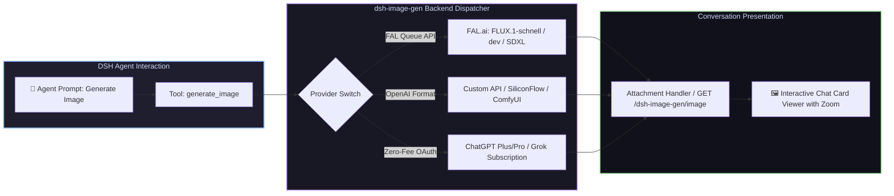

# 📦 @goodandready/dsh-image-gen

<div align="center">

<h3>Native Image Generation Tool with FAL Queue, OpenAI APIs, and Subscription Backends</h3>

<p align="center">
  <a href="https://www.npmjs.com/package/@goodandready/dsh-image-gen"></a>
  <a href="LICENSE"></a>
  <a href="https://github.com/topics/dsh-plugin"></a>
  <a href="https://nodejs.org"></a>
</p>

<p align="center">
  <a href="https://goodandready.app/"></a>
</p>

<p align="center">
  <a href="README.md"><b>🇬🇧 English</b></a> •
  <a href="README.ru.md"><b>🇷🇺 Русский</b></a> •
  <a href="README.zh.md"><b>🇨🇳 中文说明</b></a>
</p>

</div>

---

## ⚡ Overview

**`dsh-image-gen`** gives your **DeepSeek Harness** agent a versatile `generate_image` tool and puts the generated artwork directly where it belongs — in the conversation stream with responsive zoom, metadata inspection, and one-click download.

Which service actually draws the picture is a setting, not a code rewrite: switch seamlessly between FAL queue infrastructure, arbitrary OpenAI-compatible endpoints, or personal ChatGPT/Grok subscriptions.



---

## 🎨 Supported Generation Backends

| Provider | Backend Service | Credential Requirement | Description & Models |
|---|---|---|---|
| `fal` (default) | [FAL.ai](https://fal.ai) Queue | `FAL_API_KEY` | Ultra-fast queue inference (`fal-ai/flux-2/klein/9b`, `FLUX.1-schnell`, `SDXL`) |
| `custom` | OpenAI-compatible Image API | `OPENAI_API_KEY` (or custom) | Connect DALL-E 3, SiliconFlow, Together, or local ComfyUI/Automatic1111 |
| `codex` | ChatGPT Subscription (`gpt-image-2`) | *None (OAuth)* | Uses connected ChatGPT account in `dsh-subscriptions` without API fees |
| `grok` | Grok Subscription (`grok-imagine-image-2.0`) | *None (OAuth)* | Uses connected Grok account in `dsh-subscriptions` without API fees |

---

## 📐 Named Sizes Translation Matrix

The agent specifies sizes in universal human-readable names (`image_size`). The plugin automatically translates them according to the active provider's native format:

| Named Size | FAL Native Name | OpenAI / Custom Pixels | Grok Aspect Ratio |
|---|---|---|---|
| `square_hd` (default) | `square_hd` | `1024x1024` | `1:1` |
| `square` | `square` | `512x512` | `1:1` |
| `landscape_4_3` | `landscape_4_3` | `1024x768` | `4:3` |
| `landscape_16_9` | `landscape_16_9` | `1792x1024` | `16:9` |
| `portrait_4_3` | `portrait_4_3` | `768x1024` | `3:4` |
| `portrait_16_9` | `portrait_16_9` | `1024x1792` | `9:16` |

> [!TIP]
> If a custom endpoint has strict non-standard size requirements, configure `customSize` (e.g. `1280x720`) in settings to send that exact string verbatim.

---

## 🔑 Zero-Fee Subscription Drawing (`codex` & `grok`)

`codex` and `grok` require **no API keys**. They borrow an active session from [`dsh-subscriptions`](https://github.com/GooDAnDReaDY/dsh-subscriptions):
* **In-Process Communication**: The two plugins interact via internal Cordis service calls inside the Node process rather than over the network, ensuring OAuth session tokens never leave the host.
* **Subscription Quality**: Control rendering detail via `subscriptionQuality` (`low`, `medium`, `high`, or vendor default).
* **Graceful Fallback**: If `dsh-subscriptions` is not installed or no account is connected, the tool returns an informative warning instead of failing silently.

---

## 📦 Delivery Modes: `link` vs `image`

| Feature Comparison | `link` Mode (Default) | `image` Mode |
|---|---|---|
| **What the chat model receives** | Text and an attachment link | Raw image binary payload |
| **Rendered in Web UI** | Yes, full-width interactive card | Yes |
| **Works with text-only chat models** | **Yes, fully standalone** | Requires [`dsh-vision-bridge`](https://github.com/GooDAnDReaDY/dsh-vision-bridge) |
| **Model can reason about the picture** | Based on prompt and link text | Full visual multimodal reasoning |
| **Storage link durability** | Permanent host route (`GET /image`) | Provider CDN (temporary expiry) |

> [!NOTE]
> Choose `image` mode when you want multi-turn visual discussions (e.g. "make the background darker"). When using a text-only LLM, combine with `dsh-vision-bridge` so the model receives structured descriptions without crashing.

---

## 🎮 Usage Examples & Prompting

Ask your agent naturally:
> "Generate an image: neon cyberpunk street in Tokyo at night during rain, reflections in puddles, 16:9"

### Tool Parameters

| Parameter | Type | Description |
|---|---|---|
| `prompt` | `string` (Required) | Detailed text prompt describing the desired image |
| `image_size` | `string` | `square_hd`, `square`, `landscape_4_3`, `landscape_16_9`, `portrait_4_3`, `portrait_16_9` |
| `seed` | `number` | Deterministic seed for reproducible artwork |
| `output_format` | `string` | File format: `png` (default), `jpeg`, or `webp` |
| `output_name` | `string` | Custom output filename without extension |

---

## 📦 Quick Installation

```bash
# From npm:
dsh plugin --profile web add @goodandready/dsh-image-gen

# From GitHub:
dsh plugin --profile web add github:GooDAnDReaDY/dsh-image-gen
```

---

## ⚙️ Configuration Recipes (`settings.yaml`)

### 1. FAL.ai Configuration (Default)
```yaml
dsh-image-gen:
  provider: fal
  model: fal-ai/flux-2/klein/9b
  apiKeyEnv: FAL_API_KEY
  defaultSize: landscape_4_3
  defaultFormat: png
  outputDir: generated/images
```

### 2. OpenAI / SiliconFlow Endpoint
```yaml
dsh-image-gen:
  provider: custom
  customBaseURL: https://api.siliconflow.cn/v1
  customModel: black-forest-labs/FLUX.1-schnell
  customKeyEnv: SILICONFLOW_API_KEY
  defaultSize: square_hd
```

### 3. Local ComfyUI / Gateway (No Authentication)
```yaml
dsh-image-gen:
  provider: custom
  customBaseURL: http://127.0.0.1:8188/v1
  customModel: sd-xl-base-1.0
  customKeyEnv: ""   # Empty means no Authorization header
```

### 4. ChatGPT / Grok Subscription
```yaml
dsh-image-gen:
  provider: codex   # or 'grok'
  subscriptionQuality: high
  defaultSize: landscape_16_9
```

---

## 🖼️ Why the Plugin Ships its Own Tool Card

Standard DSH tool result cards only render raw JSON. `dsh-image-gen` registers a keyed `tool.call.toolview` entry for `generate_image` and serves generated files from its authenticated route (`GET /dsh-image-gen/image`), displaying the full image directly in the conversation flow.

---

## 🔄 Upgrading from `dsh-fal-image-gen`

Installing `@goodandready/dsh-image-gen` automatically migrates your previous configuration namespace, and legacy image links in past conversations remain fully visible without breaking.

---

## 📄 License

MIT © [GooDAnDReaDY](https://github.com/GooDAnDReaDY)
