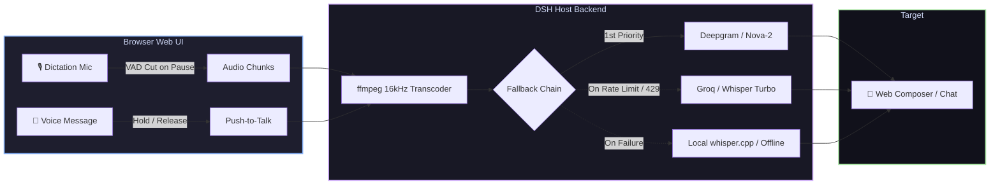

# 📦 @goodandready/dsh-voice

<div align="center">

<h3>Zero-Latency Streaming Dictation & Multi-Provider Voice Input for DeepSeek Harness</h3>

<p align="center">
  <a href="https://www.npmjs.com/package/@goodandready/dsh-voice"></a>
  <a href="LICENSE"></a>
  <a href="https://github.com/topics/dsh-plugin"></a>
  <a href="https://nodejs.org"></a>
</p>

<p align="center">
  <a href="https://goodandready.app/"></a>
</p>

<p align="center">
  <a href="README.md"><b>🇬🇧 English</b></a> •
  <a href="README.ru.md"><b>🇷🇺 Русский</b></a> •
  <a href="README.zh.md"><b>🇨🇳 中文说明</b></a>
</p>

</div>

---

## ⚡ Overview

**`dsh-voice`** brings voice superpowers to the **DeepSeek Harness** Web UI. Whether you need hands-free real-time streaming dictation segmented on natural breath pauses or crisp voice notes with keyboard/mouse Push-to-Talk gestures, `dsh-voice` ensures your audio is never lost thanks to **automatic multi-provider fallback chains**.



---

## ✨ Key Features

* 🎙️ **Streaming Dictation with VAD**: Speech is automatically sliced at natural pauses (`vadSilenceMs`, default 700ms) and typed into the composer in real time.
* 🌊 **Voice Notes with Cancel Window**: Record your thought and have it automatically dispatched to the agent after a safety countdown (`autoSendMs`, default 4000ms).
* 🎮 **Tactile Push-to-Talk**:
  * **Mouse**: Hold the wave button — releasing sends the message; dragging pointer away discards.
  * **Keyboard**: Hold <kbd>Ctrl</kbd> (or custom hotkey) for hands-free speaking; press <kbd>Esc</kbd> to cancel.
* ⚡ **Zero-Latency In-Browser Captions (`browser`)**: Chrome Web Speech API recognition runs 100% locally with live floating captions as you speak.
* 🛡️ **Ironclad Multi-Provider Fallbacks**: If your primary cloud provider runs out of credits or hits a 429 rate limit, requests seamlessly fail over down the chain.
* 🔒 **Zero API Key Leakage**: Keys are resolved on the host via `ctx.credentials` (`credentialRef`) and never transmitted to browser clients.
* 🖥️ **Offline Local Whisper Server**: Automatically boots and manages [whisper.cpp](https://github.com/ggerganov/whisper.cpp) (`whisper-server`) with on-the-fly `ffmpeg` transcode.

---

## 🎮 Four Ways to Speak

| Mode | Gesture / Trigger | Behavior |
|---|---|---|
| **Dictation** | Click <kbd>🎙️ Mic</kbd> | Speech is sliced on pauses (`vadSilenceMs`) and typed live into composer |
| **Voice Message** | Click <kbd>🌊 Wave</kbd> | Records until stopped, then sends after cancel window (`autoSendMs`) |
| **Mouse PTT** | Hold <kbd>🌊 Wave</kbd> | Records while held; release sends message, drag off button to discard |
| **Keyboard PTT** | Hold <kbd>Ctrl</kbd> | Hands-free recording; release sends message, press <kbd>Esc</kbd> to discard |

> [!TIP]
> You can customize the keyboard modifier in settings (`hotkey`: `Control`, `Alt`, `Shift`, or any `KeyboardEvent.code`).

---

## 🛠️ Supported Providers Matrix

| Provider Key | Service Backend | Default Model | Credential Ref | Features & Notes |
|---|---|---|---|---|
| `browser` | Web Speech API | Native Browser | *None* | Zero latency, floating live captions in Chrome |
| `deepgram` | Deepgram API | `nova-2` | `DEEPGRAM_API_KEY` | Ultra-fast cloud transcription |
| `groq` | Groq Whisper | `whisper-large-v3-turbo` | `GROQ_API_KEY` | Near-instant inference speed |
| `hf` | HuggingFace Inference | `openai/whisper-large-v3` | `HF_TOKEN` | High-accuracy open Whisper |
| `local-whisper` | Local whisper.cpp | Server defined | *None* | 100% private, offline, no internet needed |

### 🚀 Ready-Made Presets (Plug & Play)

Just specify the name in your fallback chain and add the corresponding API key:
* `openai` (`whisper-1`) → `OPENAI_API_KEY`
* `siliconflow` (`SenseVoiceSmall`) → `SILICONFLOW_API_KEY`
* `mistral` (`voxtral-mini-latest`) → `MISTRAL_API_KEY`
* `openrouter` (`google/gemini-2.5-flash`) → `OPENROUTER_API_KEY`
* `deepinfra` (`whisper-large-v3-turbo`) → `DEEPINFRA_API_KEY`
* `fireworks` (`whisper-v3-turbo`) → `FIREWORKS_API_KEY`

---

## 📦 Quick Installation

```bash
dsh plugin --profile web add @goodandready/dsh-voice
```

> [!IMPORTANT]
> Restart DSH Web UI after installation (`systemctl --user restart dsh-web`) and refresh your browser tab.

---

## ⚙️ Configuration

Open **Settings → Plugins → Plugin settings → Voice** in the Web UI:

```yaml
- id: dsh-voice
  config:
    dictation:
      language: ru
      vadSilenceMs: 700
      chain:
        - provider: deepgram
        - provider: groq
        - provider: local-whisper
    message:
      language: ru
      autoSendMs: 4000
      chain:
        - provider: openai
        - provider: local-whisper
    hotkey: Control
    autoStart: true
    whisperModel: /models/ggml-medium-q8_0.bin
```

---

## 🤖 Agent Tool & HTTP API

### Agent Tool (`transcribe_audio`)
Registers `transcribe_audio(file_path, language?)` in `ctx.tools`, allowing agents to analyze audio files, interview recordings, and voice notes directly from disk.

### Internal HTTP Endpoints
* `POST /dsh-voice/transcribe` — `{ dataBase64, mimeType, mode }` → `{ ok, text, provider, tookMs }`
* `GET /dsh-voice/status` — Returns whisper daemon status and active fallback chains.

---

## 📄 License

MIT © [GooDAnDReaDY](https://github.com/GooDAnDReaDY)
