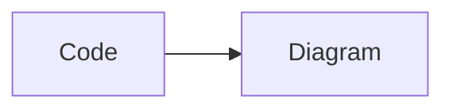

# dsh-mermaid

[简体中文](README.zh-CN.md) | English

Render Mermaid fenced code blocks in DeepSeek Harness Web as SVG diagrams with a **Diagram / Code** toggle. The plugin supports streaming responses, dark mode, fullscreen viewing, zoom and pan, SVG export, and automatic fallback to source code when rendering fails.

[](https://www.npmjs.com/package/dsh-mermaid)

## Features

- Supports `mermaid`, `mermaidjs`, and `mmd` fenced code blocks
- Works with the DSH/Shiki plain fallback, where code elements may not have a language class
- Bundles the exact Mermaid `11.17.0` release and requires no runtime CDN
- Loads the bundled Mermaid runtime from DSH only after the first Mermaid block is detected
- Renders multiple diagrams through a serial queue and yields between renders to keep the page responsive
- Uses Mermaid's `securityLevel: strict`
- Opens rendered diagrams in a fullscreen viewer with zoom, pan, reset, and fit-to-window controls
- Exports the rendered diagram as a standalone SVG file from the card's **More** menu
- Enhances only `<pre><code>` blocks and ignores inline code
- Prevents stale asynchronous renders from overwriting newer streaming content
- Rejects individual diagrams over 50,000 characters or 2,000 lines before invoking Mermaid

## Compatibility

Last verified with `@deepseek-ai/dsh 0.1.0-rc.7` on 2026-08-24 using Node.js 22.23.2. DSH is currently a developer preview and may introduce compatibility-breaking changes; please open an issue if a newer DSH release changes its plugin loader or Markdown DOM.

## Install

If `dsh` is available globally, install the stable npm release with:

```powershell
dsh plugin --profile web add -w dsh-mermaid
```

Without a global `dsh` command, invoke DSH through npx:

```powershell
npx.cmd --yes @deepseek-ai/dsh plugin --profile web add -w dsh-mermaid
```

DSH installs the package through pnpm, detects its `dsh.bundle` declaration, and automatically adds `dsh-mermaid` to the web profile bundle list. Restart DSH Web or refresh the page after installation.

### Install the latest GitHub source

```powershell
npx.cmd -y github:MrmoLabs/dsh-mermaid install
```

This runs the repository's `dsh-mermaid` installer, which asks DSH to install the GitHub source into the web profile. GitHub installation builds the package during installation. If pnpm reports that it blocked a build script, add the exact package key shown by pnpm to `allowBuilds` in the profile's `pnpm-workspace.yaml`, then run the command again. Prefer the npm release for normal use.

## Update and uninstall

Update the npm release:

```powershell
dsh plugin --profile web update -w dsh-mermaid
```

Uninstall:

```powershell
dsh plugin --profile web remove -w dsh-mermaid
```

Restart DSH Web after updating or uninstalling.

## Usage

Ask a model to output a Mermaid fenced code block:

````markdown

````

The code block receives **Diagram / Code** controls and opens in diagram view by default.

## Develop from source

Node.js 22.19 or later is required.

```powershell
npm.cmd install
npm.cmd run check
npm.cmd run build
dsh plugin --profile web add -w .
```

Build output is written to `lib/`. The lightweight `client.js` bootstrap is registered with the DSH client module loader as `dsh-mermaid`, while the bundled Mermaid runtime is served from the plugin's same-origin host route and loaded on demand. DSH resolves the relative installation path against the current plugin checkout.

For manual local development, the built package can also be copied to:

```text
C:\Users\<username>\.dsh\profiles\web\node_modules\dsh-mermaid
```

Never commit the complete `.dsh` directory. It may contain conversations and credentials.

## Release checks

```powershell
npm.cmd run check
npm.cmd run build
npm.cmd pack --dry-run
git status --short
git diff --cached
```

## License

[MIT](LICENSE)
