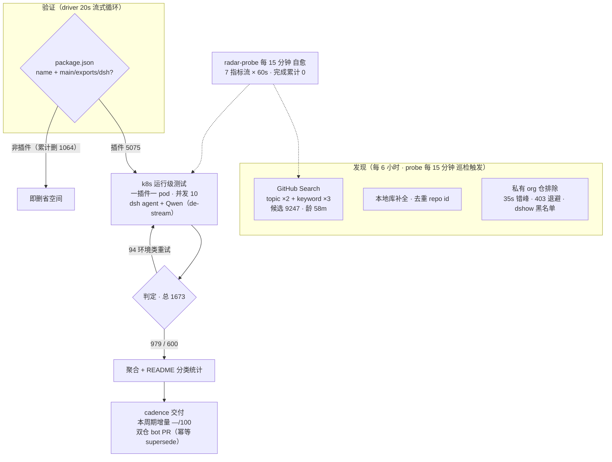

# Awesome DSH Plugins

   
  
 

  

**自动发现、证据验证的 DeepSeek Harness 插件生态雷达。自动发现 9200+ 候选、逐个 k8s 实测**

安装前就知道哪个能用，不用自己踩坑。

    

   

简体中文 | [English](README.en-US.md)

---

> 收录 5075 个 DSH 插件仓库（索引到9247个repos，正由专用K8s集群，动态在DSH最新版本下验证可用性，目前高速迭代中）。

## 工作原理

> 数据截至快照 `20260818T190001Z`（2026-08-19 03:00:01 UTC+8 · 分类器 unified-v2-bridge）

<!-- AUTO:pipeline:START -->

<!-- AUTO:pipeline:END -->

**🔌 开源计划 — 本页数据由「DSH 插件雷达」服务管线自动生产，服务雷达源码正在优化中，稳定后将分阶段开源：**

| 阶段 | 开源内容 | 状态 |
|---|---|---|
| Phase 1 | 管线文档：[总览与路线图](docs/radar/overview.md) · [架构](docs/radar/architecture.md) · [数据契约](docs/radar/data-contracts.md) | ✅ 已开源 |
| Phase 2 | 雷达引擎源码（发现 · 聚合 · 渲染 · 分发） | 🔜 稳定后开源 |
| Phase 3 | 测试引擎源码：轻量版（无需 k8s · 本地直跑）· 服务器版（k8s 集群） | 🔜 稳定后开源 |

## 快速导航

| 你的目标 | 跳转入口 |
|---|---|
| 看精选插件 | [精选插件榜](#精选插件榜) — rc.8 实测可用 · 类序星标降序 |
| 按用途找一个插件 | [分类目录](#分类目录) — 13 类功能领域 · 逐插件明细见 [PLUGINS-ALL.md](PLUGINS-ALL.md)；[PLUGINS.md](PLUGINS.md) 为 PR 登记清单 |
| 浏览自动发现的全部仓库 | [ 当前生态快照](#当前生态快照) — 日期化兼容矩阵 |
| 了解最近发生了什么 | [ CHANGELOG](CHANGELOG.md) |
| 登记或提交插件 | [ 给插件开发者](#给插件开发者) · 加 `dsh-plugin` topic → 8h 自动收录 · [PR 模板](.github/PULL_REQUEST_TEMPLATE.md) |
| 了解本雷达与开源计划 | [ 雷达总览与路线图](docs/radar/overview.md) · 架构与数据契约见 [docs/radar/](docs/radar/) |
| 给插件使用者指南 | [ 给插件使用者](#给插件使用者) |
| 本仓库如何判定兼容性 | [ 本仓库如何判定](#本仓库如何判定) |
| 加入社群交流 | [ DSH 学习社区](#dsh-学习社区-dshfindcom) · [社区讨论群](#社区讨论群) |

> [!IMPORTANT]
> **收录不等于兼容，静态检查不等于运行可用，运行可用也不等于安全审计。**
> 本仓库提供可追溯的筛选信号，不代表 DSH 官方背书。安装第三方插件前，请检查插件源码、权限、依赖、许可证及测试日期。

## 精选插件榜

<!-- AUTO:featured:START -->

> 人工策展 50 款 rc.8 实测可用插件（v4flash 全量重测通过者，2026-08-21），类序与类内均按星标降序；星标每 6 小时自动刷新（成员调整请提 PR 修改 data/awesome-50.json）。数据截至 2026-08-24 10:00（UTC+8）。

### 🚀 智力增强 Booster（6）

| 插件 | ⭐ | rc.8 实测 | 说明 |
|---|---:|---|---|
| [dsh-routing-suite](https://github.com/yjh051108/dsh-routing-suite) | 6709 | — | 注入器 × 思维模式路由套装：免重启运行时注入器 + 任务感知推理模式路由预设（P1-P23 实测） |
| [harmony-next.skills](https://github.com/linhay/harmony-next.skills) | 336 | ✅ | 技能驱动的工作流增强 |
| [superpowers-dsh](https://github.com/LayneChai/superpowers-dsh) | 84 | ✅ | TDD/调试/计划等开发技能集 |
| [forkprobe](https://github.com/Jayden-X-L/forkprobe) | 70 | ✅ | 同一任务跑多个技能对比，自动选优 |
| [dsh-tool-turbo](https://github.com/Electricitysheep/dsh-tool-turbo) | 7 | ✅ | 按轮次自动优化 reasoning_effort（推理力度） |
| [dsh-reasoning-settings](https://github.com/JuneLearn/dsh-reasoning-settings) | 6 | ✅ | 推理设置控制：让模型按任务切换思考档位 |

### 🖥 界面与工作台（7）

| 插件 | ⭐ | rc.8 实测 | 说明 |
|---|---:|---|---|
| [dsh-web-ui](https://github.com/zhu1090093659/dsh-web-ui) | 5762 | ✅ | Web UI 增强与皮肤合集：任务看板、Git 图、移动端、皮肤中心 |
| [DSH-better-sidebar](https://github.com/omdsh-dev/DSH-better-sidebar) | 2727 | ✅ | 侧边栏变完整工作台：文件编辑/终端/Git/子代理，支持三方注册扩展页 |
| [dsh-genui](https://github.com/omdsh-dev/dsh-genui) | 308 | ✅ | GenUI 内联组件：图表/表单/测验/3D 场景 + action 事件环 |
| [dsh-visualize](https://github.com/Nagi-ovo/dsh-visualize) | 209 | ✅ | 对话中生成交互式可视化卡片 |
| [dsh-annotation](https://github.com/omdsh-dev/dsh-annotation) | 94 | ✅ | 划选文字→批注→随消息发送，回复逐条对照 |
| [Liang-Saint-Slider](https://github.com/BruzWJ/Liang-Saint-Slider) | 92 | ✅ | 模型与思考力度选择滑条 |
| [dsh-navbar](https://github.com/vlln/dsh-navbar) | 58 | ✅ | 对话节点导航条：右缘节点串快速跳转（官方 bundle 插件） |

### ⌨️ 终端与桌面端（5）

| 插件 | ⭐ | rc.8 实测 | 说明 |
|---|---:|---|---|
| [dsh-TUI](https://github.com/ccch1mneyyy/dsh-TUI) | 2382 | ✅ | Claude Code 风全屏 TUI：鲸鱼顶栏/流式思考/双击 Esc 回滚 |
| [deepseek-harness-desktop](https://github.com/hairyf/deepseek-harness-desktop) | 1006 | ✅ | Tauri 桌面版：5MB 安装包零环境配置，Win/macOS/Linux |
| [Bigfish](https://github.com/turtle2209/Bigfish) | 291 | 未测 | 第三方桌面端：内置 Node 运行时，双击即用 |
| [oh-dsh](https://github.com/hust-open-atom-club/oh-dsh) | 259 | ✅ | 社区发行版：桌面/Web/TUI 三形态统一体验 |
| [dsh-tianshu-tui](https://github.com/huiliyi37/dsh-tianshu-tui) | 231 | 待定 | 自研 ANSI 渲染的极简终端 UI |

### 👁 视觉与多模态（3）

| 插件 | ⭐ | rc.8 实测 | 说明 |
|---|---:|---|---|
| [modlens](https://github.com/liustack/modlens) | 3560 | ✅ | 生态第一个视觉插件，视觉工作流的基准方案 |
| [dsh-vision-router](https://github.com/ysr666/dsh-vision-router) | 944 | ✅ | 内置免费视觉模型路由，给文本 agent 装眼睛 |
| [dsh-vision-toolkit](https://github.com/Anionex/dsh-vision-toolkit) | 819 | 需适配 | 带意图图片问答、长截图 OCR、UI 还原 |

### 🤖 Agent 能力与编排（6）

| 插件 | ⭐ | rc.8 实测 | 说明 |
|---|---:|---|---|
| [dsh-agent-teams](https://github.com/NanmiCoder/dsh-agent-teams) | 904 | 待定 | 多代理团队编排 |
| [helloagents](https://github.com/hellowind777/helloagents) | 694 | ✅ | agent 能力合集 |
| [sandbase-harness](https://github.com/sandbaseai/sandbase-harness) | 630 | ✅ | CMA 兼容开源 agent 运行时，任意模型可驱动 |
| [rea](https://github.com/morluto/rea) | 370 | ✅ | 用 agent 逆向工程任何东西：从应用行为到原生二进制 |
| [open-record-replay](https://github.com/humblebanana/open-record-replay) | 140 | ✅ | macOS 录制回放：把鼠标/键盘/UI 事件存为结构化轨迹供 agent 学习重放 |
| [axern](https://github.com/cofy-x/axern) | 57 | ✅ | AI agent 开源沙箱：不可信代码执行与持久服务 |

### 💻 编码与生产力（4）

| 插件 | ⭐ | rc.8 实测 | 说明 |
|---|---:|---|---|
| [TokenTracker](https://github.com/xiufengsun/TokenTracker) | 1403 | 未测 | 本地优先的 31 种编码工具 token 用量与成本追踪 |
| [claude-paper](https://github.com/alaliqing/claude-paper) | 325 | ✅ | 跨 agent 论文工具箱：速读摘要/深度研读材料/代码演示 + 本地 Web 阅读器 |
| [mobius](https://github.com/nutshellai-tech/mobius) | 285 | ✅ | 编码增强 |
| [dsh-remote](https://github.com/flymysql/dsh-remote) | 34 | ✅ | 多机远程工作区：SSH 连接管理、远程目录→本地镜像→原生工作区收养、SFTP 双向同步与 rw_* 工具族 |

### 🧠 记忆与上下文（2）

| 插件 | ⭐ | rc.8 实测 | 说明 |
|---|---:|---|---|
| [mnemon](https://github.com/mnemon-dev/mnemon) | 513 | ✅ | 跨 agent、本地优先的持久记忆 |
| [dsh-memory-evolve](https://github.com/csyangwen/dsh-memory-evolve) | 233 | ✅ | 五轨记忆 + git 分支托管 + 后台自我进化 |

### 📡 消息通讯与 IM（4）

| 插件 | ⭐ | rc.8 实测 | 说明 |
|---|---:|---|---|
| [dsh-message-edit](https://github.com/Moeblack/dsh-message-edit) | 42 | ✅ | 分支式消息编辑、reroll、重试、多版本 |
| [dsh-lark](https://github.com/omdsh-dev/dsh-lark) | 41 | ✅ | 飞书 IM bot 频道（官方渠道插件） |
| [dsh-interconnect](https://github.com/Chinesezjc/dsh-interconnect) | 34 | 待定 | 跨 DSH 实例消息/事件交接 |
| [ChatCCC](https://github.com/wzj998/ChatCCC) | 22 | ✅ | 飞书/微信聊天控制 DSH / Claude Code |

### 🗂 文件、数据与浏览（4）

| 插件 | ⭐ | rc.8 实测 | 说明 |
|---|---:|---|---|
| [dsh-browser](https://github.com/Lum1104/dsh-browser) | 407 | 需适配 | Chrome 侧栏扩展，让 DSH 直接操作浏览器 |
| [dsh-openpencil](https://github.com/ZSeven-W/dsh-openpencil) | 149 | ✅ | OpenPencil 设计稿预览与编辑 |
| [dsh-plugin-mineru](https://github.com/HuanLinOTO/dsh-plugin-mineru) | 41 | 待定 | PDF/图片/Office 转结构化 Markdown |
| [dsh-web-search-pro](https://github.com/anweat/dsh-web-search-pro) | 37 | ✅ | 增强型持久网页搜索 |

### 🛒 市场与管理（4）

| 插件 | ⭐ | rc.8 实测 | 说明 |
|---|---:|---|---|
| [dsh-market](https://github.com/dsh-market/dsh-market) | 2028 | ✅ | 持续收录 1000+ 插件的市场：中文搜索 + 五维评分 |
| [dsh-web-plugin-manager](https://github.com/LX2000WASD/dsh-web-plugin-manager) | 67 | ✅ | Web UI 一键管理插件：启停/装卸/环境管理 |
| [dsh-plugin-check](https://github.com/omdsh-dev/dsh-plugin-check) | 27 | ✅ | 插件健康检查：清单协议/patch 格式/构建陷阱 |
| [deepseek-plugin-store](https://github.com/Ericwong5021/deepseek-plugin-store) | 24 | ✅ | 独立社区插件商店：发现/安装/提交经验证的插件 |

### 🎮 娱乐生活（5）

| 插件 | ⭐ | rc.8 实测 | 说明 |
|---|---:|---|---|
| [petdex](https://github.com/crafter-station/petdex) | 3957 | ✅ | 生态最高星桌宠图鉴 |
| [dsh-deep-whale](https://github.com/Small-tailqwq/dsh-deep-whale) | 1633 | 待定 | 深海鲸鱼养成 |
| [dsh-ads](https://github.com/Nagi-ovo/dsh-ads) | 553 | ✅ | 把 DSH 变回 2005 门户网站：怀旧广告/小游戏/弹窗 |
| [whale-girl](https://github.com/vlln/whale-girl) | 274 | ✅ | QQ 宠物形态桌宠：可拖拽/投喂/玩耍 |
| [dsh-kun-like-pet](https://github.com/liyupi/dsh-kun-like-pet) | 85 | ✅ | 小坤桌宠：随 Agent 工作状态切换 9 种动作 |

> 实测 = rc.8 + v4flash 标准安装与单任务验证（2026-08-21 对 50 仓全量重测，仅收录通过者；逐仓日志见 data/rc8-retest-20260821/）；雷达 k8s 历史判定见 [PLUGINS-ALL.md](PLUGINS-ALL.md)；安装第三方插件前请审查源码并固定 commit。

<!-- AUTO:featured:END -->

## 分类目录

<!-- AUTO:catalog:START -->

逐插件明细（判定 · 定位 · 星标）见 **[PLUGINS-ALL.md](PLUGINS-ALL.md)**。

- **🎓 技能包**（20）— 可用 7 · 不兼容 1 · 待定 1 · 未测 11 · 监测 0 — [明细](PLUGINS-ALL.md#-技能包20)
- **🧠 记忆增强**（15）— 可用 7 · 不兼容 4 · 待定 2 · 未测 2 · 监测 0 — [明细](PLUGINS-ALL.md#-记忆增强15)
- **🎨 主题皮肤**（11）— 可用 2 · 不兼容 1 · 待定 2 · 未测 6 · 监测 0 — [明细](PLUGINS-ALL.md#-主题皮肤11)
- **🛒 市场与管理**（40）— 可用 20 · 不兼容 11 · 待定 3 · 未测 2 · 监测 4 — [明细](PLUGINS-ALL.md#-市场与管理40)
- **🔌 Web UI 增强**（380）— 可用 225 · 不兼容 71 · 待定 41 · 未测 24 · 监测 19 — [明细](PLUGINS-ALL.md#-web-ui-增强380)
- **💻 编码开发**（344）— 可用 175 · 不兼容 68 · 待定 29 · 未测 38 · 监测 34 — [明细](PLUGINS-ALL.md#-编码开发344)
- **🤖 Agent 能力**（287）— 可用 132 · 不兼容 69 · 待定 29 · 未测 27 · 监测 30 — [明细](PLUGINS-ALL.md#-agent-能力287)
- **📡 消息通讯**（109）— 可用 58 · 不兼容 24 · 待定 13 · 未测 8 · 监测 6 — [明细](PLUGINS-ALL.md#-消息通讯109)
- **🗂 文件数据**（93）— 可用 47 · 不兼容 19 · 待定 14 · 未测 8 · 监测 5 — [明细](PLUGINS-ALL.md#-文件数据93)
- **🎮 娱乐生活**（52）— 可用 30 · 不兼容 9 · 待定 6 · 未测 1 · 监测 6 — [明细](PLUGINS-ALL.md#-娱乐生活52)
- **🛠 基建部署**（217）— 可用 87 · 不兼容 75 · 待定 23 · 未测 8 · 监测 24 — [明细](PLUGINS-ALL.md#-基建部署217)
- **📚 学习研究**（16）— 可用 5 · 不兼容 5 · 待定 1 · 未测 1 · 监测 4 — [明细](PLUGINS-ALL.md#-学习研究16)
- **❓ 其他**（595）— 可用 273 · 不兼容 118 · 待定 41 · 未测 56 · 监测 107 — [明细](PLUGINS-ALL.md#-其他595)

<!-- AUTO:catalog:END -->

##  DSH 学习社区 dshfind.com

[dshfind.com](https://dshfind.com) — DSH 原理学习、插件市场与最佳实践社区：从 Cordis 论文逐章精读到插件自动聚合市场。

[ dshfind.com](https://dshfind.com) · [GitHub](https://github.com/hikariming/dshfind)

## 社区讨论群

DSH 插件社区讨论群（微信群）：插件作者、维护者与使用者都在这里，讨论插件开发、兼容性问题与新插件发布。

> 二维码 7 天内有效（2026-08-26 前）。

## 给插件使用者

### 1. 找到候选插件

- 优先浏览[分类目录](#分类目录)与逐插件明细 [PLUGINS-ALL.md](PLUGINS-ALL.md)：自动发现并经运行级实测的全量清单，每条带判定、定位与星标。
- [PLUGINS.md](PLUGINS.md) 是经 PR 登记的社区登记清单（人工说明 + 运行级结果），适合核对作者已登记申报的插件，与自动发现互补。
- 若以上都没有，再从[当前生态快照](#当前生态快照)进入当日索引，搜索仓库名或关键词。
- 仓库无法公开访问、没有 README、没有许可证或长期无维护时，把它视为高风险候选，而不是“已验证插件”。

### 2. 看懂状态（统一四档口径）

全部条目使用**单一运行级口径**（k8s 容器实测，测试版本见下），四档互斥：

| 状态 | 它说明什么 | 它不说明什么 |
|---|---|---|
|  运行级可用 | 在记录的测试版本下真实加载并完成验证任务 | 不是完整功能测试、性能测试或安全审计 |
|  运行级不兼容 | 依赖装不上、只读沙箱、缺内部包等硬失败（3 次重试全败） | 不代表永远不可用；作者可能已在新版本修复 |
|  待定 | 测试环境故障，未完成判定 | **不是部分兼容**，待重测 |
| · 未测 | 尚未派发运行级测试 | 不应推断为兼容或不兼容 |

> [!NOTE]
> **测试版本**：dsh（容器内 agent）+ Qwen3.6-35B 驱动（经 de-stream 代理）· k8s 5 分片 · 以快照 `run_id` 锚定具体轮次（当前 `20260818T190001Z`）。DSH 的 npm 版本号未随快照记录，以 run_id 与 `reports/agent-test/` 日期交叉核对。
> **口径提示**：徽章与统计中的「已测 N」是单轮运行口径；分类目录与全量清单是跨轮累积口径，两者数字不同属正常。

每个结论都应同时看四项：**插件 commit、mainline commit、测试日期、测试层级**。缺少其中任一项时，降低对结果的信任等级。

### 3. 安装、验证和回滚

本目录不是包管理器，也没有被本仓库验证过的统一安装命令。请以插件自身 README 的安装方式为准，并建议按以下顺序操作：

1. 阅读插件的安装、配置、权限和卸载说明。
2. 固定插件版本或 commit，不直接依赖会漂移的默认分支。
3. 先在隔离 profile 或测试环境加载，不提供生产密钥和敏感数据。
4. 执行一个最小功能任务，记录 DSH 版本、插件版本和日志。
5. 保留原配置与锁文件；失败时能移除插件并恢复环境。

若插件安装或功能本身出错，请优先在插件仓库反馈；若目录链接、分类或状态证据有误，请在本仓库提交 issue 或 PR。

## 给插件开发者

### 最低收录条件

公开目录建议只列出普通访问者能够打开的仓库。自动发现候选至少应满足：

- 仓库公开可访问，并添加 `dsh-plugin` topic；
- 根目录存在合法的 `package.json` 和非空 `name`；
- 提供 `main`、`exports` 或明确的 `dsh` 集成入口；
- README 说明插件做什么、如何安装、如何卸载以及最小使用示例；
- 所有运行时依赖在 `dependencies` / `peerDependencies` 中显式声明；
- 声明支持的 DSH 版本、快照或已验证 commit；
- 提供许可证，并避免把密钥、个人信息或私有仓库内容提交到公开目录。

包名应使用你有权控制的命名空间。只有获得 `dsh-external` 维护权限的项目才应使用 `@dsh-external/*`；不要占用不属于你的组织或官方保留命名空间。

### 一个合格的插件 README 至少包含

| 章节 | 应回答的问题 |
|---|---|
| Overview | 插件解决什么问题？适合谁？ |
| Compatibility | 支持哪些 DSH 版本或 mainline commit？最后验证日期是什么？ |
| Install / Uninstall | 如何安装、升级、禁用和彻底移除？ |
| Quick start | 最小配置和一个可复现示例是什么？ |
| Configuration | 配置项、默认值、环境变量和敏感项有哪些？ |
| Permissions & data | 会访问哪些文件、网络、凭据或用户数据？ |
| Troubleshooting | 常见错误、日志位置和回滚方式是什么？ |
| Development | 如何构建、测试和贡献？ |
| License & security | 使用什么许可证？安全问题如何私下报告？ |

### 提交插件

1. 给插件仓库添加 `dsh-plugin` topic，等待下一次扫描。
2. 在 [PLUGINS.md](PLUGINS.md) 的合适分类追加插件名、仓库链接和一句话说明。
3. 对照上面的最低条件完成自检。
4. 使用 [PR 模板](.github/PULL_REQUEST_TEMPLATE.md) 提交变更，并附上测试环境与结果。

仅修正链接、分类、描述或状态证据时，也欢迎直接提交小型 PR。请不要在目录 PR 中复制私有 issue、密钥、成员信息或大段第三方内容。

## 本仓库如何判定

| 层级 | 当前检查 | 合理结论 |
|---|---|---|
| L0 发现 | topic、仓库可见性、基本元数据 | 这是一个候选仓库 |
| L1 清单 | `package.json`、名称、入口字段 | 它“看起来可安装”，但还未证明能加载 |
| L2 静态兼容 | 补丁、扩展点（seam）、依赖版本范围 | 发现已知漂移信号，或暂未发现阻断信号 |
| L3 编译实验 | 在指定 workspace 中执行类型或语法检查 | 仅对该构建环境有效；缺依赖和环境问题需与真实 API 漂移分开 |
| L4 运行实测 | 安装、加载、最小任务或工具调用 | 在记录的环境和 commit 上观察到成功或失败 |

> [!NOTE]
> 首页不把以上层级合并成一个模糊的“兼容率”。静态通过、编译通过和运行通过使用不同字段与分母；完整证据保留在日期化报告中。

### 已知边界

- mainline 和插件都在快速变化，旧结论可能很快失效。
- 静态未发现问题不代表真实运行一定成功。
- 编译失败可能来自测试环境、缺失依赖或配置错误，不应自动等同于 API 不兼容。
- 运行成功只覆盖报告中的最小任务，不代表全部功能、平台和配置。
- 自动生成的 LLM 摘要只用于导航，不能替代原始矩阵和日志。

## 仓库结构

| 路径 | 内容 |
|---|---|
| `PLUGINS.md` | 人工分类和登记的精选入口 |
| `reports/<YYYY-MM-DD>/index.md` | 指定日期的完整扫描索引 |
| `reports/<YYYY-MM-DD>/mainline-compat.md` | 指定日期的静态兼容性矩阵 |
| `reports/<YYYY-MM-DD>/compile-compat.md` | 指定日期的编译与语法实验结果 |
| `reports/<YYYY-MM-DD>/runtime-test.md` | 指定日期的运行级测试结果 |
| `CHANGELOG.md` | 日期化生态变更摘要 |
| `docs/radar/` | 雷达总览、架构与数据契约（含开源路线图） |
| `docs/CATALOGING.md` | 插件分类标准（与 `scripts/classify.py` 同源） |
| `scripts/` | 发现、检查、测试和渲染脚本 |

维护者：README 自动生成约定

- 人工内容放在自动标记块之外；生成器只替换 `AUTO:ecosystem` 块。
- 首页只输出汇总和报告链接，不输出完整仓库表。
- 新增/修改项最多显示 10 条，其余链接到 `CHANGELOG.md`。
- 仓库链接必须使用扫描结果中的完整 `owner/name`，不得硬编码组织名。
- 自动块使用真实日期路径；另生成普通文件 `reports/LATEST.md` 作为可验证的稳定入口，不依赖目录符号链接。
- 报告缺失、为空或数字校验失败时显示“数据暂不可用”，不得沿用旧值或生成强结论。
- 运行结果与静态结果使用不同字段、不同分母，并展示测试覆盖数。

## 当前生态快照

<!-- AUTO:ecosystem:START -->
> 渲染于快照 20260818T190001Z（2026-08-19 03:00 UTC+8）· 数据源 data/snapshots/（渲染即对齐）

| 证据层 | 当前结果 |
|---|---:|
| 自动收录 | 5075 个仓库 |
| 运行级实测 | 979 可用 · 600 不兼容 · 94 待定（共 1673 个，k8s agent 口径）|

[完整索引](PLUGINS-ALL.md) · [运行实测](reports/2026-08-19/agent-test-v2.md)

<!-- AUTO:ecosystem:END -->

## 项目边界与致谢

本仓库维护目录、检测规则和证据报告，不托管第三方插件代码。感谢所有提交插件、复现问题、修正元数据和维护测试链路的贡献者。

本仓库的目录内容与脚本采用 [MIT License](LICENSE)；第三方插件仍遵循各自仓库声明的许可证。

非常感谢各位一起参与内测的小伙伴们（合照仅为部分名单，还有更多朋友一起在内测中贡献力量）！

Let's keep deep diving！
