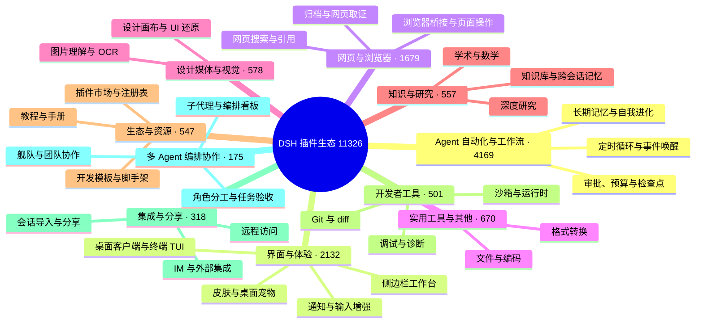

# 🐳 Awesome DSH Plugins

> 30 秒找到真正适合你的 DeepSeek Harness 插件。每天自动抓取 GitHub 上的 `dsh-plugin` 项目并逐个复核：真实插件分类收录，蹭标签项目剔除。通过场景化分类、精选推荐、热度排行和图文导览，帮你快速看懂每个插件能做什么、适合谁，以及如何开始使用。欢迎 Star，让好用的插件更快被发现。

[English](./README_EN.md) · [全量目录](./CATALOG.md) · [Star Top 200](./TOP200.md) · [作者自荐](./SHOWCASE.md) · [推荐一个插件](./CONTRIBUTING.md) · [机器可读数据](./data/repositories.json)

**如果这个列表帮你找到一个有用的插件，欢迎点一个 Star ⭐。它能帮助更多 DSH 用户发现这个生态。**

## 🧭 用户索引

| 我想要…… | 直接去哪里 |
| --- | --- |
| 30 秒选出一个插件 | [精选推荐](#-精选推荐)：从「我想让 DSH 做什么」出发，按场景分组列出社区优秀插件 |
| 第一次装插件 | [新手入门组合](#-新手入门组合)：按当前问题选一套组合，不用一次装很多 |
| 按热度翻完整榜单 | [社区热度榜](#-社区热度榜)（首页 Top 50）· [TOP200.md](./TOP200.md)（完整 Top 200） |
| 按分类浏览全部项目 | [CATALOG.md](./CATALOG.md)（全量目录）· [生态全景](#-生态全景)（分类概览） |
| 看看作者们自己提交的新插件 | [作者自荐](#-作者自荐)（首页最近 10 条）· [SHOWCASE.md](./SHOWCASE.md)（全部） |
| 用程序消费插件数据 | [data/market.json](./data/market.json)——面向下游市场的精选文件（≤500 KB，见[接口规范](https://github.com/bruc3van/dsh-desktop-safe-market/blob/master/docs/market-json-spec.md)）；[data/repositories.json](./data/repositories.json)——每日自动快照，含星数、许可证、活跃度等元数据 |
| 收录或推荐你自己的插件 | [推荐或修正插件](#-推荐或修正插件) / [CONTRIBUTING](./CONTRIBUTING.md) |

## 🗺️ 生态全景

<!-- dsh:panorama:start -->
截至 2026-09-02 共收录 **11326** 个经核实的仓库。它们长这样：

<!-- dsh:panorama:end -->

按分类浏览每个分类下的全部项目，见 [CATALOG.md](./CATALOG.md)——目录按类目分册，索引页列出每一册。

## ⭐ 精选推荐

**这里不按星数排名，但优先选择社区验证的高星项目**——绝大多数推荐来自 Star Top 200：它们解决明确问题、说明完整、仍在维护且经过大量用户验证；少数是几十 Star 但无可替代的项目。从你的问题出发，找到最接近的一行，点进去就是答案；收录不等于安全或兼容性背书。想看按热度排名的完整榜单，见[社区热度榜](#-社区热度榜)。各分类条目下方附有界面截图，点击截图即可直达仓库首页。

### 🖥️ 桌面与终端

- **想要独立的桌面客户端**，而不是浏览器标签页：[dsh-desktop](https://github.com/bruc3van/dsh-desktop) —— 原汁原味的官方 Web UI，不做过多修改；关闭窗口任务照跑，常驻托盘随点随开。安装包自带官方运行时，双击即用，不用装 Node.js、也不用敲命令；智能模式自动复用本机已运行的实例，固定地址模式则直连你自己维护的地址。安全上逐层加固——窗口沙箱、导航锁定、更新链路防劫持、权限最小化，内置安全市场，精选分类600+插件，主打先审查、再安装。
- **想在终端里用 Claude Code 风格界面**：[dsh-TUI](https://github.com/ccch1mneyyy/dsh-TUI) · [dsh-tianshu-tui](https://github.com/huiliyi37/dsh-tianshu-tui) —— 全屏交互终端：状态行、思考流展开、上下文/TPS 仪表；tianshu 版本还内置 TDD 与证据门工作流。
- **想在安卓手机上本地跑 DSH**：[dsh-mobile-apk](https://github.com/kelai141/dsh-mobile-apk) —— 安卓壳 APK：WebView UI + 内嵌 Termux 运行时、SAF 目录桥、保活服务与看门狗。只想用手机遥控电脑上已在跑的 DSH，见下方 [dsh-pocket](https://github.com/shaobeichen/dsh-pocket)。

| | | |
| :---: | :---: | :---: |
|  [dsh-desktop](https://github.com/bruc3van/dsh-desktop) |  [dsh-desktop](https://github.com/bruc3van/dsh-desktop) |  [dsh-TUI](https://github.com/ccch1mneyyy/dsh-TUI) |
|  [dsh-tianshu-tui](https://github.com/huiliyi37/dsh-tianshu-tui) | | |

### 🧰 界面与工作台

- **想一次安装补齐常用界面功能**：[dsh-web](https://github.com/zhu1090093659/dsh-web) —— 任务看板、Git 关系图、侧边面板、远程移动端界面、桌面宠物、实时 Token 用量统计与皮肤中心，一站式功能合集（仓库由 `dsh-web-ui` 更名而来）。
- **想看清上下文窗口里装了什么**：[dsh-context](https://github.com/bowenliang123/dsh-context) —— 在 Web UI 增加 Context 面板，展示上下文由什么构成、如何演化，辅助把握 token 控制与裁剪时机。
- **想把侧边栏升级成完整工作台**：[DSH-better-sidebar](https://github.com/omdsh-dev/DSH-better-sidebar) —— 内置文件渲染编辑、终端、Git 与子代理，并支持第三方扩展注册新 Tab。
- **想把所有 Agent 项目收进一个管理台**：[dsh-worktable](https://github.com/Aisland-SJL/dsh-worktable) —— 侧边栏应用抽屉 + 可停靠分屏工作区，外加实时监控所有项目的控制室。
- **想让 DSH 拥有真正的 Office 环境**：[dsh-univer-office](https://github.com/dream-num/dsh-univer-office) —— Univer 官方厂商出品：把表格、文档、幻灯片、画布与关系表装进对话，数据相互联动。
- **想让工作状态行活过来**：[working-activity](https://github.com/ccch1mneyyy/working-activity) —— 实时显示工具动态与进度、俏皮文案、模型自述与上下文预警，等待时不再无聊。
- **想让 Agent 操作浏览器**：[dsh-browser](https://github.com/Lum1104/dsh-browser) · [BrowserSkill](https://github.com/Tencent/BrowserSkill) —— dsh-browser 是 Chrome 侧边栏扩展，在当前对话里授权页面并执行操作；BrowserSkill 是腾讯出品的真实已登录浏览器桥（独立 Agent 窗口，不打断你自己的浏览），DSH 通过官方 npm 插件 `@wxg-prc-cpg/browser-skill-dsh-plugin` 接入。

| | | |
| :---: | :---: | :---: |
|  [dsh-web](https://github.com/zhu1090093659/dsh-web) |  [dsh-context](https://github.com/bowenliang123/dsh-context) |  [BrowserSkill](https://github.com/Tencent/BrowserSkill) |
|  [dsh-worktable](https://github.com/Aisland-SJL/dsh-worktable) |  [dsh-univer-office](https://github.com/dream-num/dsh-univer-office) | |

### 👀 让模型看得见、搜得到

- **想给 DSH 增加视觉理解能力**：[modlens](https://github.com/liustack/modlens) · [dsh-vision-toolkit](https://github.com/Anionex/dsh-vision-toolkit) —— modlens 把图片转成 OCR/布局/语义结构化证据；dsh-vision-toolkit 覆盖图片问答、长截图 OCR、UI 还原与像素对比。
- **想免 Key、免 Python、粘贴即用看图**：[dsh-vision-router](https://github.com/ysr666/dsh-vision-router) —— 内置免费视觉链（五模型匿名兜底，免注册免 Key），图片轮像普通工具轮一样由模型驱动 10 个 `vision_*` 像素工具（定位、裁剪、描述、像素对比、修复、取色、OCR、抠图、矢量化、截图）连续多步执行，并输出结构化证据 JSON；一条命令安装（Web profile），Node only。
- **想让 Agent 自己搜索网页和 X，答案带引用**：[modsearch](https://github.com/liustack/modsearch) · [anysearch-dsh](https://github.com/anysearch-team/anysearch-dsh) —— modsearch 在对话中直接搜索、抓取并返回带引用的结构化证据；anysearch-dsh 提供 AnySearch 搜索源与高级搜索工具，可作补充搜索后端。
- **想在对话里直接生图**：[dsh-image-gen](https://github.com/shanliuling/dsh-image-gen) —— 对话内调用 `generate_image`，支持 Gemini / OpenAI / Seedream / 通义万相，自带画廊、全屏预览与一键下载。

| | | |
| :---: | :---: | :---: |
|  [modlens](https://github.com/liustack/modlens) |  [dsh-vision-toolkit](https://github.com/Anionex/dsh-vision-toolkit) |  [dsh-vision-router](https://github.com/ysr666/dsh-vision-router) |
|  [dsh-image-gen](https://github.com/shanliuling/dsh-image-gen) | | |

### 🧠 记忆与无人值守

- **想给 DSH 加上可审计的跨会话记忆**：[mem9](https://github.com/mem9-ai/mem9) · [dsh-mnemon](https://github.com/omdsh-dev/dsh-mnemon) —— mem9 是跨会话/跨机器/跨 Agent 的持久共享记忆（混合召回 + 可视化控制台，原生支持 DeepSeek Harness 等运行时）；Mnemon 是三层记忆控制面：持久运行时上下文、可检索项目文档、可插拔长期记忆与智能路由。
- **想让 Coding 任务按计划自动运行**：[dsh-automation](https://github.com/titanwings/dsh-automation) —— 在全新 Agent Session 中按计划运行任务，定时任务由用户或 Agent 在 Web 界面创建和管理。
- **请求经常因网络波动或超时中断**，不想每次手动补一句「继续」：[dsh-auto-continue](https://github.com/HsiangNianian/dsh-auto-continue) —— 回合因非人为原因失败后自动补发「继续」：错误分类只恢复临时性故障，自适应退避避免轰炸故障上游，继续文本可模板化，参数在插件设置卡片中调整。
- **想回退对话与工作区状态**：[dsh-turn-rewind](https://github.com/Anionex/dsh-turn-rewind) —— 基于持久化 Change Ledger 回退到任意早期回合，对话与代码状态一起恢复。
- **想回合结束时收到桌面通知**：[dsh-notification](https://github.com/omdsh-dev/dsh-notification) —— 按结果类型（成功/失败）控制通知，支持关键词过滤，长时间任务无需盯屏。

| | | |
| :---: | :---: | :---: |
|  [dsh-mnemon](https://github.com/omdsh-dev/dsh-mnemon) |  [dsh-automation](https://github.com/titanwings/dsh-automation) | |
|  [dsh-auto-continue](https://github.com/HsiangNianian/dsh-auto-continue) |  [dsh-turn-rewind](https://github.com/Anionex/dsh-turn-rewind) | |

### ✍️ 对话体验细节

- **想像 Codex 一样用 @ 引用工作区文件**：[dsh-at-file](https://github.com/FSMargoo/dsh-at-file) —— 在输入框内按 @ 搜索工作区文件并把路径附进 prompt；官方近期已内置 `@file` / `@session`，新安装可优先用官方实现，本插件适合需要路径选择器与过滤规则的用户。
- **想调节思考强度**：[dsh-reasoning-effort](https://github.com/HanaAyane/dsh-reasoning-effort) —— Codex 风格的思考强度滑块，以及大肥鱼跑步滑块。
- **想更顺手地阅读和操作长对话**：[dsh-annotation](https://github.com/omdsh-dev/dsh-annotation) · [dsh-navbar](https://github.com/vlln/dsh-navbar) —— 像 Codex 一样选中文本批注，并快速跳转用户消息节点。
- **想把对话摊上画布、按分支整理**：[dsh-synapse](https://github.com/liangmianya/dsh-synapse) —— 画布式会话探索与分支工作台，非线性梳理长对话里的多条思路。

| | | |
| :---: | :---: | :---: |
|  [dsh-at-file](https://github.com/FSMargoo/dsh-at-file) |  [dsh-reasoning-effort](https://github.com/HanaAyane/dsh-reasoning-effort) |  [dsh-navbar](https://github.com/vlln/dsh-navbar) |
|  [dsh-synapse](https://github.com/liangmianya/dsh-synapse) | | |

### 🎨 创作与乐趣

- **想换皮肤、自定义背景**：[dsh-deep-whale](https://github.com/Small-tailqwq/dsh-deep-whale) · [DSH-Transparent-UI-Plugin](https://github.com/WYH66666666/DSH-Transparent-UI-Plugin) —— dsh-deep-whale 是生态内最受欢迎的鲸鱼娘皮肤系列（CC BY-NC-SA，不可商用）；DSH-Transparent-UI-Plugin 是一层高自由度的玻璃质感主题，模糊/磨砂/背景全可调，一键回到原生界面。
- **想用本机 Wallpaper Engine 壁纸当背景**：[dsh-wallpaper-engine](https://github.com/elysia395/dsh-wallpaper-engine) —— 把本机动态壁纸搬进 DSH 网页界面：视频直出、液态玻璃设置窗、内容分级过滤与自动轮播（⚠️ 仓库暂未标注许可证）。
- **想在对话中生成交互式界面**：[dsh-genui](https://github.com/omdsh-dev/dsh-genui) · [dsh-visualize](https://github.com/Nagi-ovo/dsh-visualize) —— 在回复中渲染图表、表单、测验、Mermaid 和 3D 场景，或让模型生成交互式可视化卡片。
- **想让 Agent 操作真实设计画布 / 做 PPT**：[dsh-openpencil](https://github.com/ZSeven-W/dsh-openpencil) · [deepseek-design](https://github.com/Devin-AXIS/deepseek-design) —— OpenPencil 负责可交互多页面设计稿的创建、编辑、预览和验证；deepseek-design 是原生 Design / PPT / Video 工作室（模板市场、画布精调、选区 Ask AI）。
- **想写小说、做短剧**：[oh-story-dsh](https://github.com/zenstory-ai/oh-story-dsh) —— 面向小说写作与短剧生产的插件，由 Oh Story 与 Drama Skills 驱动。
- **想给工作区增加一个陪伴型宠物**：[whale-girl](https://github.com/vlln/whale-girl) · [dsh-pet](https://github.com/PC2005-cloud/dsh-pet) —— 可拖拽、投喂和玩耍的积累型鲸鱼娘；或一行命令安装现成宠物（28 个透明动画），并从 AI 视频自造专属宠物。
- **想要点乐子**：[dsh-ads](https://github.com/Nagi-ovo/dsh-ads) · [anime-find](https://github.com/cocofhu/anime-find) · [dsh-minigames](https://github.com/lhh010/dsh-minigames) —— 把 DSH 变成 2005 年门户网站；对话内多源搜番并展示 Bangumi 评分；等模型回复时玩 18 款离线小游戏。

| | | |
| :---: | :---: | :---: |
|  [dsh-deep-whale](https://github.com/Small-tailqwq/dsh-deep-whale) |  [DSH-Transparent-UI-Plugin](https://github.com/WYH66666666/DSH-Transparent-UI-Plugin) |  [dsh-visualize](https://github.com/Nagi-ovo/dsh-visualize) |
|  [dsh-openpencil](https://github.com/ZSeven-W/dsh-openpencil) |  [dsh-pet](https://github.com/PC2005-cloud/dsh-pet) |  [dsh-ads](https://github.com/Nagi-ovo/dsh-ads) |
|  [anime-find](https://github.com/cocofhu/anime-find) |  [dsh-wallpaper-engine](https://github.com/elysia395/dsh-wallpaper-engine) |  [oh-story-dsh](https://github.com/zenstory-ai/oh-story-dsh) |

### 🛠️ 开发与工作流

- **想把一个会话变成一支协作团队**：[dsh-agent-teams](https://github.com/NanmiCoder/dsh-agent-teams) —— 当前会话作为队长：创建可续聊的子 Agent、把目标拆成带依赖的任务，并通过直达消息协调成员工作，实时 Web UI 呈现活动面板。
- **想把一次性多 Agent 调度升级为 Workflow 层**：[dsh_workflow](https://github.com/omdsh-dev/dsh_workflow) —— 把 Claude Code 的 UltraCode 模式带给 DSH：可生成、可保存、可治理、可观察、可恢复。
- **想少点手动确认、又要安全**：[dsh-auto-mode](https://github.com/NanmiCoder/dsh-auto-mode) —— 为 DSH 提供安全的自动权限（Safe automatic permissions）。
- **想给 Agent 团队配一块本地任务板**：[DSH-taskboard](https://github.com/shengsheng90/DSH-taskboard) —— SQLite 原生任务板：项目、认领、评审一体，原生 Web UI、无 iframe、无第二聊天运行时。
- **想让 Agent 驱动 iOS 模拟器或真机**：[dsh-ios](https://github.com/ZSeven-W/dsh-ios) —— 在对话里运行实时 iOS 模拟器（或 USB 连接的 iPhone），22 个工具按无障碍标识启动、构建、驱动 UI。
- **想让 Agent 的工作方式可组合、可持续进化**：[dsh-evolve-modes](https://github.com/GraySilver/dsh-evolve-modes) —— 可组合任务控制 + 隔离且经人工复核的自进化，改进先审查再生效。
- **想让 DSH 直连数据库做分析**：[dsh-data-agent](https://github.com/omdsh-dev/dsh-data-agent) —— 把 DSH 连上你的数据库：对话式数据分析与可执行的业务洞察。

| | | |
| :---: | :---: | :---: |
|  [dsh-agent-teams](https://github.com/NanmiCoder/dsh-agent-teams) |  [DSH-taskboard](https://github.com/shengsheng90/DSH-taskboard) |  [dsh-ios](https://github.com/ZSeven-W/dsh-ios) |
|  [dsh-evolve-modes](https://github.com/GraySilver/dsh-evolve-modes) |  [dsh-data-agent](https://github.com/omdsh-dev/dsh-data-agent) | |

### 🔀 迁移与集成

- **想把其他工具的历史会话搬进 DSH**：[dsh-chat-import](https://github.com/Nwflower/dsh-chat-import) —— 13 源全保真导入（Claude Code/Codex/ChatGPT/Cursor/Gemini/Reasonix/opencode/ZCode/Grok Build/OpenClaw/Pi/Hermes/Kimi）历史会话为可续聊 DSH 会话，并支持反向导出/同步回 Claude Code。
- **想把 Pi 生态的扩展直接搬进 DSH**：[pi2dsh](https://github.com/weijiafu14/pi2dsh) —— 一套 Pi Host ABI 让未改动的 Pi 扩展原生运行为 DSH 插件，打通两个生态。
- **想从微信 / 飞书 / QQ 等聊天软件指挥 DSH**：[dsh-im](https://github.com/xmanrui/dsh-im) · [dsh-qqbot](https://github.com/tencent-connect/dsh-qqbot) —— dsh-im 一个设置页接入飞书、微信、钉钉、企业微信、QQ、Slack、Telegram、Discord、WhatsApp 九个渠道；只要腾讯官方 QQ Bot 时用 dsh-qqbot。

| | | |
| :---: | :---: | :---: |
|  [dsh-im](https://github.com/xmanrui/dsh-im) |  [pi2dsh](https://github.com/weijiafu14/pi2dsh) | |

### 🔌 远程与外部协作

- **想用手机遥控电脑上正在跑的 DSH**：[dsh-pocket](https://github.com/shaobeichen/dsh-pocket) —— 电脑跑 `dsh web`，手机扫码即同屏（局域网 + 公网隧道、访问密码、移动端适配）。人在外面也能看进度、发任务、点审批。
- **想让 Agent 用 SSH 操作远程主机**：[dsh-remote](https://github.com/flymysql/dsh-remote) —— 多机 SSH（密码/私钥/agent/OTP/跳板机）+ 远程工作区选择 + 21 个 `rw_*` 工具（列目录/读文件/编辑/执行/搜索/端口转发/SFTP 双向同步）；内置「🌐 远程文件」侧边栏、审计日志、自更新；不监听 0.0.0.0。

| | | |
| :---: | :---: | :---: |
|  [dsh-pocket](https://github.com/shaobeichen/dsh-pocket) | | |

### 💰 用量与账单

- **想在右下角盯着余额和每轮花费**：[DeepSeek-Balance-Whale-Widget](https://github.com/MeteorNOX/DeepSeek-Balance-Whale-Widget) —— 右下角可拖拽的小鲸鱼挂件：账户余额、今日已用、每轮消耗气泡，开箱即用（默认用余额差值记账，不必另配平台令牌）。
- **想查看 Token 用量与费用面板**：[dsh-usage-stats](https://github.com/Ychris12138/dsh-usage-stats) · [dsh-cost-meter](https://github.com/Han-1413141/dsh-cost-meter) —— dsh-usage-stats 提供 GitHub 风格用量热力图、按模型拆解与 DeepSeek 账户余额；dsh-cost-meter 按官方价格同步统计本会话/当日费用。
- **走中转站、想按站点算清用量**：[TokenLedger](https://github.com/zh667/TokenLedger) —— 令牌用量账本按中转站归因：零配置、无需凭据。

| | | |
| :---: | :---: | :---: |
|  [DeepSeek-Balance-Whale-Widget](https://github.com/MeteorNOX/DeepSeek-Balance-Whale-Widget) |  [dsh-usage-stats](https://github.com/Ychris12138/dsh-usage-stats) |  [dsh-cost-meter](https://github.com/Han-1413141/dsh-cost-meter) |
|  [TokenLedger](https://github.com/zh667/TokenLedger) | | |

### 🔑 模型与订阅

- **想让推理模式按任务自动路由**：[dsh-routing-suite](https://github.com/yjh051108/dsh-routing-suite) —— 社区热度榜第一名的路由套装：先装运行时注入器，再装任务感知的推理模式路由预设（实测覆盖 P1–P23）；注入器会修改运行时行为，安装前先读仓库说明。
- **想用已有 ChatGPT / Claude / Grok 订阅当模型**，不想再配 API Key：[dsh-plugin-subscriptions](https://github.com/V1ki/dsh-plugin-subscriptions) —— 在设置页用 OAuth 接入 ChatGPT（Codex）、Claude、Grok（X Premium）和 GitHub Copilot 订阅；登录后出现在模型选择器里，并带用量窗口、生图/生视频工具。

| | | |
| :---: | :---: | :---: |
|  [dsh-plugin-subscriptions](https://github.com/V1ki/dsh-plugin-subscriptions) | | |

### 🛡️ 安全与审计

- **想确认中转 API 有没有被做过手脚**：[api-relay-audit](https://github.com/toby-bridges/api-relay-audit) —— 本地审计 AI API 中继与 LLM 代理：检测提示注入、模型替换、工具调用重写、SSE 异常、错误泄漏与 Web3 钱包风险，单文件 Python 即跑即出脱敏报告（AGPL-3.0）。
- **想在授权范围内给 DSH 一个渗透测试模式**：[dsh-pentest](https://github.com/howmp/dsh-pentest) —— 记录目标、探索线索、验证结果、资产与漏洞，在 Web 中以探索链路、漏洞、资产视图呈现，授权信息随报告留痕（⚠️ 仓库暂无许可证文件）。
- **想给 DSH 上一道“装坏了能撤销”的安全网**：[dsh-undo-savepoint](https://github.com/lire1131/dsh-undo-savepoint) —— 配置与插件代码改动可撤销、secret-safe 快照、一键 SAFE MODE；DSH 完全起不来时，还有离线 CLI/GUI 帮你回滚。

| | | |
| :---: | :---: | :---: |
|  [api-relay-audit](https://github.com/toby-bridges/api-relay-audit) |  [dsh-pentest](https://github.com/howmp/dsh-pentest) |  [dsh-pentest](https://github.com/howmp/dsh-pentest) |
|  [dsh-undo-savepoint](https://github.com/lire1131/dsh-undo-savepoint) |  [dsh-undo-savepoint](https://github.com/lire1131/dsh-undo-savepoint) |  [dsh-undo-savepoint](https://github.com/lire1131/dsh-undo-savepoint) |

### 🌱 生态入口

- **想先审查、再安装插件（安全第一）**：[dsh-desktop-safe-market](https://github.com/bruc3van/dsh-desktop-safe-market) —— 先审查再安装的 DSH 市场：目录来自本清单每日快照 + 人工精选，「安全安装」不执行任何命令——把安全审查提示词交给 Agent 实际读仓库代码，确认干净后由你决定是否用官方命令安装；市场默认关闭、开启才联网，插件自身没有任何执行安装的接口。
- **想在 DSH 界面里直接逛插件市场**：[dsh-market](https://github.com/dsh-market/dsh-market) · [DSH-Plugins-Marketplace](https://github.com/bradeGithub/DSH-Plugins-Marketplace) · [dsh-plugin-hub](https://github.com/Noob-stupid/dsh-plugin-hub) —— dsh-market 把市场做进 DSH：浏览、搜索、一键安装；DSH-Plugins-Marketplace 覆盖全部 GitHub dsh-plugin 插件的一键浏览、安装与更新；dsh-plugin-hub 插件管理面板 + 市场：一键启停/检测更新/框架一键升级，覆盖全部 GitHub dsh-plugin 插件与技能。
- **想让 DSH 自己找插件、装插件**：[dsh-find-plugins](https://github.com/Nagi-ovo/dsh-find-plugins) —— 一个 Skill：让 DSH 搜索、安装并验证 GitHub 上的插件。

| | | |
| :---: | :---: | :---: |
|  [dsh-desktop-safe-market](https://github.com/bruc3van/dsh-desktop-safe-market) |  [dsh-market](https://github.com/dsh-market/dsh-market) |  [dsh-find-plugins](https://github.com/Nagi-ovo/dsh-find-plugins) |

### 🚀 新手入门组合

不需要一次装很多。先选一个与你当前问题最接近的组合：

| 套装 | 适合 | 组合 |
| --- | --- | --- |
| 日常体验 | 第一次装插件：先装桌面客户端，再把侧边栏变成工作台 | [dsh-desktop](https://github.com/bruc3van/dsh-desktop) · [DSH-better-sidebar](https://github.com/omdsh-dev/DSH-better-sidebar) |
| 安全逛市场 | 先审查再安装；桌面端已内置，纯 Web 用户搜索安装 `bruc3van/dsh-desktop-safe-market` | [dsh-desktop-safe-market](https://github.com/bruc3van/dsh-desktop-safe-market) |
| 终端控 | 喜欢命令行，想要全屏交互终端（二选一） | [dsh-TUI](https://github.com/ccch1mneyyy/dsh-TUI) · [dsh-tianshu-tui](https://github.com/huiliyi37/dsh-tianshu-tui) |
| 搜索与生图 | 对话里搜网页、直接出图（官方已能看图，不必再装视觉插件） | [modsearch](https://github.com/liustack/modsearch) · [dsh-image-gen](https://github.com/shanliuling/dsh-image-gen) |
| 界面美化 | 换皮肤、玻璃质感、桌面宠物 | [dsh-deep-whale](https://github.com/Small-tailqwq/dsh-deep-whale) · [DSH-Transparent-UI-Plugin](https://github.com/WYH66666666/DSH-Transparent-UI-Plugin) · [whale-girl](https://github.com/vlln/whale-girl) |
| 多 Agent 协作 | 把复杂任务交给一支 Agent 团队 | [dsh-agent-teams](https://github.com/NanmiCoder/dsh-agent-teams) · [dsh_workflow](https://github.com/omdsh-dev/dsh_workflow) · [dsh-auto-mode](https://github.com/NanmiCoder/dsh-auto-mode) |
| 记忆与持续运行 | 跨会话记忆（二选一）+ 中断自动续跑的无人值守项目 | [mem9](https://github.com/mem9-ai/mem9) 或 [dsh-mnemon](https://github.com/omdsh-dev/dsh-mnemon) · [dsh-auto-continue](https://github.com/HsiangNianian/dsh-auto-continue) |
| 手机远程 | 人在外面看电脑上的 DSH | [dsh-pocket](https://github.com/shaobeichen/dsh-pocket) |
| 订阅模型 | 用已有 ChatGPT / Claude / Grok 订阅，不用 API Key | [dsh-plugin-subscriptions](https://github.com/V1ki/dsh-plugin-subscriptions) |

**新手先读：** [dsh-handbook](https://github.com/Electricitysheep/dsh-handbook) —— DSH 从 0 到 1 深度手册：安装、插件开发、性能调优与实测案例（中英双语 PDF）；想自己写插件的从 [hello-dsh](https://github.com/pingfanfan/hello-dsh) 开始——零基础插件开发教程（22 个中文技能实例）。

## 🏆 社区热度榜

按 Star 排序的社区热度参考，数据取自 2026-09-02 快照；蹭 `dsh-plugin` Topic 的非插件仓库与编辑部拉黑的仓库均已剔除，新仓库先进入[待审核队列](./data/review/pending.md)、经人工核实（[data/approved.json](./data/approved.json)）后才进入榜单，剔除清单见 [data/curated.json](./data/curated.json)。首页展示前 50 名，完整 Top 200 见 [TOP200.md](./TOP200.md)。排名反映受欢迎程度，不代表质量、兼容性或安全背书。

<!-- dsh:leaderboard:start -->
| # | 项目 | 简介 | ⭐ Stars | License |
| ---: | --- | --- | ---: | --- |
| 1 | [yjh051108/dsh-routing-suite](https://github.com/yjh051108/dsh-routing-suite) | 路由套装（注入器 + 路由标准）：先装运行时注入器，再装任务感知的推理模式路由预设（实测覆盖 P1–P23）。 | 7031 | MIT |
| 2 | [liustack/modlens](https://github.com/liustack/modlens) | 全网最强 DeepSeek Harness 外挂视觉插件：为纯文本模型补上视觉，粘贴图片即得结构化 JSON 证据（OCR、版面、语义）。 | 3839 | MIT |
| 3 | [omdsh-dev/DSH-better-sidebar](https://github.com/omdsh-dev/DSH-better-sidebar) | 开放的侧边栏底座，支持三方拓展注册新侧边栏页面。内置文件渲染编辑/终端/侧边对话/Git/子代理页面 | 3245 | MIT |
| 4 | [ccch1mneyyy/dsh-TUI](https://github.com/ccch1mneyyy/dsh-TUI) | DSH 官方公众号收录的 TUI 补位插件：Claude Code 风，鲸鱼顶栏、实时状态、流式思考、双击 Esc 回滚、上下文进度+TPS。 | 2782 | MIT |
| 5 | [Small-tailqwq/dsh-deep-whale](https://github.com/Small-tailqwq/dsh-deep-whale) | 适用于 DeepSeek Harness 的鲸鱼娘系列皮肤。 | 1888 | — |
| 6 | [Tencent/BrowserSkill](https://github.com/Tencent/BrowserSkill) | 让 AI Agent 使用你真实、已登录的浏览器而不打断工作：CLI + 扩展，适用于任意可运行 shell 的 AI Agent。 | 1711 | MIT |
| 7 | [MeteorNOX/DeepSeek-Balance-Whale-Widget](https://github.com/MeteorNOX/DeepSeek-Balance-Whale-Widget) | 住在 DSH 界面右下角的小鲸鱼娘，帮你盯着 DeepSeek 账户余额：QQ 弹弹、拖拽吸附、左吸附翻转、数字滚动动画，随界面自动启用。 | 1616 | MIT |
| 8 | [NanmiCoder/dsh-agent-teams](https://github.com/NanmiCoder/dsh-agent-teams) | 面向 DeepSeek Harness 的 AgentTeams 多 Agent 协作插件。 | 1293 | MIT |
| 9 | [bowenliang123/dsh-context](https://github.com/bowenliang123/dsh-context) | 一站式 DeepSeek Harness 上下文可视化插件：Context 面板与命令，透视上下文组成、演进、压缩、剪枝等事件。 | 1246 | Apache-2.0 |
| 10 | [mem9-ai/mem9](https://github.com/mem9-ai/mem9) | 为 OpenClaw 提供无限记忆。 | 1203 | Apache-2.0 |
| 11 | [xmanrui/dsh-im](https://github.com/xmanrui/dsh-im) | 扫码或凭据把 IM 机器人接入 DeepSeek Harness：支持飞书、微信、钉钉、企业微信、QQ、Slack、Telegram 等。 | 1072 | MIT |
| 12 | [ysr666/dsh-vision-router](https://github.com/ysr666/dsh-vision-router) | 纯文本 DeepSeek Harness Agent 的视觉之眼：免费视觉链（无需 Key）+ 像素级视觉工具（问答、定位、OCR），一行安装。 | 1052 | MIT |
| 13 | [shaobeichen/dsh-pocket](https://github.com/shaobeichen/dsh-pocket) | 把 DeepSeek Harness 装进你的口袋：电脑上跑 dsh web，手机扫码即同步访问（局域网 + 公网，实时同屏）。 | 902 | GPL-2.0 |
| 14 | [Minglink/dsh-infinite-gen-3](https://github.com/Minglink/dsh-infinite-gen-3) | 面向 DeepSeek-V4 的系统提示注入插件「无限三代」：破甲版只保留提示词注入与客户端状态条，砍掉工具增强面。 | 861 | MIT |
| 15 | [Anionex/dsh-vision-toolkit](https://github.com/Anionex/dsh-vision-toolkit) | 为纯文本模型设计更强大的视觉工具箱：一行安装使用、粘贴图片直接识别、多张图片问答、截图到前端 UI 还原等。 | 848 | MIT |
| 16 | [toby-bridges/api-relay-audit](https://github.com/toby-bridges/api-relay-audit) | AI API 中继与 LLM 代理的本地安全审计：检测提示注入、模型替换、工具调用改写、SSE 异常、错误泄露与 Web3 钱包风险。 | 822 | AGPL-3.0 |
| 17 | [Devin-AXIS/deepseek-design](https://github.com/Devin-AXIS/deepseek-design) | DeepSeek Harness 可编辑设计系统：AI 生成、可视化编辑、模板市场与 PPT。 | 716 | NOASSERTION |
| 18 | [ccch1mneyyy/working-activity](https://github.com/ccch1mneyyy/working-activity) | 为 pi CLI 与 DSH 打造的 Lively Working-line 工作状态动态线条扩展。 | 656 | MIT |
| 19 | [Nagi-ovo/dsh-ads](https://github.com/Nagi-ovo/dsh-ads) | 把 DSH 变成 2005 年门户网站：恶搞广告、假游戏与弹窗。 | 599 | BSD-3-Clause |
| 20 | [Lum1104/dsh-browser](https://github.com/Lum1104/dsh-browser) | 一款 Chrome 侧边栏扩展程序，可让 DeepSeek Harness 直接操控您的浏览器，无需视觉能力。 | 559 | MIT |
| 21 | [PC2005-cloud/dsh-pet](https://github.com/PC2005-cloud/dsh-pet) | DSH 桌面宠物：一行命令装好即用的透明动画小桌宠，支持多开、大小位置随心配置；还内置 DIY 素材链，能用 AI 视频自造专属宠物。 | 518 | MIT |
| 22 | [FSMargoo/dsh-at-file](https://github.com/FSMargoo/dsh-at-file) | 面向 DeepSeek Harness 的 Codex 风格 @file 引用：在输入框中搜索工作区文件并把路径附到提示词。 | 503 | MIT |
| 23 | [syncable-dev/memtrace-public](https://github.com/syncable-dev/memtrace-public) | AI 编码 Agent 的结构化记忆：双时态图、MCP 原生、零 LLM 调用，支持 Cursor、Claude Code、Codex 等。 | 468 | NOASSERTION |
| 24 | [Aisland-SJL/dsh-worktable](https://github.com/Aisland-SJL/dsh-worktable) | 面向 DeepSeek Harness 的 Agent 项目管理台：侧边栏应用抽屉 + 可停靠分屏工作区 + 实时监控所有项目的控制室。 | 445 | MIT |
| 25 | [ZJU-LLMs/OpenStory](https://github.com/ZJU-LLMs/OpenStory) | 基于 LLM 的多 Agent 框架，用于模拟可交互、可演化的故事世界。 | 399 | Apache-2.0 |
| 26 | [WYH66666666/DSH-Transparent-UI-Plugin](https://github.com/WYH66666666/DSH-Transparent-UI-Plugin) | 高自由度玻璃质感主题：顶栏、侧边栏、输入框、统计行、轨迹视图都成磨砂玻璃，模糊度与背景全部可调，不改 DSH 源码。 | 397 | AGPL-3.0 |
| 27 | [anysearch-team/anysearch-dsh](https://github.com/anysearch-team/anysearch-dsh) | 面向 DeepSeek Harness 的 AnySearch 联网搜索提供方与高级搜索工具。 | 394 | MIT |
| 28 | [omdsh-dev/dsh-genui](https://github.com/omdsh-dev/dsh-genui) | 通过 dsh-ui 围栏在助手回复内内联渲染交互式 UI：布局、图表、表单、测验、Mermaid、3D 场景与回环到模型的事件循环。 | 390 | MIT |
| 29 | [EthanYoQ/Invoice-Downloader](https://github.com/EthanYoQ/Invoice-Downloader) | 电子发票整理与报销准备：邮箱批量收集 PDF/OFD 发票、OCR 识别归档并生成 Excel 汇总，含桌面版与 DSH 插件。 | 359 | Apache-2.0 |
| 30 | [howmp/dsh-pentest](https://github.com/howmp/dsh-pentest) | 面向 DeepSeek Harness（dsh）的渗透测试模式（@CloverSecLabs）。 | 357 | — |
| 31 | [liustack/modsearch](https://github.com/liustack/modsearch) | 全网最强 DeepSeek Harness 免费联网搜索插件：免注册免 API key，为不能联网的模型补上搜索，拿回结构化 JSON 证据。 | 340 | MIT |
| 32 | [omdsh-dev/dsh-mnemon](https://github.com/omdsh-dev/dsh-mnemon) | 面向 DeepSeek Harness 的可组合三层记忆控制平面：持久运行时上下文、可检索项目文档、可插拔长期记忆与护栏策略，含 WebUI。 | 314 | MIT |
| 33 | [liangmianya/dsh-synapse](https://github.com/liangmianya/dsh-synapse) | 可视化非线性对话工作区：画布式会话探索与分支工作台。 | 313 | MIT |
| 34 | [V1ki/dsh-plugin-subscriptions](https://github.com/V1ki/dsh-plugin-subscriptions) | 把 ChatGPT（Codex）、Claude、Grok 订阅作为 DSH 模型提供方：Web UI OAuth 登录，无需 API Key。 | 313 | MIT |
| 35 | [vlln/whale-girl](https://github.com/vlln/whale-girl) | DSH Web GUI 桌面宠物插件（QQ 宠物形态）：右下角悬浮、可拖拽/投喂/玩耍的积累型伙伴。 | 305 | MIT |
| 36 | [shanliuling/dsh-image-gen](https://github.com/shanliuling/dsh-image-gen) | 在 DSH 对话里直接生成图片的轻量插件。 | 299 | MIT |
| 37 | [shengsheng90/DSH-taskboard](https://github.com/shengsheng90/DSH-taskboard) | DSH 原生本地任务板：SQLite 项目、Agent 认领/评审与原生 Web UI，无 iframe。 | 286 | Apache-2.0 |
| 38 | [ZSeven-W/dsh-ios](https://github.com/ZSeven-W/dsh-ios) | DSH 插件：在对话里运行实时 iOS 模拟器（或 USB 连接的 iPhone），22 个工具按无障碍标识启动、构建、驱动 UI。 | 273 | MIT |
| 39 | [csyangwen/dsh-memory-evolve](https://github.com/csyangwen/dsh-memory-evolve) | 跨会话长期记忆 + 后台自我进化：五轨记忆、git 分支感知、技能自我进化与四轨待办，零核心修改。 | 271 | MIT |
| 40 | [zenstory-ai/oh-story-dsh](https://github.com/zenstory-ai/oh-story-dsh) | 小说写作与短剧生产插件，由 Oh Story 与 Drama Skills 驱动。 | 259 | MIT |
| 41 | [huiliyi37/dsh-tianshu-tui](https://github.com/huiliyi37/dsh-tianshu-tui) | 交互式终端 UI 插件：ANSI 极简渲染、流式 Markdown/工具卡、16+ 主题、slash 命令与 LSP 诊断。 | 252 | Apache-2.0 |
| 42 | [Nagi-ovo/dsh-visualize](https://github.com/Nagi-ovo/dsh-visualize) | 在 DSH 对话中生成交互式可视化卡片。 | 249 | BSD-3-Clause |
| 43 | [Han-1413141/dsh-cost-meter](https://github.com/Han-1413141/dsh-cost-meter) | 会话成本仪表：会话/日成本、预算与各家余额查询、token 热力图与峰谷定价切换提醒。 | 246 | MIT |
| 44 | [dream-num/dsh-univer-office](https://github.com/dream-num/dsh-univer-office) | 给 DSH 装上真正的 Office：Univer 运行时把表格、文档、幻灯片、画布与关系表带进对话。 | 244 | Apache-2.0 |
| 45 | [elysia395/dsh-wallpaper-engine](https://github.com/elysia395/dsh-wallpaper-engine) | 把本机 Wallpaper Engine 壁纸变成 DSH 网页背景：动态视频播放、液态玻璃设置窗与自动轮播。 | 231 | — |
| 46 | [e2mcc/dsh-popout-sidebar](https://github.com/e2mcc/dsh-popout-sidebar) | 侧边栏弹出插件：把侧边栏拖出为独立浏览器标签页，可放到第二块显示器上双屏使用 | 205 | MIT |
| 47 | [GraySilver/dsh-evolve-modes](https://github.com/GraySilver/dsh-evolve-modes) | 可组合任务控制 + 隔离且经人工复核的 Agent 自进化，让工作方式可持续改进。 | 203 | MIT |
| 48 | [d-dev0101/open-sea-skin](https://github.com/d-dev0101/open-sea-skin) | WebGPU 海洋皮肤：DSH 插件、Chrome/Edge 扩展与原生集成多种安装方式。 | 195 | MIT |
| 49 | [zh667/TokenLedger](https://github.com/zh667/TokenLedger) | DSH 令牌用量账本：中转站归因，零配置、无需凭据。 | 192 | MIT |
| 50 | [saya-ch/dsh-mobile](https://github.com/saya-ch/dsh-mobile) | DeepSeek Harness 的 Android 客户端与安全远程访问插件：局域网/远程连接 DSH，移动界面与扩展能力高度自定义。 | 190 | Apache-2.0 |
<!-- dsh:leaderboard:end -->

[查看完整 Star Top 200 →](./TOP200.md)

## 🆕 最近加入生态

人工筛选的近期新项目，不定期更新：

| 项目 | 简介 | 创建日期 |
| --- | --- | --- |
| [Kevin66Z0/dsh-telegram](https://github.com/Kevin66Z0/dsh-telegram) | Telegram 远程控制：流式推送回复、快捷按键交互与白名单鉴权，零入站端口安全直连。 | 2026-08-28 |
| [plastic-labs/dsh-honcho](https://github.com/plastic-labs/dsh-honcho) | Honcho 长期记忆：为 DSH 赋予跨会话持久化记忆，记住开发偏好与决策上下文，支持多工作区共享。 | 2026-08-31 |
| [wbin0001/dsh-comfyui-canvas](https://github.com/wbin0001/dsh-comfyui-canvas) | ComfyUI 分屏画布：Web 界面内嵌 ComfyUI，对话直接生成提示词并编辑节点，实时出图出视频无需切屏。 | 2026-08-31 |
| [frank-fan-818/dsh-f1-skin](https://github.com/frank-fan-818/dsh-f1-skin) | F1 围场控制台主题：红牛/法拉利/迈凯伦/奔驰四车队主题色，搭配转播实况背景与原生设置面板。 | 2026-09-01 |
| [sogoodayo/dsh-code-ui](https://github.com/sogoodayo/dsh-code-ui) | Cursor 风格代码工作台：文件树、多标签页编辑、上下文引用与行内内嵌 AI 输入框，纯前端原生集成。 | 2026-09-01 |
| [10086ggqq/dsh_theme_Minecraft](https://github.com/10086ggqq/dsh_theme_Minecraft) | Minecraft 主题：WebGL 旋转全景主菜单、存档式会话选择、HUD 聊天台、AI 思考跑酷小游戏与 8-bit 音效。 | 2026-09-02 |
| [StephenEvenson/dsh-plugin-elevenlabs-callback](https://github.com/StephenEvenson/dsh-plugin-elevenlabs-callback) | ElevenLabs 电话回呼：任务完成或需要审批时向手机推送链接，语音通话播报结果并接收下一步指令。 | 2026-09-02 |
| [yindf/taskfold](https://github.com/yindf/taskfold) | 长会话任务折叠：将完成的子任务全段折叠为短标题摘要，降低上下文成本与阅读负担，支持随时按需召回。 | 2026-09-02 |

## 📣 作者自荐

插件作者按 [CONTRIBUTING](./CONTRIBUTING.md#作者自荐--self-promotion) 规范自行提交的推荐位：**不经编辑部审核，也不代表质量或安全背书**，安装前请自行评估（见下方「使用与安全」）。本区最多保留 30 条，区满后先进先出；条目若被上方[精选推荐](#-精选推荐)收录，会从本区移除、不占名额。首页只展示**最近 10 条**，完整列表见 [SHOWCASE.md](./SHOWCASE.md)。

<!-- dsh:showcase:start -->
- **[dsh-meow-memory](https://github.com/Phant0Meow/dsh-meow-memory)**（[@Phant0Meow](https://github.com/Phant0Meow) · 2026-08-19）— 跨会话长期记忆插件：node:sqlite 七层存储（soul/user/project/fact/lesson/topic/rules），首条消息缓存友好注入，memory_* 检索/读写/整理工具，逐消息关键词命中，BM25×艾宾浩斯加权检索，夜间按窗口自动整理（dream）。
- **[dsh-maze](https://github.com/lamost423/dsh-maze)**（[@lamost423](https://github.com/lamost423) · 2026-08-20）— 轨迹对比 + 实时迷宫：把 agent 真实的探索过程画在墙钟时间轴上——主干、失败/扑空的支路、折返点、子代理支路；上传 1–2 个 session log 做单跑复盘或同轴对比（按轮次自动对齐 + 支路盘点表），也可在会话页签实时看迷宫生长；判定全部是确定性规则、悬停可见依据，不调 LLM。
- **[dsh-feishu](https://github.com/PGZXB/dsh-feishu)**（[@PGZXB](https://github.com/PGZXB) · 2026-08-20）— 把 DeepSeek Harness 装进飞书：一个聊天对应一个 dsh 会话，命令面板、审批与提问全部卡片化，流式卡片实时展示，扫码一次完成配置，随时在手机/桌面指挥本地 agent；已发布 npm `@dsh-feishu/dsh-feishu`。
- **[dsh-easyrewrite](https://github.com/Renzic-Stone/DSH-EasyRewrite)**（[@Renzic-Stone](https://github.com/Renzic-Stone) · 2026-08-21）— DSH Web 用户消息气泡内联编辑与撤回插件：单击气泡原位编辑、撤回键一键截断重发，惰性提交、无痕替换，版本翻页器回看历史版本，草稿按会话持久化并超时自动备份，界面三语（中文 / English / 日本語），纯官方扩展点实现、零源码补丁。
- **[tabbit-browser](https://github.com/Tabbit-Browser/dsh-tabbit)**（[@Tabbit-Browser](https://github.com/Tabbit-Browser) · 2026-08-21）— 让 DSH agent 接管你的 Tabbit 浏览器：通过浏览器自带的任务隔离 Playwright CLI（`tabbit-cli`）操作真实页面、真实登录态与真实交互，用于网页自动化、信息抽取、QA 与基准测试。自带 `tabbit-browser` 技能（持久任务空间、定位器与等待、截图、回执与恢复，随插件自动注册，`/tabbit-browser` 调用）与 `tabbit_browser_install` 环境预检工具（检测稳定版 ≥1.9.0 与运行时，缺失或过旧则按系统区域后台下载对应安装包）。一条命令安装：`dsh plugin --profile web add github:Tabbit-Browser/dsh-tabbit`。⚠️ 仓库暂无 LICENSE 文件（README 标注 MIT）。
- **[ds-harness-remote](https://github.com/liguobao/ds-harness-remote)**（[@liguobao](https://github.com/liguobao) · 2026-08-21）— 从另一台电脑、浏览器或 Android 设备安全访问运行在工作电脑上的 DeepSeek Harness：Host 仅主动出站连接，会话流量端到端加密，并复用原生 Workspace 与会话界面，无需暴露公网端口。⚠️ 仓库根目录暂无许可证文件；Host 插件包使用 MIT 许可证。
- **[dsh-codex-subscription](https://github.com/WSL043/dsh-codex-subscription)**（[@WSL043](https://github.com/WSL043) · 2026-08-21）— 把现有 ChatGPT/Codex 订阅作为 DSH Web 原生模型提供方：独立 OAuth 登录，无需 API Key 或 Codex CLI；在同一设置页选择订阅搜索、查看服务端返回的普通 Codex/Spark 额度并生成脱敏支持诊断，对话中支持图片生成。适合希望直接在 DSH 中使用订阅模型、又不想额外配置 API Key 的用户。
- **[dsh-meow-smooth](https://github.com/Phant0Meow/dsh-meow-smooth)**（[@Phant0Meow](https://github.com/Phant0Meow) · 2026-08-24）— 喵丝滑：让 DSH 在手机上像原生 App 一样好摸——输入框失焦自动折叠、触屏 Enter 正常换行、锁死误触缩放、窄屏选中会话自动收起侧边栏等十余项移动端细节优化；自带长任务完成/失败通知推送（iOS PWA Web Push + Bark 兜底），内置可选压缩代理（手机蜂窝网络下历史响应压缩 70–90%）。纯 client 自包含、零 dsh 本体改动，npm 包 meow-smooth。
- **[dsh-rewind](https://github.com/SiriLee/dsh-rewind)**（[@SiriLee](https://github.com/SiriLee) · 2026-08-26）— DSH Web 同窗口原地回退（Claude Code /rewind 语义）：每条用户消息旁 ↶ 按钮把模型上下文截断回任意一条消息，可选 Claude Code 风格文件回滚（磁盘持久化 before 备份），纯官方扩展点实现、零源码补丁。
- **[dsh-whale-musume](https://github.com/Sutera-Diffusus/dsh-whale-musume)**（[@Sutera-Diffusus](https://github.com/Sutera-Diffusus) · 2026-08-28）— 元气鲸鱼娘桌宠：摸头养成、工作状态联动、494 条台词与 30 项成就；v2.0.0 新增余额关心（本机代理，密钥不落地）、主动关怀、无障碍、成长日记与主题适配，全本地零遥测（MIT，102 项单测）。
<!-- dsh:showcase:end -->

[查看全部 30 条自荐 →](./SHOWCASE.md)

## 🔍 我们如何维护这个列表

- **面向使用者，而不是爬虫：** 从「我想完成什么」出发组织首页，而不是让你阅读几百行仓库名称。
- **人工推荐 + 全量索引分层：** 首页只放经过人工筛选的精选推荐与自荐预览；[CATALOG.md](./CATALOG.md) 及其分类分册收录全部经核实的仓库；新增仓库先进入[待审核队列](./data/review/pending.md)，核实后合并（约定见 [data/review/README.md](./data/review/README.md)）。
- **数据自动、页面人工：** 原始快照与待审核队列每天由脚本自动刷新；全量目录与 Top 200 热度榜只在人工核实合并后重新生成（生成逻辑见 [scripts/merge.mjs](./scripts/merge.mjs) 与 [scripts/top.mjs](./scripts/top.mjs)，可随时切回 Top 100）；首页精选推荐、自荐与最近加入由人工维护，避免刷星、蹭 Topic 等被污染的接口数据直接改写推荐内容。
- **剔除蹭热度条目：** 带 `dsh-plugin` Topic 但并非 DSH 插件的仓库（平台本体、其他 Agent 工具、同名目录站等）以及编辑部拉黑的仓库不计入目录与榜单，理由逐条记录在 [data/curated.json](./data/curated.json)（榜单另有 `leaderboard_exclusions`：保留在目录中、但不参与榜单排序的仓库），可随时复查与质疑。
- **下游市场文件：** [data/market.json](./data/market.json) 是给下游市场（如 DSH 桌面端插件市场）消费的精选小文件——在快照与 curation 之上过滤、清洗并按类目均衡发牌（≤600 条、≤500 KB），每日快照刷新与 curation 合并后自动重建；字段与生成规则见下游的[发布规范](https://github.com/bruc3van/dsh-desktop-safe-market/blob/master/docs/market-json-spec.md)。同一时序下同步生成根目录 [MARKET.md](./MARKET.md)——这份文件的只读可视化（按 Star 数排名），可在 GitHub 上直接预览市场内容，无需安装下游插件。
- **中文默认，中英双语：** 普通用户可以直接理解，英文读者也有独立入口。

截至 2026-09-02，全量目录收录 **11326** 个仓库、**32** 种主要语言；其中 **10092** 个声明了许可证，**11282** 个未归档且未禁用（目录随人工审核合并更新，最新统计以 [CATALOG.md](./CATALOG.md) 为准）。

## ⚠️ 使用与安全

第三方插件可能读取会话、文件、网络或系统资源。安装前请检查源码、权限、许可证、安装方式和最近更新情况，并优先在隔离环境中试用。本列表仅做发现与整理，不代表 DSH 官方认可，收录也不构成安全或兼容性背书。

## 🤝 推荐或修正插件

发现遗漏、分类不准确或说明过时？欢迎提交 Issue 或 Pull Request：

- **收录你的插件：** 公开仓库只要带上 `dsh-plugin` Topic 且确实是 DSH 插件，就会在每日刷新时进入[待审核队列](./data/review/pending.md)，经我们核实后进入全量目录——**不需要给我们提 PR**。蹭 Topic 的条目会被剔除，理由记录在 [data/curated.json](./data/curated.json)。
- **作者自荐上首页：** 如果你是插件作者，可以按 [CONTRIBUTING](./CONTRIBUTING.md#作者自荐--self-promotion) 的自荐规范在 [SHOWCASE.md](./SHOWCASE.md) 末尾追加一条自荐（中英各一行），并把首页自荐预览区同步为最近 10 条，无需编辑部审核。
- **上首页推荐：** 首页的精选推荐与最近加入为人工维护页面，提 Issue 告诉我们它解决什么问题、适合谁，或直接编辑对应 Markdown 并附上理由；热度榜 [TOP200.md](./TOP200.md) 由脚本生成，如需把某仓库排除出榜单，请在 [data/curated.json](./data/curated.json) 登记 `leaderboard_exclusions` 并注明理由。

详见 [CONTRIBUTING.md](./CONTRIBUTING.md)。

## 📈 Star History

## 🔗 相关项目

**作者维护**

- **[dsh-desktop](https://github.com/bruc3van/dsh-desktop)** — 让 Agent 安全常驻桌面的独立 DeepSeek Harness 客户端。原汁原味的官方 Web UI，不做过多修改；关窗任务照跑，常驻托盘随点随开；安装包自带官方运行时，双击即用；智能模式复用已有实例、固定地址直连自己的实例。安全上逐层加固，内置安全市场精选 600+ 插件，先审查、再安装。（其内置市场的目录数据即来自本仓库的 [`market.json`](./data/market.json)。）
- **[dsh-desktop-safe-market](https://github.com/bruc3van/dsh-desktop-safe-market)** — 先审查再安装的 DSH 市场（review-before-install DSH marketplace）。（消费本仓库 [`market.json`](./data/market.json) 的下游市场，DSH 桌面端内置的「插件市场」即由它实现。）

**官方仓库**

- **[deepseek-harness](https://github.com/deepseek-ai/deepseek-harness)** — DeepSeek Harness: Everything is a Plugin. 官方 `dsh` 与 Web UI 的上游项目——本目录收录的全部插件都为它而生。

## License

本列表采用 [MIT License](./LICENSE) 发布；各收录项目遵循其各自许可证。
