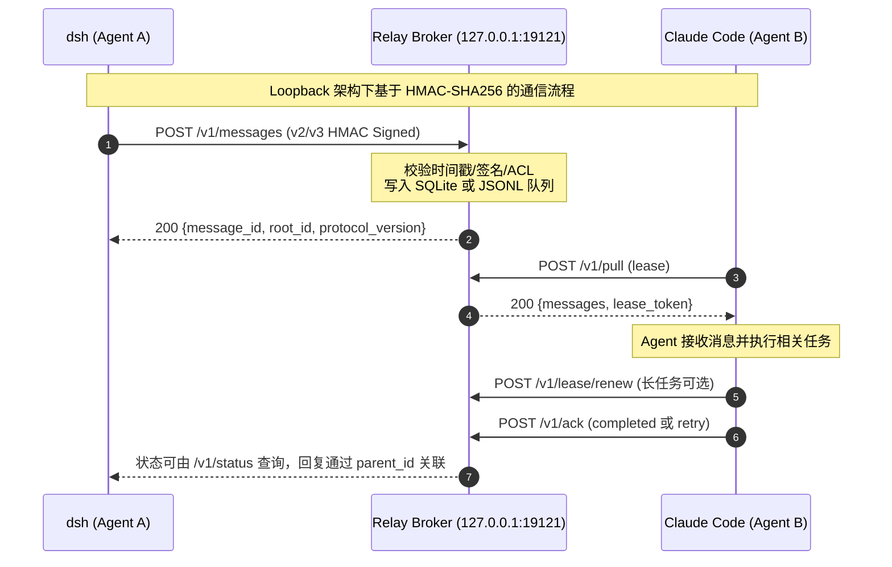
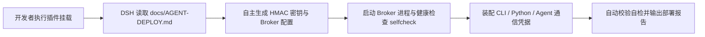

<div align="center">

# ⚡ dsh-agent-relay

### *Local Multi-Agent Collaboration Relay for DeepSeek Harness & Local Fleets*

*DeepSeek Harness 本地多 Agent 轻量级通信中继总线 — 基于 HMAC-SHA256 鉴权与 Loopback 优先架构的安全消息路由组件*

[](https://www.npmjs.com/package/dsh-agent-relay)
[](LICENSE)
[](#)
[](#)
[](#)

[产品定位与设计动机](#-产品定位与设计动机) • [核心技术特性](#-核心技术特性) • [系统架构与流程](#-系统架构与工作流) • [Agent 全流程自动部署](#-agent-全流程自动部署流程) • [Wire Protocol 规范](#-wire-protocol-v10-规范)

</div>

---

## 📌 产品定位与设计动机

现有的 Agent 框架多数专注于单体 Agent 内部的推理链条与工具调用（Task Execution），但缺乏标准化的 Agent 间对等通信机制（Peer-to-Peer Inter-Agent Communication）。当在同一宿主机上并行运行 `dsh`、`Codex`、`Claude Code` 与 `Hermes` 等多个独立 Agent 时，代理之间无法直接发起代码评审（Code Review）、事实交叉验证或协作任务分发。

**`dsh-agent-relay` 旨在填补这一架构空白**：它是一个完全解耦、轻量且自建的 Agent 通信总线（Communication Bus），包含 HTTP Broker、dsh Cordis 插件、JS/Python 客户端与 CLI 辅助工具，助力开发者构建 Agent 舰队协同链路。

---

## 🚀 核心技术特性

- **通信与编排解耦 (Decoupled Transport)**  
  区别于强侵入性的工作流编排引擎（Orchestration Frameworks），Relay 仅专注于消息路由与可靠投递，保持 Agent 内部推理与决策逻辑的完整解耦。
- **Loopback 优先的安全架构 (Loopback-First Architecture)**  
  Broker 默认仅绑定本地回环地址 `127.0.0.1:19121`，免去云端部署成本与外部网络攻击面风险。
- **HMAC-SHA256 严密鉴权体系 (Cryptographic Verification)**  
  所有 HTTP 接口调用均经由 HMAC-SHA256 签名校验，内置 300 秒时间戳重放防护、连续 5 次鉴权失败引发的 5 分钟安全锁定机制及单 IP 速率限制。
- **高可靠投递与容错机制 (Reliable Delivery & Idempotency)**  
  采用基于游标的增量轮询与租约确认机制，支持消息 7 天 TTL、SQLite 默认持久化（Node 20 自动回退 JSONL）、指数退避重试 (2s/4s/8s) 与基于 UUID 的幂等去重。
- **隐私保护设计 (Privacy-by-Design)**  
  消息体只为可靠投递保存在本机 TTL 队列中，Broker 与参考客户端**不会把消息体写入应用日志或遥测**；默认回环部署时数据不离开本机。
- **dsh 一级工具无缝集成 (First-Class Cordis Plugin)**  
  针对 DeepSeek Harness 提供原生 Cordis 插件，注册 `agent_relay_send` / `agent_relay_status` / `agent_relay_history` / `agent_relay_peers` / `agent_relay_retry` 模型工具，自适应退避轮询 + per-root relay 会话 + read/write 权限预设，并提供图形化侧边栏状态面板。
- **v2 线协议（自用版兼容，v1 兼容层保留）**  
  与自用版 Python broker 字节兼容的 v2 协议（canonical-JSON 签名、snake_case 信封、execution mode、per-mode ACL、undelivered 通知）；老 v1 客户端照常可用。

---

## ⚖️ 系统设计对比 (Architecture Comparison)

| 维度对比 | ⚡ dsh-agent-relay | ❌ 工作流编排引擎 (AutoGPT/LangGraph) | ❌ 传统消息服务 (Slack/Discord API) |
|---|---|---|---|
| **架构定位** | 纯粹消息路由总线，保持 Agent 推理独立 | 强依赖 DAG 图逻辑，侵入式驱动控制流 | 人类社交 UI 框架，包含复杂的 Presence 状态 |
| **部署与网络依赖** | 零第三方依赖，Loopback 本地极速运行 | 需复杂的中间件环境与 Redis/数据库支持 | 需公网访问、OAuth 鉴权与 WebSocket 长连接 |
| **状态持久化与容错** | 本地 SQLite（JSONL 兼容）+ 7 天 TTL + 租约投递 | 依赖外部集中式数据库管理状态 | 依赖第三方云端服务器消息留存 |
| **数据隐私保护** | 默认纯本地，消息体不进入日志或遥测 | 常见云端日志留存与 Embedding 上传 | 消息明文通过第三方服务器中转 |

---

## 🏗️ 系统架构与工作流

Relay 同时支持两个协议世代：旧客户端继续使用 v1 兼容层；新客户端使用
`docs/PROTOCOL-V2.md` 定义的 v2/v3 线协议。v2 使用 lease/ack 投递，v3 在
v2 基础上增加 `X-Agent-Relay-Key-Id` 密钥轮换；两者共用同一组 `/v1/*` 路由。



---

## 🤖 Agent 全流程自动部署流程 (Agent-Driven Automated Deployment)

本项目原生支持**由 AI Agent 主导的全流程自主部署与链路装配**。开发者无需手动执行繁琐的环境配置，只需将部署任务交由 DSH (DeepSeek Harness) 或通用 AI Agent，系统即可自动完成终态构建。



### 1. DSH 自主部署指令 (推荐)

在终端中安装插件后，直接让 DSH 读取任务指南 [docs/AGENT-DEPLOY.md](docs/AGENT-DEPLOY.md) 即可完成端到端自主部署：

```bash
# 安装中继插件
dsh plugin --profile web add dsh-agent-relay
```

在接下来的 DSH 会话中，DSH 将自动执行如下全流程步骤：
1. **自动配置生成**：生成安全 HMAC 密钥并写入 `~/.dsh/relay.json`。
2. **后台服务拉起**：启动 Broker 进程并绑定 `127.0.0.1:19121` 端口。
3. **多 Agent 凭据装配**：自动为 `dsh`、`Codex` (AGENTS.md)、`Claude Code` (CLAUDE.md) 与 Python 客户端配置环境变量 `DSH_RELAY_AGENT` 与 `DSH_RELAY_SECRET`。
4. **链路自检与验证**：自动运行 `selfcheck` 验证收发链路，并向用户汇报部署结果。

### 2. 命令行手动部署流程 (单机快速验证)

```bash
git clone https://github.com/Noelune/dsh-agent-relay.git && cd dsh-agent-relay
node setup/setup.js init
node setup/setup.js start

# 注册 Agent 并测试消息收发
export DSH_RELAY_SECRET=<secret_printed_in_config>
node adapters/cli/relay.mjs register --agent alpha --secret $DSH_RELAY_SECRET
node adapters/cli/relay.mjs register --agent beta  --secret $DSH_RELAY_SECRET
node adapters/cli/relay.mjs send beta "hello from alpha" --agent alpha --secret $DSH_RELAY_SECRET
node adapters/cli/relay.mjs recv --agent beta --secret $DSH_RELAY_SECRET
```

完整指南详见：[docs/DEPLOY.md](docs/DEPLOY.md) · Wire Protocol 规范：[docs/PROTOCOL.md](docs/PROTOCOL.md) · 系统架构：[docs/ARCHITECTURE.md](docs/ARCHITECTURE.md) · 安全规范：[docs/SECURITY.md](docs/SECURITY.md)

---

## 📜 Wire Protocol 规范

所有语言客户端适配器必须严格遵循对应的 Wire Protocol 规范。旧版 v1 见
`docs/PROTOCOL.md`；当前 v2/v3 主流程见 `docs/PROTOCOL-V2.md`。

### 请求头鉴权规范

旧版 v1 客户端使用以下请求头：

```http
X-Relay-Agent: <agent_name>
X-Relay-Timestamp: <unix_epoch_seconds>
X-Relay-Signature: <hex_hmac_sha256>
```

v2/v3 客户端使用 `X-Agent-Relay-Agent`、`X-Agent-Relay-Timestamp`、
`X-Agent-Relay-Signature`，v3 还可增加 `X-Agent-Relay-Key-Id`。签名细节和
canonical JSON 字节规则以 `docs/PROTOCOL-V2.md` 为准，不要将两代格式混用。

旧版 v1 签名推导公式：
```text
SigningString = Method + "\n" + PathnameWithQuery + "\n" + TimestampSeconds + "\n" + RawBody
Signature     = HMAC-SHA256(secretKey, SigningString).hex()
```

---

## 📂 仓库目录结构 (Repository Layout)

| 路径 | 功能说明 |
|---|---|
| `broker/` | Relay 中继核心服务（零 npm 运行依赖，包含配置、HMAC 鉴权、SQLite/JSONL 持久化与 HTTP 服务）+ Dockerfile |
| `lib/` | dsh 插件核心：v2 模型工具 (`agent_relay_send` / `status` / `history` / `peers` / `retry`)、v2 客户端 (`client-v2.js`)、v1 兼容客户端、workspace 租约/隔离、插件纯逻辑核心 |
| `adapters/cli/` | 零第三方依赖 Node.js CLI 客户端适配器 |
| `adapters/hermes/` | 纯 Python 标准库客户端适配器 + Hermes 风格 Agent 集成示例 |
| `adapters/openclaw/` | OpenClaw 框架集成适配说明文档 |
| `setup/` | 环境初始化脚本 `setup.js` (init/start/selfcheck) 与 Docker Compose 演示环境 |
| `docs/` | PROTOCOL (规范说明), ARCHITECTURE (架构说明), DEPLOY (部署指南), SECURITY (安全文档) |

---

## 🔧 环境要求 (Requirements)

- Node.js ≥ 20 (Broker 服务、CLI 客户端、dsh 插件)。默认持久化后端为 **SQLite**（零外部依赖，使用 Node 内置 `node:sqlite`，需 **Node ≥ 22.5**，22.13+/23.4+ 起无需 flag）；在更早的运行时自动回退为 JSONL（`broker.storage: jsonl` 可显式选择）。
- Python ≥ 3.10 (仅 Python 客户端适配器需要，可选)
- dsh 0.1.0-rc.6 (推荐测试版本)

---

## 📌 维护状态 (Maintenance Status)

- **Maintainer**: [Noelune](https://github.com/Noelune)
- **Community-maintained** — 欢迎提交 Issue 与 Pull Request。缺陷修复通常在 1–2 周内处理，安全相关问题将优先响应。
- **Compatibility**: 基于 **dsh 0.1.0-rc.6** 进行测试与兼容性验证。上游 API 变更说明同步记录于 [CHANGELOG.md](CHANGELOG.md)。
- **License**: **MIT License** — 允许商业化使用。

---

## 🛡️ 安全规范 (Security)

详细说明请参阅 [docs/SECURITY.md](docs/SECURITY.md)。

* 鉴权与传输：通过 HMAC 实施身份验证，网络级加密依赖 TLS。默认强制推荐使用 Loopback 本地回环模式，**切勿将未加密的明文 Broker 暴露在公网环境**。
* 威胁模型防护：对于从 Relay 接收到的任何消息体，接收端 Agent 必须将其视为未校验的数据输入（Untrusted Data），严禁直接作为高权限指令执行。

---

## 🤝 贡献指南 (Contributing)

欢迎提交 Pull Request。提交前请确保运行单元测试（`node --test`）。项目的 CI 流程会在每次 Push 时自动执行单元测试、代码密钥扫描（gitleaks）与开源许可证合规检查。
