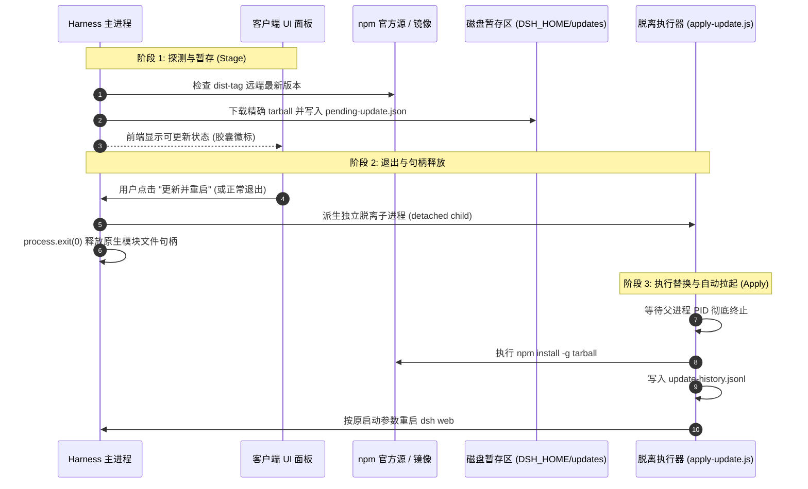

<div align="center">

# 🔄 dsh-auto-update
### 🚀 DeepSeek Harness 自更新守护插件 · 跨平台/容器环境自适应

[](https://github.com/a1113622001/dsh-auto-update)
[](https://www.npmjs.com/package/dsh-auto-update)
[](https://nodejs.org/)
[](https://github.com/a1113622001/dsh-auto-update)
[](LICENSE)

[English](./README.en.md) · [简体中文](./README.md) · [更新日志](./CHANGELOG.md)

</div>

---

## 📖 项目简介

**dsh-auto-update** 是已上架 **DeepSeek Harness 官方插件市场** 的自更新守护插件。

在 Windows 及 POSIX 平台上，运行中的 Node 原生插件（sharp/koffi/node-pty）会被操作系统加锁，直接热覆盖必报 `EBUSY`；而在容器中，主进程退出又会直接导致容器销毁。

本项目通过 **Stage（暂存） + Post-Exit Detached Apply（退出后脱离子进程替换） + 容器智能感知保护** 三阶段设计，完美解决了 Harness 在各类环境下的自动升级难题。

---

## 🛒 插件市场与安装方式

### 方式 1：通过 Harness Web 插件市场一键安装（推荐）
1. 打开 DeepSeek Harness Web 界面（默认 `http://127.0.0.1:3080`）；
2. 进入 **`设置 (Settings)`** -> **`插件市场 (Plugin Inventory / Market)`**；
3. 搜索 **`dsh-auto-update`**，点击 **`安装 (Install)`** 即可完成热加载。

### 方式 2：通过 Harness CLI 命令行安装
```bash
# 官方插件名一键添加
dsh plugin add dsh-auto-update

# 或指定 profile 安装
dsh plugin --profile web add dsh-auto-update

# 或直接从 GitHub 安装
dsh plugin add github:a1113622001/dsh-auto-update
```

---

## 🏗️ 架构与生命周期



---

## ✨ 核心特性

- 🛡️ **突破 Windows EBUSY 文件锁**：两阶段更新设计，运行期仅做暂存，主进程退出释放原生 DLL 句柄后再执行原子替换。
- 🐳 **容器智能感知（Container-Aware）**：自动检测 Docker / K8s / Podman 容器环境，禁止触发 `process.exit(0)`，并在 UI 友好提示“请拉取最新镜像更新”。
- 🌐 **全平台软链适配**：支持 Windows (`<prefix>/dsh.cmd`) 与 Linux/macOS POSIX (`<prefix>/bin/dsh`) 重启寻址。
- 💊 **极简胶囊交互**：Web 界面右下角默认折叠为轻量胶囊，点击展开查看版本差异、手动检查或一键重启。
- 🔄 **原子并发锁保护**：内置 `apply.lock`，防止多个更新进程并发冲突损坏全局环境。

---

## ⚙️ 配置文件说明 (`cordis.patch.yml`)

插件安装后会自动注入配置。如需自定义参数，可在 `%USERPROFILE%\.dsh\profiles\web\cordis.patch.yml` 中调整：
```yaml
# dsh-auto-update 配置项
- insert:
    - id: auto-update
      name: 'dsh-auto-update'
      config:
        distTag: latest              # 跟踪的 npm dist-tag (如 latest, next)
        checkOnStart: true           # 启动时立即执行一次版本检查
        checkIntervalMinutes: 240    # 定期检查间隔 (分钟)
        autoStage: true              # 发现新版本后自动下载暂存
        applyOnExit: true            # Harness 退出时自动应用更新
        relaunch: false              # 应用更新后是否自动重启 harness
```

---

## 📄 开源许可证

本项目采用 [MIT License](LICENSE) 授权开源。
