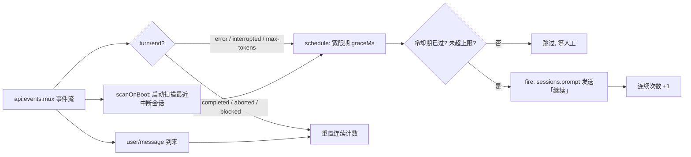

# @frog755/dsh-client-auto-retry

[](https://awesome-dsh-plugin.com)
[](https://www.npmjs.com/package/@frog755/dsh-client-auto-retry)

> DSH 客户端插件：检测到回合被中断 / 出错 / 超长（max-tokens）时，自动发送「继续」重试。
> 只做自动重试，**不做**模型 / provider 切换。自带设置卡片。

English version: [README-EN.md](./README-EN.md)

<p align="center">
  
</p>

---

## 📺 视频演示

抖音讲解视频（含 429 报错自动续跑的真实演示 + 一分钟原理讲解）：

<https://v.douyin.com/FAT_Vlsd_AU/>

---

## 它能做什么

DeepSeek Harness（DSH）的回合（turn）偶尔会因为网络抖动、provider 报错、超时、
或输出达到 token 上限而中断。大多数情况下模型其实已经跑完大部分内容，只要再发一句
「继续」就能接着完成，完全不需要人工介入、也不需要切换模型。

这个插件就是干这件事的：

1. 监听会话事件流（`api.events.mux`）；
2. 发现 `turn/end` 的 `reason.kind` 属于 `error` / `interrupted` / `max-tokens` 时，
   等一个宽限期（默认 5 秒，给 host 留出重连/恢复的时间）；
3. 宽限期后向该会话自动发送「继续」（可配置文本）；
4. 带冷却期、连续次数上限、启动时扫描最近被中断的会话等防护措施，避免失控循环。

## 安装

### 方式 A：通过 npm 安装（推荐）

在 DSH 的 profile 目录（例如 `~/.dsh/profiles/web`）里执行：

```powershell
pnpm add @frog755/dsh-client-auto-retry
```

然后编辑该目录下的 `package.json`，把 `@frog755/dsh-client-auto-retry` 加入 `dsh.profile.bundles`
（插件自带的 `cordis.patch.yml` 会以 bundle 层的形式把 `auto-retry` 行插入插件清单）：

```jsonc
{
  "dependencies": {
    "@frog755/dsh-client-auto-retry": "^0.3.0"
  },
  "dsh": {
    "profile": {
      "bundles": [
        "@deepseek-ai/dsh-base",
        "@deepseek-ai/dsh-web-app",
        // ... 其他 bundle ...
        "@frog755/dsh-client-auto-retry"
      ]
    }
  }
}
```

然后：

```powershell
pnpm install
```

**重启 DeepSeek Harness**（Host 侧插件只在进程内加载一次），再刷新浏览器页面即可。

### 方式 B：本地 link 开发调试

```jsonc
{
  "dependencies": {
    "@frog755/dsh-client-auto-retry": "link:C:/Users/frog/.dsh/projects/dsh-client-auto-retry"
  }
}
```

改完 `lib/` 下的文件后刷新页面即可（Client 侧即时生效）；Host 侧 `lib/index.js`
的改动需要重启。

## 设置项

设置入口：**设置 → 通用 → 断联自动重试**。所有项都实时生效（`applies: "live"`）。

| 字段 | 默认值 | 含义 |
| --- | --- | --- |
| `graceMs` | `5000` | 宽限期：中断后等多少毫秒再自动发送「继续」 |
| `cooldownMs` | `20000` | 冷却期：同一会话两次自动继续的最小间隔 |
| `maxConsecutive` | `5` | 最多连续自动继续次数，超过后停下等人工介入 |
| `continueText` | `继续` | 自动发送的文本内容 |
| `scanOnBoot` | `true` | 页面加载时扫描最近被中断的会话并恢复 |
| `freshMs` | `900000` | 扫描窗口：只恢复此时间段内被中断的会话（毫秒） |
| `verbose` | `true` | 在浏览器控制台输出 `[auto-retry]` 调试日志 |

## 工作原理



核心逻辑都在 `lib/client.js` 的 `AutoRetryRunner` 里；`lib/index.js`（Host 半边）
只负责注册设置 schema。

## 兼容性说明（重点）

> 📖 详细版见 [docs/COMPATIBILITY.md](docs/COMPATIBILITY.md)（含排查步骤与修改点索引）。

### 已适配版本

本插件是针对 **DSH `0.1.0-rc.7`**（web 端 profile；desktop runtime 同版本）编写并验证的。
**不同版本 / 不同形态的 DSH（桌面端 App、更新或更旧的 rc、社区构建）接口可能不同，
装不上或不生效时请按下表逐个核对。**

### 插件依赖的 DSH API 面

| # | 依赖点 | rc.7 中的形态 | 其他版本可能的变化 |
| --- | --- | --- | --- |
| 1 | 事件流打开 | `api.events.mux({}, signal)` 返回 `AsyncIterable<RpcRequest<MuxFrame>>` | 方法名、参数、返回类型 |
| 2 | mux 帧信封 | 帧是 RPC 信封 `{ rpcId, payload }`，真正内容在 `payload` 里（`session/event` 等） | 有的版本直接推裸帧 `{ type, sessionId, event }`；插件已同时兼容两种（见 `onMuxFrame`） |
| 3 | 回合结束原因 | `turn/end` 的 `data.reason.kind ∈ { completed, aborted, blocked, error, 'max-tokens', interrupted }` | 枚举名可能增减；`TurnEndReasonMap` 本身设计为可被插件 merge 扩展 |
| 4 | 发送继续 | `api.sessions.prompt({ sessionId, mode: 'queue', content: [{ type: 'text', text }] })` → `{ result: { ok } }` | 请求/响应结构可能变 |
| 5 | 会话列表 | `api.sessions.list({})` → `result.value`（或 `result.data`）数组；字段 `s.id`/`s.sessionId`、`s.updatedAt`/`s.lastActivityAt` | 字段名可能变（插件已做兼容取值） |
| 6 | 客户端加载格式 | `window.__ModuleLoader__.load({ id, factory })`（`@deepseek-ai/dsh-client-runtime`） | 桌面端或其他构建可能用不同的模块加载器 |
| 7 | 设置 schema（Host） | `settingsNamespace(NS)` + `ctx.settings.register(ns, schema, { applies: 'live' })`（`@deepseek-ai/dsh-settings`） | 注册 API 或 `applies` 取值可能变 |
| 8 | 设置卡片（Client） | `ctx.slots.inject('settings.general.item')` + `slots.register(...)` + `ctx.locale.register(NS, { zh, en })` + `ctx.settingsScope.bind({ namespace: NS })` + `runtime.defineStore(...)` | slot id、locale/scope/store API 可能变 |
| 9 | bundle 机制 | `package.json` 的 `dsh.bundle.patch` 指向 `cordis.patch.yml`，`- insert: { id, name }` 插入插件行 | 旧版本可能需要在 profile 的 `cordis.patch.yml` 里手动 `insert`，或机制完全不同 |

### 遇到问题时怎么排查

1. 打开浏览器 DevTools 控制台，看有没有 `[auto-retry]` 日志；`verbose` 默认开着。
2. 如果插件行根本没加载：先确认 `package.json` 里 `dsh.profile.bundles` 是否包含
   `dsh-client-auto-retry`，并已重启 DSH。
3. 如果加载了但不触发：在控制台手动调用 `api.events.mux({}, signal)` 观察帧结构，
   对照上表第 2、3 条 —— 你的版本帧信封 / `reason.kind` 枚举可能不同。
4. 如果触发了但发送失败：对照上表第 4、5 条检查 `sessions.prompt` / `sessions.list`
   的请求响应结构。
5. 如果设置卡片不出现：对照上表第 7、8 条检查 settings / slots 注册方式。

### 常见坑

- **Host 侧改动需要重启 DSH**：Cordis 插件进程内只加载一次，改 `lib/index.js` 后必须重启，
  否则只是刷新页面不会生效。
- **别把 `maxConsecutive` 设太大**：如果 provider 持续报错，自动重试只会反复烧 token，
  建议保持默认 5 次以内，超限后由插件主动停手等你人工介入。
- **`scanOnBoot` 只扫 `freshMs` 窗口内的会话**：重启很久之后再打开页面不会误触老会话。
- **不要把插件当错误兜底**：它只发「继续」，不做模型/provider 切换；如果需要故障转移，
  请在 DSH 的模型路由配置里做。

## 跨 Agent 适用性与可推广方向

> 本项目当前已针对 **DeepSeek Harness（DSH）** 完成适配和验证；下面的其他 Agent
> 是基于其公开插件 / SDK / Hook / Session API 做出的适配性评估，**不代表本包已经
> 直接支持这些平台**。不同 Agent 需要各自的薄适配层，核心的自动恢复策略可以复用。

这个插件的核心能力并不局限于 DSH：它本质上是一个带安全阈值的 **Agent 回合自动恢复器**。
只要目标 Agent 提供“监听回合状态、识别会话、发送后续消息或恢复会话”这组能力，就可以接入：

```text
监听回合 / 运行事件
    ↓
判断失败是否可恢复
    ↓
宽限期 + 冷却期 + 连续次数上限
    ↓
向原会话发送继续指令，或恢复同一会话
```

### 优先适配目标

| Agent | 推荐适配形态 | 公开入口 | 适配性 | 备注 |
| --- | --- | --- | --- | --- |
| **Codex CLI / app-server** | Plugin Hook 或 app-server Adapter | `turn/completed`、`thread/resume`、`turn/start`、`turn/steer` | **很高** | 有稳定 thread/turn ID 和结构化失败状态，最接近 DSH 的事件 + 恢复模型 |
| **Claude Code** | Agent SDK Adapter 或 Plugin Hook | `StopFailure`、`resume`、`continue_conversation` | **很高** | 官方 SDK 支持持续会话、指定 session 恢复和中断控制 |
| **Pi coding agent** | TypeScript Extension | `agent_end`、`session_start`、`sendUserMessage()` | **很高** | 原生扩展和 session runtime 清晰，适合做本地插件 |
| **OpenCode** | JS/TS Plugin 或 Server SDK Adapter | `session.error`、`session.idle`、`session.prompt_async` | **很高** | 插件、SSE 事件流、Session API 和异步 Prompt 均已公开 |
| **Cline** | AgentPlugin / Runtime Hook | `afterRun`、`onEvent`、`continue()` | **很高** | 有类型化生命周期 Hook，适合封装成正式插件 |
| **OpenClaw** | Gateway Plugin | `agent_end`、`session_*`、下一轮注入、Session API | **高** | 适合进一步扩展到卡死、超时、子 Agent 和后台任务恢复 |
| **OpenHands** | Python SDK / Agent Server Adapter | Conversation pause/resume、`send_message()`、`run()` | **中高** | 更适合 SDK 或服务端中间件，而不是前端小插件 |
| **Hermes Agent** | Python Plugin / Gateway Hook | `agent:end`、`post_llm_call`、Session Hook | **中** | 有丰富 Hook，但自动恢复动作需要结合其 Gateway / Session 路由实现 |
| **Goose** | Hook / HTTP Session Adapter | Session Hook、`resume`、`steer` | **中** | 可接入，但需要仔细区分工具失败和整轮 Agent 失败 |

### 适配边界

- **当前已验证**：DSH Web profile（`0.1.0-rc.7`）。
- **具备较好推广条件**：Codex、Claude Code、Pi、OpenCode、Cline、OpenClaw。
- **适合做 SDK / Middleware，而非直接安装本插件**：OpenHands、Hermes、Goose、Aider、mini-SWE-agent。
- **尚未宣称直接兼容**：除 DSH 外，其他平台需要单独的 Adapter、安装包和版本验证。

因此，本项目可以作为一个跨 Agent 方向的基础实现：

```text
Auto-Retry Core
├── DSH Adapter（当前实现）
├── Codex Adapter（规划）
├── Claude Code Adapter（规划）
├── Pi / OpenCode / Cline Adapter（规划）
└── OpenClaw / OpenHands 等高级 Adapter（规划）
```

公开参考：

- [Codex Hooks](https://developers.openai.com/codex/hooks) · [Codex app-server](https://developers.openai.com/codex/app-server)
- [Claude Code Hooks](https://code.claude.com/docs/en/hooks) · [Claude Agent SDK Sessions](https://code.claude.com/docs/en/agent-sdk/sessions)
- [Pi Extensions](https://github.com/earendil-works/pi/blob/main/packages/coding-agent/docs/extensions.md)
- [OpenCode Plugins](https://opencode.ai/docs/plugins/) · [OpenCode SDK](https://opencode.ai/docs/sdk/)
- [Cline Plugins](https://docs.cline.bot/sdk/plugins)
- [OpenClaw Plugin Hooks](https://docs.openclaw.ai/plugins/hooks)
- [OpenHands SDK](https://docs.openhands.dev/sdk)
- [Hermes Hooks](https://github.com/NousResearch/hermes-agent/blob/main/website/docs/user-guide/features/hooks.md)

## 开发与调试

```powershell
# 本地起项目（纯 ESM，无构建步骤，改完直接生效）
# Client 侧：刷新页面
# Host 侧：重启 DSH
```

日志前缀：`[auto-retry]`。`verbose: false` 可关闭非关键日志（连接日志仍会输出）。

## 致谢

本插件的开发与日常调试使用了阿里云百炼的免费模型额度（学生认证赠送 300 元，国内主流模型基本都能用）：

<https://university.aliyun.com/course/promotion27-activity?clubTaskBiz=subTask..12810055..10280..&userCode=hbs5sljx>

## License

MIT
