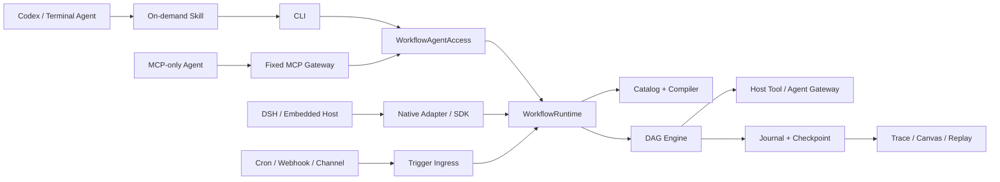

# Agent DAG Workflow

`@gm-hz/agent-dag-workflow` 是一个可嵌入任意 Agent Host 的持久化 DAG Workflow 内核。它把 Agent、Tool、Skill、MCP 和受控本地能力编排成同一份可保存、校验、发布、恢复、审计和重放的 `WorkflowTemplate` JSON。

它不是另一个 Coze/Dify 平台，也不内建模型 Provider、凭据中心或 Tool 市场。Host 继续负责已有的 Agent/Tool/Skill/MCP 生态；本项目只负责把离散能力变成稳定流程。

## 为什么这样设计



核心约束：

- 一份 JSON：SDK、Agent、CLI、MCP、DSH 和 Canvas 使用同一 `WorkflowTemplate`，不维护第二套 DSL。
- 两级扩展：普通外部能力注册为 Host Tool，由 `tool.call@1` 调用；只有暂停恢复、长任务 checkpoint、补偿等生命周期语义才实现自定义 Node。
- 没有 Provider 层：MCP Tool、本地受控命令、DMS、HTTP、数据库和消息能力都由 Host Gateway 适配。
- 权限只会收窄：模板先声明 `requires`，节点再声明固定依赖；最终能力是模板声明、节点声明、Authority 和 Host policy 的交集。
- Agent Access 默认只允许同一 `authorityRef` 读取、追踪、重放或恢复持久化 Run；多租户管理员访问必须通过显式 `authorize` policy 授权。
- Host 通过 `WorkflowDeploymentLimits` 持有不可提升的并发、时长、节点次数、输出大小和子流程深度 ceiling。
- 编译器执行分支路径支配检查，拒绝发布在某条激活路径上必然缺少数据的 Workflow。
- 外部动态结果只有通过 lossless JSON、schema、`expects`、端口和大小检查后，才会进入 Artifact、Journal 和 Checkpoint。
- Script 只做纯 JSON：`core.script@1` 没有网络、文件、环境变量、密钥或 `eval`。含外部副作用的循环必须使用 `core.foreach@1`。
- 运行可复现：run 固化模板、发布修订、依赖闭包、Engine 版本和 NodeDefinition set hash；Journal 与 Checkpoint 原子提交。
- Trigger 不进入 DAG：Cron、Webhook、钉钉等只产生可信 Envelope，再通过固定 Binding 启动发布修订。
- 默认由当前 Agent、CLI 或 Host 直接调用 Runtime；Queue/Runner 只是不可靠进程或分布式部署需要时才启用的可选适配器。

完整设计见 [核心通用化重构方案](docs/core-generalization-refactor.md)、[Core hardening 不变量](docs/core-hardening.md) 与 [Core Verification Harness](docs/core-verification-harness.md)，Agent 访问方式见 [访问架构技术方案](docs/agent-access-architecture.md)，模板字段见 [Workflow Template v1](spec/workflow-template-v1.md)。

## 安装

要求 Node.js 22.19+：

```bash
npm install @gm-hz/agent-dag-workflow
```

这是唯一公开包。不同宿主通过 subpath export 按需引用：

```ts
import { WorkflowRuntime } from '@gm-hz/agent-dag-workflow'
import { SqliteWorkflowRunStore } from '@gm-hz/agent-dag-workflow/sqlite'
import { createMcpGateway } from '@gm-hz/agent-dag-workflow/mcp'
import * as DshWorkflow from '@gm-hz/agent-dag-workflow/dsh'
```

未导入的 DSH、Canvas、MCP 或 Trigger Adapter 不会自动启动。

## 最小 SDK 用例

下面的流程不需要任何外部 Provider，只执行确定性 JSON 变换：

```ts
import {
  InMemoryWorkflowCatalogRepository,
  InMemoryWorkflowRunStore,
  WorkflowNodeRegistry,
  WorkflowRuntime,
  WorkflowTemplateCatalog,
  registerCoreNodes,
} from '@gm-hz/agent-dag-workflow'

const nodes = new WorkflowNodeRegistry()
registerCoreNodes(nodes)

const catalog = new WorkflowTemplateCatalog(
  new InMemoryWorkflowCatalogRepository(),
  nodes,
)

const runtime = new WorkflowRuntime({
  nodes,
  catalog,
  runStore: new InMemoryWorkflowRunStore(),
})

const template = {
  apiVersion: 'workflow.gm-hz.dev/v1alpha1',
  kind: 'WorkflowTemplate',
  metadata: { id: 'hello', name: 'Hello' },
  spec: {
    inputSchema: {
      type: 'object',
      required: ['name'],
      properties: { name: { type: 'string' } },
    },
    outputSchema: {
      type: 'object',
      required: ['message'],
      properties: { message: { type: 'string' } },
    },
    requires: [{ kind: 'script-runtime', uses: 'json.expr@1' }],
    nodes: [
      { id: 'start', uses: 'core.start@1', with: {}, inputs: {} },
      {
        id: 'format',
        uses: 'core.script@1',
        with: { language: 'json.expr@1', source: '{ message: "Hello, " + input.name }' },
        inputs: { name: { input: { path: ['name'] } } },
      },
      {
        id: 'end',
        uses: 'core.end@1',
        with: {},
        inputs: { message: { output: { nodeId: 'format', path: ['message'] } } },
      },
    ],
    edges: [
      { id: 'start-format', source: 'start', target: 'format' },
      { id: 'format-end', source: 'format', target: 'end' },
    ],
    outputs: { message: { output: { nodeId: 'end', path: ['message'] } } },
  },
}

const handle = await runtime.launch({
  target: { type: 'inline', template },
  inputs: { name: 'Workflow' },
  authorityRef: 'sdk:local',
  authority: {},
  origin: { type: 'sdk' },
})

console.log(await handle.result)
```

生产调用应先创建 draft、校验并发布，再使用固定 revision：

```ts
const draft = await runtime.createDraft(template)
const published = await runtime.publish(draft.id, draft.revision)

const handle = await runtime.launch({
  target: { type: 'published', id: published.id, revision: published.revision },
  inputs: { name: 'Workflow' },
  authorityRef: 'user:42',
  authority: currentUser,
  origin: { type: 'sdk' },
  idempotencyKey: requestId,
})
```

## 接入 Host Tool 与 Agent

模板中的外部调用只经过显式 Gateway：

```ts
const runtime = new WorkflowRuntime({
  nodes,
  catalog,
  runStore,
  services: {
    tools: {
      async execute(request) {
        // 在这里执行 Host 自己的 scope、guard、审批、凭据和审计策略。
        return hostTools.execute(request.uses, request.inputs, {
          authority: request.authority,
          invocationId: request.invocationId,
          signal: request.signal,
        })
      },
    },
    agents: hostAgentGateway,
  },
})
```

`tool.call@1` 的 `with.uses` 必须是固定能力名，并同时出现在 `spec.requires`。模板不能传入任意 shell、动态 Tool 名或明文 Secret；`connectionRef`/`credentialRef` 只是不透明引用，最终由 Host 解析。

## Script、Condition 与 Foreach

三者不是重复能力：

| 场景 | 节点 | 原因 |
| --- | --- | --- |
| JSON map/filter/reduce/sort | `core.script@1` | 无副作用，可作为一个原子节点重算 |
| 选择静态 DAG 端口 | `core.condition@1` | Scheduler 必须记录 taken/skipped edge |
| 对每个 item 调用 Tool/Agent/子流程 | `core.foreach@1` | 需要并发上限、逐项 checkpoint、稳定 invocationId 和恢复 |

不支持无界 `while`，也不允许 Script 返回动态节点后让 Engine 隐式执行。

## Journal、恢复与 Replay

Runtime 提供三种不同语义：

- `inspect`：只读取历史事实，不执行任何节点；
- `recorded`：创建新 run，使用已提交的外部节点结果，重新计算确定性下游；
- `live`：创建新 run，并重新调用外部能力。

```ts
const page = await runtime.readEvents(runId, { afterSeq: 0, limit: 100 })
const replay = await runtime.replay({ runId, mode: 'recorded' })
```

Recorded Replay 不声称重放模型隐藏思维链。它只使用显式输入、公开内容、结构化输出和按部署 Capture Policy 保存的 Artifact。
默认 Memory/SQLite Artifact Store 不伪装提供静态加密或自动过期；启用对应策略时必须换成声明了 `encryptionAtRest`/`retentionPolicy` capability 的 Store，否则 Runtime 会拒绝启动。

## CLI

CLI 默认使用当前目录的 `.agent-dag-workflow.db`，也可以用 `--db` 指定 SQLite 文件：

```bash
agent-workflow validate examples/script-transform.workflow.json
agent-workflow draft put examples/script-transform.workflow.json --db workflows.db
agent-workflow publish script-transform-demo --expected 1 --db workflows.db
agent-workflow search "transform" --db workflows.db
agent-workflow describe script-transform-demo@1 --view schema --db workflows.db
agent-workflow run script-transform-demo@1 --input input.json --db workflows.db
agent-workflow run-get <runId> --db workflows.db
agent-workflow trace <runId> --events --db workflows.db
agent-workflow trace <runId> --follow --format jsonl --db workflows.db
agent-workflow replay <runId> --mode recorded --db workflows.db
agent-workflow resume <runId> --db workflows.db
agent-workflow migrate-template old.json --output workflow-v1.json
```

所有非流式命令都返回单个 `agent-workflow.cli/v1` JSON Envelope；`--input -` 从 stdin 读取 JSON，不需要把大型输入塞进 shell 参数。CLI 对每个命令使用严格参数契约，未知、重复或多余参数会在打开数据库前 fail closed。包含 Tool/Agent 节点时，必须显式传入 `--host ./host.mjs`。该模块导出 Gateway、Authority 和可选自定义 Node；CLI 不会隐式读取环境变量来猜测能力或凭据。

后台调用使用 `run ... --detach`，并由 `agent-workflow worker --once` claim/resume。Host 必须提供可恢复的 Authority Resolver，否则 Runtime 会拒绝后台启动。

## Codex、Skill 与 MCP

具备终端能力的 Codex 类 Agent 默认使用仓库内的 `workflow-builder` Skill 和 CLI。Skill 只在 Workflow 任务命中时加载，不包含执行逻辑。Codex Plugin 位于 `integrations/codex/agent-dag-workflow`，已按官方 manifest 结构打包同一 Skill。

没有本地命令能力的 Agent 可以启动一个固定 Tool 数量的 MCP Gateway：

```bash
agent-workflow-mcp --db workflows.db --profile invoke
agent-workflow-mcp --db workflows.db --profile author
```

`invoke` profile 永远只有 `workflow_search`、`workflow_describe`、`workflow_run`、`workflow_run_get` 和 `workflow_trace` 五个 Tool。`author` 额外提供有界的节点、校验、草稿、diff 和发布 Tool。Catalog 中有多少 Workflow 都不会改变 Tool 数量；Agent 只按需读取被选中 Workflow 的 Schema。搜索由 Repository 在已发布 revision 上有界执行，不会读取未发布 Draft 元数据。

## DSH 与 Canvas

DeepSeek Harness 是一个 Adapter，不是 Core 前提。安装同一个包即可加载 DSH Tool/Agent/Skill、SQLite 和 Canvas：

```bash
dsh plugin --profile web add @gm-hz/agent-dag-workflow
```

从当前源码验证时只链接仓库根目录：

```bash
pnpm install
pnpm build
dsh plugin --profile web add "$PWD"
dsh web
```

插件向 DSH 注册 `workflow-builder` Skill，以及查询节点、创建/更新/校验 draft、发布和运行的受保护工具。Canvas 编辑的是同一份 `WorkflowTemplate`，Trace 来自同一份 Journal。
Canvas 的“触发与投递”页面还能查看 Binding、重复 Ingress、run 关联和状态不确定的 Delivery，并从入口直接打开权威 Trace。

## Trigger

Trigger 通过不可变 Binding 把可信入口映射到固定发布修订：

```text
验签 → 生成可信 Envelope → Ingress 去重 → Binding 映射
     → 幂等 launch → WorkflowRun → Result Delivery
```

外部 payload 不能指定最终 Authority、幂等键或 Workflow revision。Cron、Webhook 和钉钉只提供 reference adapter；生产部署仍需按平台协议实现可靠 HTTP/消息接收、加密凭据、持久队列和运维告警。

CLI、固定 MCP Gateway、DSH Plugin、SDK 和 Trigger 最终都调用同一个 Runtime。入口不会改变固定 revision、输入输出 Schema、Authority、Journal、Checkpoint 或 Replay 语义。

## 示例与验证

仓库包含以下长期基准：

- [script-transform.workflow.json](examples/script-transform.workflow.json)：纯 JSON 变换；
- [approval-gate.workflow.json](examples/approval-gate.workflow.json)：条件分支；
- [batch-contract-review.workflow.yaml](examples/batch-contract-review.workflow.yaml)：foreach 与子工作流；
- [weekly-ai-model-news.workflow.json](examples/weekly-ai-model-news.workflow.json)：多路检索、Agent 结构化、确定性排序和 Top 10；
- [showcase 说明](docs/showcase-workflows.md)：复杂场景的依赖与运行方式。

源码验证：

```bash
pnpm install
pnpm check
pnpm demo
```

项目使用 MIT License。发布、兼容性和实现门禁以 [重构方案](docs/core-generalization-refactor.md) 的完成定义为准。
