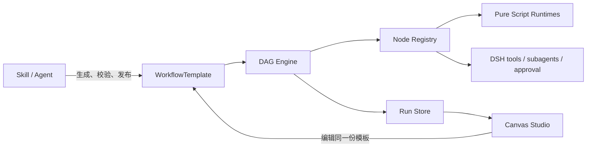

# DSH DAG Workflow

DSH DAG Workflow 是一套基于 [DeepSeek Harness](https://github.com/deepseek-ai/deepseek-harness) 插件体系的持久化 Workflow 能力：Skill 或 Agent 负责生成模板，DAG Engine 按模板执行，Canvas 直接编辑和观察同一份模板。

它不是对 DSH 现有动态 JavaScript workflow 的替代。动态 workflow 适合 Agent 临时规划和扇出任务；本项目解决需要保存、复用、版本化、审计、暂停恢复和可视化编排的流程。

## 设计



核心设计约束：

- **一个真源**：Agent、Engine 和 Canvas 都读写 `WorkflowTemplate`，不再维护第二套 Canvas DSL。
- **精确解析**：节点使用 `type@version`，发布后的 Workflow 和子流程固定到不可变 revision。
- **能力不越权**：`dsh.tool@1`、`dsh.agent@1`、`dsh.human-approval@1` 始终经过当前 DSH scope 的 tool、subagent、approval 和 owning Agent。
- **依赖先声明**：动态节点的 capability、Tool、脚本 runtime、secret 和子流程必须出现在 `spec.requires`；Agent 节点继承当前 DSH Agent scope，模板声明只会收窄权限，不会授予新权限。
- **结果先契约化**：节点可用 `expects.schema/maxBytes` 声明实例级结果契约，输出必须在写入 checkpoint 前通过确定性校验；需要业务语义复核时再显式连接 Agent 节点。
- **逻辑可扩展、边界不模糊**：确定性 JSON 处理使用可插拔的 `core.script@1` runtime；网络、文件、密钥和外部副作用仍必须走 DSH Tool/Agent 节点。
- **外部扩展只有两级**：普通外部能力注册为 DSH Tool，由通用 `dsh.tool@1` 执行；只有暂停恢复、长任务、事务补偿等特殊工作流语义才实现自定义 Node。
- **执行可恢复**：每次状态推进同时追加有序事件并提交 checkpoint；未知副作用不会自动重试，而是进入 `needs_attention`。
- **布局不污染语义**：节点位置和 viewport 位于 `layout`，移动节点只产生 layout diff，不改变 Workflow 的 semantic hash。

一个模板包含输入/输出 Schema、节点、边、binding、执行策略和可选布局：

```yaml
apiVersion: dsh.workflow/v1alpha1
kind: WorkflowTemplate
metadata:
  id: echo-message
  name: Echo message
spec:
  requires:
    - { kind: capability, uses: dsh.tools.execute }
    - { kind: tool, uses: echo }
  inputSchema:
    type: object
    required: [message]
    properties:
      message: { type: string }
  outputSchema:
    type: object
    required: [answer]
    properties:
      answer: { type: string }
  nodes:
    - id: start
      uses: core.start@1
      with: {}
      inputs: {}
    - id: echo
      uses: dsh.tool@1
      with: { name: echo }
      expects:
        schema:
          type: object
          required: [result]
          properties:
            result: { type: object }
      inputs:
        message: { input: message }
    - id: end
      uses: core.end@1
      with: {}
      inputs:
        answer: { output: { node: echo, path: [result, echo] } }
  edges:
    - { id: start-echo, source: start, target: echo }
    - { id: echo-end, source: echo, target: end }
  outputs:
    answer: { output: { node: end, path: [answer] } }
```

完整字段、校验规则和分支语义见 [Workflow Template v1 规范](spec/workflow-template-v1.md)。复杂场景统一收录在 [Showcase workflows](docs/showcase-workflows.md)：包括生产发布门禁、可恢复批量合同审查、多源尽调和 AI 模型周报，覆盖并行 Agent、Tool、受限脚本、审批、子 Workflow、foreach 恢复和审计追踪。真实外部数据的完整验收模板见 [weekly-ai-model-news.workflow.json](examples/weekly-ai-model-news.workflow.json)：13 路 DSH `web_search` 检索一周内候选，Agent 归一化最多 100 条并返回评分/摘要 overlay，受限脚本严格合并、稳定排序并输出 Top 10。

## 快速开始

要求 Node.js 22.19+。将 `dsh-dag-workflow` 主包安装到 DSH Web profile：

```bash
dsh plugin --profile web add @gm-hz/dsh-dag-workflow
```

该命令会装配 DAG runtime、Agent authoring tools、`workflow-builder` Skill、SQLite 持久化和 Canvas Studio；默认数据库位于 DSH home 下的 `dsh-dag-workflow/workflows.db`。

从源码开发和运行全部门禁需要 pnpm 11：

```bash
git clone https://github.com/GM-HZ/dsh-dag-workflow.git
cd dsh-dag-workflow
pnpm install
pnpm check
```

发布前也可以直接把当前 workspace 链接到本机 DSH，不需要先上传 npm：

```bash
pnpm build
dsh plugin --profile web add \
  "$PWD/packages/core" \
  "$PWD/packages/catalog" \
  "$PWD/packages/dsh" \
  "$PWD/packages/sqlite" \
  "$PWD/packages/canvas" \
  "$PWD"
dsh web
```

打开任意顶层会话后，页面右下角会出现 `◇ 工作流`。首次打开有三条清晰路径：运行不依赖外部 Tool 的回显示例、复制指令让 Agent 创建，或者继续最近草稿。Canvas 会跟随 DSH 明暗主题，并把高级 Schema、依赖和原始 JSON 收进渐进配置。

最短验证路径：

1. 点击 `◇ 工作流` → `从可运行示例开始`。
2. 保持预填的 `{ "message": "你好，DSH Workflow" }`，点击 `试运行`。
3. 在底部看到开始、节点完成和运行完成；选择节点可查看本次输出。
4. 点击 `校验`，确认 0 个错误后保存。只有发布不可变修订时才会二次确认。

连接中断或 DSH 重启时，Canvas 会保留未保存模板和运行输入、自动重连并区分连接、权限、CAS 冲突、Schema 与执行错误。详细交互约束见 [体验与故障恢复](docs/experience.md)。本仓库另提供可直接执行的风险分流模板 [approval-gate.workflow.json](examples/approval-gate.workflow.json)：`riskScore > 70` 走 `true` 边，否则走 `false` 边，两路汇合并输出类型稳定的 `{ request, highRisk }`。

先单独验证模板和 DAG Engine：

```bash
pnpm demo
```

也可以将同一组本地包链接到本机 `headless` profile，再让真实 DSH Agent 创建、校验、发布和运行该模板。Web 与 Headless profile 默认共用 `$DSH_HOME/dsh-dag-workflow/workflows.db`，因此 Agent 创建的模板会直接出现在 Canvas 的 OPEN 列表中。

需要定制存储或 Canvas authority 时，也可以只安装子包并在 DSH Host 中手动装配。最小内存版只需要 `@gm-hz/dsh-dag-workflow-host`：

```ts
import * as DagWorkflow from '@gm-hz/dsh-dag-workflow-host'

// Host 需要先提供 DSH 的 tools、subagents、approval 和 skills 服务。
await ctx.plugin(DagWorkflow)
```

插件会发布六个 Cordis service：

| Service | 用途 |
| --- | --- |
| `ctx.workflowCapabilities` | 为自定义 Node 注册受声明约束的 Host 生命周期服务 |
| `ctx.workflowScripts` | 注册版本化、确定性的纯 JSON 脚本运行时 |
| `ctx.workflowNodes` | 注册并解析版本化节点 |
| `ctx.workflowTemplates` | draft、CAS 更新、diff、校验和发布 |
| `ctx.workflowRuns` | 事件日志与 checkpoint |
| `ctx.dagWorkflowEngine` | 启动、恢复和取消运行 |

内存实现适合开发和测试。生产环境先挂载 SQLite 持久化实现，再让主插件复用外部服务：

```ts
import {
  WorkflowCapabilityRegistryService,
  WorkflowNodeRegistryService,
  WorkflowScriptRuntimeRegistryService,
} from '@gm-hz/dsh-dag-workflow-host'
import * as DagWorkflow from '@gm-hz/dsh-dag-workflow-host'
import {
  SqliteWorkflowRunsService,
  SqliteWorkflowTemplatesService,
} from '@gm-hz/dsh-dag-workflow-sqlite'

const database = { path: './data/workflows.db' }

await ctx.plugin(WorkflowCapabilityRegistryService)
await ctx.plugin(WorkflowScriptRuntimeRegistryService)
await ctx.plugin(WorkflowNodeRegistryService)
await ctx.plugin(SqliteWorkflowTemplatesService, database)
await ctx.plugin(SqliteWorkflowRunsService, database)
await ctx.plugin(DagWorkflow, {
  catalog: 'external',
  runStore: 'external',
})
```

## 使用方式

### 1. 让 Agent 生成 Workflow

主插件会向 DSH 注册 `workflow-builder` Skill，以及下面十个受 DSH 策略保护的工具：

```text
workflow_nodes_list
workflow_draft_create
workflow_draft_import
workflow_draft_read
workflow_draft_update
workflow_draft_validate
workflow_validate
workflow_diff
workflow_publish
workflow_run
```

可以直接对 Agent 表达目标，例如：

> 创建一个“研究主题 → 两路独立调研 → 汇总报告 → 人工确认”的 workflow。先展示校验结果和 diff，得到我确认后再发布，并运行发布的精确 revision。

Skill 引导 Agent 按 `查询节点和 Tool → 生成拓扑 → 创建或导入 draft → 校验 → diff → 发布 → 运行` 的顺序工作。大型模板使用 `workflow_draft_import` 传递完整 JSON 字符串，避免模型把 object 参数错误序列化。Skill 不绕过工具直接修改 Catalog，因此原有的 scope、guard、approval 和 observer 策略仍然生效。

创建或更新完成后，Agent 默认只返回工作流名称、草稿 ID、草稿修订、校验结果和下一步，不会把完整模板塞进对话。用户打开 `工作流` 看到的是同一份 WorkflowTemplate，而不是另一份 Canvas 副本；只有明确要求原始 JSON 时才展开模板。

### 2. 从代码执行

```ts
const published = ctx.workflowTemplates.getPublished('research-report', 1)
const run = ctx.dagWorkflowEngine.start({
  template: published.template,
  inputs: { topic: 'DSH plugin architecture' },
  parent: agent, // 发起运行并拥有权限的真实 DSH Agent
})

const result = await run.result
await run.dispose()

if (result.status === 'completed') {
  console.log(result.outputs)
}
```

`result` 会以 `completed`、`failed`、`cancelled` 或 `paused` 收敛。调用方持有 run，并应在读取结果后 `dispose()`。

### 确定性脚本节点

`core.script@1` 用于字段整理、模板拼接、数组筛选/投影和数值聚合。内置 `dsh.expr@1` 是有操作数上限的纯表达式语言，不使用 `eval`，表达式必须返回 JSON object：

```json
{
  "language": "dsh.expr@1",
  "maxOperations": 10000,
  "source": "{ customer: upper(trim(input.customer)), total: sum(mapGet(input.orders, \"amount\")) }"
}
```

可运行示例见 [script-transform.workflow.json](examples/script-transform.workflow.json)。`sortBy` 支持对象数组的稳定多键排序，`joinBy` 用唯一 key 严格合并等长 overlay，并拒绝未知、重复、缺失 key 或覆盖原字段。脚本没有 I/O、时间、随机数或凭据接口；这些能力应拆成 `dsh.tool@1` 或 `dsh.agent@1`，再把其结构化输出交给脚本节点。

周报验收模板只使用 DSH 已有的 `web_search` Tool：Agent 先规划 13 组查询，Runtime 并行执行 Tool，随后将最多 100 条候选交给 Agent 结构化和评分。确定性脚本用 `joinBy` 将 `{id, ...新增字段}` overlay 合并回原记录，因此排序、截断和关键字段合并不由 Agent 隐式控制。

动态依赖和结果契约属于模板语义并进入 semantic hash。执行时一个节点能看到的 gateway 或自定义 Host capability 会按其 NodeDefinition `capabilities` 裁剪；最终有效能力是“节点声明 ∩ Workflow requires ∩ owning Agent scope ∩ DSH policy”。

恢复一个持久化运行：

```ts
const resumed = ctx.dagWorkflowEngine.resume({
  runId,
  parent: agent,
  unknownNodeResolutions: {
    charge: 'retry', // 也可以显式选择 'fail'
  },
})

const result = await resumed.result
await resumed.dispose()
```

### 3. 启用 Canvas Studio

Canvas 是独立插件。所有 RPC 会先通过 Host 的实时 Agent registry 解析 `sessionId`，只接受仍附着在当前 Host 的顶层 Agent。多人或多租户部署应继续按用户、workspace、action/resource 增加授权策略：

```ts
import * as WorkflowCanvas from '@gm-hz/dsh-dag-workflow-canvas'

await ctx.plugin(WorkflowCanvas, {
  authorize: async ({ sessionId, agent, action, resourceId }) => {
    return mayUseWorkflow(currentUserId(), agent, action, resourceId)
      ? { subject: currentUserId(), agent }
      : undefined
  },
})
```

省略 `authorize` 时使用面向本地单用户 profile 的默认边界：不存在、未附着或属于 subagent 的 session identity 会被拒绝，但 `sessionId` 本身不是多租户身份凭证。

包内的 `dsh.client` manifest 会加载 XYFlow Studio。Studio 会把当前 Agent scope 可见的每个 DSH Tool 直接显示为一个 palette 项，拖入后保存的仍是 `dsh.tool@1 + with.name`。它同时支持自定义节点、边编辑、Schema/config 编辑、诊断、CAS 保存、语义/布局 diff、发布、draft 测试运行、持久 trace，以及未知副作用的 retry/fail 决策。

其他 DSH Client 插件也可以打开同一个 overlay：

```ts
ctx.workflowCanvasUi.open({
  templateId: 'research-report',
  runId: 'dag-…',
  nodeId: 'summarize',
})
```

## 两级扩展模型

### 一级：DSH Tool

普通外部系统只注册 DSH Tool，不需要实现 Workflow 接口。Tool 的输入 Schema、scope、guard、credential、observer 和输出校验继续由 DSH 负责；`workflow_nodes_list` 和 Canvas 会读取当前 Agent scope 可见的 Tool catalog。Canvas 中的 Tool 条目不是第三种节点类型，保存时统一物化为：

```yaml
- id: dms-query
  uses: dsh.tool@1
  with: { name: dms.query }
  inputs:
    sql: { input: sql }
```

编译器自动要求模板声明 `capability:dsh.tools.execute` 和 `tool:dms.query`。DMS 的目标库、SQL 风险、审批、脱敏等领域规则全部留在 DMS Tool 中。

### 二级：自定义 Node

只有 Tool 的单次 JSON 请求/响应无法表达的暂停恢复、进度 checkpoint、事务补偿或特殊控制流，才通过 `ctx.workflowNodes` 注册自定义 Node。自定义 Host 服务通过 `ctx.workflowCapabilities` 注册；节点只能从执行上下文解析自己预声明的 capability：

```ts
const reviews = ctx.acmeReviews
ctx.effect(() => ctx.workflowCapabilities.register('acme.review.execute', reviews))

ctx.effect(() => ctx.workflowNodes.register({
  type: 'acme.review',
  version: 1,
  title: 'Review',
  description: 'Run an internal review step.',
  role: 'regular',
  configSchema: {
    type: 'object',
    additionalProperties: false,
    required: ['resource'],
    properties: { resource: { type: 'string', minLength: 1 } },
  },
  inputSchema: { type: 'object' },
  outputSchema: { type: 'object' },
  outputPorts: ['success'],
  capabilities: ['acme.review.execute'],
  dependencyKinds: ['acme-resource'],
  retry: 'safe',
  dependencies(config) {
    return [{ kind: 'acme-resource', uses: String(config.resource) }]
  },
  async execute(context) {
    const service = context.capabilities.require<typeof reviews>('acme.review.execute')
    return { outputs: await service.review(context.inputs, context.signal) }
  },
}))
```

模板中使用 `acme.review@1`，并在 `spec.requires` 精确声明 capability 与 resource。未安装 capability、Node 未声明它或模板没有 allowlist 时都会 fail closed。如需自定义 Canvas 外观，Client 插件可额外注册同一 `uses` 对应的 React renderer；未注册时仍可使用通用节点编辑器。

纯脚本 runtime 是内置 `core.script@1` 的确定性实现细节，不构成第三种外部集成层。如果定制只是 JSON 数据逻辑，可以注册：

```ts
ctx.effect(() => ctx.workflowScripts.register({
  language: 'acme.rules',
  version: 1,
  title: 'Acme Rules',
  description: 'Deterministic business rules.',
  deterministic: true,
  validate(source) { return validateRules(source) },
  async execute({ source, inputs, signal, maxOperations }) {
    return runRules({ source, inputs, signal, maxOperations }) // 必须返回 JSON object
  },
}))
```

模板使用 `core.script@1`，并设置 `with.language: acme.rules@1`。Runtime 插件属于受信任的宿主代码；`deterministic: true` 是契约声明，不是对恶意插件的 sandbox。

## 可靠性与安全边界

- draft 使用 revision CAS，published revision 不可变；运行发布版本时必须指定精确 revision。
- `core.subworkflow@1` 和 `core.foreach@1` 只调用固定 published revision，并设置继承深度上限。
- secret binding 只保存引用；原值通过 Host 的 scoped resolver 进入瞬时节点输入，若流入节点输出则拒绝持久化。
- 自动恢复只处理 `running + ownerRef + 可重新解析的 Agent`；paused 或无 authority 的 run 保持不动。
- Canvas 所有读写和运行 RPC 都先解析 Host 中的实时顶层 Agent；多人部署必须叠加用户/workspace/action/resource 授权策略。
- 模板、输入、binding 和输出在执行/存储边界进行 lossless JSON materialize 与深冻结。

生产部署前请阅读 [安全与恢复边界](docs/security.md)。

## 包与文档

| 包 | 职责 |
| --- | --- |
| [`@gm-hz/dsh-dag-workflow`](package.json) | 仓库根主包，可由 `dsh plugin add` 安装，默认启用 SQLite 和 Canvas |
| [`@gm-hz/dsh-dag-workflow-core`](packages/core/README.md) | 协议、编译器、调度器、核心节点、Run Store contract |
| [`@gm-hz/dsh-dag-workflow-catalog`](packages/catalog/README.md) | draft CAS、diff、不可变发布版本 |
| [`@gm-hz/dsh-dag-workflow-host`](packages/dsh/README.md) | Cordis services、DSH adapters、Agent tools、Skill |
| [`@gm-hz/dsh-dag-workflow-sqlite`](packages/sqlite/README.md) | SQLite Catalog、事件和 checkpoint 持久化实现 |
| [`@gm-hz/dsh-dag-workflow-canvas`](packages/canvas/README.md) | 授权 RPC、DSH Client manifest、XYFlow Studio |

- [总体架构](docs/architecture.md)
- [源码对照与设计取舍](docs/source-findings.md)
- [Workflow Template v1 规范](spec/workflow-template-v1.md)
- [参考项目版本](ref_project/README.md)
- [实现与测试审计](docs/implementation-status.md)

## 开发

```bash
pnpm build       # 构建所有包
pnpm typecheck   # 类型检查
pnpm test        # 运行测试
pnpm check       # 完整校验
```

## License

[MIT](LICENSE)
