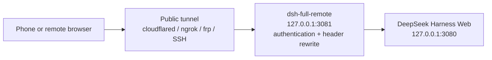

# dsh-full-remote

[](https://github.com/awesome-dsh-plugin/awesome-dsh-plugin)
[](https://www.npmjs.com/package/dsh-full-remote)
[](https://github.com/JUANWANG-BUAA/dsh-full-remote/actions)
[](./LICENSE)
[](https://github.com/JUANWANG-BUAA/dsh-full-remote/stargazers)
[](https://github.com/JUANWANG-BUAA/dsh-full-remote/commits/main)
[](./package.json)
[](https://github.com/deepseek-ai/deepseek-harness)
[](https://github.com/JUANWANG-BUAA/dsh-full-remote/pulls)

**Listed in [awesome-dsh-plugin](https://github.com/awesome-dsh-plugin/awesome-dsh-plugin)** · DeepSeek Harness plugin

**English** | [中文](./README.zh.md)

`dsh-full-remote` is a plugin for
[DeepSeek Harness](https://github.com/deepseek-ai/deepseek-harness). It
places an authenticated reverse proxy in front of the Harness Web server,
so the Web UI can be used through a public tunnel or from a device on the
local network while privileged APIs such as settings, credentials, and
directory browsing remain available.

## 60-second quick start

```sh
dsh plugin --profile web add dsh-full-remote
dsh --profile web
```

In **Settings → Reverse proxy**, press **Start proxy**, then **Start
Cloudflare quick tunnel** and scan the generated QR code. The invite is
one-time and never contains the standing access token. For a controlled
network, point an existing SSH, frp, ngrok, Tailscale, or cloudflared tunnel
at the proxy target shown in the panel instead.

The quick tunnel is optional and temporary, not a managed production
deployment. Read [Security model](#security-model) before exposing a listener
to the Internet. For composition details, see
[Compatibility and composition](./docs/compatibility.md).

| Desktop control panel | Mobile workspace |
|---|---|
|  |  |

| Phone confirmation sheet | Remote desktop confirmation |
|---|---|
|  |  |

## Problem

DeepSeek Harness binds its Web server to a loopback address and only
accepts privileged requests when the `Host` and `Origin` headers refer to
a loopback address. When the UI is reached through a generic tunnel, these
headers carry the public hostname and the trust check fails. The page
loads, but the following methods return 403:

- `settings.*`
- `credentials.*`
- `host.listDirectory`

| Approach | Result |
|---|---|
| Generic tunnel (SSH port forward, Caddy, binding `0.0.0.0`) | Page loads; `settings.*` / `credentials.*` / `host.listDirectory` return 403 |
| LAN-only plugin without authentication | Usable on the local network; not suitable for public exposure |
| Password prompt without header rewriting | Requests are authenticated, but the privileged APIs remain blocked |

## Solution

The plugin inserts a reverse proxy between the tunnel and the Harness Web
server. The proxy:

- rewrites `Host` and `Origin` to `127.0.0.1` before forwarding, so the
  privileged APIs pass Harness's trust check;
- requires an access token or a valid device session before any request is
  forwarded;
- forwards HTTP, SSE, and WebSocket traffic; compressible HTTP responses
  may be gzipped (not SSE or WebSocket);
- provides a settings page (**Settings → Reverse proxy**) for starting and
  stopping the proxy, changing the listen address, rotating the token, and
  managing device sessions.

Because the rewrite disables Harness's original trust check for remote
clients, the plugin provides its own access-control layer in its place.
This layer is described under [Security model](#security-model).

The plugin can optionally start a temporary Cloudflare quick tunnel. Any
managed tunnel (cloudflared, ngrok, frp, SSH, Tailscale) can also point at the
local endpoint it publishes.

## How it works



1. The remote browser connects to the public tunnel, which forwards to the
   plugin's listener (`127.0.0.1:3081` by default).
2. A request is accepted only with an access token, a valid one-time
   invite, or an existing device session. Requests that fail
   authentication do not reach the backend.
3. The proxy rewrites `Host`/`Origin` to loopback, removes untrusted
   headers, and forwards the request to the Harness Web server at
   `127.0.0.1:3080`. Compressible HTTP responses (HTML/JS/CSS/JSON/SVG,
   ≥1 KB) may be gzipped; SSE and WebSocket are not. Hashed `/assets/*`
   files may receive a long-cache header. See
   [HTTP gzip](./docs/http-gzip.md).

## Features

### Privileged APIs

- `settings.describe` / `update` / `replace` / `mutate`
- `credentials.describe` / `set` / `unset`
- `host.listDirectory` / `pickDirectory` / `openPath`
- `agentPreset.*`, `llm.discoverModels`

### Access control

- 192-bit access token, stored in a state file with mode `0600`; reveal and
  rotation are performed from the local panel
- Per-device sessions: each login creates an independent device
  credential, and only a hash is persisted. Devices can be renamed or
  revoked from the panel, which also shows each device's source IP
  (at login and most recently seen).
- Optional first-visit approval: a new device waits on a page until it is
  approved from the local panel
- Phone invite: a QR code or a one-time link (single use, 15-minute
  expiry). Same-IP browser retries within 60 s reuse the original device
  session so a flaky tunnel dropping the redirect cannot deadlock the
  phone into the token form or spawn a duplicate device. The link does
  not contain the standing token.
- Fixed delay and per-IP lockout on failed logins
- Optional CIDR allowlist for remote IPs
- Optional `trustForwardedFor` to use real client IPs from a trusted local
  tunnel in CIDR / rate-limit / audit via its rightmost `X-Forwarded-For`
  value; `CF-Connecting-IP` is a separate Cloudflare-only opt-in, and
  loopback or malformed forwarded values are never trusted

### Operation

- Fence self-check: probes `settings.describe` with the same Host/Origin
  rewrite the proxy uses
- Structured JSONL audit log (login, approval, revocation, token rotation,
  start, stop, WebSocket open/deny/reject) with an in-panel viewer for
  recent events and JSON export; rotates past 8 MB, keeping one previous
  generation
- Runtime listen-address changes with automatic rollback when a bind fails
- Optional local TLS (`tlsCertFile` / `tlsKeyFile`)
- Health endpoint at `/_dsh_reverse_proxy/healthz`
- WebSocket upgrade rate limiting: repeated failed upgrades are locked out
  per remote IP
- Stream-level request body limit; hop-by-hop and spoofable headers are
  stripped; upstream `set-cookie` is removed
- Gzip for compressible HTTP responses (JS/CSS/HTML/JSON/SVG) when the
  client advertises gzip; SSE, WebSocket, fonts, gate pages, and bodies
  under 1 KB are skipped. Measured first-load of the Harness shell:
  **−72.7%** (1.29 MB → 351 KB). `vendor-*.js` −75.7%. Tiny JSON grows,
  so it is not compressed. Issue #11's "95%+" is not a general result.
  Off: `compressResponses: false`. Details: [HTTP gzip](./docs/http-gzip.md)
- Long-cache `Cache-Control` on hashed `/assets/*` (not `index.html` or
  `/api`). Off: `cacheHashedAssets: false`

### One-click public tunnel (Cloudflare quick tunnel)

- Start a cloudflared quick tunnel from the panel (free, no account) and
  get a `https://…trycloudflare.com` address — no public IP or port
  forwarding required
- Binary resolution: `cloudflaredPath` → PATH → a pinned
  (2026.8.2), SHA256-verified download cache; failed checksums are
  discarded
- While the tunnel is up, forwarding-header trust applies dynamically
  (rate limiting / CIDR / audit see real client IPs) and reverts when the
  tunnel stops; the tunnel forwards to the proxy listener, so the token
  gate, approval and audit all keep applying
- Invites automatically use the tunnel URL: start the tunnel, generate
  the QR, scan from the phone (the panel shows it and the Origin can
  still override it)
- Mutually exclusive with local TLS (the Cloudflare edge already
  provides HTTPS); the quick-tunnel address is random per start and is
  meant for temporary sharing / emergencies

### Device home (opt-in)

- A second button on the login form opens `/_dsh_reverse_proxy/home`:
  device facts (label, login IP/time, expiry estimate, security
  posture), self-rename, and self-logout (revokes only this device)
- The default login landing stays `/`; the original flow is unchanged

### Mobile use

- Settings edits persist when the page is opened through a tunnel hostname
- Add workspace uses the in-app directory browser; no native dialog
  appears on the host display
- Tool approvals, `ask_user_question` option lists, and plan reviews
  appear as a confirmation sheet on the remote page: a bottom drawer
  on a phone, a centered card on a wider remote window. You can choose
  and submit there; you do not have to go back to the host. Custom
  answers wrap; `Shift+Enter` inserts a newline. The official composer
  still only sits on the current session
- Image paste/drop for `deepseek-v4-flash-vision-exp` (and other
  image-capable routes) goes through the same authenticated `/api`
  path. The default body cap is 160 MiB, matching Harness. Raster
  image responses are not gzipped
- For a phone-friendly layout (full-width session area, directory drawer,
  adapted dialogs), pair it with a mobile-layout plugin such as
  [dsh-web-mobile](https://github.com/mexiaosqwq/dsh-web-mobile)

## Requirements

- Node.js `^22.19.0 || >=24`
- A DeepSeek Harness **web** profile. The plugin depends on `webServer` and
  Host `connection` services and is not intended for headless profiles.
  Verified against **0.1.2-rc.1** (npm `next` dist-tag), with a compatibility
  path for **0.1.1-rc.1/rc.2**.

## Installation

```sh
dsh plugin --profile web add dsh-full-remote
dsh --profile web
```

1. Open `http://127.0.0.1:3080`.
2. Open **Settings → Reverse proxy** (last entry in the left navigation).
3. Press **Start proxy** and copy the local target.
4. Point the tunnel at the target:

```sh
# Examples only. The plugin does not execute these commands.
cloudflared tunnel --url http://127.0.0.1:3081
ngrok http 3081
```

For devices on the same network, set the listen address to a LAN IP
instead of using a tunnel.

The package was previously published as `dsh-reverse-proxy`; that legacy name
is deprecated. Install `dsh-full-remote` for new deployments.

## Usage

### Starting and stopping

On the settings page, press **Start proxy** to start the listener and
**Stop proxy** to stop it.

### Listen address

| Bind | Purpose |
|---|---|
| `127.0.0.1` (default) | The tunnel runs on the same machine |
| `192.168.x.x` | A device on the same network, without a tunnel |
| `0.0.0.0` / `::` | Bind every interface. This is not an address to open; the panel reports a separate reachable address. |

The listen address can be changed at runtime and persists across restarts.
If a new address fails to bind, the proxy rolls back to the previous
working address.

The copyable **tunnel target** (and any extra reachable URL the panel
lists) is what a remote client should open. Binding `0.0.0.0` only
listens; it is not a URL.

`backendHost` is the address the proxy connects to, not the address it
listens on. Keep it at `127.0.0.1`.

### Phone invite

The QR encodes a one-time login URL. **Public / reachable Origin** is the
host the *scanning device* will request: the tunnel's `https://…`, or the
LAN URL from the panel. Leave it empty only when the tunnel target above
is already that address.

Do not put `127.0.0.1` in Origin. That address is the Harness machine; a
phone would open its own loopback and never reach the proxy.

Then press **Generate invite**. After a scan (or opening the link) the
login page submits once. The invite expires in 15 minutes, works once
(same-IP retries within 60 s reuse the original session), and does not
contain the standing token. Invites can only be generated while the proxy
is running.

### Upgrade

`dsh plugin` forwards to pnpm. If you installed with an exact pin such as
`add dsh-full-remote@0.2.4`, a bare `update dsh-full-remote` reports
Already up to date and stays on the old version. To jump to the latest npm
release:

```sh
dsh plugin --profile web update --latest dsh-full-remote
```

Then restart `dsh web`. `--latest` ignores the current range, installs the
newest version, and rewrites `package.json`. For a specific version use
`dsh plugin --profile web update dsh-full-remote@0.3.7`.

## Screenshots

The gallery is hosted in the repository; the npm package keeps only runtime
files and links back here so installation stays small.

### Desktop

The full settings page: running status and fence self-check, listen
address, recommended setup, tunnel target, one-click quick tunnel,
one-time invite QR, access token, connected devices with source IPs
(inline rename), and the audit viewer.


| One-time phone invite (QR) | Connected devices with inline rename |
|---|---|
|  |  |

### Mobile

| Login page | Control panel | Add workspace |
|---|---|---|
|  |  |  |

### Remote confirmation

When the model asks a question, requests a tool approval, or presents a
plan review, the remote browser shows its own sheet. You do not have to
look at the host display.

| Phone bottom sheet | Remote desktop card |
|---|---|
|  |  |

### Gate pages

The token login (with an opt-in **Device home** button), the device home
itself, and the first-visit approval wait page.

| Device home | Waiting for approval |
|---|---|
|  |  |

## Configuration

Common options:

```yaml
- id: reverse-proxy
  name: dsh-full-remote
  config:
    listenHost: 127.0.0.1
    listenPort: 3081
    approvalMode: false          # true: approve each new device locally
    allowedCidrs: []             # e.g. ["192.168.1.0/24"]; empty: any IP after login
    trustForwardedFor: false     # true: trust rightmost X-Forwarded-For from a trusted local tunnel
    trustCloudflareConnectingIp: false # true only with trustForwardedFor for a local Cloudflare connector
    upgradeMaxAttempts: 10       # failed WebSocket upgrades before lockout
    upgradeLockoutSeconds: 300   # lockout for repeated failed WebSocket upgrades
    headersTimeoutMs: 15000      # timeout for request headers
    requestTimeoutMs: 300000     # timeout for the complete request (headers + body); covers remote vision uploads
    upstreamTimeoutMs: 15000     # TCP connect + first POST byte after the body; not applied to SSE GET
    commandTimeoutMs: 300000     # first POST byte for /api/commands/execute; /compact may run long before responding
    maxRequestBytes: 167772160   # 160 MiB; matches the Harness /api image envelope
    sessionIdleSeconds: 0        # 0: off; otherwise idle timeout in seconds
    auditLog: true
    allowTokenRead: false        # safer default; enable only for local token re-read
    cloudflaredPath: ""          # optional path to cloudflared for the one-click tunnel
    tlsCertFile: ""              # optional local HTTPS
    tlsKeyFile: ""
    compressResponses: true      # gzip JS/CSS/JSON/HTML ≥1KB; skip SSE/WebSocket/fonts/gate pages
    cacheHashedAssets: true      # immutable Cache-Control on hashed /assets/* only
```

The complete option list, with defaults and validation, is defined in the
package `Config` schema (`src/config.ts`) and
`src/config-validation.ts` (source is not included in the published package).

Two points to note:

- Installing the plugin pins the in-app directory picker so that a phone
  can add workspaces. By default the stock adaptive picker is disabled and
  the browse pair is created at runtime unless another plugin already
  inserted it. Set `DSH_FULL_REMOTE_USE_NATIVE_PICKER=1` before boot only
  when you deliberately want the host's native chooser and do not need
  remote directory browsing.
- `backendHost` must remain a loopback address. A wildcard or non-loopback
  value is rejected at load time.

## Security model

The Host/Origin rewrite restores the privileged APIs and, at the same
time, disables Harness's original protection for remote clients. The
access-control layer provided by this plugin consists of:

- a 192-bit access token, stored locally with file mode `0600`;
- an `HttpOnly`, `SameSite=Strict` session cookie per device, carrying a
  per-device secret of which only a hash is stored;
- a fixed delay plus a per-IP `429` lockout on failed logins;
- loopback-only control routes (`/dsh-reverse-proxy/*`), which require a
  control header and are never forwarded through the public proxy;
- removal of spoofable forwarding and hop-by-hop headers, so the proxy's
  own cookie never reaches the backend;
- optional `trustForwardedFor`: when enabled, only a loopback peer's
  rightmost `X-Forwarded-For` value is trusted for CIDR / rate-limit / audit.
  `CF-Connecting-IP` needs the separate, Cloudflare-only
  `trustCloudflareConnectingIp` opt-in; loopback or malformed values are
  never trusted. Keep both disabled for direct LAN access.

The access token must be treated as a secret. Terminate TLS on the public
side of the tunnel. For LAN use without a tunnel, set
`tlsCertFile` / `tlsKeyFile` (for example with
[mkcert](https://github.com/FiloSottile/mkcert)).

**Public exposure checklist.** Whoever holds the token controls the whole
Harness — credentials and settings included — so for anything reachable
from the internet:

- enable `approvalMode: true`, so a new device stays pending until you
  approve it in the local panel (the panel shows a warning whenever the
  quick tunnel is online with approval off);
- consider `allowedCidrs` to pin the entry to known networks;
- keep `auditLog: true` (the default) and rotate the token after invites
  outlive their need.

## Limitations

- Control actions (start, stop, reveal token, change listen address) can
  only be performed from the local Harness window, not from the tunnel
  URL.
- Settings persistence on a remote page relies on a temporary trust pin
  until Harness provides a proper deployment trust field. On Harness
  `0.1.0-rc.8` and later, that pin must survive the official ModuleLoader
  `create()` replacing `load`; otherwise Settings → Models shows
  `settings are unavailable in this browser`. "Open on host" from a phone
  acts on the machine running Harness.
- `allowTokenRead` defaults to `false`. When explicitly enabled, `GET /token`
  is served over loopback HTTP, so any local process that sends the control
  header can read the token; rotation always returns the replacement token.
- By default, a tunnel running on the same machine makes every remote
  client appear as `127.0.0.1` to the proxy. `allowedCidrs` and per-IP
  login lockout therefore apply to the tunnel as a whole unless
  `trustForwardedFor: true` is set behind a trusted local edge.
- The plugin replaces Harness's remote trust check with its own
  access-control layer. A defect in this layer has serious consequences.
  If Harness provides official remote access in the future, the role of
  this plugin should be reassessed.
- The one-click quick tunnel: the URL is random per start (old invites
  and logins stop working), Cloudflare positions quick tunnels as
  temporary/testing with terms limiting heavy non-HTML content, and the
  first use downloads cloudflared on demand (18–52 MB depending on the
  platform; Windows ARM64 has no official build — install it yourself
  and set `cloudflaredPath`). For a stable daily entry, bring your own
  frp / ngrok / named tunnel.
- Gzip at the proxy helps LAN and SSH/frp. A Cloudflare quick tunnel
  already compresses HTML/JS/CSS/JSON at the edge, so that path sees
  little extra saving. Live model output uses WebSocket and is not gzipped.
  Plugin login/wait/home pages are not gzipped (about 1 KB of potential
  saving). Full contract: [HTTP gzip](./docs/http-gzip.md).

## Development

### Build from source

```sh
pnpm pack
dsh plugin --profile web add ./dsh-full-remote-0.3.7.tgz
```

Git installs run the `prepare` build. On pnpm ≥ 10 allow it:

```yaml
allowBuilds:
  dsh-full-remote: true
```

### Checks and CI

```sh
pnpm install
pnpm run check:ci
```

`check:ci` runs lint, typecheck, unit and client tests, and a build. CI
adds a real `dsh plugin add` smoke test against a live Harness
composition. `.github/workflows/canary.yml` runs a weekly smoke test
against the harness default-branch tip.

The loopback control API lives at `/dsh-reverse-proxy/*` and is never
forwarded through the public proxy. The settings page is the intended
interface; the raw routes are rarely needed. For example, recent audit
events can be read with `GET /dsh-reverse-proxy/audit?limit=50&event=login.ok`
from the local control surface.

## Contributing · Security · License

- [CONTRIBUTING.md](./CONTRIBUTING.md)
- [SECURITY.md](./SECURITY.md)
- [MIT](./LICENSE) © 2026 [JUANWANG-BUAA](https://github.com/JUANWANG-BUAA)
