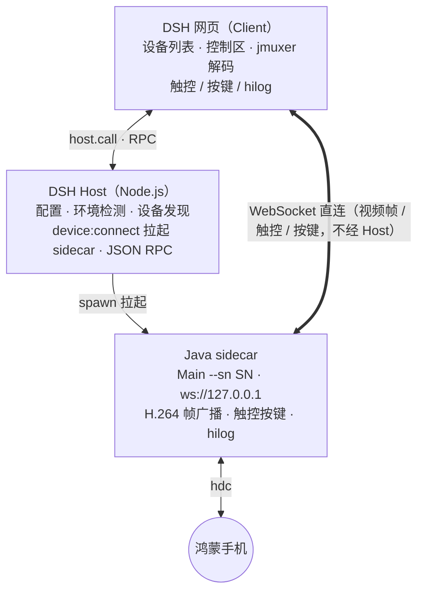

# dsh-hos-scrcpy — DSH 鸿蒙投屏控制插件

[](https://awesome-dsh-plugin.com)

> 开发手机软件时总在手机和电脑之间来回切换，太麻烦了。这个插件让你在 DeepSeek Harness 网页里**直接操作鸿蒙手机**：
> 实时投屏、鼠标触控、系统按键、hilog 日志，**AI 助手还能"看到"并"操作"手机屏幕**——截图识别、读控件清单、点击/长按、按返回/Home、输入文本，开发调试不用再两头跑。

## 它能做什么

- **电脑上操作手机**：网页内实时投屏鸿蒙（HarmonyOS NEXT）手机，鼠标点击/拖动即触摸，返回/主页/音量键一键可按，无需在手机和电脑屏幕之间切换
- **AI 也能识别屏幕**：开启「允许截图」后，AI 可用 `hos_scrcpy_screenshot` 工具截取手机屏幕并识别画面内容（可选"需要确认"或"无需确认"模式），例如"当前页面是什么应用？界面上有哪些按钮？屏幕上显示了什么错误？"
- **AI 也能操作屏幕**：开启「允许控制」后，AI 先用 `hos_scrcpy_locate` 读取当前屏幕的可操作控件清单（type/text/id/key/比例坐标），再用 `hos_scrcpy_tap` 点击、`hos_scrcpy_longpress` 长按，每次执行前二次确认并在投屏画面上闪烁绿点显示落点
- **AI 按键 / 输入**：`hos_scrcpy_key` 按返回/Home 键；`hos_scrcpy_input` 向当前聚焦输入框注入文本（支持中文）；面板也提供手动「输入」按钮
- **截图入聊天框**：一键截取当前屏幕，像粘贴图片一样加进聊天输入框
- **hilog 实时日志**：设备日志滚动查看（限速 60 行/秒，保留最近 500 行），排查问题不用开 DevEco

## 功能特性

| 功能 | 说明 |
|---|---|
| 设备发现 | USB / 局域网无线调试，`hdc` 已连接设备自动列出 |
| 实时投屏 | H.264 视频流，网页播放（jmuxer.js） |
| 触控操作 | 鼠标点击/拖动 = 手机触摸，坐标自动换算设备分辨率 |
| 系统按键 | 返回 / 主页 / 音量+ / 音量- |
| hilog 日志 | 设备实时日志滚动查看 |
| AI 截图识别 | `hos_scrcpy_screenshot` 工具（deepseek-v4-flash-vision-exp），截图前二次确认（或设为"无需确认"） |
| AI 控件清单 | `hos_scrcpy_locate` 工具（hdc uitest 布局树 → 压缩可操作控件清单，含 type/text/fx/fy/w/h） |
| AI 点击/长按 | `hos_scrcpy_tap` / `hos_scrcpy_longpress` 工具（比例坐标，执行前二次确认 + 落点绿点预览） |
| AI 按键/输入 | `hos_scrcpy_key`（返回/Home 键）· `hos_scrcpy_input`（聚焦输入框注入文本） |
| 权限分级 | 四项权限独立三态：允许截图 / 允许控制 / 允许按键 / 允许输入（禁止使用 / 需要确认 / 无需确认），控制/按键/输入依赖允许截图 |
| 截图入聊天框 | 截屏并直接加入聊天输入框 |
| 自适应布局 | 右侧控制区宽度按手机屏幕比例调整，聊天区自动让位 |
| 环境自动检测 | `JAVA_HOME` / `DEVECO_SDK_HOME` 优先，支持手动配置 |

## 环境要求

| 依赖 | 说明 |
|---|---|
| DSH 运行环境 | HarmonyOS NEXT + DeepSeek Harness（插件经包安装、随 web profile 常驻） |
| Java 8+ | sidecar 桥接程序运行环境 |
| hdc | DevEco Studio 自带（`<DevEco>/sdk/default/openharmony/toolchains/hdc.exe`） |
| 鸿蒙手机 | 开启开发者模式 + USB 调试（或 `hdc tconn` 无线连接） |

## 目录结构

```
dsh-hos-scrcpy/
├── README.md
├── LICENSE
├── package.json                # dsh.bundle / dsh.client 声明（npm pack / dsh plugin add 入口）
├── cordis.patch.yml            # bundle patch：向组合树插入插件行
├── lib/
│   └── index.js                # Host 半区（webServer RPC 路由）
├── client/
│   └── client.js               # Client 半区
├── resources/                  # sidecar 运行时资源（全部必需）
│   ├── hosScrcpy-1.0.18-beta.jar
│   ├── out/                    # Main 及内部类（javac 编译产物）
│   └── jmuxer.min.js
└── Dev/                        # sidecar 源码 + 独立测试环境（二次开发从这里开始）
    ├── src/Main.java           # sidecar 主程序源码（唯一手写源码）
    ├── demo/index.html         # 独立测试页（不依赖 DSH）
    ├── demo/jmuxer.min.js      # H.264 网页解码库
    └── doc.md                  # Dev 目录开发文档（协议/编译/排障）
```

## 快速开始

以插件包（tgz）安装，重启 DSH 后插件常驻：

1. 从 Release 下载 `dsh-hos-scrcpy-<版本>.tgz`，或在项目根目录执行 `npm pack` 生成
2. 安装到 web profile：`dsh plugin --profile web add <tgz 路径>`
3. 重启 `dsh web`，右上角出现「设备列表」按钮即成功
4. 设备列表 → 鸿蒙设备 → 点「投屏」→ 等待部署（首次约 10 秒）→ 右侧出现控制区：手机画面 + 按键
5. 点「日志▸」查看 hilog 实时日志
6. 控制区点「设置」→ 打开「允许截图」/「允许控制」「允许按键」「允许输入」即可让 AI 识别并操作屏幕（每项可选"需要确认"或"无需确认"；控制/按键/输入依赖允许截图）

## 架构



## 二次开发

**[开发文档](Dev/doc.md)** —— sidecar 源码解析、WebSocket 协议、编译与同步、独立测试页用法、常见故障排查，二次开发从这里开始。

- 改动约定：sidecar 逻辑改 `Dev/src/Main.java`（编译产物同步到插件目录的 `out/`）；
  协议改动要三处同步（`Main.java` + `Dev/demo/index.html` + 插件 `client.js`）；
  前端 UI 只改插件 `client.js`

## 安全说明

- sidecar 只监听 `127.0.0.1` 回环地址（随机端口），不暴露局域网
- 无任何外部网络请求（审计确认：全部源码与原生库无外联域名）
- 设备端命令仅限白名单（hilog / uinput / uitest / snapshot_display 等）
- 仅支持本机 hdc 已连接设备（USB / 局域网无线调试），不含远程真机模式

## 已知限制

- **文本输入**：`hos_scrcpy_input`（AI）与面板「输入」按钮需先让目标输入框获得焦点（先用 `hos_scrcpy_tap` 点一下输入框），再注入文本；系统输入法未内建，部分 App 对注入文本的输入法兼容性可能影响输入结果
- **控件定位**：`hos_scrcpy_locate` 只对原生 ArkUI/鸿蒙控件有效；H5 / 游戏 / 自绘画面布局树匹配不到时，可先 `hos_scrcpy_screenshot` 看画面，再用 `hos_scrcpy_tap` 以比例坐标点击
- **坐标体系**：所有点击/长按用当前画面的**比例坐标(0..1)**，非设备物理像素；小目标（页签/图标）定位 x 偶有偏差，建议确认落点绿点后再放行
- 仅支持鸿蒙设备；安卓暂不支持
- 会话内 `cordis_define` 加载方式随 DSH 进程重启失效，需重新定义；插件包方式不受此限制
- 画面静止时 SDK 不推帧，前端会提示"请持续滑动手机更新画面"（正常行为，非故障）

## 参考项目

本项目基于 [HOScrcpy](https://gitcode.com/OpenHarmonyToolkitsPlaza/HOScrcpy) 开发。
原项目采用 [MIT 开源协议](https://gitcode.com/OpenHarmonyToolkitsPlaza/HOScrcpy/blob/main/LICENSE)。

视频解码使用 [jmuxer](https://github.com/webstream-labs/jmuxer)。
采用 [MIT 开源协议](https://github.com/webstream-labs/jmuxer/blob/master/LICENSE)。
