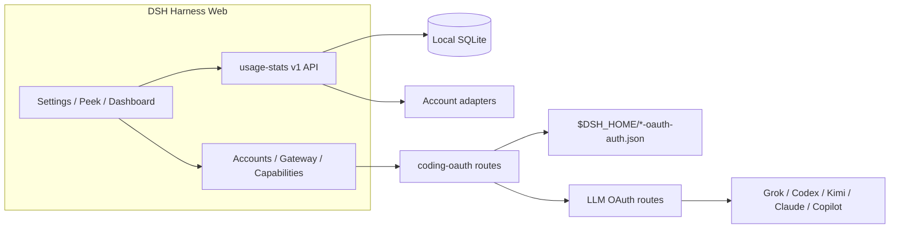

<!-- banner -->
<div align="center">

# dsh-hub-oauth-gateway

**v1.11.1** · formerly `dsh-usage-stats`

**Local-first usage center for [DeepSeek Harness](https://github.com/deepseek-ai/dsh) Web.** Tokens, estimated cost, account balances, subscription quotas, trends, forecasts, alerts, and exports — plus coding-subscription OAuth (Grok Build, Codex, Kimi Code, Claude Code), an optional loopback API gateway, and opt-in local auth/usage monitoring. **No tokens in chat.**

[](https://github.com/lninghaha/dsh-hub-oauth-gateway/actions/workflows/ci.yml)
[](LICENSE)
[](.github/CONTRIBUTING.md)

*[English](README.md) · [中文版](README.zh-CN.md) · [日本語](README.ja.md) · [한국어](README.ko.md) · [Português (BR)](README.pt-BR.md) · [Español](README.es.md) · [Français](README.fr.md) · [Deutsch](README.de.md) · [Русский](README.ru.md)*

</div>

---

> **Upgrade / 升级：** Follow the versioned steps in [`docs/01-install.md`](docs/01-install.md). Hub `1.11.1` and Subscription `0.6.4` share the verified DSH `0.1.1-rc.2` contract and pin `dsh-coding-oauth-core@0.1.1` with `undici@7.29.0`. Keep profile, configuration, and credential files, update both plugins in the same Web profile, then restart the existing DSH Web process once. Core remains a shared npm dependency, not a separate DSH plugin.

---

## Name change

First published as **`dsh-usage-stats`**. The package and repository are now **`dsh-hub-oauth-gateway`** (effective with **1.1.0**). Remove any old entry before reinstalling. Local data files and the internal Cordis plugin id stay the same, so historical usage is preserved.

| | Use this | Still works / unchanged |
|---|---|---|
| npm (recommended) | `dsh plugin --profile web add dsh-hub-oauth-gateway` | Old npm name is no longer updated |
| GitHub / development | [`dsh-hub-oauth-gateway`](https://github.com/lninghaha/dsh-hub-oauth-gateway) | — |
| Cordis plugin id | `usage-stats` | unchanged |
| SQLite database | `${DSH_HOME}/storages/usage-stats-v1.sqlite` | unchanged |
| CLI | `dsh-coding-oauth` | `dsh-grok-build` (alias) |

Release history lives in [`CHANGELOG.md`](CHANGELOG.md).

## Features

- **Quick Peek + Full Dashboard** — floating HUD (or sidebar button); tabbed overview / trends / accounts / details / local; today / 7d / 30d / month; compare prior period; manual refresh.
- **Tabbed Settings** — Display / Accounts / Gateway / Capabilities / Providers / Fees under Settings → Usage Center.
- **Presets and modules** — Minimal, Quota, Cost, Analyst; custom module order; density, motion, provider aliases and colors.
- **Activity heatmap** — 370-day calendar + streak in the configured timezone.
- **Local history** — projects DSH usage into SQLite by `(session, turn, step)`; later samples replace, never double-count.
- **Cost estimates** — user-owned per-million prices with coverage ratio; missing prices are never treated as free.
- **Subscription fee ledger** — local subscription/top-up costs; payback multiples when currencies match.
- **Trends and forecasts** — hour/day/week/month buckets; bounded linear extrapolation as a distinct series.
- **Account and quota adapters** — balances, windows, reset times, stale/last-success, soft alerts (no hard blocks, no outbound notify).
- **CSV / JSON export** — filtered, daily, or bundle layouts; optional session redaction; spreadsheet-injection defense.
- **Coding-subscription OAuth** — Grok Build, Codex, Kimi Code, Claude Code via device code / browser / PKCE paste; optional GitHub Copilot LLM route when `oauthDevice.copilotClientId` is set; multi-account store (max 8) with optional `codingOAuth.pool` (`off` | `priority` | `quota_aware`); Claude Code import via **Import Claude Code** (macOS Keychain `Claude Code-credentials` or file fallback; preview → commit; overwrite still needs confirm); models appear as `(OAuth)`; one-way CLI credential Pull.
- **Optional loopback API gateway** — default-off OpenAI/Anthropic-compatible server for your own tools.
- **Optional capabilities** — Codex search / images / usage / Fast and Grok Imagine default off; apply live.
- **Opt-in local monitor** — read-only CLI auth snapshots and cross-tool token scans (never conversation content).
- **Bilingual UI** — Chinese and English through DSH locale services.

Product research: [`docs/research/usage-analytics-landscape.md`](docs/research/usage-analytics-landscape.md). Architecture: [`docs/02-architecture.md`](docs/02-architecture.md).

## Screenshots

Captured against DeepSeek Harness Web with this plugin installed (empty local history is normal for a fresh profile).

<p align="center">
  
  <br />
  <em>Floating HUD — today’s metric plus multi-account quota chips</em>
</p>

<p align="center">
  
  <br />
  <em>Quick Peek — compact 2×2 KPIs with a one-click jump to the full dashboard</em>
</p>

<p align="center">
  
  <br />
  <em>Full dashboard — ranges, tabs, refresh, and CSV / JSON export</em>
</p>

<p align="center">
  
  <br />
  <em>Settings → Usage Center — Display / Accounts / Gateway / Capabilities / Providers / Fees</em>
</p>

## Problems this plugin solves

| You searched / saw | What was actually broken | What this plugin does |
|---|---|---|
| Usage / cost / quota scattered across CLIs and providers | No single local history or coverage-aware cost view | SQLite projection + price rules + account adapters in one Usage Center |
| SuperGrok / ChatGPT Plus / Kimi Code / Claude Pro in DSH without another API bill | Built-in routes are often pay-as-you-go API keys | Local OAuth routes coexist with existing API-key providers |
| `本轮运行失败` **API key is invalid** / `AUTH` mid-turn | GUI maps every `AUTH` to that banner; OAuth access tokens expire | Proactive refresh and AUTH-aware retry on coding OAuth routes |
| Want OpenAI/Anthropic-compatible tools against subscription sessions | No safe local bridge | Opt-in loopback gateway (not a public relay) |
| Token Monitor-style CLI status without pasting secrets | Manual file digging or chat paste | Opt-in localMonitor / localUsage on hardened allowlisted paths |

## Quick start

```bash
# 1. install the current npm release into the web profile
dsh plugin --profile web add dsh-hub-oauth-gateway

# 2. restart the resident DSH Web process (operator chooses when)
# `dsh web` is the official CLI alias for the web profile, not a service-unit name.
# Restart the existing process with the process manager actually configured on this machine.
```

Then open **Settings → Usage Center**. For Accounts / Gateway / Capabilities, sign in or enable switches as needed. Full install options (npx installer, GitHub tarball, proxy) are in [`docs/01-install.md`](docs/01-install.md).

## Table of contents

- [Name change](#name-change)
- [Features](#features)
- [Screenshots](#screenshots)
- [Problems this plugin solves](#problems-this-plugin-solves)
- [Quick start](#quick-start)
- [Requirements](#requirements)
- [Install](#install)
- [Usage](#usage)
- [Settings](#settings)
- [Coding OAuth](#coding-oauth)
- [Local API gateway](#local-api-gateway)
- [Optional capabilities](#optional-capabilities)
- [Runtime configuration](#runtime-configuration)
- [Credentials](#credentials)
- [Data and migration](#data-and-migration)
- [Privacy and security](#privacy-and-security)
- [Architecture](#architecture)
- [Documentation](#documentation)
- [Contributing](#contributing)
- [License](#license)

## Requirements

- DeepSeek Harness Web, verified against `@deepseek-ai/dsh 0.1.1-rc.2`
- Node.js `^22.19.0 || >=24.0.0`
- Loopback DSH Web backend; a controlled local HTTPS reverse proxy to an authenticated private network is OK. Do not expose the plugin API alone or publish unauthenticated to the public internet.

## Install

```bash
dsh plugin --profile web add dsh-hub-oauth-gateway
dsh plugin --profile web update dsh-hub-oauth-gateway
dsh plugin --profile web remove dsh-hub-oauth-gateway
```

Compatible installer when the plugin manager is missing: `npx --yes dsh-hub-oauth-gateway-install`. GitHub `/path/to/*.tgz` and development path installs are documented in [`docs/01-install.md`](docs/01-install.md). After install, restart the existing DSH Web process through the process manager configured on your machine, then refresh `http://127.0.0.1:3080`; DSH does not publish a universal service-unit name.

## Usage

1. Open Quick Peek from the floating HUD (or sidebar button under **Settings → Display → entry mode**). Settings also links Peek / Full Dashboard.
2. In Full Dashboard, switch overview / trends / accounts / details / local; pick range, metric, and provider/model dimensions.
3. Use the refresh button for immediate projection and account refresh. Ordinary GET reads local snapshots only.
4. Configure Display / Accounts / Gateway / Capabilities / Providers / Fees under **Settings → Usage Center**.
5. Costs are always estimates — watch the coverage percentage; unpriced tokens are not free.

CLI: `dsh-coding-oauth login [--pkce] | import | status | logout` (`dsh-grok-build` is an alias).

## Settings

**Settings → Usage Center** uses six top tabs: **Display**, **Accounts**, **Gateway**, **Capabilities**, **Providers**, and **Fees**. Signed-in provider cards collapse until expanded. Each Providers card maintains its own auth inline — save/clear API keys, Copilot device auth, per-provider refresh — and OAuth cards link straight to Accounts sign-in / pull.

## Coding OAuth

On the **Accounts** tab, sign in to Grok Build, Codex, Kimi Code, or Claude Code (device code preferred on remote/headless hosts; browser/PKCE can paste a code or full redirect URL). Authenticated models appear in the selector with `(OAuth)`.

Each provider file can hold multiple AuthDocument v2 accounts (max 8). Use Accounts controls to add accounts, set the default, or remove one. Signed-in cards can show Usage Center cached quota bars (GET-only; hidden when no snapshot exists).

**Import Claude Code** runs preview → commit (`accountMode: add` when possible). On macOS it prefers Keychain `Claude Code-credentials`; elsewhere it uses the allowlisted file path. Overwrite still requires an explicit confirm.

Optional sticky routing: set `codingOAuth.pool.mode` to `priority` or `quota_aware` when two or more accounts exist for a provider. Default is `off`. Details: [`docs/03-configuration.md`](docs/03-configuration.md).

GitHub Copilot as an LLM route (`github-copilot-oauth`) stays fail-closed until you set `oauthDevice.copilotClientId`.

Allowlisted official CLI OAuth files are discovered read-only. Sync is an explicit one-way **Pull** (discover → preview → confirm), never auto-import and never writes official CLI files.

## Local API gateway

Default **off**. When enabled, an isolated `node:http` listener (not the DSH web port) serves `GET /healthz`, `GET /v1/models`, `POST /v1/chat/completions`, `POST /v1/responses`, and `POST /v1/messages` on loopback, reusing signed-in OAuth sessions. Bind stays YAML-only; non-loopback bind requires a Bearer key. This is not a remote relay. Details: [`docs/01-install.md`](docs/01-install.md).

## Optional capabilities

Seven switches default **off** and apply **live**: `codexSearch`, `codexImages`, `codexImageEdits`, `codexUsage`, `codexFast`, `grokImagineImage`, `grokImagineVideo`. Codex Fast / private endpoints and Grok Imagine stay fail-closed until enabled. With `codexFast` on, the session picker uses the existing `codex-oauth-fast` route (Standard/Fast hint in Capabilities). That route appears only after a live catalog lists a `priority`-eligible model. It is not a second Fast stack. See [`docs/01-install.md`](docs/01-install.md) and [`docs/03-configuration.md`](docs/03-configuration.md).

## Runtime configuration

Merge `config` under the existing Cordis entry — do not add a second entry:

```yaml
# ~/.dsh/profiles/web/cordis.patch.yml
- insert:
    - id: usage-stats
      name: dsh-hub-oauth-gateway
      config:
        refresh:
          usageSeconds: 30
          accountMinutes: 5
          accountConcurrency: 3
          timeoutMs: 15000
        retention:
          usageDays: 730
          accountSnapshotDays: 180
          preserveDeletedSessions: true
        pricing:
          baseCurrency: USD
        accounts:
          monitors: {}
        oauthDevice:
          copilotClientId: YOUR_PUBLIC_OAUTH_CLIENT_ID
        codingOAuth:
          enabled: true
          pool:
            mode: off
            # switchMargin: 2
        localMonitor:
          enabled: false
        localUsage:
          enabled: false
          intervalMinutes: 30
```

Full field reference, monitors, proxy, and pricing import: [`docs/03-configuration.md`](docs/03-configuration.md) and [`docs/01-install.md`](docs/01-install.md). Legacy root `config.monitors` maps to `config.accounts.monitors` (do not set both).

## Credentials

- Stored through the DSH credential seam; the browser only receives `configured` / `source` / `writable` metadata — never values.
- Local CLI import (Claude, Codex, Gemini, Grok, Amp) never logs absolute paths.
- Copilot device flow keeps the device code server-side; the browser holds only a random flow ID. Configure your own public OAuth client ID before enabling.
- Coding OAuth files: `$DSH_HOME/.grok-build-auth.json`, `.codex-oauth-auth.json`, `.kimi-code-oauth-auth.json`, `.claude-code-oauth-auth.json`, and `.github-copilot-oauth-auth.json` when Copilot is configured (`0600`, atomic write). **No HTTP status, log, or UI may return a token.**

## Data and migration

```text
${DSH_HOME:-~/.dsh}/storages/usage-stats-v1.sqlite
```

Directory `0700`, main file `0600`, WAL. Default retention: 730 days usage facts, 180 days account snapshots. First-start migration and rollback notes: [`docs/04-migration-v1.md`](docs/04-migration-v1.md).

## Privacy and security

- Loopback peer + loopback Host by default. A trusted HTTPS reverse proxy must satisfy the full owner policy: trusted peer, exact HTTPS Origin and matching public Host, owner proof, same-origin Fetch Metadata, and CSRF for mutations; forwarded headers alone do not grant access, and incomplete policy fails closed.
- Ordinary GET is local-only; credential-bearing refresh is explicit POST or scheduled.
- Monitors: HTTPS by default, no URL-embedded credentials, manual redirects, size limits, DNS pinning before connect.
- SQLite excludes credentials, prompts, responses, cwd, and raw provider payloads.
- Analytics and estimates are not invoices. Query only accounts and endpoints you own or are authorized to use.

Threat model and reporting: [`.github/SECURITY.md`](.github/SECURITY.md).

## Architecture



Details: [`docs/02-architecture.md`](docs/02-architecture.md) · [中文](docs/02-architecture.zh-CN.md). OAuth attribution: [`docs/oauth-provenance.md`](docs/oauth-provenance.md).

## Documentation

| Doc | Purpose |
|---|---|
| [`docs/01-install.md`](docs/01-install.md) | Installation, proxy, gateway, capabilities, troubleshooting |
| [`CHANGELOG.md`](CHANGELOG.md) | Release history |
| [`docs/00-project-rules.md`](docs/00-project-rules.md) | Publication layers, versioning, release loop |
| [`docs/02-architecture.md`](docs/02-architecture.md) | Internal architecture · [中文](docs/02-architecture.zh-CN.md) |
| [`docs/03-configuration.md`](docs/03-configuration.md) | Runtime configuration reference |
| [`docs/04-migration-v1.md`](docs/04-migration-v1.md) | 1.0 data migration |
| [`catalog/`](https://github.com/lninghaha/dsh-hub-oauth-gateway/tree/main/catalog) | Desktop Market Path A catalog source (`catalog-source.json`, `v1/plugins.json`); not shipped in the npm package `files` whitelist |
| [`.github/CONTRIBUTING.md`](.github/CONTRIBUTING.md) | Contribution guide |
| [`.github/SECURITY.md`](.github/SECURITY.md) | Security policy |

## Contributing

Verify in Cursor Cloud / this repo’s cloud workspace with the declared Node.js and pnpm (Docker sandbox is optional, not required). Use an isolated `DSH_HOME` for DSH smoke tests. See [`.github/CONTRIBUTING.md`](.github/CONTRIBUTING.md). Keep secrets, prompts, and personal paths out of issues, PRs, screenshots, and logs.

If your language is missing from the switcher, open a PR with a README translation and we will add it.

## License

[MIT](LICENSE) · see [NOTICE](NOTICE). Independent community project; no vendor endorsement is implied. Coding-OAuth portions retain Apache-2.0 attribution where required (`LICENSES/Apache-2.0.txt`).
