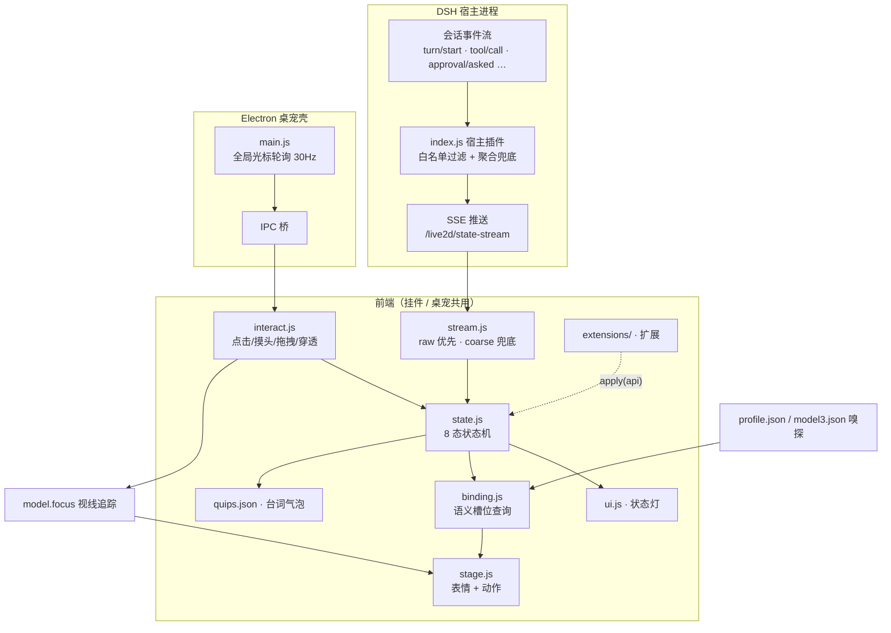

# Live2D 监控面板・看板娘桌宠（dsh-live2d-companion）

[DeepSeek Harness](https://github.com/deepseek-ai/dsh)（下称 DSH）的 Live2D 状态监控面板：把你喜欢的 Live2D 角色接进 DSH Web GUI，实时反映 AI 的工作状态——思考时歪头、工作时兴奋、等你确认时招手、闲着没事会打瞌睡，还能陪你下五子棋和国际象棋。**不绑定任何特定角色**：任何 Cubism 4/5 模型丢进 `model/` 目录即可上岗（详见[模型接入与绑定层](#模型接入与绑定层)）。

**双形态**：网页右下角挂件 / Windows 桌面桌宠（Electron 透明置顶窗口），同一份前端内核驱动。

另提供 [`standalone/`](standalone/) 独立运行入口：不启动 DSH 也能使用同一套桌宠渲染、模型面板、游戏中心和 Codex/OpenCode 状态联动（含 OpenCode 对局解说）。独立版仍不包含模型、Cubism Core、Electron 二进制或第三方角色 Prompt，详细许可边界与安装步骤见 [`standalone/README.md`](standalone/README.md)。

## 特性

- 🎭 **AI 状态同步**：订阅 DSH 会话事件流，8 态状态机（空闲/思考/工作/等待确认/报错/完成/睡眠/离线）+ 左上角**状态灯**（小灯+文字常显）；**多任务并行时每会话一枚独立任务灯**（任务1·工作 / 任务2·待确认…），聚合主灯 + 分工小灯一目了然；任务完成后 6 秒转闲置、闲置 5 分钟自动收灯回收编号，会话复活自动重新上牌
- 🖱️ **丰富交互**：点击反应、双击卖萌、点击摸头害羞（划过不误触）、拖拽搬家、睡着点一下叫醒、缩放（挂件滚轮 / 桌宠 Ctrl+滚轮，拖拽期间自动锁定）、**全局视线跟随**（OS 层轮询光标，整屏追踪不限窗口）
- 💬 **气泡台词**：15 个台词池 70+ 条，状态轮播、时段问候、加班焦虑、深夜关怀
- ⚙️ **全配置化**：台词/节奏/行为阈值都在 `quips.json`（官方默认）；台词支持**多预设可视化编辑**（「词」按钮：另存为多份人设台词集、一键切换、池级恢复默认，保存即生效）
- 🐾 **桌面桌宠**：透明无边框置顶、鼠标穿透（不挡操作）、位置记忆、随 DSH 启停（心跳看门狗）、面板内一键重启 / 双击确认退出
- 🧩 **多模型**：任何 Cubism 4/5 模型丢进 `model/` 目录即可接入；语义槽位 + 自动嗅探 + profile.json 绑定层，情绪表现零配置自适应
- 🖼️ **模型面板**：挂件旁静置自动隐藏的齿轮入口，扫描/切换/导入/预览模型，选择持久化，恢复默认无需改配置
- 🔌 **零侵入**：对 DSH 本体零修改，纯用户级 cordis patch 层挂载，DSH 升级免疫
- ♟️ **游戏中心**：五子棋 / 国际象棋开箱即玩，本地引擎裁决 + 本地 AI 执子 + LLM 人格化解说，还有让模型亲自执子的「阿尔法狗」难度——详见[游戏中心](#游戏中心)一节
- 🫧 **气泡优先级仲裁**：0=状态轮播 1=对局解说/思考 2=物理互动/任务完成/报错——低级不抢高级，完成事件必达，对局闲聊压不住正事

## 架构

```
dsh 宿主进程
 └─ cordis patch 层（cordis.patch.yml insert 行）
     └─ index.js（宿主插件）
         ├─ prefix 路由 /live2d/*        → 静态资源（前端/模型/vendor）
         ├─ SSE  /live2d/state-stream    → session/event 白名单转发 + 聚合状态兜底
         ├─ exact /live2d/state|config   → 状态快照 / 模型配置
         ├─ exact /live2d/models         → 扫描 model/ 下全部模型（GET）
         ├─ exact /live2d/model          → 切换/恢复/删除模型并持久化（POST）
         ├─ exact /live2d/mode           → 显示模式切换：改写 cordis.patch.yml 本插件 config，热重载生效（POST）
         ├─ exact /live2d/import         → 上传模型文件（POST）
         ├─ exact /live2d/profile        → 绑定档案写/删（POST，白名单清洗）
         ├─ exact /live2d/quips          → 台词预设存/切/删（POST，写 quips-presets/）
         ├─ exact /live2d/quips-config   → 预设清单与生效指针（GET）
         ├─ exact /live2d/game/list      → 游戏目录（GET，游戏中心 chips 数据源）
         ├─ exact /live2d/game/models    → 模型目录（GET，llm.listModels 网关发现 + settings 兜底）
         ├─ exact /live2d/game/presets   → agent 预设清单（GET，喂对局面板下拉）
         ├─ exact /live2d/game/state     → 对局快照：注册表描述符 snapshot + busy/模式/难度/解说（GET）
         ├─ exact /live2d/game/new       → 开新局：本地引擎+本地 AI 执子；在线加建人格化解说 agent（零工具）（POST）
         ├─ exact /live2d/game/move      → 玩家走子→本地 AI 应手（阿尔法狗档=LLM 标签协议执子，非法重试/超时兜底本地 hard）→在线 LLM 解说（25s 超时 cancel+本地台词兜底）→响应同帧带 aiMove+解说（POST）
         ├─ tapIndex 注入 <script>       → 网页挂件（widget: false 可关）
         └─ spawn Electron 桌宠          → 随宿主启停（pet: false 可关）；重挂载收养旧进程不闪断，退出延迟处死+宿主 exit 兜底防孤儿

浏览器挂件 / Electron 桌宠
 └─ boot.js（ES Module 入口装配）+ src/ 职能模块：
     ├─ config.js    → 环境常量 / localStorage / 台词库加载
     ├─ binding.js   → 语义槽位绑定（profile 覆盖 + model3.json 嗅探）
     ├─ ui.js        → 容器 / 气泡 / 状态灯
     ├─ stage.js     → PIXI 渲染 / 模型加载 / 布局收身 / 缩放 / Idle 池守卫
     ├─ state.js     → 8 态状态机（灯 + 表情 + 动作 + 台词轮播）
     ├─ interact.js  → 点击/摸头/拖拽/缩放/穿透/全局视线
     ├─ stream.js    → SSE 客户端（raw 优先 / coarse 兜底 / 离线检测）
     ├─ panel.js     → 模型面板（入口/列表/切换/查看/导入/绑定编辑器）+ 竖列按钮簇（🔒❓⚙️🎮💬）
     ├─ game.js      → 游戏中心壳（卡片/游戏 chips/通用设置条/轮询/动画驱动/解说声道，全游戏无关）
     ├─ games/<id>.js → 前端渲染器（棋盘绘制/点击映射/走子动画；gomoku.js、chess.js）
         └─ pixi.js + pixi-live2d-display + Live2D Cubism Core
```

`games/`（根目录）：游戏注册表与描述符——每游戏一个目录（`engine.mjs` 纯逻辑引擎 + `ai.mjs` 本地 AI + `index.mjs` 描述符：裁判/快照/解说提示词/台词池/可选 `llmMoveSpec` 阿尔法狗协议），`registry.mjs` 登记后宿主与 standalone 路由自动接入。新游戏 = 一个目录 + 一次 `registerGame` + 一个前端渲染器。测试随源码不入包：五子棋引擎+AI（`games/gomoku/engine.test.mjs`）、国象引擎 perft 黄金值与 AI（`games/chess/*.test.mjs`）、阿尔法狗协议（`games/llm-duel.test.mjs`）、独立版全链路冒烟（`standalone/test.cjs`）。

宿主只转发白名单原始事件（`turn/start`、`tool/call`、`approval/asked`…），状态判定全在前端——调行为不需要重启宿主。前端模块间不互相 import，经共享上下文 `ctx` 在运行期取用彼此能力，依赖方向即 `boot.js` 的初始化顺序。

### 工作流程



## 游戏中心

🎮 独立功能钮直达对局：挂件模式为非模态浮卡；桌宠模式弹**独立卫星小窗**（`game-card.html`，不抢前台焦点、下棋时输入不串扰，与透明 overlay 物理隔离）；独立版同样走卫星窗，网页环境保留页内浮卡回退。

**执子与解说的分工**：

- **本地引擎裁决 + 本地 AI 执子**：难度分档（简单/普通/困难）在本地 AI 真实生效；LLM 听不懂难度指令、逐手工具调用延迟不可接受，所以棋力永远不外包
- **LLM 只做「对局者本人」的碎语**（在线模式）：零工具单轮问答，按你设置的称呼叫人；AI 落子在引擎内即时完成，但**响应扣到解说就位才返回——走子动画与解说语句同帧出现**（你自己的走子点下即滑，不等 LLM）；解说 25s 超时/离线模式自动落回本地台词池，**对局永不卡死**；玩家制胜终局有服输收场白（离线用 lose 台词池）
- **阿尔法狗（难度第四档，仅在线）**：你的模型亲自执子对抗——闭合标签协议 `<move>…</move>` 提取走法、标签外全是狠话，一次调用走子+台词同产；非法/裸写带诊断重试一次，再失败/超时由本地 hard AI 静默接管，棋局照样走完

**内置游戏**：

| 游戏 | 引擎 | AI |
|---|---|---|
| 五子棋 | 15 路纯逻辑裁判（四方向胜负/长连/满盘平局） | 攻守双线评分，难度=防守权重+噪音+防水概率 |
| 国际象棋 | 完整规则（易位/过路兵/升变/逼和/五十回合/三次重复/子力不足），perft 黄金值校验 | alpha-beta 剪枝，按难度调搜索深度，超时哨兵+try/finally 护盘 |

**通用设置条**（称呼/模式/难度/解说人格/解说模型）全游戏复用，**悬停即出人话注释**——每个选项是干什么的、有什么副作用，鼠标放上去就看懂。

**独立版（standalone）**：同一套游戏离线可玩；选「OpenCode 解说」模式后由 OpenCode 侧的对话 agent 用独立「游戏解说」会话逐手点评（与普通聊天会话隔离），未连接/超时/乱答自动回退本地台词，内部代理提示（步骤上限、任务总结等）程序级过滤，台词强制一句 40 字内。

**加新游戏**：`games/<id>/` 一个目录（引擎+AI+描述符）+ 一次 `registerGame` + `public/src/games/<id>.js` 一个前端渲染器，hub chips、路由、快照、解说管道自动接入。

## 安装

> 需要：已安装 DSH（`dsh web` 可用）、Node.js ≥ 18。

**1. 一键安装（官方插件通道）**

```powershell
dsh plugin --profile web add github:Tisitan/dsh-live2d-companion
```

本插件声明了 `dsh.bundle` 清单，`dsh plugin add` 会自动登记为 profile 组合层，无需手动接线。

**2.（可选）调整开关**

默认网页挂件开、桌宠关。要改就在 `$env:USERPROFILE\.dsh\profiles\web\cordis.patch.yml` 追加同 id 覆盖行：

```yaml
- insert:
    - id: live2d-companion
      name: 'dsh-live2d-companion'
      config:
        widget: false  # 关闭网页挂件
        pet: true      # 桌面桌宠随 DSH 自启
```

patch 文件热重载，保存即生效。

**开发者路径**：`git clone` 后 junction 到 `<DSH_HOME>\profiles\web\node_modules\dsh-live2d-companion`，再按上方注册 patch 行。

**3. 放入模型**

```
public/model/<模型名>/xxx.model3.json   ← 连同贴图、 motions、expressions 整目录放入
```

然后在 patch config 里指认：`model: '<模型名>/xxx.model3.json'`（不指认时按内置默认路径加载，见 `index.js` 的 `DEFAULT_MODEL`）。

> 📦 **模型获取**：本仓库不分发任何模型文件——请自备任何 Cubism 4/5 模型，并遵守其原始许可。

**4. 下载 Cubism Core（许可要求，仓库不含）**

从 Live2D 官方下载并放入：

```
public/vendor/live2dcubismcore.min.js
# 官方地址：https://cubism.live2d.com/sdk-web/cubismcore/live2dcubismcore.min.js
```

**5.（桌宠）安装 Electron**

```powershell
cd pet
npm.cmd install
```

重启 DSH Web（或下次启动时），桌宠自动出现。

## 配置

### patch config（`cordis.patch.yml`）

| 键 | 默认 | 说明 |
|---|---|---|
| `model` | 见 `index.js` 的 `DEFAULT_MODEL` | 模型路径（相对 `public/model/`） |
| `widget` | `true` | 是否向 DSH 页面注入网页挂件 |
| `pet` | `false` | 是否随 DSH 自动拉起桌面桌宠 |
| `petDir` | `./pet` | Electron 壳目录 |

### quips.json（官方默认）+ 台词预设（用户自定义）

台词分两层，**官方默认永远只读**，用户自定义永不与上游更新冲突：

| 文件 | git | 说明 |
|---|---|---|
| `public/quips.json` | ✅ 跟踪 | 官方默认台词库（`pools` + `rotation` + `behavior`） |
| `public/quips.local.json` | ❌ 忽略 | 活跃指针 `{ "active": "预设名" }`，决定哪份预设生效 |
| `public/quips-presets/<名>.json` | ❌ 忽略 | 用户台词集，可「另存为」任意多份（如不同模型各一份人设） |

运行时合并：官方默认 ← 生效预设**逐池胜出**；预设未覆盖的池继续跟随上游默认（上游润色台词你照收）。

「词」按钮（齿轮与「?」之间）打开台词池编辑器：预设下拉切换生效集、逐池编辑（每行一句）、`·自定义` 标记与官方不同的池、「恢复默认」让单池回落官方、「另存为」冻结当前内容为新预设。保存写入预设文件并**立即生效**（不等 30 秒轮询）。

| 区 | 说明 |
|---|---|
| `rotation` | 台词节奏：`holdMs`（单句停留）/ `intervalMs`（轮换间隔）/ `doneHoldMs` |
| `behavior` | 行为阈值：`sleepAfterMs`（闲置入睡）/ `seriousAfterMs`（加班严肃脸）/ `overtimeAfterMs`（加班焦虑） |
| `pools` | 15 个台词池：`thinking`/`working`/`done`/`waiting`/`error`/`overtime`/`sleeping`/`click`/`pat`/`drag`/`greet`/`greet_morning`/`greet_night`/`idle`/`busy` |

模型切换也可以不改配置：URL 加 `?model=<模型名>/xxx.model3.json` 临时指定。

## 模型接入与绑定层

本插件**不自带任何模型、也不绑定任何特定角色**——状态机驱动的是「语义槽位」，你自备的模型素材通过两级机制绑定到槽位上：

### 第一级：自动嗅探（零配置）

启动时前端会拉取模型的 `.model3.json`，解析 `FileReferences` 里的表情/动作清单，按关键词模糊匹配槽位（如文件名含 `shy`/`害羞` → 害羞位，含 `nod` → 点头位）。任何命名规范的 Cubism 模型丢进来即可获得完整情绪表现；匹配不到的槽位**静默跳过**，不会报错。

> 🌐 **生态惯例兼容**：自动呼吸依赖官方示例框架的 `Idle` 组惯例（绝大多数模型遵守）；点击反应池优先取官方示例惯例的 `Tap*` / `Reaction` / `Touch` 组并自动剔除生气动作。Live2D 官方并不规定动作组/表情的语义命名，故无标配模型一律可用下方编辑器手动绑定。
>
> 💤 **Idle 池守卫**：运行时会在无动作时从 `Idle` 组随机自动回放——若睡眠动作也在该组，睡眠态会被随机抽中的站立动作顶开（睁眼诈尸），清醒时也可能随机打瞌睡。本插件包住了随机选择器：睡眠态只回放睡眠动作，其余状态把睡眠剔出随机池。显式按序号播放不受影响。

### 第二级：profile.json 精确覆盖（可选）

在模型目录放 `profile.json`（`model/<模型名>/profile.json`，随模型一起走），逐槽位钉死映射；写了的槽位覆盖嗅探结果，没写的继续走嗅探。

**表情槽位**（值为模型里的表情名）：

| 槽位 | 用途 |
|---|---|
| `default` / `happy` / `excited` | 常态 / 完成 / 工作兴奋 |
| `shy` | 摸头、被拖动 |
| `doubt` | 思考、待确认 |
| `troubled` / `serious` | 报错、加班焦虑 / 加班严肃 |
| `surprised` | 睡醒惊醒 |
| `dark` / `sleep` | 离线 / 打瞌睡 |

**动作槽位**（值为 `[动作组名, 组内序号]`）：

| 槽位 | 用途 |
|---|---|
| `think` / `excited` / `shake` | 思考姿势 / 工作动作 / 摇头求确认 |
| `dizzy` / `nod` | 报错转圈 / 完成点头 |
| `sleep` / `glitch` | 打瞌睡循环 / 报错特效 |
| `clickPool` | 点击反应随机池，二维数组 |

示例（示意值，请按你的模型实际素材名填写）：

```json
{
  "expressions": {
    "default": "Default", "happy": "Smile", "excited": "Sparkle",
    "shy": "Shy", "doubt": "Doubt", "troubled": "Troubled",
    "serious": "Serious", "surprised": "Surprised",
    "dark": "Dark", "sleep": "Sleep"
  },
  "motions": {
    "think": ["Poses", 1], "excited": ["Reactions", 2], "shake": ["Reactions", 1],
    "dizzy": ["Reactions", 5], "nod": ["Reactions", 0],
    "sleep": ["Idle", 1], "glitch": ["Effects", 0],
    "clickPool": [["Reactions", 0], ["Reactions", 1], ["Reactions", 2]]
  }
}
```

调试时可在控制台看解析结果：`window.__l2d.binding`。

## 模型面板

挂件/桌宠右上角有一个悬浮齿轮按钮，鼠标不悬停时约 1.2 秒后自动隐藏；悬停模型区域或打开面板时重新出现。齿轮下方依次是「词」台词编辑器（自定义每个状态的随机台词，保存即生效）和「?」说明按钮（同显隐节奏，点开是基本操作速查卡）：

- 自动扫描 `public/model/` 下全部 `*.model3.json`
- 点击列表项即时切换当前挂件模型，无需刷新页面
- 每个模型右侧「查看」按钮，弹窗内嵌 Live2D 预览（隔离实例：不接 SSE/交互，状态由按钮手动驱动，8 态点哪个看哪个）
- 预览弹窗顶部「绑定」打开**状态直通绑定编辑器**：点上方状态按钮选目标（工作/闲置…），下方列出全部表情/动作素材按钮——点素材即在预览里试穿并记入草稿（角标「→ 工作」标出素材服役状态），「保存绑定」才写入模型目录 `profile.json` 并热生效到主窗；「恢复自动嗅探」删除档案回退。闲置/离线无动作位、共享脸槽（思考/等待）等情况界面会明确提示
- 「导入模型」选择模型文件夹（Chrome/Edge 支持目录选择；其他浏览器可多选文件后输入模型名），按文件逐个上传并自动切到导入后的 `.model3.json`
- 「恢复默认」清除面板选择，回到 `cordis.patch.yml` 里的 `model`
- 面板底部「帧率」下拉：满血（60/30/12）/ 均衡（30/12/6，默认）/ 省电（15/8/4）三档预设，常态/睡眠/离线帧率联动切换，立即生效并持久化到本机
- 「设置」页每个配置项下方都有灰色小字说明，一眼看懂用途与副作用
- 「显示模式」切换桌宠/网页挂件形态：**桌宠侧立刻变化**（补丁层热重载，桌宠进程跨切换收养存活、不闪断）；**网页挂件侧需刷新页面才跟着变**——在挂件页切「仅桌宠」时会浮出「立刻生效」按钮，点一下自动刷新摘掉挂件
- 「CPU 渲染模式」：仅桌宠形态显示；拖动桌宠画面闪烁/撕裂时再开，切换后桌宠自动重启生效
- 「重启桌宠」：重载模型与台词、顺手治小毛病（不影响网页挂件）；走「放单实例锁→relaunch」路径，桌宠秒回
- 「退出桌宠」：仅桌宠形态显示，双击确认；想再见到桌宠，切一下显示模式或重启 DSH 即可
- 面板选择保存在仓库根目录 `model-selection.json`（已 gitignore），下次启动 DSH 仍生效；该文件优先于 patch 默认值

面板和选择接口：

- `GET /live2d/models`：`{ current, defaultModel, models: [{ path, dir, file }] }`
- `POST /live2d/model`：body `{ "model": "<相对 model/ 的 .model3.json 路径>" }`
- `POST /live2d/model`：body `{ "reset": true }` 恢复 patch 默认模型
- `POST /live2d/import?model=<文件夹名>&path=<相对文件路径>`：body 为原始文件字节，单文件上限 128 MiB；路径经过校验，无法写出 `model/` 目录
- `POST /live2d/profile`：body `{ "dir": "<模型文件夹>", "profile": {...} }` 写绑定档案；`{ "dir": "...", "reset": true }` 删除档案恢复自动嗅探。档案经白名单形状清洗，写入范围锁死在 `model/<dir>/profile.json`
- `POST /live2d/quips`：台词预设三动作——`{ "save": "<预设名>", "data": {pools…} }` 新建/覆盖预设并设为生效；`{ "activate": "<预设名>" | null }` 仅切换生效预设；`{ "delete": "<预设名>" }` 删除预设。池数据逐池白名单校验，写入范围锁死在 `quips-presets/` 与 `quips.local.json`
- `GET /live2d/quips-config`：`{ active, presets: [...] }` 预设清单与生效指针

> 🔒 全部变更类路由（`/model` `/import` `/profile` `/quips` `/mode` `/game/new` `/game/move`）仅允许本机来源（127.0.0.1/::1），且浏览器跨站请求校验 Origin 防 DNS-rebind。若把 DSH web 绑定到局域网，远端写入会被 403 拒绝。

> 🛟 模型加载自带兜底链：配置模型加载失败自动回退默认模型；默认也失败时挂件内显示可见错误提示（首次使用未放模型/缺 cubismcore 时不再是一团空气）。

## 扩展开发（贡献者向）

无需改核心代码即可拓展功能：`public/extensions/` 下放一个 ES Module，在 `index.json` 清单里登记文件名，启动时自动加载。

```js
// public/extensions/my-feature.js
export default function apply(api) {
  api.on('enter', (next, prev) => { /* 状态切换钩子 */ })
  api.showBubble('咱的扩展上线啦', 3000)
}
```

```json
// public/extensions/index.json
["hourly-chime.js", "my-feature.js"]
```

**公共 API（`api`，即控制台里的 `window.__l2d`）**：

| 成员 | 说明 |
|---|---|
| `enter(state)` / `showBubble(text, ms)` | 切状态 / 冒气泡 |
| `on(event, fn)` | 订阅事件，返回退订函数 |
| `registerState(name, def)` | 注册/覆盖状态行为（expr/motion/pool/rotate/remotionMs/transientMs） |
| `registerLamp(name, spec)` | 注册/覆盖状态灯（color/label/anim；自定义动画需自注入 @keyframes） |
| `quip(pool)` | 从台词池抽一句 |
| `setModel(path)` / `refreshModels()` | 热切换模型 / 重新扫描模型列表 |
| `openModelPanel()` / `closeModelPanel()` | 打开 / 关闭模型面板 |
| `openModelViewer(path)` / `importModels(files)` | 预览模型 / 导入文件列表 |
| `state` / `binding` / `model` / `modelPath` / `modelList` / `bounds` / `gaze` | 实时只读状态 |
| `ctx` | 完整共享上下文（实验性，结构可能随版本调整） |

**事件**：`enter`（状态切换，`(next, prev)`）、`raw`（宿主原始会话事件，`(ev)`）、`model`（模型热切换，`(modelPath)`）、`ready`（初始化完成，`(api)`）。

**隔离保证**：单个扩展加载或钩子抛错只会打出一条 `console.error`，不影响本体与其他扩展。自带示例 `hourly-chime.js`（整点报时），从清单删名即停用。

## 状态 → 表现映射

| 状态 | 触发事件 | 表情/动作 | 台词池 |
|---|---|---|---|
| thinking | `turn/start` / `assistant/chunk` | 疑惑 + 思考姿势循环 | thinking |
| working | `tool/call` 等 | 兴奋 + 定期重放动作 | working |
| waiting | `approval/asked` | 疑惑 + 摇头求确认 | waiting |
| error | `llm/retry-started` | 困扰 + 转圈/概率 Glitch | error |
| done | `turn/end`（6 秒后回 idle） | 开心 + 点头 | done |
| sleeping | 空闲超时（前端计时） | Sleep + 打瞌睡循环 | sleeping |
| offline | 宿主失联（SSE 检测） | dark 表情 | — |
| —（加班中） | working 超时升级 | 严肃脸 → 困扰脸 | overtime |

## 调试

- 桌宠 DevTools：`L2D_DEBUG=1` 启动后 `--remote-debugging-port 9222`，配合 `pet/cdp-probe.mjs`（CDP 注入探针）
- 页面控制台句柄：`window.__l2d`（model / 当前状态 / bounds / 手动 enter）
- 桌宠环境变量：`L2D_URL`（目标页面）、`L2D_MODEL`（临时模型）、`L2D_SOFT=1`（软渲染模式：GPU 光栅化路径异常的逃生门，代价是渲染吃 CPU；对拖动闪烁无效，见下方拖拽架构）、`L2D_PIDFILE`（宿主注入的凭据文件：桌宠拿单实例锁后写入自己的 pid，退场属主校验后清理——宿主重启凭它认领存活实例并接管生命周期，孤儿不再占锁弹回新进程。注意 relaunch 类退场走 `app.exit(0)` 不经 will-quit，凭据残留指向死进程时由宿主 stale 探活判定自愈，属设计内行为）
- 测试套件：`node games/gomoku/engine.test.mjs`、`node games/chess/engine.test.mjs`、`node games/chess/ai.test.mjs`、`node games/llm-duel.test.mjs`、`node pet-lifecycle.test.mjs`、`node standalone/test.cjs`

### 桌宠架构：全屏覆盖层（overlay-pet）

桌宠窗口**铺满主屏、永不移动、默认指针穿透**（仅模型与 UI 按钮区域拦截输入，随光标位置实时切换）。拖拽 = 模型在画布内 1:1 跟随——没有锚定、没有接力、没有活动范围限制，松手即定位，位置以模型中心画布坐标记忆，重启复原。

**穿透策略（自动 + 手动）**：全屏窗口从「穿透」切到「交互」的瞬间会参与 DWM 合成，可能拆解浏览器视频的硬件覆盖层（MPO）导致视频黑屏卡帧。为此模型区域默认**自动穿透**：指针路过不算数，**停留约 0.6 秒**（位移 <24px）才放行交互，离开包围盒即回收——看片时鼠标扫过模型不再触发黑屏；⚙/🔒/菜单/卡片等 UI 控件不受等待限制，即时可点。⚙ 左侧的「🔒」钮是**手动强制穿透**：按下后模型完全不响应鼠标（UI 保留可点，再按恢复自动），状态持久化。

设计动机（Windows 透明窗拖动闪烁的根因，实测证据矩阵）：呈现层（DirectComposition/DWM）丢帧**只在「按住鼠标的物理消息流 × 窗口移动」并发时触发**——模型瞬间消失、无白/黑闪；纯程序滑移不闪、悬停不闪、按住不动不闪、渲染帧缓冲移动全程实测完好（无 WebGL 上下文丢失、无 rAF 卡顿），与指针捕获/窗口激活态/光标可见性/GPU 或软渲染/RDP 或直插/刷新率**均无关**。全屏覆盖层让窗口从启动到退出零移动，触发条件在架构上不存在；拖拽手感同时达到像素级 1:1（游戏浮层/RTSS 同款架构）。

已知边界：窗口仅覆盖主屏（多显示器待扩展）；独占全屏应用（如部分游戏）会盖住桌宠。

> 看视频时鼠标经过模型导致视频黑屏/卡顿：本版本起由自动穿透（停留等待）天然规避；若个别播放器仍敏感，点一下 ⚙ 左侧的「🔒」钮强制全穿透即可。

> 「CPU 渲染模式」（面板勾选，或 `L2D_SOFT=1` 临时测试）仅对 GPU 光栅化路径类异常有效，对上述呈现层丢帧无效——拖动闪烁请直接升级到此版本。

### 卫星窗：分数 DPI 尺寸稳定化

游戏卡片卫星窗在 Windows **分数缩放（125%/150%，含 RDP 会话）**下曾出现「窗口持续自动变大」：根因是 Chromium↔Windows 的框架度量对账在分数 DPI 下被窗口操作触发后**自激滚雪球**（实测每 5ms 一次 resize，760×650 起步疯长突破 2000px；与页面缩放/捏合缩放/拖拽代码均无关，探针证据：`zoomFactor=1`、`visualViewport.scale=1`、窗口物理 bounds 自增）。

治疗组合（缺一不可的链条 + 一道兜底）：`hasShadow:false`（切除 DWM 阴影隐形边框——对账误差主要来源，同款配置的全屏 overlay 窗从不自激）+ 拖拽全程 `setBounds` **钉死加载完成时的实测尺寸**（`setPosition` 是对账循环的触发器）+ 冻结运行期 `setFocusable` 切换（WS_EX_NOACTIVATE 样式变更同属框架扰动源，创建态 `focusable:true` 让下拉/输入原生可用）+ **80ms 尺寸看门狗**（残留 ±1px 级抽搐的零容忍矫正）。底层 1px 对账抽搐是 Electron/Windows 深水区行为，用户态无法根除，但正反馈链已断。

## 许可

- 本仓库代码：MIT（见 LICENSE）
- **不包含** Live2D 模型与 `live2dcubismcore.min.js`：模型请自备并遵守其原始许可；Cubism Core 受 [Live2D 专有协议](https://www.live2d.com/eula/live2d-software-license-agreement_en.html)约束，请从官方渠道下载
- 依赖：pixi.js（MIT）、pixi-live2d-display（MIT）、Electron（MIT）
