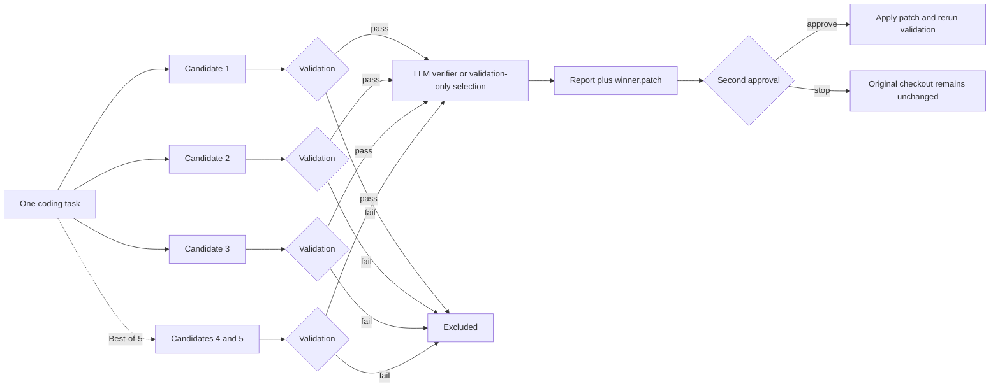

# dsh-llm-verifier

<p align="center">
  <strong>Generate several coding-agent patches, reject the ones that fail your tests, and let an LLM verifier rank the rest before you decide whether to apply the winner.</strong>
</p>

<p align="center">
  <a href="README.zh-CN.md">简体中文</a>
</p>

<p align="center">
  
  
  
  <a href="LICENSE"></a>
</p>

`dsh-llm-verifier` is a developer-preview plugin for [DeepSeek Harness](https://github.com/deepseek-ai/deepseek-harness). It runs **3 or 5 independent coding candidates** in detached Git worktrees, validates every candidate against project tests, ranks the passing patches with [`llm-verifier`](https://pypi.org/project/llm-verifier/), and keeps the original checkout unchanged until a separate approval applies the selected patch.

> [!WARNING]
> This public version is for **trusted repositories only**. Candidate generation uses detached Git worktrees and the DeepSeek Harness `workspace-write` permission mode, but validation commands still execute code from the target repository on the host. Read the [security boundaries](#security-boundaries) before using it.

## Why this exists

A single coding-agent run can produce a plausible patch, yet another independent run may find a simpler fix, add better tests, or avoid a subtle regression. Running several candidates manually creates a new problem: comparing them consistently.

This plugin turns that process into one approval-gated workflow:

1. Give every candidate the same coding task.
2. Keep candidate edits in separate detached worktrees.
3. Run deterministic project validation before model-based ranking.
4. Exclude candidates that fail validation.
5. Rank the remaining patches with an LLM verifier when comparison is needed.
6. Produce an auditable report and winner patch.
7. Apply the winner only after a second explicit approval, then rerun validation.



## What you get

- **Best-of-3 or Best-of-5:** use 3 candidates by default, or 5 for higher-value tasks.
- **Validation-first selection:** failing candidates never enter model ranking.
- **Efficient ranking:** one passing candidate wins by validation; two use one pivot; three to five use two pivots.
- **Two approval gates:** one before candidate execution and another before applying the winner.
- **Integrity checks before apply:** repository path, base `HEAD`, clean state, and winner-patch SHA-256 are checked again.
- **Auditable artifacts:** reports include rankings, changed files, timings, process status, patch hashes, verifier requests, and token usage.
- **Credential controls:** validation processes do not receive the DeepSeek API key; logs, errors, validation output, and text diffs are redacted against the exact credential value.
- **No automatic Git mutation:** the plugin does not commit, push, stash, reset, or automatically apply a patch.

## Current status

| Item | Current public version |
|---|---|
| Release stage | Developer preview |
| DeepSeek Harness | Pinned to `0.1.0-rc.7` |
| Node.js | `24.x` |
| Python bridge | Managed by `uv`; Python `>=3.9,<3.14` |
| `llm-verifier` | Pinned to `0.2.0` |
| Platforms | macOS and Linux |
| Candidate counts | `3` or `5`; default `3` |
| Distribution | Local-path installation after building from source |
| License | MIT |

## Quick start

### Prerequisites

Install or prepare:

- DeepSeek Harness `0.1.0-rc.7`
- Node.js 24 and pnpm `11.7.0`
- [`uv`](https://docs.astral.sh/uv/)
- Git
- A DeepSeek credential available to Harness through the credential reference `DEEPSEEK_API_KEY`

### 1. Clone, install, and verify

```bash
git clone https://github.com/Web0926/dsh-llm-verifier.git
cd dsh-llm-verifier

pnpm install --frozen-lockfile
uv sync --frozen --project python
pnpm run check
```

### 2. Add the local plugin to the Web profile

```bash
dsh plugin --profile web add "$(pwd)"
dsh plugin --profile web list
```

### 3. Start Harness in a clean target repository

```bash
cd /path/to/a/clean-and-trusted-git-repository
dsh --profile web
```

Ask Harness to use the tool, for example:

```text
Use verified_best_of with 3 candidates to fix the login retry bug and add regression tests.
Run pnpm test for validation. Do not apply the winner yet.
```

Equivalent tool input:

```json
{
  "task": "Fix the login retry bug and add regression tests",
  "candidateCount": 3,
  "validationCommands": ["pnpm test"]
}
```

The tool returns the run ID, status, eligible candidates, ranking, report path, token usage, and—when a winner exists—the local path to `winner.patch`.

After reviewing the report and patch, explicitly call:

```json
{
  "runId": "<runId returned by verified_best_of>"
}
```

through `apply_verified_winner`. The plugin requests a separate approval before applying the patch and reruns the original validation commands afterward.

### 4. Remove the plugin

```bash
dsh plugin --profile web remove dsh-llm-verifier
```

## Tools

### `verified_best_of`

Runs candidate generation, validation, and winner selection without modifying the original checkout.

| Parameter | Required | Description |
|---|---:|---|
| `task` | Yes | Coding task shared by every candidate. |
| `candidateCount` | No | `3` or `5`; defaults to `3`. |
| `validationCommands` | No | Explicit commands. When omitted, one supported project type is detected. |

Possible run states are `winner_selected`, `no_winner`, and `failed`.

### `apply_verified_winner`

Applies one previously selected winner after a separate approval. Before applying, it rechecks the repository identity and state, base commit, and patch SHA-256. It then reruns the validation commands captured by the original run.

## Automatic validation detection

Explicit validation commands always take precedence. Without them, the plugin accepts exactly one recognized root project type:

| Root markers | Command |
|---|---|
| `package.json`, one JavaScript package manager, and a `test` script | That package manager's `test` command |
| `pyproject.toml` | `uv run pytest` |
| `Cargo.toml` | `cargo test` |
| `go.mod` | `go test ./...` |
| `Makefile` with a `test` target | `make test` |

If several project types match, several JavaScript package managers are present, or no supported type can be identified, the run fails fast and asks for explicit commands.

## Security boundaries

The plugin is deliberately conservative about repository mutation, credentials, and artifacts, but the current public version is **not a container boundary**.

- It accepts only a normal, clean Git repository root.
- It rejects submodules, sparse checkouts, linked worktrees, and uncommitted changes.
- Candidate edits live under `$DSH_HOME/llm-verifier/runs/<runId>` in detached worktrees.
- Candidate Harness processes use the explicit `workspace-write` permission mode and do not inherit the host `DSH_PERMISSION_MODE`.
- Validation commands execute repository code on the host. Use this version only with repositories and validation commands you trust.
- Validation processes do not receive the API key.
- If a candidate writes the exact credential into text, binary content, or a symbolic-link target, that candidate is invalidated.
- Binary data is never sent to the verifier; complete binary patches remain local.
- Cancellation and timeout handling terminate the candidate process group and attempt to clean up plugin-created worktrees.
- An apply failure is left in place for inspection; the plugin does not run `git reset` as an automatic rollback.

Review every approval prompt, especially the validation commands shown before execution.

## Run artifacts

Each run is stored under:

```text
$DSH_HOME/llm-verifier/runs/<runId>/
├── artifacts/
├── manifest.json
├── report.md
├── winner.patch
└── apply-result.json        # created only after an apply attempt
```

The report records candidate launch, completion, validation, and ranking counts; exit codes and durations; diff statistics; patch paths and SHA-256 values; log paths; binary-file metadata; verifier request counts; and token usage. When verifier input is truncated, the report points to the complete local artifact.

## Cost awareness

With the default three evaluation criteria and two repeated evaluations, a fully eligible Best-of-3 run makes about **36 verifier requests** and a Best-of-5 run about **72**. Actual counts vary with candidate eligibility and cache hits and are written to the report.

Real candidate and verifier runs use paid model requests. Automated tests do not call the live DeepSeek API.

## Configuration

Default values:

| Setting | Default |
|---|---:|
| `defaultCandidateCount` | `3` |
| `candidateProfile` | `headless` |
| `credentialRef` | `DEEPSEEK_API_KEY` |
| `verifierModel` | `deepseek-v4-flash` |
| `nEvaluations` | `2` |
| `maxVerifierWorkers` | `8` |
| `verifierEffort` | `high` |
| `verifierMaxTokens` | `32768` |
| `candidateTimeoutMs` | `1200000` |
| `validationTimeoutMs` | `600000` |
| `runTimeoutMs` | `2700000` |
| `maxVerifierTraceBytes` | `524288` |
| `stateDirectory` | `$DSH_HOME/llm-verifier` |

Override the plugin entry in the Web profile's `cordis.patch.yml`:

```yaml
- id: llm-verifier
  config:
    defaultCandidateCount: 3
    candidateProfile: headless
    credentialRef: DEEPSEEK_API_KEY
    verifierModel: deepseek-v4-flash
    nEvaluations: 2
    maxVerifierWorkers: 8
    verifierEffort: high
    verifierMaxTokens: 32768
    candidateTimeoutMs: 1200000
    validationTimeoutMs: 600000
    runTimeoutMs: 2700000
    maxVerifierTraceBytes: 524288
    stateDirectory: $DSH_HOME/llm-verifier
```

`nEvaluations` accepts `1`–`4`, `maxVerifierWorkers` accepts `1`–`16`, and `verifierEffort` accepts `low`, `high`, or `max`. The verifier model name must begin with `deepseek-`.

## Development

```bash
pnpm run typecheck
pnpm test
pnpm run build
python3 -m py_compile python/verifier_bridge.py
```

The test suite covers Best-of-3 and Best-of-5 eligibility matrices, patch tampering, credential redaction, verifier failures, post-apply validation failures, binary patches, input truncation, and residual-process cleanup.

See [CONTRIBUTING.md](CONTRIBUTING.md) before proposing a change. Bug reports should include sanitized evidence and must never include credentials or private repository content.

## Current limitations

- No Windows support.
- No dirty worktrees, submodules, sparse checkouts, or linked worktrees.
- Candidate count is fixed to 3 or 5.
- No automatic commit, push, merge, or patch application.
- No OpenAI, Vertex, vLLM, or other verifier backends.
- No custom Web UI, ProgressTracker, or early stopping.
- Source installation only; no npm package or prebuilt GitHub release yet.

## License

[MIT](LICENSE)
