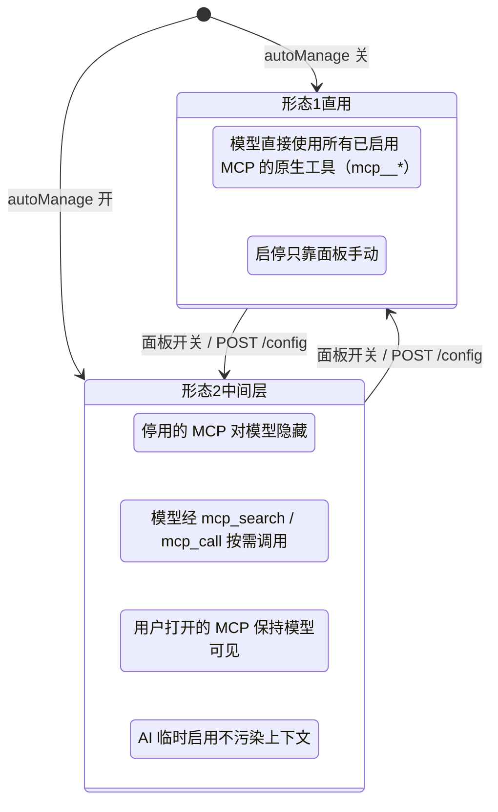
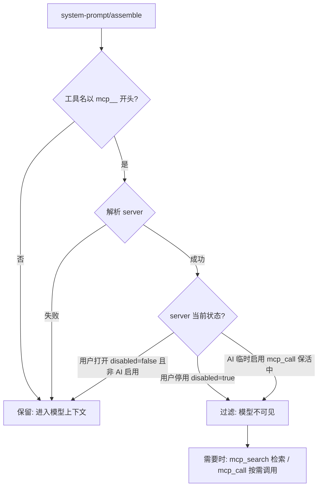
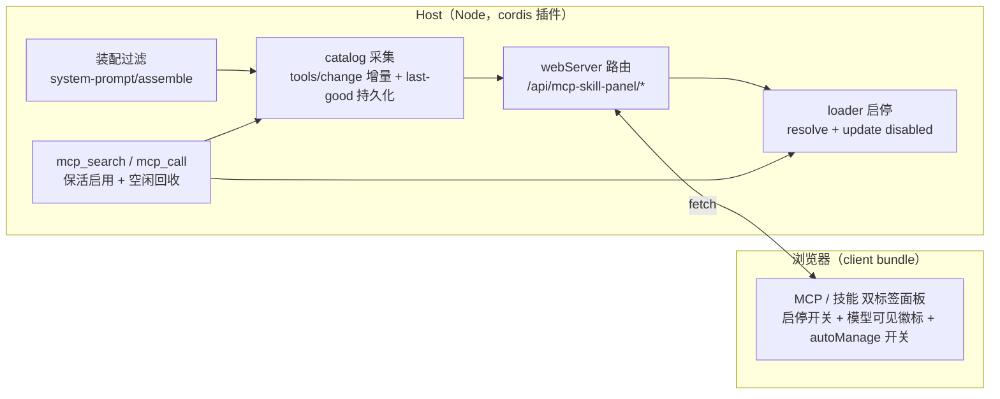
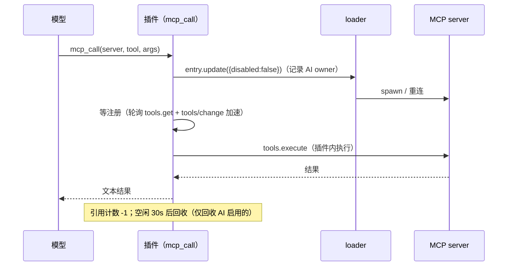

<p align="center">
  <strong style="font-size: 2.2em">🧩 MCP 与技能管理面板</strong><br>
  <span style="font-size: 1.1em">DeepSeek Harness（DSH）Web 插件 · MCP 服务器与 Skill 目录的实时启停 · 可选中间层（让AI按需调用）</span>
</p>

<p align="center">
  <a href="./README.en.md">🌐 English</a> · <strong>中文</strong>
</p>

<p align="center">
  
  
</p>

---

## ✨ 是什么

一个把 **MCP 服务器** 与 **Skill 目录** 变成可操作清单的设置页面板：每个条目一个启停开关，**停用即释放上下文占用，启用无需重启**。

还内置可选的 **AI 中间层**（`autoManage`）：开启中间层时，停用的 MCP 立即释放上下文，被中间层接管；模型需要 MCP 工具时，由中间层**临时开启** MCP，按需调用工具；用户手动打开的 MCP 全程对模型保持可见以维持高灵敏调用 —— 上下文占用完全由你的开关决定。


## 🎯 核心能力

| 能力 | 说明 |
| --- | --- |
| 🟢 **MCP 实时启停** | 停用 → loader entry 卸载（断开连接 + 注销全部 `mcp__<server>__*` 工具），工具从模型目录**立即消失**、schema token 即时释放；启用 → 重新连接 + 恢复工具，**无需重启** |
| 🧠 **Skill 启停** | 往 SKILL.md frontmatter 注入/移除 `disable-model-invocation: true`，模型 catalog 实时失效 |
| 📊 **停用态回填** | 停用的 MCP 卡片仍显示「目录中有多少工具、约多少 token」（来自私有 catalog 的 last-good 快照），决策是否启用更有依据 |
| 🤖 **AI 中间层（可选）** | `autoManage` 开启后：停用的 MCP 对模型隐藏，模型经 `mcp_search` / `mcp_call` 按需使用；用户打开的 MCP 保持模型可见；AI 临时启用不污染上下文 |
| 🔒 **用户启停不被模型干预** | 回收器只回收「AI 从停用态临时启用」的 server；用户手动打开的 server 永不被自动关闭 |
| 💾 **重启保持** | 启停意图持久化（`~/.dsh/dsh-mcp-skill-panel/state.json`）并在启动早期物化进预设组合文件；catalog 快照（`catalog.json`）重启后仍可回填 |
| ⚡ **响应快** | 开关点击即翻转（乐观更新 + 服务端确认），分域缓存 + 事件驱动失效（`tools/change` / `skills/change`），MCP 页不触发 skill 目录扫描 |
| 🌐 **双语界面** | 全部文案 zh/en 双语，跟随 DSH 界面语言；明暗主题适配 |
| 🪶 **零上下文占用** | 插件自身不注册任何模型工具，不消耗模型注入面（开关关闭时与未安装无异） |
| ⏱️ **生效时机选项** | 手动开关可选「立即生效」或「下次会话生效」，后者零缓存失效、零额外费用；AI 中间层按需调用始终不触发缓存 miss |
| ➕ **快速迁移添加** | 面板粘贴其它 harness 的 `mcpServers` JSON（Claude Code / Codex 等）→ 转换预览 → 一键添加为全局（写入 profile patch）或项目（`.dsh/mcps/mcp.json`）；`type/transport` 自动推断、`${VAR}` 环境变量自动插值 |
| 📁 **项目级 MCP** | 读取 `<工作空间>/.dsh/mcps/**/mcp.json`（根目录先读、子目录按 serverName 覆盖），**仅该项目工作空间的会话可见**（按会话 cwd 过滤）；文件改动热更新 |
| 🛠️ **工具级禁用** | 在 server 级启停之上按工具精确控制：被禁工具从 `mcp_search` 检索结果过滤、`mcp_call` 直接拒绝；项目 MCP 按工作区作用域隔离（A 区禁用不影响 B 区） |
| 🪄 **创建技能** | 面板填写名称/描述/指令即可创建技能（全局 `~/.dsh/skills` 或项目根 `.dsh/skills`），可上传 SKILL.md 自动解析 frontmatter 预填，创建后立即可见 |

## 🏗️ 两种形态（面板上的「AI 中间层」开关）



形态 2 的装配过滤（每回合实时判定）：



**工具级禁用（v0.5.3+，常开）**：除上述 server 级过滤外，被禁用的单个工具从装配结果剔除、`mcp_search` 检索结果过滤、`mcp_call` 直接拒绝并提示「请在 MCP 管理面板打开该工具后再调用」；禁用集合持久化在 `state.json`，重启保持。

## ⏱️ 生效时机：立即生效 vs 下次会话生效

面板为手动开关提供「生效时机」选项（位于开关旁的下拉菜单），两档：**立即生效**（默认）和 **下次会话生效**。理解两者区别对 Prompt Cache 费用有直接影响。

### 手动开关的两种模式

- **立即生效**（默认）：切换在**下一轮对话**即生效，该轮起工具前缀变更 → **前缀 KV-Cache 100% 失效**，该轮按 miss 费率计费（约为 hit 的 **5 ~ 12.5 倍**）。适合需要马上释放/恢复上下文的场景。

- **下次会话生效**：仅记录意图，当前会话全程工具集不变 → **零缓存失效、零额外费用**。直到以下边界之一到来才真正应用：
  - 新会话首次请求前（`agent/session-start` 阶段）；
  - DSH 重启（启动早期 `syncPresetFiles` 物化到预设组合文件）。

  面板提供 **「立即应用待生效变更」** 按钮，作为"已知晓费用"的强制生效出口——点击后立即生效（等同于选择"立即生效"并应用）。

### AI 中间层按需调用：天然免缓存失效

开启 AI 中间层（`autoManage`）后，模型经 `mcp_search` / `mcp_call` 按需调用已停用的 MCP——这种临时启用**不会造成缓存 miss**。原因：每回合的装配过滤（`system-prompt/assemble` Waterfall）让临时启用的 server 工具对模型保持不可见，前缀恒定，KV-Cache 持续命中。

### 默认值与生效边界

| 项目 | 说明 |
| --- | --- |
| 默认值 | `immediate`（维持历史行为） |
| 选择 `next-session` | 需在面板显式切换 |
| 生效边界 | 新会话首次请求前 + DSH 重启 |
| 当前会话 | 已开会话的后续轮次不受影响 |

### 一句话结论

> 想省费用又不急着释放上下文 → 用 **下次会话生效**；要当前会话立刻释放/拿回工具 → **立即生效**（理解该轮会 miss 一次缓存）。

## 📦 安装

```sh
dsh plugin --profile web add "github:lilyblessing/dsh-mcp-skill-panel#main"
```

产物已入库（`lib/`），git 源一行安装，无需构建授权。安装后**重启 `dsh web`**（bundle 层在启动时合成，热更新无效），设置页即出现「MCP 与技能管理面板」入口。

> 📦 已发布到 **npm**：`dsh-mcp-skill-panel`（[npm 页面](https://www.npmjs.com/package/dsh-mcp-skill-panel)）。npm 版为预构建产物，安装可跳过 `allowBuilds` 构建授权，也可直接以包名安装；git 源方式始终可用。
>
> ⬆️ **升级**：git 源用户请在 DSH profile 目录执行 `pnpm update dsh-mcp-skill-panel`（`pnpm add` 对相同 spec 不会重解析 git 分支）；npm 用户 `pnpm add dsh-mcp-skill-panel@latest`（当前 latest = **0.5.3**）即可。

## 🚀 使用

1. 设置页 → **MCP 与技能管理面板**
2. **MCP 服务器** 标签页：每张卡片显示服务器名、状态徽标（运行中 / 已停用 / 无工具 / 异常）、**模型可见徽标**（中间层模式下用户打开=可见，停用/AI 临时=隐藏）、工具数与 token 占用估算；点右上角开关启停；MCP 行可**展开工具列表逐个禁用**（工具级禁用）
3. **技能** 标签页：每张卡片显示技能名、来源、描述、模型可见徽标；点右上角开关启停
4. **AI 中间层开关**：开启后停用的 MCP 由模型按需调用（见上节形态说明）；关闭回到经典模式
5. **添加 MCP / 创建技能**：MCP 页右上「添加 MCP」粘贴 `mcpServers` JSON 后可选全局/项目；技能页右上「创建技能」填名称/描述/指令（可上传 SKILL.md 自动预填）
6. **手动管理**（可选）：直接编辑预设组合文件（`disabled: true` 行）或 SKILL.md frontmatter（`disable-model-invocation: true`），下次重启/变更即生效；被外部修改的行会退出插件管理（下次启动尊重你的改动）

> 状态徽标含义：🟢 运行中（有工具）/ ⚪ 已停用 / 🟡 无工具（进程在跑但工具列表为空，多为 server 启动失败或空实现）/ 🔴 异常（未在运行也未停用）。

## 🔌 HTTP API

前缀 `/api/mcp-skill-panel`（旧前缀 `/api/runtime-inventory/*` 仍兼容）。

| 方法 | 路径 | 说明 |
| --- | --- | --- |
| GET | `/state?session=<id>&part=<mcp\|skills\|all>` | 清单快照；`part` 分域拉取，缺省 all |
| POST | `/mcp/toggle` | `{ entryId, disabled }` 启停单个 MCP |
| POST | `/mcp/toggleBatch` | `[{ entryId, disabled }]` 批量启停（400ms 合并，单次失效） |
| POST | `/mcp/applyPending` | 立即应用待生效队列（next-session 意图强制生效） |
| POST | `/mcp/toolToggle` | `{ serverName, toolName, disabled }` 工具级禁用（全名 `mcp__<server>__<tool>`） |
| POST | `/mcp/preview` | `{ json }` 快速迁移预览：粘贴 mcpServers JSON → 解析 + YAML patch 转换（返回 warnings） |
| POST | `/mcp/add` | `{ json, target: global\|project, workspace? }` 添加 MCP（全局写入 profile patch / 项目写入 `.dsh/mcps/mcp.json`） |
| POST | `/skill/toggle` | `{ name, disabled }` |
| POST | `/skill/add` | `{ name, description, body, target: global\|project, workspace? }` 创建技能 |
| GET | `/config` | 读取 AI 中间层开关与生效时机 |
| POST | `/config` | `{ autoManage?, applyMode? }` 切换中间层 / 生效时机（持久化到 state.json） |
| GET | `/debug` | catalog 采集诊断 + scope 解析现场（scopeDiag），运维排障用 |
| POST | `/debug/collect` | 手动触发一次 catalog 采集 |
| GET | `/token` | 取本进程随机令牌（面板 POST 前自动获取并携带 `x-panel-token` 头） |

> **写操作鉴权（0.4.7+）**：全部 POST 要求 `x-panel-token` 头与本进程随机令牌一致，否则 401 —— 阻断跨源 / DNS-rebinding 对本地控制端点的盲写；GET 只读端点（state/config/debug/token）保持开放。令牌由客户端在 `/token` 获取并自动携带。
> 分域缓存（60s TTL 兜底）由事件驱动精确失效：`tools/change` / `loader/partial-dispose` → MCP 域；`skills/change` → Skill 域。

## ⚙️ 工作原理



**MCP 启停**：MCP 行是 agent preset 组合（`agent.cordis.yml`）中的 loader entry（`@deepseek-ai/dsh-mcp-client`，完整 id 形如 `include:agent-presets:mcp-cheatengine`）。`loader.resolve(id).update({ disabled })` 实时 dispose/restart 该 entry。

**MCP 持久化为何分两步**：预设树（`PresetTree`）的 `write()` 是显式 no-op，且 `dsh-agent-presets` 用 `{mtimeMs, size}` stamp 检测预设文件变化 —— **运行期写该文件会触发 standing 重挂而旧实例不清理**（serverName 全冲突、会话创建失败，0.1.0 实测事故）。因此 toggle 只写插件状态文件，插件 `apply`（启动早期、standing 未挂载）时再把意图物化到预设文件。

**中间层调用链**（`mcp_call` 对停用 server）：



> **tool 参数契约（0.5.1+）**：`mcp_call` 的 `tool` 应传该 server 上的**裸名**（如 `understand_image`）；误传 `mcp_search` 返回的注册全名（`mcp__<server>__<tool>`）或双重前缀会自动归一化，其他 server 的注册全名立即快速失败并提示。

**catalog 采集**：`tools/change` 事件（root 监听，150ms 去抖）对 enabled server 增量快照；scope 解析经 `agentPresets.standingKeyFor()` 兜底并**进程级共享缓存**（v0.5.3，HTTP 面板路径与快照路径复用同一 key）；空快照不覆盖磁盘 last-good；`catalog.json` 原子写回（tmp + rename，0600）。

## ✅ 验证清单

| 检查项 | 操作 | 预期 |
| --- | --- | --- |
| 面板入口 | 重启后打开设置页 | 出现「MCP 与技能管理面板」，MCP/技能双标签，zh/en 跟随界面语言 |
| MCP 停用 | 关掉一个服务器开关 | 卡片变「已停用」，新会话工具列表不再含 `mcp__<server>__*`；停用态仍显示目录工具数 |
| MCP 启用 | 再打开开关 | 工具恢复，**无需重启** |
| 持久化 | 停用后重启 dsh | 该服务器仍处于停用状态 |
| Skill 启停 | 点技能开关 | 卡片立即翻转且不回跳；模型目录同步移除/恢复 |
| 外部变化 | 会话 A 停用某 MCP，会话 B 打开面板 | 无需点刷新即为最新状态 |
| AI 中间层 | 面板开 autoManage | 停用 server 对模型隐藏、`mcp_search`/`mcp_call` 可用；用户打开的 server 带「模型可见」徽标 |
| 回收保护 | 模型 mcp_call 后空闲 30s | AI 临时启用的 server 自动停用；用户手动启用的不被回收 |
| 工具级禁用 | 展开 server 工具列表关掉一个工具 | `mcp_search` 不再返回该工具；`mcp_call` 拒绝并提示；重启后保持 |
| 添加 MCP | 粘贴 mcpServers JSON → 预览 → 添加 | 全局写入 profile patch / 项目写入 `.dsh/mcps/mcp.json`，面板即时出现新行 |
| 创建技能 | 技能页「创建技能」 | 落盘 `~/.dsh/skills` 或项目 `.dsh/skills`，技能列表即时出现 |

## ⚠️ 已知限制

- 启停作用于 preset 层：一个服务器/技能的开关影响该 preset 下所有会话。
- 无 frontmatter 的 SKILL.md 无法切换（provider 本身会忽略此类文件）。
- 工具数/token 为估算值（`JSON.stringify(parameters).length / 4`），与模型注入面真实值近似。
- 停用后工具立即消失，但**当前回合的请求缓存**（如有）可能仍引用旧 schema；下一请求自然刷新。
- **持久化时滞**：启停实时生效；跨重启保持依赖下次启动的物化 —— 插件在「已有会话运行」期间被热更新时，本次进程不物化，下一次重启生效。
- **手动编辑预设组合文件的 mcp 行**（如手动移除 `disabled: true`）会令该行退出插件的持久化管理（下次启动尊重你的改动，不再覆盖）。
- **工具级禁用边界**：禁用拦截作用于模型可见性（装配过滤）、`mcp_search` 检索与中间层 `mcp_call`；对已注册工具的直接原生调用（绕过中间层）不做运行时拦截。
- 运行期写 SKILL.md 安全（skill-filesystem 的 watcher 本就预期文件被改）；运行期写预设组合文件会触发 dsh-agent-presets 的 stamp 重挂事故，插件刻意不做。
- 能力摘要表（`mcp_search` 空查询）只覆盖有 catalog 快照或配置了 `serverSummary` 的 server；从未成功启动过的 server（如 codegraph）不会列出。
- **控制端点鉴权**：写操作由进程级随机令牌（`x-panel-token`）保护，仅面板同源客户端自动携带；GET 只读开放。宿主 webServer 本身无鉴权层，若将监听地址改为 `0.0.0.0` 对外暴露，建议同时依赖外层网络隔离。

## 🛠️ 开发

依赖已**自包含**（`@deepseek-ai/*` 构建期依赖全部并入 devDependencies，纯 registry 安装即可，**无需本机 DSH 闭包**）：

```sh
npm install --legacy-peer-deps --ignore-scripts   # 一次即可（旧流程的 npm run setup / junction 不再必需）
npm run typecheck  # tsc 类型检查（@deepseek-ai devDeps 提供 Context 服务类型增补）
npm run build      # tsdown（node external 全部 @deepseek-ai/*）→ 最后 tsc 生成 lib/types（顺序不可换）
npm run verify     # 产物验证（无 TOOL_RUNTIME_SCHEDULER 内联、client 包装完整、lib/types 齐全）
node scripts/selftest-mcp.mjs  # catalog / convert / preset 纯逻辑单测（含 computeStatus 等回归）
node scripts/selftest-pending.mjs  # P1 会话边界应用链单测
```

> **lib/ 产物由 GitHub Actions 自动重建**（`.github/workflows/build.yml`）：提交源码后推送，CI 跑 typecheck→build→verify→selftest，在 main 分支把新 `lib/` 以 `[skip ci]` 提交回写；本地记得 pull 收产物。
> 为什么 `--legacy-peer-deps`：运行时 peer 由 DSH 闭包注入，而 registry 上 rc.6~rc.8 的 peer 声明互相咬（ERESOLVE）；为什么 `--ignore-scripts`：esbuild 走 optionalDependencies 平台二进制、无需 postinstall。

node 半区 tsdown 必须 `external: [/^@deepseek-ai\//]`：内联 dsh-tools 会产生第二个 `TOOL_RUNTIME_SCHEDULER` Symbol，导致工具调度崩溃（dsh-context-doctor 同款教训）。
`build.mjs` 的顺序必须是「tsdown → tsc dts」：tsdown 的 `clean` 会清掉 `lib/`，若先 tsc 生成、后 tsdown，`lib/types` 会被连带删除（0.4.7 修复，verify 有护栏）。

## 📋 变更日志

### v0.5.3（2026-08-27）— 发布批次：新功能 + 测试期修复 + 工程改进

- ✨ **新功能**（承接 PR #5）：
  - MCP 快速迁移添加（粘贴 `mcpServers` JSON → 转换预览 → 全局/项目）
  - 项目级工作空间 MCP（`.dsh/mcps` 热更新 + 按会话隔离）
  - 工具级禁用（`mcp_search` 过滤 + `mcp_call` 拒绝，按工作区作用域）
  - 创建技能（全局/项目，支持上传 SKILL.md 预填）
- 🐛 **修复**：
  - `setRowFlag` 支持 `disabled` 标记反转 + 外部修改不再删除 state 条目（重启后设置丢失事故）
  - `/config` GET 恢复只读开放（面板生效时机恒显「立即生效」修复）
  - scope key 进程级共享缓存（HTTP 面板路径聚合无工具根治）+ 工具列表 catalog 兜底
  - status 徽标以真实注册工具判定（不掩盖故障现场）
- ⚡ **性能**：装配过滤空表快速通道（约 177x）
- 🔧 **工程**：CI 适配分支保护（App token 回写）；发布前独立审查整改；selftest 增补回归

### v0.5.2（2026-08-24）— 审计修复

- reaper×call 竞态（空闲回收 await 后二次检查引用计数，杜绝在途 mcp_call 被误清归属）
- mcp_call 参数双编码归一化（normalizeArguments）与错误呈现（msgOf JSON 化，杜绝 [object Object]）
- scope 钥匙改用 agent 对象（修复重启后 mcp_call 全量「未在超时内注册」）
- 双缓存统一（getSchemasView 共享 raw schemas）；toggleSkill 确认改指数退避
- applyStateResidue 按文件分组读盘；preset 原子写；serverOfMcp 收敛
- /config 鉴权回归修复（独立审查拦截）

### v0.5.1（2026-08-23）— mcp_call 工具名前缀防御（PR #4）

- `tool` 参数误传注册全名/双重前缀自动归一化（normalizeToolName）；其他 server 注册全名立即快速失败并提示裸名
- selftest 新增 4 条回归断言；宿主端到端验证通过

### v0.5.0（2026-08-21）— Prompt Cache 优化（P0+P1）

- 中途开关必现 miss 警示条（大包红色 severe 变体、12s 自动消失）
- 生效时机选项 immediate / next-session（新会话 `agent/session-start` 或重启统一应用，当前会话零 miss）
- 开关 400ms 合并单次 toggleBatch；applyPendingMcp 增加 state.json 残留兜底；toggleBatch 单项失败不阻断整批

### v0.4.9（2026-08-20）

- 依赖对齐 DSH rc.8 系；新增 Trusted Publishing 自动发布流水线（publish.yml，OIDC 免 token）

### v0.4.8（2026-08-19）

- 构建工程自包含 + CI：14 个 `@deepseek-ai/*` 并入 devDependencies；GitHub Actions 流水线（main push 自动重建回写 lib）

### v0.4.7（2026-08-18）

- 安全与健壮性加固：toggle 校验目标行必须是 MCP 行；全部写端点加进程级 token 鉴权；readBody 限长 64KB；waitRegistered 绑定上下文销毁；build 顺序修复使 lib/types 入库

### v0.4.6 / v0.4.5

- 0.4.6：修复 0.4.5 引入的 catalog 清空事故（prune 空视图保护 + 空采集不写盘）
- 0.4.5：catalog 失效清理（行移除/改名后残留快照自动清除）

### v0.4.4（2026-08-13）

- 可维护性重构：index.ts 拆分（state/preset/collect/routes/util/mcp-entry/shared-types）；MCP entry 判定收敛；端点样板收敛；client 类型声明替换 any

### v0.4.3（2026-08-12）

- 性能优化：修复 restore 竞态；装配过滤回合内可见性 Map 缓存；schemas 500ms 窗口复用；catalog 写盘 300ms 防抖；state.json 内存态 + 写队列合并

### v0.4.2（2026-08-11）

- AI 中间层（autoManage）：mcp_search/mcp_call 按需使用；装配过滤按 server 状态；面板 autoManage 开关 + 模型可见徽标

### v0.4.1（2026-08-10）

- 修复 catalog 采集链路（standKeyFor fallback、last-good 守卫、启动早期空快照写盘、写盘竞态）；新增 debug 诊断端点

### v0.4.0（2026-08-09）

- AI 中间层初版：私有 catalog 持久化 + 面板停用态回填目录工具数

### v0.3.x（2026-08-06 ~ 08-08）

- 0.3.2：API 前缀对齐包名（旧前缀兼容）
- 0.3.1：MCP 聚合版本化复用；前端 fetch 乱序防护
- 0.3.0：分域端点 + 分域缓存 + 事件驱动失效（tab 懒加载）

### v0.2.x / v0.1.x

- 0.2.1：skill 启停 UI 30s 滞后根因修复（已确认值覆盖陈旧 catalog）
- 0.2.0：改名「MCP 与技能管理面板」+ GitHub 库 `dsh-mcp-skill-panel`
- 0.1.1：MCP 持久化重构（状态文件 + 启动早期物化），修复运行期写预设文件导致的会话创建失败
- 0.1.0：初版：MCP/Skill 清单 + 启停

## 📄 License

[MIT](./LICENSE) © lilyblessing