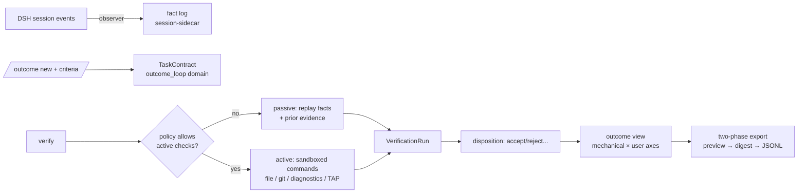

# dsh-outcome-loop

Task outcome ledger & acceptance plugin for DeepSeek Harness (DSH) · 任务结果账本与验收插件

**Know whether a task was actually completed — with near-zero extra tokens and mechanically re-checkable evidence — and keep the result as a portable, user-owned record.**

`dsh-outcome-loop` is a local-first, user-owned, vendor-neutral task outcome ledger and acceptance plugin for DSH. It organizes one DSH session's goal, constraints, acceptance criteria, execution evidence, user feedback, cost, and final result into a re-auditable task record.

- **Stops "the model said done" from being mistaken for "the task is done"**: acceptance is based on mechanical evidence — tests, build, lint, exit codes, file state, diagnostics, git scope;
- **Zero extra model cost by default**: no extra LLM calls, no model-visible tools, no system-prompt injection;
- **Local by default, offline by default**: all result data lives in your own DSH storage backend;
- **User owns and controls the data**: inspect, delete, or export — with a preview + redaction gate before any export;
- **Separates success, failure, unknown, stale evidence, user acceptance and user abandonment** — an unknown is never silently converted into a success.

## Quick start

### Install

```bash
# From source
pnpm install
pnpm build
pnpm pack   # produces dsh-outcome-loop-<version>.tgz

# Install into a DSH profile
dsh plugin --profile <name> add ./dsh-outcome-loop-0.1.0-beta.8.tgz
```

> **Prerequisite — `storageDomain` (real-host verified)**: the plugin requires
> the `storageDomain` service, which the official `dsh-base` bundle does **not**
> provide (only upper bundles such as `@deepseek-ai/dsh-web-app` do; the `web`
> profile already has it). On a bare/headless profile, add it once:
>
> ```bash
> dsh plugin --profile <name> add @deepseek-ai/dsh-storage-domain@0.1.0-rc.8
> # then append to ~/.dsh/profiles/<name>/cordis.patch.yml:
> # - insert:
> #     - id: storage
> #       name: "@deepseek-ai/dsh-storage"
> #     - id: storage-json
> #       name: "@deepseek-ai/dsh-storage-json"
> #       config:
> #         root: !!js dshHomePath("storages")
> #     - id: storage-domain
> #       name: "@deepseek-ai/dsh-storage-domain"
> #       config:
> #         backend: json
> ```
>
> Without it the profile boot fails loud with `waiting for service:
> storageDomain` (fail-loud by design; see [COMPATIBILITY.md](COMPATIBILITY.md) §4
> for the verified lifecycle: add → dump-config → boot → real `/outcome`
> commands → restart-read → uninstall).

The bundle mounts four plugin rows (see `cordis.patch.yml`):

| Row | Role |
| --- | --- |
| `outcome-loop` | Core service `ctx.outcomeLoop` + session observer + local sidecar storage |
| `outcome-loop-commands` | Human commands `/outcome` (contract, verification, feedback, export) |
| `outcome-loop-projection` | Optional web session projection (auto-skipped headless) |
| `outcome-loop-contribute` | **Not installed by default**: contribution-dataset preparation (add the row manually + `contribute.enabled: true`, see below) |

### Use (via `/outcome`)

```
/outcome new 修复登录页按钮在移动端溢出问题        # create a task contract
/outcome criterion add 移动端 375px 宽度下无横向滚动  # add an acceptance criterion (manual)
/outcome criterion add-command "pnpm test"          # command criterion (exit code 0)
/outcome criterion add-test                          # test-report criterion
/outcome criterion add-file dist/bundle.js          # artifact file criterion
/outcome criterion add-test --min-passed 2 --max-failed 1
                                                     # structured test counts (TAP auto-parsed)
/outcome verify                                     # run verification (passive observation only)
/outcome status                                     # mechanical verification × user disposition
/outcome accept | reject | revise | abandon         # user disposition (independent axis)
/outcome export [<contract>]                             # two-phase export: preview → digest
/outcome export <contract> --approve <digest> --out <path> [--overwrite]
                                                     # approve and atomically write JSONL
/outcome exports [<contract>]                        # list export manifests
/outcome import <path>                              # import a Task Contract file (outcome-loop.contract.v1)
/outcome export-contract <id> --out <path>          # export a contract file
/outcome cost [<contract>] [--summary]              # token usage (+ optional price table → cost)
/outcome calibration [<contract>]                 # dsh-code-reference decision calibration
/outcome skills [--out <path>]                    # skill candidates (read-only aggregation)
/outcome delete <contract-id> --yes                 # delete sidecar data (session log untouched)
```

### Contribution mode (off by default, ADR-0005)

Contribution mode is a separate, not-installed-by-default consumer. Add it manually to the profile patch:

```yaml
- insert:
    - id: outcome-loop-contribute
      name: dsh-outcome-loop/lib/consumers/contribute.js
      config:
        enabled: true
```

```text
/contribute preview <contract>                 # batch preview (fields/sensitivity/digest)
/contribute approve <digest> <contract> --out <dir> [--summary-only]
                                               # writes consent manifest + records.jsonl (or summary.json)
/contribute revoke <contract> --out <dir> --yes  # withdrawal = delete the dataset directory
```

Datasets contain only the export-v1 minimal fields (no message bodies / code / credentials / absolute paths); the deterministic redaction gate blocks a whole batch on any sensitive hit; the plugin **never uploads anything** — delivery is entirely the user's decision.

### Via the Host API

```ts
import type { Context } from '@deepseek-ai/cordis'

// Create a contract
const created = await ctx.outcomeLoop.createContract({
  sessionId: session.id,
  goalText: 'fix login bug',
  workspaceRoot: session.header.cwd,
  criteria: [
    { description: 'pnpm test passes', kind: 'command-exit',
      specification: { kind: 'command-exit', command: 'pnpm test', expectExitCode: 0 } },
  ],
})
// created: OutcomeResult<TaskContract>

// Run verification (passive: observes existing events, never executes commands on its own)
const run = await ctx.outcomeLoop.verify({ contractId: created.value.id })

// User disposition (an independent axis from mechanical verification)
await ctx.outcomeLoop.setDisposition({ contractId, status: 'accepted' })

// Two-phase export
const preview = await ctx.outcomeLoop.previewExport({ contractId })
const receipt = await ctx.outcomeLoop.exportJsonl({ contractId, previewDigest: preview.value.previewDigest })

// Record a prior decision from dsh-code-reference (or any integration, §15 — calibration only)
await ctx.outcomeLoop.recordDecisionEvidence({
  contractId,
  source: 'dsh-code-reference',
  decisionId: 'decision-42',
  strategy: 'reuse',
  predictedMatch: 0.87,
})
```

The full API surface is `OutcomeLoopApi` in `src/service.ts`.

## Runtime flow



Active verification is **never run by default**: the policy layer gates every invocation (`autoRun`, `allowedVerifierIds`, timeout, output cap, allowlisted env). Commands are spawned argv-first — never through a shell string.

### Active-verifier safety (beta.8)

- **Infrastructure failures are always `unknown`**: a command that timed out, failed to start, or had its output truncated is never parsed into pass/fail evidence; `git-scope` requires both git commands to exit 0 (non-repo directories are `unknown`, never `pass`, and git stderr is never parsed as changed paths); `diagnostic-count` treats a non-zero exit with zero parsed diagnostics as `unknown` (tool crash) while keeping tsc/eslint semantics (non-zero + findings → `fail`);
- **Workspace confinement is realpath-based**: every user- or contract-supplied path is checked against `realpath` of the workspace root — reads (`file-exists`, `file-digest`, `json-schema`, JUnit `reportPath`, contract import) and writes (export `--out`, contribute approve/revoke) reject symlinks escaping the workspace (`unknown`/error, never pass); in-workspace symlinks keep working.

## Conceptual model

A task result is not a boolean. The ledger keeps at least five mutually independent axes (full rules in [ARCHITECTURE.md](ARCHITECTURE.md) and `src/domain/reducer.ts`):

| Axis | Values |
| --- | --- |
| Execution status | `active` / `ended` / `aborted` / `blocked` |
| Verification status | `not-run` / `passed` / `failed` / `inconclusive` |
| User disposition | `none` / `accepted` / `rejected` / `revised` / `abandoned` |
| Label strength | `strong` / `medium` / `weak` / `unknown` |
| Data eligibility | `private-only` / `exportable` / `contribution-approved` |

A user may accept a result even when mechanical verification failed — and user acceptance never erases the mechanical failure. Both axes are kept.

## Verification aggregation (summary)

1. Any required + blocking criterion `fail` → overall `failed`;
2. No failure but at least one required criterion `unknown` → `inconclusive`;
3. All required `pass`/`not-applicable` → `passed`;
4. Nothing verified → `not-run`;
5. Warning criteria do not change passed/failed but are always shown;
6. Conflicting current evidence → `inconclusive` by default — never pick the success-favoring row;
7. Contract revision change, workspace change, or stale age → old evidence is `stale`; stale rows never imply pass;
8. User acceptance only changes disposition, not mechanical verification;
9. An LLM judge (future, separate plugin) can at most produce a `weak` label.

## Privacy & security (summary)

- Zero model calls, zero network, zero proactive command execution by default;
- Only structured facts are stored: command digests, exit codes, counts, digests, seq references — **never** full prompts, tool arguments, tool output, source code, or message bodies;
- Outcome data lives in a separate sidecar domain (`outcome_loop`), **never in the session log**, never in telemetry;
- Export is an explicit two-phase operation: preview (with digest) → approval (digest-bound; content changes invalidate it);
- Full threat model: [SECURITY.md](SECURITY.md); default hard privacy gates: [PRIVACY.md](PRIVACY.md).

## Repository layout

```text
src/
├── domain/        # pure domain: ids / types / errors / reducer / aggregate / freshness (no DSH deps)
├── dsh/           # DSH adapters: events / observer / replay / registry / token-bridge / feedback-bridge / compatibility
├── persistence/   # storage-domain sidecar: schema / repository / queue / repair
├── verification/  # engine: registry / policy / engine / adapters(passive, active) / paths (realpath confinement)
├── export/        # redact / schema / preview / jsonl
├── consumers/     # /outcome commands + optional projection (service-only, no domain truth)
├── service.ts     # ctx.outcomeLoop (OutcomeLoopApi)
├── config.ts      # Schemastery config (defaults locked to the safe side)
└── index.ts       # plugin entry
```

## Development

```bash
pnpm install
pnpm typecheck     # tsc --noEmit
pnpm lint          # eslint
pnpm test          # vitest (151 tests)
pnpm test:coverage # coverage with thresholds (security-critical code targets 100% branch)
pnpm build         # tsc → lib/
pnpm pack          # npm tarball (dsh plugin add install)
pnpm smoke         # plain-Node import smoke of the built bundle
```

Test matrix: Node 22.19+ / Node 24 (`engines`), CI in `.github/workflows/ci.yml`. Coverage thresholds (statements 80 / branches 68 / functions 80 / lines 80) are enforced in CI; security-critical modules (path confinement, consumers) are never excluded from measurement.

## Relationship to dsh-code-reference

[dsh-code-reference](https://github.com/victorzhong0110/dsh-code-reference) handles pre-development candidate discovery and reuse decisions; this plugin handles post-development factual verification. They install independently with a one-way optional integration: outcome-loop never imports code-reference internals.

## Docs

- [ARCHITECTURE.md](ARCHITECTURE.md) — architecture decisions, layering, event flow, replay & idempotency
- [PRIVACY.md](PRIVACY.md) — default privacy hard gates and data minimization
- [SECURITY.md](SECURITY.md) — threat model and controls
- [DATA_FORMAT.md](DATA_FORMAT.md) — sidecar schema and open export format
- [COMPATIBILITY.md](COMPATIBILITY.md) — DSH compatibility matrix and release baseline
- [CHANGELOG.md](CHANGELOG.md) — change log

## License

MIT — see [LICENSE](LICENSE).

**DSH compatibility statement**: developed and verified against DeepSeek Harness `0.1.0-rc.7` (see [COMPATIBILITY.md](COMPATIBILITY.md)). DSH is in developer preview and its APIs may change incompatibly; check the compatibility matrix before upgrading.
