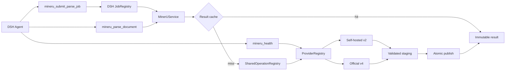

<div align="center">


# dsh-pdf-mineru

**让 DeepSeek Harness 拥有强大的 PDF 与文档智能解析能力**

支持 **MinerU 官方云 (v4)** 与 **私有化自建服务 (v2)**，为 AI Agent 提供高精度的文档版面分析、公式与表格提取、图文解析，原生支持后台异步任务与智能缓存。

<p>
  <a href="https://awesome-dsh-plugin.com"></a>
  <a href="https://www.npmjs.com/package/dsh-pdf-mineru"></a>
  <a href="./package.json"></a>
  =0.1.2-rc.1 (RC only)">
  
  <a href="./LICENSE"></a>
</p>

[✨ 核心亮点](#-核心亮点) · [🚀 快速开始](#-快速开始) · [💬 对话示例](#-对话与提示词示例) · [⚙️ 模型工具](#️-模型工具与参数参考) · [🏗️ 工作架构](#️-工作架构与流程) · [🔌 Provider 选型](#-provider-选型对比) · [🛠️ 设置与配置](#️-设置与配置参考) · [❓ 常见问题](#-常见问题-faq) · [🧑‍💻 开发者指南](#-开发者指南)

</div>

---

## ✨ 核心亮点

- 📑 **高质量结构化提取**：精准识别双栏排版、复杂多级标题、LaTeX 数学公式、表格与插图，输出排版优雅的 Markdown。
- ☁️ **云端 / 本地自由切换**：支持开箱即用的 **MinerU 官方云 API**（无需本地显卡）与 **私有化自建服务**（数据不出内网），统一工具接口无缝切换。
- ⚡ **无感后台异步解析**：几十页至数百页的长篇论文或研报，Agent 会自动提交为 DSH 原生后台任务（Native Job），解析期间不阻塞聊天，解析完成后自动提醒。
- 💾 **智能内容寻址缓存**：基于文件指纹与解析配置自动去重，同一份文档无需重复解析，极大节省 Token、官方 API 额度与计算资源，二次调用秒级响应。
- 🖥️ **深度集成 Web GUI**：提供内置可视化设置面板，支持一键连通性测试、参数预设、缓存统计与磁盘管理，配置即改即用。

---

## 🚀 快速开始

### 0. 环境要求与版本兼容说明

> ⚠️ **重要版本声明与环境要求**：
> - **最低支持的 DSH 版本**：`>= 0.1.2-rc.1`。
> - **仅支持 RC 版本**：本插件**只会对 DeepSeek Harness 的 RC（Release Candidate）版本及后续正式发布版本进行官方支持**。由于早期 `alpha` 测试版本包含较多实验性且剧烈变动的内部 API，本插件不再对 `alpha` 等非稳定测试版本提供兼容与维护支持。
> - **运行环境要求**：Node.js `^22.19.0 || >=24.0.0`，包管理器推荐 `pnpm@11+`。

### 1. 安装插件

在 DeepSeek Harness 环境中一键安装：

```sh
dsh plugin --profile web add dsh-pdf-mineru
```

> 本地开发或测试源码时，可使用：`dsh plugin --profile web add link:/absolute/path/to/dsh-pdf-mineru`

### 2. 配置与连接

打开 DSH 界面中的 **Settings → Plugins → MinerU**，根据您的使用场景选择 Provider：

<p align="center">
  
</p>

#### 方案 A：使用 MinerU 官方云（推荐，免部署）
1. 前往 [MinerU 官网](https://mineru.net) 注册并获取 API Token。
2. 在终端配置环境变量（或通过 DSH 凭据服务管理）：
   ```sh
   export MINERU_API_KEY="your-token-here"
   ```
3. 在设置中选择 **Official v4**，保持 **API Key Env Var** 为 `MINERU_API_KEY`，点击 **Test Active Provider** 即可完成验证。

#### 方案 B：使用本地 / 私有化自建服务
1. 启动您的 MinerU 自建服务（如 FastAPI v2，默认端口 18000）。
2. 在设置中选择 **Self-hosted v2**，填入服务地址（例如 `http://localhost:18000`）。
3. 若使用本地 HTTP，勾选 **Allow Insecure HTTP**，点击 **Test Active Provider** 验证连通。

### 3. 开始使用

配置完成后，无需记忆复杂指令，直接在聊天框中用自然语言对 Agent 下达需求即可！

---

## 💬 对话与提示词示例

Agent 会自动根据文档长度和指令意图，智能选择同步返回或后台异步处理：

### 场景 1：常规论文 / 报告解析
> **你**：“帮我解析 `/workspace/paper.pdf`，提取正文、数学公式和表格，整理成 Markdown 格式。”
> **Agent**：调用 `mineru_parse_document`，直接返回排版好的 Markdown 文本与产物清单。

### 场景 2：超长文档后台异步解析（推荐）
> **你**：“请在后台解析这本 120 页的技术研报 `/data/annual-report.pdf`，解析完成后告诉我。”
> **Agent**：提交 `mineru_submit_parse_job` 并返回任务 ID（如 `mineru-1`），随后可在后台静默运行，完成后自动读取结果并向您汇报。

### 场景 3：指定页码与扫描件 OCR
> **你**：“解析 `/data/scanned_doc.pdf` 的第 1 到 5 页，这个是扫描件，请开启强制 OCR 模式。”
> **Agent**：传入 `pages: "1-5"` 与 `ocr: true` 进行精准定向识别。

### 场景 4：检查服务状态
> **你**：“检查一下当前 MinerU 服务的连接状态和剩余队列。”
> **Agent**：调用 `mineru_health`，回报服务连通性、鉴权状态与排队情况。

---

## ⚙️ 模型工具与参数参考

插件为 Agent 注册了三项核心工具：

| 工具名称 | 适用场景 | 说明 |
| --- | --- | --- |
| `mineru_parse_document` | 短篇文档 / 同步等待 | 同步解析文档，直接返回 Markdown 预览、产物清单与存储路径 |
| `mineru_submit_parse_job` | 长篇文档 / 批量解析 | 注册为 DSH 原生后台任务（`mineru-N`），不阻塞当前对话 |
| `mineru_health` | 状态诊断 | 检查 MinerU 服务连通性、鉴权有效性及协议版本 |

### 常用解析参数（均可通过自然语言告知 Agent）

| 参数 | 类型 | 默认值 | 作用说明 |
| --- | --- | --- | --- |
| `file_paths` | `string[]` | 必填 | 待解析的本地文件绝对路径（支持单个或批量） |
| `model` | `pipeline` / `vlm` | `pipeline` | 解析引擎类型：`pipeline`（快速高效）或 `vlm`（视觉大模型，复杂图文理解更强） |
| `ocr` | `boolean` | `false` | 是否对所有页面强制开启 OCR（适合纯图片型或扫描版 PDF） |
| `formula` | `boolean` | `true` | 是否提取数学公式并转换为 LaTeX 代码 |
| `table` | `boolean` | `true` | 是否提取表格结构 |
| `pages` | `string` | 全部 | 1-based 页码范围，例如 `"1-10,15"` |
| `language` | `string` | `"ch"` | 语言提示代码（如 `ch` 中文、`en` 英文等） |
| `artifacts` | `string[]` | `["markdown"]` | 需要提取保留的产物类型：`markdown`、`images`、`layout`、`content-list` |

---

## 🏗️ 工作架构与流程



- **统一工具分发**：Agent 发起的同步请求（`mineru_parse_document`）直接返回结果，异步长任务（`mineru_submit_parse_job`）交由 DSH 原生 JobRegistry 调度。
- **智能缓存命中**：每次解析计算文件 SHA-256 与参数指纹，若命中缓存则秒级返回不可变产物。
- **并发请求合并**：同进程内的并发重复请求由 `SharedOperationRegistry` 合并，避免重复向上游提交。
- **双 Provider 适配**：上游适配自建 FastAPI v2 或官方云 v4，解析产物经校验后原子发布。

## 🔌 Provider 选型对比

| 维度 | 官方云服务 (Official v4) | 本地 / 私有化自建 (Self-hosted v2) |
| --- | --- | --- |
| **部署难度** | ⭐ **零门槛**（仅需配置 API Key） | 需自行部署 MinerU FastAPI 服务及模型环境 |
| **硬件要求** | 无需本地 GPU，云端集群算力支持 | 推荐配备 NVIDIA GPU 显卡 |
| **数据安全性** | 数据上传至 MinerU 官方云端解析 | **100% 数据私有化**，数据完全不出本地内网 |
| **支持模型** | 原生支持 `pipeline` 与 `vlm` | 支持 `pipeline`，亦可通过 `modelMap` 映射自建 VLM 引擎 |
| **单文件限制** | 单文件最大 200 MB，最多 200 页 | 取决于自建服务端硬件与配置 |
| **网络协议** | 强制 HTTPS，安全传输 | 支持 HTTP / HTTPS，本地可配置 `allowInsecureHttp` |

---

## 🛠️ 设置与配置参考

推荐直接在 **DSH Web GUI (Settings → Plugins → MinerU)** 中进行可视化调整。若需要直接编辑配置文件（`cordis.patch.yml`），可参考以下常用配置：

<details>
<summary><strong>📋 点击展开：YAML 配置示例</strong></summary>

### 1. 官方云 (Official v4) 推荐配置
```yaml
schemaVersion: 1
activeProvider: mp_official
providers:
  - id: mp_official
    type: official-v4
    baseURL: https://mineru.net/api/v4
    apiKeyEnv: MINERU_API_KEY
    models: [pipeline, vlm]
defaults:
  model: vlm
  ocr: false
  formula: true
  table: true
  artifacts: [markdown]
```

### 2. 本地私有化 (Self-hosted v2) 推荐配置
```yaml
schemaVersion: 1
activeProvider: mp_self_hosted
providers:
  - id: mp_self_hosted
    type: self-hosted-v2
    baseURL: http://localhost:18000
    allowInsecureHttp: true
    modelMap:
      pipeline: pipeline
      vlm: vlm-engine
defaults:
  model: pipeline
  ocr: false
  formula: true
  table: true
  artifacts: [markdown]
```

### 3. 存储与限制自定义（可选）
```yaml
storage:
  storageRoot: /absolute/path/to/dsh/cache/pdf-mineru  # 默认在 $DSH_HOME/cache/pdf-mineru
  cacheEnabled: true
limits:
  maxFilesPerRequest: 1
  maxFileBytes: 209715200  # 200 MB
```

</details>

---

## ❓ 常见问题 (FAQ)

<details>
<summary><strong>Q: 如何获取 MinerU 官方 API Token？</strong></summary>

1. 访问 [MinerU 官网 (mineru.net)](https://mineru.net) 注册账号。
2. 在个人中心创建并复制您的 API Key。
3. 导出为环境变量 `export MINERU_API_KEY="xxx"`，或在 DSH Settings 中统一管理。
</details>

<details>
<summary><strong>Q: 扫描版 PDF 或图片文档识别不准怎么办？</strong></summary>

普通纯文本 PDF 建议使用默认设置以获得最高速度。对于扫描件、拍照文档或生僻字体文档，对 Agent 说明“开启 OCR 模式”或在设置中将 `ocr` 设为 `true`，MinerU 将调用 OCR 引擎逐页深度识别。
</details>

<details>
<summary><strong>Q: Pipeline 和 VLM 模型有什么区别？</strong></summary>

- **Pipeline 模式**：采用经典版面分析 + 规则提取管线，解析速度快，资源消耗低，适合大多数标准版面论文、电子书和报表。
- **VLM 模式**：引入端到端视觉多模态大模型，对极其复杂的图文混排、手写公式、艺术字体及特殊图表有更出色的理解力。
</details>

<details>
<summary><strong>Q: 解析结果保存在哪里？如何清理缓存？</strong></summary>

所有解析结果经过 SHA-256 内容哈希后安全存放在 `$DSH_HOME/cache/pdf-mineru/results/` 下，确保不会因重复解析浪费额度。
您可以在 **Settings → Plugins → MinerU** 的运维区域中：
- 点击 **Verify Cache** 检查缓存完整性；
- 点击 **Clear Cache** 一键安全清理旧缓存。
</details>

<details>
<summary><strong>Q: 后台异步任务中途可以取消吗？</strong></summary>

可以。DSH 会话中可通过通用的任务管理（如 `job_kill`）随时取消对任务的等待。
</details>

---

## 🧑‍💻 开发者指南

如果您希望对插件进行二次开发或贡献代码：

```sh
# 1. 安装依赖
pnpm install

# 2. 类型检查与测试
pnpm run typecheck
pnpm test

# 3. 构建产物
pnpm run build

# 4. 在运行中的 DSH Web 中验证前端设置组件
pnpm run verify:gui

# 5. （可选）使用真实 Token 运行端到端 Smoke 测试
MINERU_API_KEY=<token> pnpm run smoke:official-v4 -- /path/to/sample.pdf
```

> 想要深入了解插件的架构设计、数据模型、并发请求合并、安全解包与存储隔离机制？请查阅 **[ARCHITECTURE.md](./ARCHITECTURE.md)**。

---

## 📜 许可证与致谢

- 本项目基于 [MIT License](./LICENSE) 开源。
- 感谢 [DeepSeek Harness](https://github.com/deepseek-ai/deepseek-harness) 提供的卓越插件体系。
- 感谢 [OpenDataLab MinerU](https://github.com/opendatalab/MinerU) 提供的文档解析能力。
- 感谢 [Huanlin/dsh-plugin-mineru](https://github.com/HuanLinOTO/dsh-plugin-mineru) 带来的早期设计灵感。
- 本插件已被 [Awesome DeepSeek Harness Plugin](https://github.com/awesome-dsh-plugin/awesome-dsh-plugin) 社区精选列表收录（[收录详情页](https://awesome-dsh-plugin.com/p/Yurzi/dsh-pdf-mineru)）。
- Banner 图像中的 DeepSeek 鲸鱼娘形象由上善无形原创角色与 ZipZipPipe 二创设计衍生，遵循 [CC BY-NC-SA 4.0](https://creativecommons.org/licenses/by-nc-sa/4.0/deed.zh-hans) 许可。
