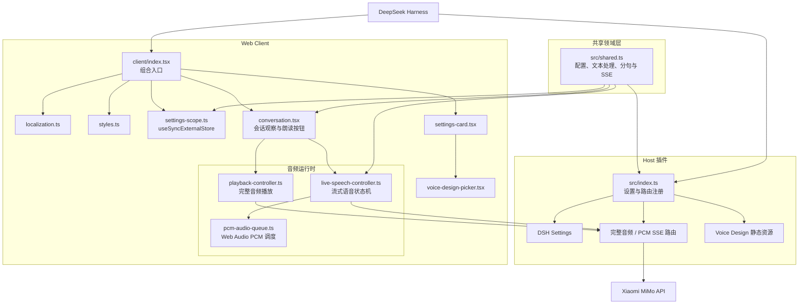

# dsh-xiaomi-tts

[](https://www.npmjs.com/package/dsh-xiaomi-tts)
[](https://github.com/ppy-web/dsh-plugin-xiaomi-mimo-tts)

为 DeepSeek Harness Web 的助手回复添加 Xiaomi MiMo TTS 语音朗读。

> 基于 Xiaomi MiMo TTS 大模型，将助手回复转为流畅、清晰的自然语音。MiMo TTS 当前为限时免费服务，具体政策以 Xiaomi MiMo 平台为准。

<p><a href="README.en.md"><strong>English README →</strong></a></p>

## 预览
| 预置音色 | 自定义音色 |
|:---:|:---:|
|  |  |
| 设置界面 | UI示例 |
|  |  |

## 功能

- 在对话操作栏中显示“朗读”按钮（默认开启）。
- 使用 `mimo-v2.5-tts` 输出流畅、清晰的音频；可选择 PCM 流式播放或 MP3/WAV 完整音频。
- 使用 `mimo-v2.5-tts-voicedesign` 通过文字描述创造你想要的声音。
- 两种 MiMo 模型都支持浏览器语音双向兜底，使用浏览器提供的离线或在线音色，并支持“MiMo 优先 / 本地优先 / 关闭本地语音”三种策略。
- 支持切换预置音色/自定义音色模型，配置 API Key、自动播报、音色、音频格式和音色描述。
- 丰富的自定义音色模板，自由切换和修改。
- 自动清洗需要朗读的文本：移除网址、文件路径、代码块、表情符号、图标和控制字符等。

## 环境要求

- `@deepseek-ai/dsh` `0.1.0-rc.7` 或兼容版本
- Node.js 22+
- Xiaomi MiMo API Key

官方 TTS API 文档：<https://mimo.mi.com/models/zh-CN/mimo-v2.5-tts>

## 安装与使用

从 npm 安装 **（推荐）**：

```bash
dsh plugin --profile web add dsh-xiaomi-tts
```

从本地目录安装：

```bash
dsh plugin --profile web add ./dsh-plugin-xiaomi-mimo-tts
```

从 GitHub 安装：

```bash
dsh plugin --profile web add github:ppy-web/dsh-plugin-xiaomi-mimo-tts
```

安装后重启 `dsh web`，打开 **设置 → 插件 → 插件配置 → 语音朗读(Xiaomi MiMo)**，[获取并填写 API Key](https://platform.xiaomimimo.com/console/api-keys) 。插件会根据 API Key 前缀自动选择服务端点：`sk-` 使用标准端点，`tp-` 使用 Token Plan 兼容端点，无需额外配置。

点击 **保存** 即可愉快滴使用啦

> 更新或从本地开发版切换到 npm 版时，必须先停止 DSH Web，避免 Windows Junction 被运行中的 Node 进程占用：

```powershell
.\start\dsh-plugin-reinstall.bat 3.0.0
```

这个脚本会按顺序停止 DSH Web、卸载当前 profile 中的插件、从 npm 安装指定版本并重新启动 DSH Web。若手动操作，请保持相同顺序：

```powershell
.\start\dsh-web-stop.bat
dsh plugin --profile web remove dsh-xiaomi-tts
dsh plugin --profile web add dsh-xiaomi-tts@3.0.0
.\start\dsh-web-start.bat
```

## 配置

**内置音色（`mimo-v2.5-tts`）**：

- 中文女声：`冰糖`、`茉莉`
- 中文男声：`苏打`、`白桦`
- 英文女声：`Mia`、`Chloe`
- 英文男声：`Milo`、`Dean`

预置模型默认选择 `PCM（流式播放）`：完整回复会在音频分片到达时立即开始播放，等待更短，但暂不支持暂停和续播；首个分片前失败时会回退 MP3。选择 `MP3（完整音频）` 或 `WAV（完整音频）` 时，会等待完整文件生成后播放，并支持暂停和继续；MP3 体积更小，WAV 保留无损音频但体积更大。

**自定义音色（`mimo-v2.5-tts-voicedesign`）**

为你提供了常用音色描述模板；下拉框默认选择“自定义”，用户可以直接修改并保存描述。切换到其他模板后再切回“自定义”时，会恢复之前保存的自定义内容。

```text
青年女性，声线清亮、亲切自然，吐字清楚，语速适中，情绪温柔克制。
```

建议包含年龄段与性别、声音质感、语速节奏和情绪底色，不写场景或动作。预置音色模式仍使用原来的内置音色配置。

**浏览器本地兜底语音**

预置音色与 Voice Design 都支持双向兜底：“MiMo 优先”在当前 MiMo 模型失败时使用浏览器语音；“本地优先”先使用所选浏览器语音，失败时尝试当前 MiMo 模型；“关闭本地语音”仅使用 MiMo。选择器使用浏览器 Web Speech API 提供的全部音色，并按照 `localService` 标记显示“离线”或“在线”。实际可选的在线音色由浏览器、操作系统和网络服务共同决定。

音色列表依次显示离线音色、在线中文音色（`zh-*`）、在线英文音色（`en-*`）和其他在线音色。每个浏览器语音片段默认等待 2 分钟；超时会停止当前语音，并在策略允许时回退到 MiMo。


## 朗读文本处理

朗读只使用清理后的正文，不会修改聊天记录中显示的助手回复。Markdown 链接会保留可读标题并删除链接地址；网址、文件路径、完整代码块、表情符号、图标、零宽字符和控制字符不会发送给 Xiaomi MiMo。括号、方括号、书名号、引号等非断句符号会删除；保留的断句标点会转换为 ASCII 英文标点。仅当预置模型选择 PCM 时，回复生成期间的流式朗读才会累计至少 20 个可朗读字符再发起请求；对已经完成的回复，插件会把完整文本作为一次 PCM/SSE 请求发送并立即播放返回的音频分片。选择 MP3 或 WAV 时始终请求完整音频。

完整音频响应默认限制为 MP3 32 MiB、WAV 128 MiB，可在 Cordis 配置中通过 `maxMp3AudioBytes` 和 `maxWavAudioBytes` 调整。Host 会在解析 JSON 和 Base64 解码前执行大小检查。

## 隐私

- API Key 仅保存在 DSH Host，不会发送给浏览器。
- 生成语音时，回复正文会发送给 Xiaomi MiMo 服务。
- 音频只在浏览器内存中通过 Web Audio 或临时 Blob URL 播放，不会持久化到磁盘。

## 反馈与支持

欢迎通过 [GitHub Issues](https://github.com/ppy-web/dsh-plugin-xiaomi-mimo-tts/issues) 提交问题反馈、功能建议或使用体验。

## 架构

- `src/index.ts`：Host 入口，注册 Schemastery 设置、两类音色静态资源，以及完整音频和 PCM/SSE 流式合成路由。
- `src/shared.ts`：Host 与 Client 共用的领域契约，包括配置类型、默认值、文本清洗、分句、流式批处理和 SSE 解析。
- `src/client/index.tsx`：Web Client 组合入口，只负责绑定 DSH 服务、注册 Slot、注入样式和托管控制器生命周期。
- `src/client/conversation.tsx`：React 会话适配层，订阅 DSH 会话快照并渲染朗读操作。
- `src/client/settings-card.tsx`、`built-in-voice-picker.tsx` 与 `voice-design-picker.tsx`：插件设置表单、官方内置音色面板和 Voice Design 音色选择 UI。
- `src/client/live-speech-controller.ts`、`pcm-audio-queue.ts` 与 `playback-controller.ts`：分别管理实时朗读状态机、Web Audio PCM 调度和完整音频播放。
- `src/client/settings-scope.ts`：使用 `useSyncExternalStore` 将 DSH Settings Scope 安全接入 React。



## 开发

```bash
pnpm install
pnpm typecheck
pnpm test
pnpm pack:check
```

`lib/` 是构建产物，不纳入日常代码提交。提交功能时只更新源码和测试；升级版本并执行 `pnpm pack` 或 `pnpm publish` 时，`prepack` 会自动重新生成发布包。直接从 GitHub 安装时，`prepare` 会在安装阶段构建该产物。

## 许可证

MIT
