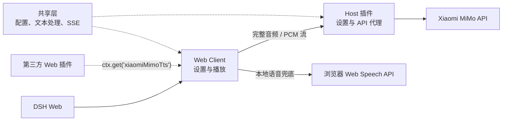

# dsh-xiaomi-tts

[](https://www.npmjs.com/package/dsh-xiaomi-tts)
[](https://github.com/ppy-web/dsh-plugin-xiaomi-mimo-tts)

为 DeepSeek Harness Web 的助手回复添加 Xiaomi MiMo TTS 语音朗读。

> 基于 Xiaomi MiMo TTS 大模型，将助手回复转为流畅、清晰的自然语音。MiMo TTS 当前为限时免费服务，具体政策以 Xiaomi MiMo 平台为准。

<p><a href="README.en.md"><strong>English README →</strong></a></p>

## 目录

- [预览](#预览)
- [功能](#功能)
- [环境要求](#环境要求)
- [安装与使用](#安装与使用)
- [配置](#配置)
- [朗读文本处理](#朗读文本处理)
- [三方插件联动](#三方插件联动)
- [隐私](#隐私)
- [反馈与支持](#反馈与支持)
- [架构](#架构)
- [开发](#开发)
- [推荐插件](#推荐插件)
- [许可证](#许可证)

## 预览
| 预置音色 | 自定义音色 |
|:---:|:---:|
|  |  |
| 设置界面 | UI示例 |
|  |  |

## 功能

- 在对话操作栏中显示“朗读”按钮（默认开启）。
- 使用 `mimo-v2.5-tts` 输出流畅、清晰的音频；可选择 PCM 流式播放或 MP3/WAV 完整音频。
- 使用 `mimo-v2.5-tts-voicedesign` 通过文字描述创造你想要的声音。
- 两种 MiMo 模型都支持浏览器语音双向兜底，使用浏览器提供的离线或在线音色，并支持“MiMo 优先 / 本地优先 / 关闭本地语音”三种策略。
- 支持切换预置音色/自定义音色模型，配置 API Key、自动播报、音色、音频格式和音色描述。
- 丰富的自定义音色模板，自由切换和修改。
- 自动清洗需要朗读的文本：移除网址、文件路径、代码块、表情符号、图标和控制字符等。

## 环境要求

- `@deepseek-ai/dsh` `0.1.2-rc.1`（与插件 `V3.0.1-alpha` 配套）
- Node.js 22+
- Xiaomi MiMo API Key

已验证的可靠组合：`V3.0.0` + `0.1.1-rc.2`；`V3.0.1-alpha` + `0.1.2-rc.1`。`V3.0.0` 在 `0.1.2-rc.1` 下无法显示播放按钮或播放，`V3.0.1-alpha` 在 `0.1.1-rc.2` 下无法显示设置菜单，因此不要交叉组合。

官方 TTS API 文档：<https://mimo.mi.com/models/zh-CN/mimo-v2.5-tts>

## 安装与使用

从 [DSH 插件市场](https://github.com/dsh-market/dsh-market) 安装 **（推荐）**：

1. 尚未安装插件市场时，先执行以下命令并重启 `dsh web`：

   ```bash
   dsh plugin --profile web add dshmarket
   ```

2. 打开 **设置 → 插件市场**，搜索 `dsh-xiaomi-tts` 并点击安装。

从 npm 安装 **（推荐）**：

```bash
dsh plugin --profile web add dsh-xiaomi-tts
```

从本地目录安装：

```bash
dsh plugin --profile web add ./dsh-plugin-xiaomi-mimo-tts
```

从 GitHub 安装：

```bash
dsh plugin --profile web add github:ppy-web/dsh-plugin-xiaomi-mimo-tts
```

安装后重启 `dsh web`，打开 **设置 → 插件 → 插件配置 → 语音朗读(Xiaomi MiMo)**，[获取并填写 API Key](https://platform.xiaomimimo.com/console/api-keys) 。插件会根据 API Key 前缀自动选择服务端点：`sk-` 使用标准端点，`tp-` 使用 Token Plan 兼容端点，无需额外配置。

点击 **保存** 即可愉快滴使用啦

> 更新或从本地开发版切换到 npm 版时，必须先停止 DSH Web，避免 Windows Junction 被运行中的 Node 进程占用：

```powershell
pnpm pack
.\start\dsh-plugin-reinstall.bat .\dsh-xiaomi-tts-3.0.1-alpha.tgz
```

`3.0.1-alpha` 尚未发布到 npm，验证该版本必须使用本地 tarball。脚本第一参数也接受完整 npm spec；纯版本号（例如 `3.0.0`）会继续解析为 `dsh-xiaomi-tts@3.0.0`。脚本会严格执行停止、清理旧包/残留链接、安装、`dump-config`、启动及 HTTP/profile 校验。若手动操作，请保持相同顺序：

```powershell
.\start\dsh-web-stop.bat
dsh plugin --profile web remove dsh-xiaomi-tts
dsh plugin --profile web add .\dsh-xiaomi-tts-3.0.1-alpha.tgz
.\start\dsh-web-start.bat
pnpm profile:check
```

这些辅助脚本默认使用 `web` profile、`127.0.0.1:3080`；可用 `DSH_HOME`、`DSH_WEB_HOST` 和 `DSH_WEB_PORT` 覆盖。开发 Junction 模式下，设置 `DSH_PROFILE_EXPECT_CHECKOUT` 后运行 `pnpm profile:check`，还会核对磁盘和服务端客户端 bundle 的 SHA256。

## 配置

**内置音色（`mimo-v2.5-tts`）**：

- 中文女声：`冰糖`、`茉莉`
- 中文男声：`苏打`、`白桦`
- 英文女声：`Mia`、`Chloe`
- 英文男声：`Milo`、`Dean`

预置模型默认选择 `PCM（流式播放）`：完整回复会在音频分片到达时立即开始播放，等待更短，但暂不支持暂停和续播；首个分片前失败时会回退 MP3。选择 `MP3（完整音频）` 或 `WAV（完整音频）` 时，会等待完整文件生成后播放，并支持暂停和继续；MP3 体积更小，WAV 保留无损音频但体积更大。

**自定义音色（`mimo-v2.5-tts-voicedesign`）**

为你提供了常用音色描述模板；下拉框默认选择“自定义”，用户可以直接修改并保存描述。切换到其他模板后再切回“自定义”时，会恢复之前保存的自定义内容。

```text
青年女性，声线清亮、亲切自然，吐字清楚，语速适中，情绪温柔克制。
```

建议包含年龄段与性别、声音质感、语速节奏和情绪底色，不写场景或动作。预置音色模式仍使用原来的内置音色配置。

**浏览器本地兜底语音**

预置音色和 Voice Design 均支持三种策略：“MiMo 优先”在 MiMo 失败时改用浏览器语音；“本地优先”先用浏览器语音，失败时再尝试 MiMo；“关闭本地语音”仅使用 MiMo。可选音色来自浏览器 Web Speech API，是否离线及实际可用范围取决于浏览器、操作系统和网络服务。


## 朗读文本处理

插件只朗读清理后的正文，不会修改聊天记录。处理时会保留 Markdown 链接标题，移除链接地址、文件路径、代码块、表情及不可见字符，并统一朗读标点。

PCM 模式会在回复生成时分段流式朗读，已完成的回复则一次请求并边接收边播放；MP3 和 WAV 会等待完整音频。默认响应上限为 MP3 32 MiB、WAV 128 MiB，可通过 `maxMp3AudioBytes` 和 `maxWavAudioBytes` 调整。

## 三方插件联动

Web 客户端插件可以按需调用本插件的 PCM 流式播放能力。推荐直接在需要播放的位置写一行：

```ts
ctx.get('xiaomiMimoTts')?.play('欢迎回来')
```

请通过 `ctx.get()` 动态获取这项可选能力，不要声明为必需的 `inject` 服务。插件未安装或未就绪时调用会安全跳过；`play()` 使用用户已保存的 MiMo 设置播放 PCM 流，`stop()` 可主动停止。新播放会自动打断当前朗读。

需要 TypeScript 类型提示时可仅导入类型：

```ts
import type { XiaomiMimoTtsService } from 'dsh-xiaomi-tts/client-api'

const tts = ctx.get('xiaomiMimoTts') as XiaomiMimoTtsService | undefined
tts?.play('欢迎回来')
```

## 隐私

- API Key 仅保存在 DSH Host，不会发送给浏览器。
- 生成语音时，回复正文会发送给 Xiaomi MiMo 服务。
- 音频只在浏览器内存中通过 Web Audio 或临时 Blob URL 播放，不会持久化到磁盘。

## 反馈与支持

欢迎通过 [GitHub Issues](https://github.com/ppy-web/dsh-plugin-xiaomi-mimo-tts/issues) 提交问题反馈、功能建议或使用体验。

## 架构

- **共享层**：统一配置、文本清理、分段和 SSE 契约。
- **Host 插件**：管理设置与静态资源，并代理 MiMo 完整音频和 PCM 流式请求。
- **Web Client**：提供设置与朗读入口，负责播放状态、浏览器语音兜底和第三方播放服务。



## 开发

```bash
pnpm install
pnpm typecheck
pnpm test
pnpm pack:check
```

发布前使用互相隔离的 `DSH_HOME`，按可靠组合验证：`V3.0.0` + `0.1.1-rc.2`，以及 `V3.0.1-alpha` + `0.1.2-rc.1`。CI 使用同一个打包产物依次对两个 DSH 版本执行自动安装、Host、状态路由、settings namespace 和客户端 bundle smoke；浏览器菜单与音频播放仍需发布前人工验证。

日常发布构建使用 `pnpm build`，不会输出 MiMoTTS 的 Host 或浏览器控制台追踪。排查 PCM 流式链路时使用 `pnpm build:debug`，该构建会同时启用 `[MiMoTTS Host]`、`[MiMoTTS Stream]`、`[MiMoTTS Audio]` 和 `[MiMoTTS Service]` 日志。

`lib/` 是构建产物，不纳入日常代码提交。提交功能时只更新源码和测试；升级版本并执行 `pnpm pack` 或 `pnpm publish` 时，`prepack` 会自动重新生成发布包。直接从 GitHub 安装时，`prepare` 会在安装阶段构建该产物。

## 推荐插件

推荐配合本插件一起食用：

- [dsh-whale-musume](https://github.com/Sutera-Diffusus/dsh-whale-musume#readme)：元气鲸鱼娘桌宠。
- [dsh-plugin-uisfx](https://github.com/XanthanL/dsh-plugin-uisfx#readme)：语义化 UI 音效。
- [dsh-codex-timeline](https://github.com/Wine-Red/dsh-codex-timeline#readme)：Codex 风格时间线与会话搜索。
- [dsh-dream-skin](https://github.com/RevolutionLA/dsh-dream-skin#readme)：原生换肤、背景壁纸、强调色、主题包 。


## 许可证

MIT
