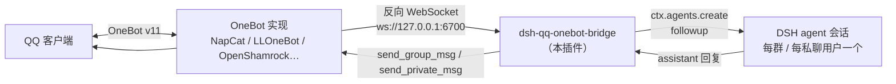

# dsh-qq-onebot-bridge

QQ ↔ DeepSeek Harness 双向桥插件（独立 bundle）。QQ 消息直接驱动 DSH agent 会话，agent 回复自动发回 QQ。

## 功能总览

- **双向消息桥**：QQ（群聊/私聊）消息进入 DSH agent 会话；回复自动分段发回 QQ（OneBot v11 反向 WebSocket）
- **会话分组**：每个群一个独立会话（`sessionMode: chat`）或每群每人一个会话（`user`）；每个私聊用户一个独立会话，互不串上下文；agent 系统提示注入当前会话归属（chatScope）
- **持久化记忆**：每个群/私聊的最近对话自动落盘到 `cwd/qq-memory/`，宿主重启后自动注入新会话——小鲸鱼不会失忆（`memoryEnabled` 开关；`/new` 清除当前会话的记忆）
- **定时提醒**：`30分钟后提醒我喝水`、`明天9点提醒我开会`——到点自动发消息提醒（群聊需 @机器人，@ 时可省略"提醒"字样如「明天9点开会」；私聊需带提醒关键词；提醒跨宿主重启保留，`/reminders` 查看待执行列表）
- **群管理套件**：`/summary` 总结最近聊天；群投票（`投票：问题？A 选项 B 选项`，回复字母投票，自动开奖）；共享待办（`/todo` + 「记一下：xxx」）；管理员命令 `/mute` `/unmute` `/kick`（**踢人需二次确认**）`/clear`（仅 `adminUsers` 白名单可用）
- **语音回复（TTS）**：文字回复后自动跟一条语音（默认 Azure 晓晓，`ttsProvider` 可切换任意 OpenAI 兼容服务；`ttsEnabled` 默认关闭）
- **实用小工具**：`/health` 运行诊断、私聊文件自动转存到本机、`/export` 聊天记录导出 markdown
- **语音转文字（STT）**：群聊中 @机器人并引用（回复）一条语音 → 转写文字并回复；私聊语音直接转写。支持智谱 GLM-ASR-2512 或任意 OpenAI 兼容 `/audio/transcriptions` 端点（如 SiliconFlow）
- **私聊识图**：私聊中用户发送的图片/动画表情自动下载到 `cwd/qq-images/` 并注入会话，agent 用 `describe_image` 主动查看并回应（`privateImageView` 开关）
- **引用解析**：@机器人并引用文本/图片/语音时自动展开（图片落盘到 `cwd/qq-replies/` 供 `describe_image` 查看，语音自动转写）
- **表情系统**：黄脸表情表 + 回复里 `[face:名字]` 标记替换 + 图片表情收藏（`autoCollectStickers`）+ 会话内 `qq_face_list` / `qq_face_send` 工具（`faceEnabled` 总开关）
- **会话命令**：`/new` 重置当前会话、`/status` 查看会话状态
- **安全控制**：`allowUsers` / `allowGroups` 白名单、`accessToken` 鉴权、`replyOnlyWhenMentioned` 群聊仅@回复
- **人设解耦**：插件**不包含任何人设/记忆内容**——人设与群规则经 dsh-mnemon 的 `USER.md`/`MEMORY.md` 注入会话（见文末说明）

## 架构



## 安装 / 卸载

```sh
# 安装（本地目录）
dsh plugin --profile web add <本目录>

# 卸载（随时可移除，独立 bundle 不影响其它插件）
dsh plugin --profile web remove dsh-qq-onebot-bridge
```

装/卸后重启 `dsh web` 生效。

## 配置

profile 的 `cordis.patch.yml` 覆盖 `id: dsh-qq-onebot-bridge` 的 config（完整示例见 `examples/cordis.patch.example.yml`）：

| 键 | 默认 | 说明 |
|---|---|---|
| `host` | `127.0.0.1` | 反向 WS 监听地址 |
| `port` | `6700` | 反向 WS 监听端口 |
| `accessToken` | `''` | OneBot 端须携带的 Bearer token（空=不校验） |
| `allowUsers` | `[]` | 私聊用户白名单（**空=拒绝所有私聊**，务必填入自己的 QQ 号） |
| `allowGroups` | `[]` | 群白名单（**空=拒绝所有群消息**，列出机器人服务的群号） |
| `botQq` | `0` | 机器人 QQ 号（用于群内 @ 检测；0=任何群消息视为@） |
| `replyOnlyWhenMentioned` | `true` | 群聊仅 @机器人 才回复 |
| `acceptPrivate` | `true` | 是否回复私聊（私聊仍需 allowUsers 放行） |
| `autoCollectStickers` | `false` | 自动收藏消息里的图片表情到本地图库 |
| `faceEnabled` | `true` | 表情功能总开关（[face:] 标记 + qq_face_* 工具） |
| `sessionMode` | `chat` | 群会话分组：`chat`=每群一会话；`user`=每群每人一会话 |
| `cwd` | `''` | 会话工作目录（同时决定 `qq-faces/`、`qq-replies/`、`qq-bridge-debug.log` 的位置） |
| `provider` | `''` | LLM provider 覆盖（空=agent 默认） |
| `model` | `''` | LLM 模型覆盖（空=agent 默认） |
| `maxMessageLength` | `1700` | 单条出站消息最大字符数（超出自动分段） |
| `sttEnabled` | `false` | 语音转文字总开关 |
| `sttBaseUrl` | `https://open.bigmodel.cn/api/paas/v4` | STT 端点（OpenAI 兼容 `/audio/transcriptions`） |
| `sttModel` | `glm-asr-2512` | STT 模型（智谱 `glm-asr-2512` / SiliconFlow `FunAudioLLM/SenseVoiceSmall`） |
| `sttApiKey` | `''` | STT API Key（可复用智谱 GLM 系列的 key） |
| `privateImageView` | `true` | 私聊中主动下载查看对方发送的图片/动画表情（存 `cwd/qq-images/`，agent 用 describe_image 查看） |
| `visionMode` | `tool` | 识图方式：`tool`=存盘后由 `visionToolName` 工具查看（稳定）；`native`=原生多模态附件直传模型（DSH 0.1.1+，文本模型自动降级） |
| `visionToolName` | `describe_image` | `tool` 模式下使用的识图工具名 |
| `imageRetentionDays` | `14` | 下载图片（qq-images/qq-replies）保留天数，宿主启动时清理更旧的 |
| `memoryEnabled` | `true` | 每会话持久化记忆（最近对话存 `cwd/qq-memory/`，宿主重启后自动恢复；`/new` 清除） |
| `memoryMaxEntries` | `30` | 每个会话保留的对话条数上限 |
| `rateLimitEnabled` | `false` | 回复限流开关（默认关闭）；开启后每会话窗口内最多回复 `rateLimitMaxReplies` 条 |
| `rateLimitMaxReplies` | `10` | 限流窗口内每会话最大回复数 |
| `rateLimitWindowSeconds` | `60` | 限流滑动窗口（秒） |
| `dedupEnabled` | `true` | 消息去重（同一 message_id 窗口内重复投递忽略，防重连重发） |
| `dedupWindowSeconds` | `300` | 去重窗口（秒） |
| `reminderEnabled` | `true` | 定时提醒总开关（群聊需 @，私聊直接说；存 `cwd/qq-reminders.json` 跨重启保留） |
| `reminderMaxPerChat` | `10` | 每个会话最多同时保留的提醒数 |

## 用户侧（OneBot 实现）配置

以 NapCat 为例：OneBot11 配置里把 WebSocket 客户端地址填成：

```
ws://127.0.0.1:6700/
```

其它实现同理（LLOneBot 填反向 WebSocket、OpenShamrock 填被动 WebSocket、go-cqhttp 填 `ws-reverse`）。若本插件配了 `accessToken`，OneBot 端填同一 token。

## 语音转文字（STT）

**触发规则**（最终版）：

| 场景 | 行为 |
|---|---|
| 群聊：@机器人 + 引用（回复）一条语音 | ✅ 转写被引用语音并以文字回复 |
| 群聊：单独发语音（不@/不引用） | ❌ 不触发 |
| 私聊：直接发语音 | ✅ 转写并回复（不受 acceptPrivate 限制） |
| 私聊：文字 + 引用语音 | ✅ 转写被引用语音 |

实现链路：消息里的引用 → `get_msg` 找到被引用消息 → 其中含 `record` 段 → OneBot `get_record`（`out_format` mp3/wav，响应含 `base64`）→ POST `{sttBaseUrl}/audio/transcriptions`（multipart 字段 **`file`** 二进制）→ 转写文本注入会话。

注意事项：
- 智谱 GLM-ASR-2512 限 wav/mp3、**≤ 30 秒**、≤ 25MB；更长的语音请换 SiliconFlow 等端点
- 智谱接口的 multipart 字段必须是 `file`（二进制）——文档里写的 `file_base64` 实测会报 1214 错误

## 会话分组

- 群聊：`sessionMode: chat`（默认）下每个群一个独立会话，全群共享上下文；`user` 下每群每人一个会话
- 私聊：每个私聊用户一个独立会话，与群聊完全隔离
- 会话创建时 agent 系统提示注入 chatScope（"你正在 QQ 群 xxx 里聊天"/"你在和用户 xxx 私聊"），并要求不串上下文
- `/new` 仅重置**当前**会话；会话存内存，宿主重启后重建（不持久化）

## 表情系统

- 回复文本里写 `[face:鼓掌]` 等标记会替换为对应 CQ 表情段（黄脸表见 `lib/faces.js`，约 70 个）
- `faceEnabled=true` 时每个会话注册 `qq_face_list` / `qq_face_send` 工具
- 手动把图片放进 `cwd/qq-faces/` 自动登记为可发送表情（文件名=表情名），删除文件自动剔除
- `autoCollectStickers=true` 时自动收藏群消息里的图片表情

## 命令与调试

- `/new`：结束当前会话并开新会话
- `/status`：查看当前会话状态与 sessionId 前缀
- 调试日志：`{cwd}/qq-bridge-debug.log`（消息路由、语音转写、agent 事件，按时间戳追加）
- 宿主错误日志：启动 dsh web 时把 stderr 重定向到文件（如 `D:\Deepseek\qq-host-err.log`）可查启动崩溃
- 关键日志标记：`voice fetched via get_record`、`quoted voice transcribed`、`followup sent (voice)`、`group msg without @bot ignored`

## 测试

`test/` 下为 WS 协议模拟脚本（模拟 OneBot 端连入并断言收发）：

- `protocol-smoke.mjs` 协议冒烟；`sim-group.mjs` / `sim-private.mjs` 群聊/私聊；`sim-user.mjs` 每用户会话
- `sim-quote.mjs` 引用解析；`sim-face.mjs` / `sim-sticker*.mjs` 表情链路；`live-status.mjs` 在线状态

运行（宿主运行时）：`node test/sim-group.mjs`。语音转文字链路建议直接用 QQ 实测（模拟脚本需真实 STT 调用）。

## 记忆与人设说明（重要）

本插件**不内置任何人设、偏好或群规则**。小鲸鱼人设、问答偏好、群内行为规则等记忆内容由 **dsh-mnemon 插件**的运行时记忆（`~/.mnemon/runtime/USER.md` + `MEMORY.md`）注入每个 QQ 会话——插件只负责"功能"，记忆只负责"灵魂"，两者完全解耦。换人设只改 Mnemon 记忆，换功能只动本插件。

## ⚠️ 风险与合规说明（使用前必读）

### 账号风控风险
- 本插件通过**第三方协议实现**（NapCat 等）接入 QQ，**不是腾讯官方接口**，与《QQ 软件许可及服务协议》相悖，QQ 官方明确禁止非官方客户端/协议
- 使用第三方协议存在**账号被限制登录、冻结、甚至永久封禁**的风险，且可能波及其他正常使用的 QQ 账号（同设备/同 IP）
- 建议使用**机器人小号**运行，绝不要用大号/常用号
- 常见风控诱因：高频发言、短时间大量消息、发送营销/广告/违规内容、被多人举报、异常登录设备
- 缓解建议：降低回复频率、仅在小群/自用场景运行、不 24 小时刷屏、严格内容合规

### 内容风控
- agent 生成的一切内容都会以机器人账号身份发出，**使用者对该账号发布的内容负全部责任**
- 建议在人设/系统提示中约束输出合规内容；违规内容既触发账号处罚，也可能带来法律责任

### 安全风险
- `allowUsers` / `allowGroups` 未配置（为空）时，插件**默认拒绝所有私聊与群消息**——请显式填入自己的 QQ 号与群号后再使用；配置白名单后，白名单外的任何人都无法驱动你的 agent
- 插件只监听 `127.0.0.1`，不要改成 `0.0.0.0` 暴露公网
- 语音与图片会上传到第三方云服务（STT API）处理，**敏感语音请勿发送**

### 合规提示
- 仅用于个人学习、内部小范围交流；不得用于批量营销、广告、骚扰、群控等用途
- 遵守所在地区法律法规与腾讯平台规则
- 使用第三方协议**风险自负**，本插件不提供任何免封号承诺

### 免责声明
本插件仅供技术学习与个人研究使用。使用者应自行评估并承担使用第三方 QQ 协议的全部风险与后果。

## 安全注意

- `allowUsers` / `allowGroups` 为空时默认拒绝一切消息——使用前务必填入自己的 QQ 号与群号
- 端口仅监听 127.0.0.1；不要对外暴露
- OneBot 实现本身有 QQ 封号风险，使用第三方机器人协议需自行评估

## 更新日志

最近五个版本（始终滚动展示）：

- **v0.3.0** — 语音回复 TTS（默认 Azure 晓晓，可换任意 OpenAI 兼容服务）+ `/health` 诊断、私聊文件转存、`/export` 聊天导出
- **v0.2.9** — 群管理套件：`/summary` 聊天总结、群投票、共享待办（`/todo`）、管理员命令 `/mute` `/unmute` `/kick`（踢人二次确认）`/clear`
- **v0.2.8** — 回复限流（默认关闭，可自行开启）+ 消息去重
- **v0.2.7** — 调试日志轮转、图片保留期清理、提醒解析单元测试
- **v0.2.6** — 可配置识图方式（`visionMode: tool/native` 原生多模态附件）

完整历史见 [CHANGELOG.md](CHANGELOG.md)。
