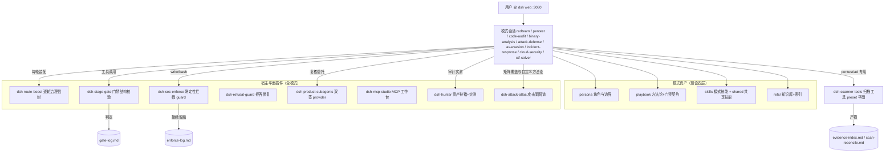

# dsh-redteam-model

基于 [dsh](https://www.npmjs.com/package/@deepseek-ai/dsh) web 实现的九个 redteam 安全研究工作模式（预设）及其运行时插件，自包含、可离线部署。目标是服务于 redteam 进行授权安全研究，覆盖渗透测试、红队评估、代码审计、二进制分析、免杀对抗、应急溯源、云安全攻防与 CTF 解题领域。

> **请勿用于非法行为。** 本项目仅面向已获得书面授权的安全测试、CTF 竞赛、漏洞赏金与安全研究场景（见文末免责声明）。

**该项目是为 [https://github.com/deepseek-ai/deepseek-harness](https://github.com/deepseek-ai/deepseek-harness) 赋能的项目，先装好 deepseek-harness 以后，再装该项目；最快捷的安装方式：下载仓库源码包，并让 DeepSeek 自行给 deepseek-harness 装好即可；在 dsh web 的新会话中选择相应的模式即可开始任务。**

如果各位对插件的方法存在不适用自身的情况，那么可以进行两种更改：

1、源码层，调整各个模式的方法论。
2、在"AttackAtlas"插件中，右上角具备两个功能"自定义工作方法论"&"能力库"，如果内置能力中，没有你需要的能力，可以在"能力库"中添加主类、子类，完成以后再到"自定义工作方法论"中构建属于你的工作方法论（类似于workflow），有问题欢迎提或者自己再改。

UI这块儿不太会，AI处理的，见谅。

## 九个工作模式

| 模式 | 定位 | 核心纪律 |
|---|---|---|
| `redteam` 安全研究员 | 安全领域总入口：任务路由分流（浅做/专业路由/多任务协同）、台账、全局回归总结与下一步建议；深度任务指引切换专业模式 | 任务台账 + 路由表 + light 三纪律 |
| `pentest` 渗透测试 | Web/API/app/小程序黑盒渗透：侦察、枚举、漏洞验证与报告 | 发现+验证=真实有效；对照三件套（基线/差分/marker）；覆盖度矩阵收口 |
| `code-audit` 代码审计 | 白盒源码审计，可 RCE 主线（上传/未授权/组合/反序列化/溢出等七类） | 双链一致（审计工人链 vs 追踪员链）；扫描命中对账；Fortify 分类定级 |
| `binary-analysis` 二进制分析 | 病毒分析、逆向破解、脱壳还原 | 样本登记门（B0）前置；还原不完整=结论标疑似；假设台账终态 |
| `attack-defense` 攻防评估 | 权限与数据主线的全链路对抗：侦察→突破→横向→持久化→报告 | 每阶段 gate-pass 才进下一阶段；持久化登记制；先留证后清理 |
| `av-evasion` 免杀对抗 | 攻击视角的免杀研究：载荷开发与本地实验循环，技术与检测侧成对呈现（OPSEC 情报） | 本地默认验证+授权目标按任务；免杀技术与检测情报成对交付；V 门四声明 |
| `incident-response` 应急溯源 | Windows/Linux 应急响应与攻击溯源：证据保全→失陷排查→攻击链时间线还原→定性→处置建议→报告 | 证据与时间线主线（无证据标疑似）；先留证后处置；删除类操作只出清单 |
| `cloud-security` 云安全攻防 | 云平台（AWS/Azure/GCP/阿里云/腾讯云/华为云）与云原生（K8s/容器/Serverless/CI-CD）渗透：暴露面测绘、AK/SK 凭证利用、IAM 提权、元数据 SSRF、容器逃逸、云检测缺口 | 云攻击路径主线（入口→身份→权限→资源→影响）；只读探测优先；环境改动逐项登记还原 |
| `ctf-solver` CTF 解题 | CTF 竞赛解题：题面登记、模块路由（web/pwn/reverse/crypto/misc 等）、解题循环、flag 台账与复盘 | flag 平台回显验证；解题台账终态；未解题如实记录卡点 |

每个模式自包含四层资产：**persona**（角色/认识论/边界/报告纪律）→ **playbook**（方法论与门禁文本契约）→ **skills**（可加载技能）→ **refs/**（外部知识库，原文索引化，零本机路径）。

## 运行时插件（十五个）

| 插件 | 作用 | 挂载平面 |
|---|---|---|
| `dsh-stage-gate` | `stage_gate`/`gates_list` 工具：八模式 32 道阶段门的结构校验（文件/标记/表格/哈希登记），判定写入 `gate-log.md`；`operation_goal`/`operation_progress` 目标契约与进度收口（`operation-state.json` 驱动中断恢复） | 宿主（全模式可见） |
| `dsh-route-boost` | 逐轮治理信封：阶段推断（带粘滞记忆）+ 门禁清单 + 模式边界 + 证据等级预判 + refs 指针 + 技能依赖工具面就绪行（缺件提前显形走三级兜底）+ operation 恢复行（中断续作），任务口径判定（用户显式指定项优先只做指定项并点亮，未指定走全流程矩阵）、结构化标记块注入（压缩后可识别）、整行粒度预算、变化才投递并落注入量记账 | 宿主 |
| `dsh-sec-enforce` | 确定性工具拦截（guard 四连）：报告门（gate-log 无 PASS 或目标准则未全 met 不许写 reports/）、写边界（不出任务工作区）、高危命令先问后做、裸奔扫描限速 | 宿主 |
| `dsh-refusal-guard` | 拒答检测与一次性临近性再注入（强/弱两级检测、工具轮豁免、3 轮冷却） | 宿主 |
| `dsh-product-subagents` | `subagent_claude_code`/`subagent_codex` provider：无头 spawn 本机 claude/codex CLI，跨 harness 复核按建议项由用户触发 | 宿主 |
| `dsh-mcp-studio` | MCP 加载工作台：通用类 MCP（burpsuite/yakit/chrome-dev-mcp 等）的接入、状态与诊断 | 宿主 |
| `dsh-redteam-results` | 会话标签页「redteam 成果」：任务台账作战大屏 + 五板式成果页（发现/资产/台账/时间线/云攻击路径），九模式**跨会话**聚合与时间范围筛选（验证/删除回原始会话执行），SQLite 行级持久 | 宿主（bundles） |
| `dsh-hunter` | 会话标签页「hunter 狩猎」：FOFA / Hunter / Quake 三平台资产搜索（统一 DSL 自动转平台语法、分页与限额导出、API key 独立存储），代码审计成果页「实测」按钮一键验证（指纹搜索→存活探测→EXP 验证，仅授权资产执行） | 宿主（bundles） |
| `dsh-campaign-memory` | 会话标签页「战役记忆」：跨会话打法沉淀（战术/指纹/工具/教训/检测指纹，原文存储不脱敏——凭据同样原样入库，或只写指位），同模式同工作区同题写入即刷新不重复，读全文记账、热度×30 天时间衰减排序（久未读取自然让位、读取即复活），按工作区隔离召回（新工作区干净开局，跨区显式检索带来源标注），检测指纹 30 天自动清理、目标指纹 180 天到期退场仍可检索（带过期标记、同题重写复活）；模型侧 write/search/get/list/remove 工具 + 装配期高频记忆注入 | 宿主（bundles） |
| `dsh-mode-group` | 新建会话屏模式选择器两级化：内置模式与研究员模式留顶层，八个专业安全模式折叠进「专业安全模式」悬停/点击子菜单（视口自适应翻转、触屏加大命中区） | 宿主（bundles） |
| `dsh-session-pulse` | 会话状态面板（九模式）：头部右上角任务进度 chip（任务清单实时汇总 done/total + 进度条，全部完成转绿）+ 子代理 chip；右侧「子智能体目录」抽屉（正在运行/已结束分组，点名进入子代理会话查看运行内容，打开期间目录实时更新）；对话页左侧「提示词」栏（用户输入按序成列，悬停预览、点击平滑定位到消息并高亮，仅对话标签页可见） | 宿主（bundles） |
| `dsh-attack-atlas` | 会话标签页「AttackAtlas 攻击面图谱」：八专业模式架构矩阵（战场分区 × 战术列 × 子项）四态点亮与阶段带、目标锚定、双击派单；自定义工作方法论（五类模块编排、闭环五查询问、分层运行信封）；工具 / MCP / 自定义工具模块（安装批准协议）；能力库（自定义主类 / 子类并入图谱与方法论） | 宿主（bundles） |
| `dsh-scanner-tools` | 本机扫描器封装：nuclei/httpx/ffuf + 声明式注册表十三工具（nmap·masscan·subfinder·gau·whatweb·wafw00f·dirsearch·sqlmap·nikto·hydra·impacket·netexec·crackmapexec）——六节点工具调用阶梯（本机→MCP→已装替代→MCP 备选→询问安装→脚本）、保守默认+显式覆盖留痕、防盲打登记、全文落盘+预览封顶+连续失败熔断 | preset（pentest / attack-defense / cloud-security / ctf-solver） |
| `dsh-semgrep-audit` | `semgrep_scan` 工具：本机 semgrep 封装 + 预设离线规则集自动定位（java 自建 / php / oss 三层），命中双写 `scan-reconcile.md`/`.csv` 对账（命中≠漏洞，复核补链后经成果登记升格），检测制绝不自动装、`--metrics=off` 离线、产物只落任务工作区 | preset（code-audit） |
| `dsh-webshell-mgr` | 会话标签页「webshell 管理」：webshell 生成器（PHP/JSP/ASPX 三语言 × 基础/加密/冰蝎/哥斯拉形态）→ 协议自动识别连接（七通道）→ 命令执行/文件管理（上传下载/权限/时间戳伪造/远程下载/文本编辑）/数据库操作（PDO 原生 MySQL/PostgreSQL/SQLite/MSSQL）/载荷插件体系（声明式扩展），操作台账审计；攻防评估模式立足点作战节方法论接线 | 宿主（bundles） |

## 安装

前置：**Node.js >= 22**（DSH 本身要求）。无需预装 pnpm/dsh（经 npx 拉起）；bash/python 非必需。

### 方式一：设置页管理台（推荐）

把整个合集作为一个 dsh 插件安装（需 dsh web 0.1.0-rc.6+，验证于 0.1.1-rc.2）：

```sh
dsh plugin --profile web add github:SeaOf0/dsh-redteam-model
```

打开 dsh web 设置页 → **Redteam Manager**，即可：

- 一键部署九个安全模式（空目录使用整体链接；已有实体 `.agent-presets` 时写入管理器持有的实体副本）；
- 安装 / 更新 / 卸载十五个运行时插件；
- 查看操作进度与失败原因；最近 50 条记录按 profile 保留，重启时未完成任务会标记为中断失败。

模式复制状态刷新页面即可更新；宿主平面插件安装 / 卸载以及管理器自身更新后需**重启 dsh web** 生效。

插件依赖与 bundle 声明只修改当前 profile；模式位于当前 `DSH_HOME` 的全局 `.agent-presets`，会被该 DSH home 下的 profile 共享。写入 profile 前会备份声明，安装失败时恢复 `package.json` 与 lockfile；卸载子插件只移除运行态声明，不会删除源码。

### 方式二：源码一键部署 CLI

获取源码任选其一：`git clone https://github.com/SeaOf0/dsh-redteam-model.git`，或仓库页 Code → Download ZIP 解压。

```bash
cd dsh-redteam-model/deploy
node deploy.mjs            # 安装：预设链接 + 插件挂载 + 依赖安装（幂等可重跑）
node deploy.mjs --check    # 离线校验：九预设挂载 + 插件真实 loader 路径 + bundle 声明
node deploy.mjs --start    # 后台启动 dsh web → http://127.0.0.1:3080
```

也支持 `npx ./deploy`。Windows（Win10+ 自带 bsdtar）：流程一致，预设链接用 junction 免管理员。

两种安装方式都会把随包的 `AGENTS.md` 落地为 dsh 全局指令文件 `~/.dsh/AGENTS.md`（dsh 原生机制，对所有会话生效，新会话读入）：仅当该文件不存在时安装；已存在则**不覆盖**，安装输出会提示如何自行改用本包版本。

部署后 2 分钟人工验证：

1. 打开 [http://127.0.0.1:3080](http://127.0.0.1:3080)，roster 列出九个模式（redteam 安全研究员 + 八个专业模式）；
2. 任一会话让模型调 `gates_list`，返回专业模式门禁 schema；
3. pentest/attack-defense/cloud-security/ctf-solver 会话可见 `nuclei_scan` 等扫描工具（其余模式不可见 = preset 平面正确）；
4. 发起任务后出现 `[route-boost] mode=... phase=...` 运行时信封快照；
5. 未过报告门就写 `reports/` 会被 sec-enforce 拦截并指路。

机器差异项（可选，缺失自动降级）：`claude`/`codex` CLI（跨 harness 双签通道）、nmap/nuclei/httpx/ffuf/jadx/frida/mingw 等工具链（playbook 工具平面检测制 + 三级兜底：检测到的工具 → MCP → 批准后安装）。

## 基础原理与架构

设计原则：**文本纪律（persona/playbook）+ 运行时强制（插件）双层防线**——模型不能自评门禁（结构校验必须是工具调用）、语义门禁归独立复核员、关键发现双签（DSH 复核 + claude/codex 复核一致才进报告）、一切判定落审计 trail（gate-log/enforce-log/evidence-index）。



阶段流转（以 pentest 为例）：P1 资产基线 → P2 逐 finding 对照三件套+复核 → P3 覆盖度矩阵 → 报告落盘（sec-enforce 校验 gate-log 存在 P3 PASS）。

## 项目结构

```
dsh-redteam-model/
├── modes/                    # 九个模式预设（DSH 发现器经 ~/.dsh/.agent-presets 链接扫描）
│   └── <mode>/
│       ├── preset.yml        # 模式名与定位
│       ├── agent.cordis.yml  # persona + 组合行（工具/技能/MCP/子代理）
│       ├── skills/           # playbook 等模式技能
│       └── refs/             # 知识库（README.md 全量索引，零本机路径）
├── shared/skills/            # 九预设共享技能（生态协作/独立复核/治理/边界）
├── plugins/                  # 十五个运行时插件（各自含 lib/ 测试/README）
└── deploy/                   # 一键部署 CLI（deploy.mjs / verify-deployment.mjs / check-sources.mjs / DEPLOY.md）
```

## 效果展示

| 任务台视图（数据统计展示） | 攻防评估模式（数据统计展示） |
|:---:|:---:|
|  |  |

| 代码审计模式（数据统计展示） | 二进制分析模式（数据统计展示） |
|:---:|:---:|
|  |  |

| hunter 狩猎 | webshell 管理 |
|:---:|:---:|
|  |  |

| AttackAtlas(攻击面图谱) |
|:---:|
|  |

## 发现问题

使用中遇到 bug、误报/漏报、文档与行为不符，请到 [Issues](https://github.com/SeaOf0/dsh-redteam-model/issues) 提交，附：模式名、复现步骤、期望与实际行为、相关日志片段（gate-log/enforce-log/会话输出）。

## 贡献者

感谢参与本项目的贡献者：

- [@yzke](https://github.com/yzke) —— [设置页 Redteam Manager 管理台](https://github.com/SeaOf0/dsh-redteam-model/pull/3)（一键部署/安装/更新/卸载）
- [@SeaOf0](https://github.com/SeaOf0) —— 项目作者与维护者

欢迎通过 Pull Request 参与贡献。

## 致谢

感谢以下项目中的知识点，在这里向作者表达致谢：

- https://github.com/Just-Hack-For-Fun/Linux-INCIDENT-RESPONSE-COOKBOOK
- https://github.com/Just-Hack-For-Fun/Windows-INCIDENT-RESPONSE-COOKBOOK

## 开源协议

[MIT License](LICENSE)

## 免责声明

本项目仅供安全研究、教学与**已获授权**的安全测试（渗透测试授权书、CTF、漏洞赏金计划范围内）使用。使用者必须：

- 在获得目标系统所有者书面授权的前提下使用；
- 遵守所在地区法律法规；
- 对使用本项目造成的任何后果自行承担责任。

作者与贡献者不对任何滥用行为负责，且不承担任何直接或间接损失的责任。**请勿用于非法行为。**
