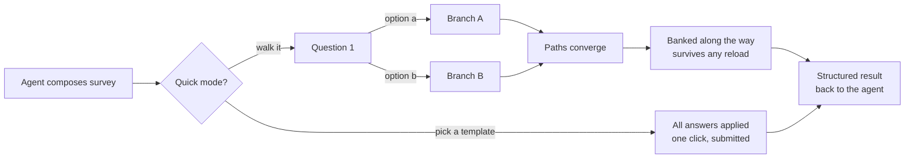

# dsh-rich-questions

**Branching surveys for [DeepSeek Harness](https://github.com/deepseek-ai/deepseek-harness) — authored live by your agent, answered in your chat.**

Your agent doesn't just *send* a questionnaire — it *composes* one from the conversation's context: a directed graph of questions where each answer decides what gets asked next, every option carries its own reasoning, and the whole thing renders in the same composer seat you're already looking at. One tool call. No forms product, no account, no copy-paste.

> 富问题/问卷系统 — 由 agent 现场编写的分支问卷：每个答案决定下一题，每个选项自带洞察与流程图，直接在聊天输入框位置作答。

MIT · zero runtime dependencies · DSH ≥ 0.1.1-rc.1 · Node ≥ 20



## Install

```sh
dsh plugin --profile web add dsh-rich-questions
```

Restart the `dsh web` process, refresh the tab — done. The `ask_survey` tool is now visible to every agent preset. (From a fork: `dsh plugin --profile web add file:/path/to/dsh-rich-questions`.)

## What you get

| | |
|---|---|
| **Branching paths** | Every option declares what follows it (`next`). Choose *C*, get a different range of questions than *A*. Multi-select fans out depth-first; skipped/free-text fall through cleanly; the host re-derives the path independently so claimed paths are always verifiable. |
| **Per-option intelligence** | Insights (~6 lines: what great looks like / the tradeoff / "(today)"), sources and citations, and compact **Mermaid diagrams** — all behind one click-to-expand disclosure (`?` for text, the branch icon for the diagram); no hover ambushes, ever. |
| **Justify** | Selected options gain a pencil affordance: state *why* you chose this option in one line (inline input, checkmark or Enter submits, re-editable any time before submit). The why rides the answer as `justifications` — the agent reads your stated intent when deriving follow-ups. |
| **Quick mode** | Up to six whole-survey decision templates (`a`–`f`) next to Start — "Ship like Vercel/Railway: polish + DX first" vs "Lean internal tool: ship fast". One click applies a complete, coherent answer map and submits. A 20-question alignment exercise becomes a single decision. |
| **Bank & continue** | Per-step commit for long surveys: answers-so-far go to the host *in the background* while you advance immediately. Banked answers **lock** (view-only forever after), survive reloads, and follow you to any browser. A `{n} banked` chip tracks them. |
| **Durable progress** | Drafts autosave per survey — reload, switch tabs, come back tomorrow: same question, same answers, same position. Nothing to press. |
| **Pre-flight steering** | **Reroll** (rewrite it cleaner), **Push** (deep research: 12+ competitors, GitHub open-source repos, `.refs/` curated references — options grounded in specific evidence, not guessing), **Discuss** (drop the form, talk it through) — one click each, before the first question. |
| **Language follows you** | English chat → English survey. 中文 → 中文. Any language → that language, consistently. |
| **Host-authoritative** | The pending survey lives on the host — close the browser, kill the tab, the tool keeps waiting and the wizard rehydrates on reconnect. |

## Why it exists

`ask_user_question` is perfect for 1–3 flat questions and nothing more. Real work — expectation gathering, acceptance criteria, scoping a build across a dozen interacting dimensions — needs **paths** (one answer changes what matters next), **depth** (a one-line label is not enough to choose well), and **speed** (sometimes you already know the destination). `ask_survey` is that system, and it leaves the simple flow untouched.

## How it compares

Researched against the major survey platforms and wizard-commit patterns:

| Capability | dsh-rich-questions | Typeform | SurveyMonkey | Google Forms | MS Forms |
|---|---|---|---|---|---|
| Survey composed live from conversation context | ✅ | — | — | — | — |
| Graph branching (per-option `next`) | ✅ native | logic jumps (paid) | ✅ | sections only | basic |
| Reload resumes progress | ✅ autosave | same browser | via resume link | same browser + login | ❌ |
| Committed answers survive browser loss | ✅ bank, any browser | partial (paid) | ❌ | ❌ | ❌ |
| Answers lock once committed | ✅ | ❌ | ❌ | ❌ | ❌ |
| One-click whole-survey decision templates | ✅ | ❌ | ❌ | ❌ | ❌ |
| Rewrite / deep-research / discuss redirection | ✅ | ❌ | ❌ | ❌ | ❌ |
| Per-option insights + sources + diagrams | ✅ | descriptions | descriptions | descriptions | descriptions |
| License | MIT | commercial | commercial | free (account) | free (account) |

*Also studied: Qualtrics, Jotform, Tally, Fillout, SurveySparrow partial-submission behavior, and Stripe/TurboTax-style per-step wizard commits — banking follows the wizard pattern, which none of the survey tools implement.*

## The wizard

Renders in the composer seat, one question per page over the live branch path:

- Progress bar + answered/total against the *current* path; back re-evaluates branches from saved answers
- Multi-select with checkboxes, free-text `other` row, per-question `skippable`
- **Bleed-row grammar**: option rows run edge-to-edge of the card, split by 1px hairline dividers (no floating chips); the free-text row bleeds with its own divider, and the footer is a bleed toolbar — action buttons float right as full-height segments separated by vertical hairlines, the back arrow and progress staying left
- Every action button explained by a delayed tooltip — Start/Next/Submit (contextual), Skip, Bank, Quick, Reroll, Push, Discuss, back, minimize, cancel
- Keyboard-operable rows, aria-labelled controls; UI chrome localizes (EN / 简体中文, graceful fallback elsewhere)
- Host-authoritative pending state, loopback-fenced routes, SSE + poll rehydration

## Authoring guide

One spec, every capability:

```json
{
  "survey": {
    "title": "Expectation alignment",
    "intro": "Short markdown preamble — the first page.",
    "entry": "q1",
    "questions": {
      "q1": {
        "prompt": "Which direction fits this release?",
        "header": "Scope",
        "detail": "Optional markdown context.",
        "options": [
          {
            "key": "a",
            "label": "Ship the public surface",
            "description": "One-line tradeoff, always visible.",
            "insight": "**What great looks like** — …\n**Tradeoff** — …\n**(today)** — …",
            "diagram": "flowchart TD; ship-->polish; polish-->latency; latency-->done",
            "sources": ["https://example.com/rfc-1"],
            "recommended": true,
            "next": "q2a"
          },
          { "key": "b", "label": "Rework the core first", "next": "q2b" },
          { "key": "other", "label": "Something else" }
        ],
        "next": "q2b"
      },
      "q2a": { "prompt": "…", "next": "q3" },
      "q2b": { "prompt": "…", "next": "q3" },
      "q3":  { "prompt": "…", "multiSelect": true }
    },
    "quick": [
      { "key": "a", "label": "Highest standard: Vercel/Railway grade", "recommended": true,
        "insight": "Who this is for, what it optimizes, the tradeoff.",
        "answers": { "q1": { "selected": ["a"] }, "q2a": { "selected": ["b"] }, "q3": { "selected": ["a", "c"] } } },
      { "key": "b", "label": "Lean internal tool", "answers": { "q1": { "selected": ["b"] } } }
    ]
  }
}
```

**Edge semantics** — exactly enforced:

| Situation | Follows |
|---|---|
| Single-select, option has `next` | that option's `next` (id, list, or `null` = end) |
| Single-select, option has no `next` | the question-level `next` |
| Multi-select | every selected option's branch, depth-first, in option order |
| Skipped / free-text-only | the question-level `next` |
| Nothing left / `next: null` | the survey finishes |

**Validation is self-repairing.** Every rule is checked host-side at authoring time: `entry` exists, every `next` names a real question (question-level `null` = no follow-up), no cycles, option keys unique, quick templates reference only reachable questions with real option keys, every option-bearing question carries **at least 5 options** (keys a–e, aim 5–8 — genuinely distinct stances; the free-text row is separate and uncounted), size caps hold (150 questions / 40 options / 1500-char insights / 1200-char diagrams / 8 sources / 6 templates / 500-char justifications). Rejected specs get the exact offending spot, the **nearest defined id** for dangling references, and the **full id roster** — one retry fixes it.

### When the call fails: "survey must be an object"

The harness parses tool-call arguments leniently: valid JSON arrives as a parsed object, **malformed JSON arrives as the raw text string**, and an empty payload arrives as `{}`. A model with a small output budget (a local 27B, a heavily quantized build) can truncate a large `ask_survey` payload mid-JSON — the spec never arrives as an object, and older plugin builds could only answer `survey must be an object`, which reads as "fix the spec" and invites an identical, doomed retry.

The tool now recovers what it can and otherwise names the real cause:

- A `survey` field that is itself a JSON **string** is parsed and validated normally.
- Arguments that arrive as raw **text** are parsed whole when they are valid JSON.
- Anything else gets a diagnostic with the JSON syntax error and the fix: **re-send a smaller payload** (trim `insight`/`detail` strings, cut options to five, drop the quick templates) or **split the survey into two consecutive calls** — never resend the identical payload, because the failure was size, not content.

Quick-template reachability errors now also list the path the template's selections actually reach (`reaches only: q1, q2a, q3`), so a wrong fork is a one-line fix instead of a guess.

## Result shapes

Completed (manual walk, quick template, or a mix — indistinguishable):

```json
{
  "outcome": "answered",
  "path": ["q1", "q2a", "q3"],
  "answers": [
    { "id": "q1", "selected": [{ "key": "a", "label": "Ship the public surface" }] },
    { "id": "q3", "selected": [{ "key": "a", "label": "…" }, { "key": "c", "label": "…" }] }
  ],
  "skipped": []
}
```

Pre-flight redirect:

```json
{
  "outcome": "push",
  "instruction": "The user hit \"Push\" before starting: … run aggressive web research … Call ask_survey again with the expanded, better-informed spec; do not ask the user anything first."
}
```

Banking never changes the result shape — banked answers simply *are* answers, committed earlier and locked along the way.

## Architecture

```
src/host.js            Node half — ask_survey tool, pending-survey registry with
                       write-ahead banking, /api/rich-questions/{state,action,events}
                       routes, bilingual system-prompt announcement. Node builtins only.
src/survey-engine.js   Pure engine — branch-path computation + self-repairing
                       spec/answer validation. Imported by the host AND inlined
                       verbatim into the client bundle (keep the two in sync).
src/client.bundle.js   Browser half — the composer-seat wizard (draft autosave,
                       banking, quick mode, diagrams, tooltips). React + client
                       primitives only.
cordis.patch.yml       Bundle patch inserting the plugin row.
```

The Mermaid engine lazy-loads from CDN on first diagram expand and caches after — everything else is fully offline.

## License

[MIT](LICENSE)
