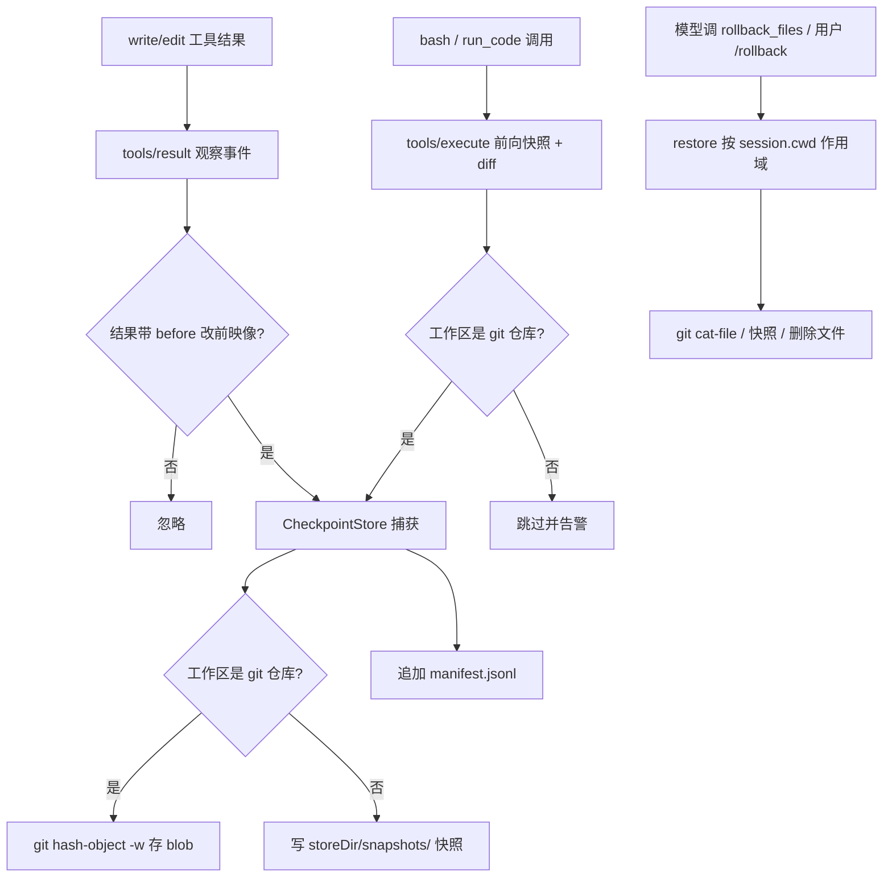

# dsh-rollback

[](https://www.npmjs.com/package/dsh-rollback)
[](LICENSE)

English | [中文](README.zh.md)

File-mutation rollback plugin for [DeepSeek Harness](https://github.com/deepseek-ai/deepseek-harness): it checkpoints the pre-image a `write`/`edit` mutation reports in its result, forward-snapshots the workspace around black-box `bash`/`run_code` calls so the files they change are diffable, retains every pre-image in the workspace git object database or a snapshot store, and exposes restore through a model-facing `rollback_files` tool and a `/rollback` human command. It registers no service and changes no loop code — capture rides the documented `tools/*` extension points (the `tools/result` observation event and the `tools/execute` around hook), and restore writes files directly (never through the fs policy seam or the sandbox, because undoing a mutation must not be gated by the policy the mutation passed).

## Install

The package is an installable **bundle** (declares `dsh.bundle`), so it plugs into a profile without touching the harness. All you need is a `dsh` CLI; the runtime peer packages (`@deepseek-ai/dsh-tools`, `@deepseek-ai/cordis`, ...) resolve from the dsh installation itself, so nothing else is installed.

### Prerequisites

- A `dsh` CLI on the machine (`dsh plugin` shells out to `pnpm`, so `pnpm` must be on `PATH`).
- A profile to install into — `demo` below is initialized on first use; use any name.

### Install from npm (recommended)

```sh
dsh plugin --profile demo add dsh-rollback
```

Other sources work the same way:

```sh
# straight from git (sources are built by the prepare script; pin a commit)
dsh plugin --profile demo add github:you/dsh-rollback#<sha>

# or from a local tarball
dsh plugin --profile demo add ./dsh-rollback-0.1.0.tgz
```

### Verify the install

1. The profile manifest under `$DSH_HOME/profiles/demo/` (`$DSH_HOME` defaults to `~/.dsh`) now lists `dsh-rollback` in `dependencies` **and** in `dsh.profile.bundles` — the reconciler adds it automatically because the package declares `dsh.bundle`. The equivalent manual patch layer row:

```yaml
- id: rollback
  name: dsh-rollback
  config:
    mode: auto          # auto | git | snapshot
    storeDir: ''        # '' = <harness home>/rollback
    maxRecords: 200
    gitPath: git
```

2. Start a session. Any of these proves the plugin is live:
   - the model sees a `rollback_files` tool in its tool list,
   - typing `/rollback` answers `rollback: nothing to restore` (instead of an unknown-command error) before any mutation happened.

## Usage

### 30-second quickstart

1. Open a session whose working directory is a git repository.
2. `write` a file `notes.md` with the content `hello`.
3. `write` it again with `goodbye` — the first content is silently checkpointed.
4. Tell the model *"restore the file you just overwrote"* (it calls `rollback_files`), or type `/rollback` yourself.
5. Read `notes.md`: it says `hello` again.

### For humans — `/rollback [count]`

Type it in the chat input (base `web` and `headless` profiles mount the command registry the command needs):

- `/rollback` — undo the single most recent captured mutation in this session's working directory,
- `/rollback 3` — undo the three most recent ones.

The output lists every restored file and its action:

```text
rollback: restored 2 file mutation(s):
  restored  /ws/src/lib/parse.ts
  deleted   /ws/src/lib/generated.ts
```

### For models — `rollback_files`

One model-facing tool, `rollback_files {count}` (no prompt section). It is meant for the model to undo its own `write`/`edit` mistakes instead of asking the user. Restores are scoped to the calling session's working directory and reported as a per-file summary — restored file contents are not echoed.

### What is captured

Two capture paths feed the same store: successful `write`/`edit` tool results that carry a `before` pre-image, and file changes made by root `bash`/`run_code` calls (forward-snapshotted in git repositories, then diffed — see [Behavior](#behavior)). Mutations through `str_replace_editor`, raw subprocesses, or a `bash` call outside a git repository carry no recoverable pre-image and are not captured. A session can only restore records at or under its own working directory.

## Demo: before and after

One `write` overwrite, undone. Same file, four states:

| Step | Action | `notes.md` |
|---|---|---|
| 1 | original state | `hello` |
| 2 | model `write`s a broken edit — pre-image captured | `goodbye` |
| 3 | model calls `rollback_files {"count": 1}` | (transparent) |
| 4 | restored, byte-for-byte | `hello` |

The full transcript of that turn:

```text
# 1. original
$ cat /ws/notes.md
hello

# 2. the model overwrites it; tools/result carries the pre-image "hello",
#    and the capture listener checkpoints it into the git object database
> tool/call   write {"path": "/ws/notes.md", "content": "goodbye"}
> tool/result {"path": "/ws/notes.md", "before": "hello", ...}

# 3. the model realizes the mistake and undoes it
> tool/call   rollback_files {"count": 1}
> tool/result "rollback: restored 1 file mutation(s):
               restored  /ws/notes.md"

# 4. back to the pre-mutation content
$ cat /ws/notes.md
hello
```

Under the hood: `git hash-object -w` wrote the pre-image into git's object database (zero index/branch/working-tree pollution), and one line was appended to the durable `manifest.jsonl` — the same undo works after a restart.

## How it works



The diagram above is a full worked example with a before/after transcript — see [Demo](#demo-before-and-after).

## Plugin (namespace: `rollback`)

A function/namespace plugin (`name` / `inject` / `Config` / `apply`), not a service. It is a loop-hygiene guard in the same family as `dsh-tool-call-timeout-policy`: it layers a safety net over the documented `tools/*` extension points instead of touching the agent loop.

### Config

| Key | Type | Default | Meaning |
|---|---|---|---|
| `mode` | `'auto' \| 'git' \| 'snapshot'` | `'auto'` | `git` checkpoints every pre-image as a git blob (requires a repository; a non-repository path fails loud and captures nothing); `snapshot` always copies pre-images under `storeDir/snapshots/`; `auto` picks git per file when the workspace is a repository and snapshots otherwise. |
| `storeDir` | string | `''` | Root holding the durable `manifest.jsonl` and `snapshots/`. Empty resolves to `rollback` under the Harness home. |
| `maxRecords` | number | `200` | Upper bound on in-memory records per store; the oldest are dropped beyond it (the durable manifest keeps everything). |
| `gitPath` | string | `'git'` | Git executable name or absolute path. |
| `mutationTools` | string[] | `['bash', 'run_code']` | Tool names that get a forward snapshot — black-box mutation calls without a `before` pre-image. Only root dispatches are snapshotted (nested Code Mode sub-calls are covered by their `run_code` parent) and only inside a git repository. |

### Behavior

**Capture.** A `tools/result` listener converts a successful `write`/`edit` outcome into a checkpoint: the outcome's `before` field is the pre-mutation content (`null` records a file that did not exist). `blob` pre-images are written with `git hash-object -w --stdin` inside the file's repository (discovered by walking up to `.git`, cached per directory) — zero index/branch/working-tree pollution, content-addressed and deduplicated by git itself. Every record is appended as one JSONL line to `manifest.jsonl`; a store replay on plugin load restores the in-memory list, so restores survive restarts. Only absolute local display paths are captured; relative or remote display paths (non-local filesystem backends) are ignored.

**Forward snapshot (`bash` / `run_code`).** A `tools/execute` around hook snapshots the workspace before a root `bash` (or `run_code`) call runs: every file under the session working directory is retained as a git blob (`git hash-object -w`, zero index/working-tree pollution), reusing a `mtime + size` fast path so unchanged files are not re-hashed. When the call settles, the tree is walked again and diffed, and every changed file is checkpointed — modified or deleted files keep the pre-mutation blob, created files an `absent` record. `.git` and `node_modules` are never snapshotted (and therefore never restored), and the plugin's own store directory is excluded. The snapshot is scoped to the session working directory and requires a git repository; otherwise it is skipped with a warning. Nested Code Mode sub-calls are covered by their `run_code` parent, so a mutation is never checkpointed twice.

**Restore.** `restore(count, under)` re-materializes the `count` most-recent records whose path lies at or under `under` (the calling agent's session working directory): `blob` via `git cat-file blob <hash>`, `snapshot` from `storeDir/snapshots/<ref>`, and `absent` by deleting the file. Writes are atomic (temp file + rename) and create parent directories. Restored records are removed from the in-memory list; the manifest stays append-only, so a restart replays the same records and a later restore re-applies the identical pre-image (idempotent, no double-undo).

**Exposure.**

- `rollback_files` tool — model-facing restore, parameter `count` (integer, default 1). Registered on `ctx.tools`; not concurrency-safe. It refuses when the calling execution has no session working directory.
- `/rollback [count]` command — the same restore for the receiving agent's session; the command child activates only when a command registry is composed (base `web` and `headless` profiles mount `dsh-commands`).

### Why git, and why direct spawn

Git blobs are the same mechanism ccAgent uses: `hash-object -w` writes the pre-image without touching index, refs, or the working tree; `cat-file` restores bytes verbatim; unreferenced blobs are reclaimed by git's own gc. Git is spawned directly via `node:child_process` (never through `ctx.shell` or `ctx.subprocess`): a restore is a deliberate system-level undo, so it must not be confined by the sandbox or shell policy it is undoing.

## Model Experience

### Model-facing restore tool

#### What the model sees

This plugin adds one model-facing tool, `rollback_files` (integer parameter `count`, string output), and no prompt section. It changes no other tool's schema or system prompt. The `/rollback` command is a human command plane entry; it never reaches the model.

#### Token effect

Zero tokens on normal operation. A `rollback_files` call adds its small tool/result pair; the restored file content is not echoed (only a summary line). Capture itself is invisible to the model.

#### KV Cache effect

Append-only; the added tool schema and result follow the reusable request prefix and do not invalidate existing KV-cache entries.

## Known Limitations and Deferred Work

- **`str_replace_editor` and raw subprocesses are not checkpointed** — `bash`/`run_code` file changes are captured by forward snapshot, but only inside a git repository (a non-repository workspace skips the snapshot with a warning), and a `bash` call is snapshotted at the session working directory only, so files it changes elsewhere are not captured. A plan-scoped batch backup (capture every file a plan touches before execution) is the corresponding generalization, deferred.
- **UTF-8 text only** — pre-images travel as strings; binary content is outside scope (matching the fs tools' text-only contract).
- **Restores are workspace-scoped** — records outside the calling agent's session working directory are never restored by that caller; there is no cross-directory or global restore entry point.
- **Append-only manifest, no pruning** — restored records remain in `manifest.jsonl` and re-appear on replay (idempotent re-restore, never a double-undo), but a long-lived harness home grows without compaction.
- **Git gc can prune long-lived blobs** — default gc reclaims unreferenced objects after a retention window; checkpoints older than that window may fail to restore. A keep-alive ref namespace is deferred.
- **No automatic restore on failure** — `restoreOnFailure` is deliberately not offered in v1; auto-restore would need to attribute failure to specific mutations first.

## Development

```sh
pnpm install     # peer packages resolve from npm releases
pnpm run build   # tsdown -> lib/ (ESM + d.mts), self-contained
pnpm test        # vitest, 16 store-level tests
```

## License

MIT
