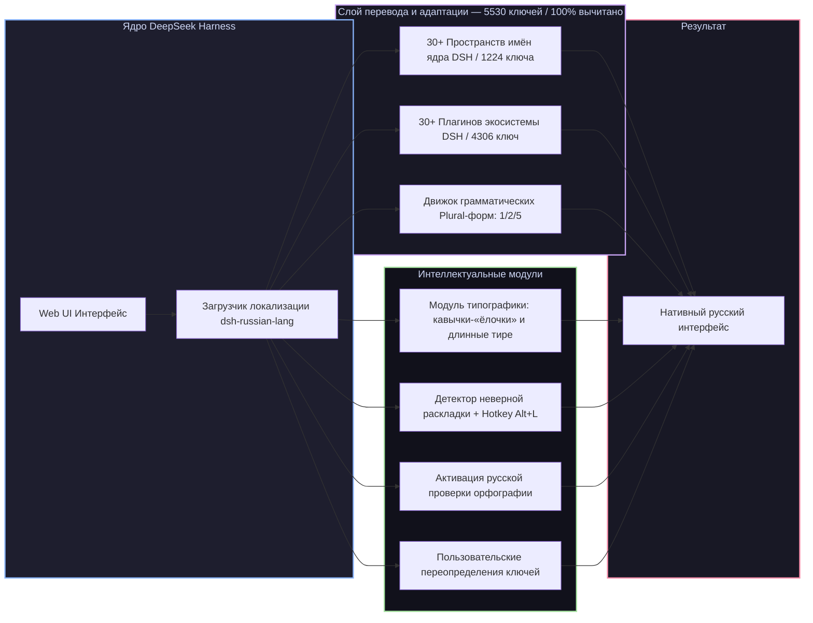

# 📦 @goodandready/dsh-russian-lang

<div align="center">

<h3>Полная русская локализация, умная типографика и исправление раскладки клавиатуры для DeepSeek Harness</h3>

<p align="center">
  <a href="https://www.npmjs.com/package/@goodandready/dsh-russian-lang"></a>
  <a href="LICENSE"></a>
  <a href="https://github.com/topics/dsh-plugin"></a>
  <a href="https://nodejs.org"></a>
</p>

<p align="center">
  
  
  
  
</p>

<p align="center">
  <a href="https://goodandready.app/"></a>
</p>

<p align="center">
  
</p>

</div>

---

## ⚡ Обзор

**`dsh-russian-lang`** — официальный, всеобъемлющий пакет русской локализации для веб-интерфейса [DeepSeek Harness](https://github.com/deepseek-ai/deepseek-harness) (dsh).

Пакет не просто переводит интерфейс ядра и всех популярных плагинов экосистемы, но и добавляет интеллектуальные функции для комфортной русскоязычной работы: **100% ручная вычитка терминов**, **грамматические формы множественного числа (plural)**, автоматическую **расстановку экранной типографики** («ёлочки», длинные тире, неразрывные пробелы) и **исправление ошибочно набранного текста** на неверной раскладке по горячей клавише <kbd>Alt+L</kbd>.



---

## ✨ Полный обзор возможностей

### 1. 🌐 100% покрытие ядра DSH (30+ Пространств имён, 1224 ключа)
* **Диалоги и переписка (`conversation`)**: лента сообщений, ветки обсуждений, карточки вызова инструментов, статус генерации и рассуждений (thinking traces).
* **Модели и провайдеры (`settings.models`)**: каталог моделей, параметры инференса, управление токенами и ключами API.
* **Трейсы рассуждений (`trajectory`)**: детальные шаги, параметры вызовов инструментов, временные метки и визуализация размышлений модели.
* **Настройки ядра (`settings`, `common`, `settings.theme`)**: параметры подключения, горячие клавиши, системные уведомления, масштабирование шрифтов, модальные окна и подтверждения.
* **Рабочие области (`workspace`, `subagent`)**: дерево файлов, управление контекстом, запуск и координация субагентов.
* **Планировщик и инвентарь (`schedule.catalog`, `settings.pluginInventory`, `settings.plugins`)**: фоновые задания, периодичность, фильтры и каталог установленных плагинов.
* **Права доступа и безопасность (`permission.access`, `plan`, `skill`)**: пресеты прав (полный доступ, только чтение, запись в рабочую область), выполнение планов и навыки.

> **О качестве перевода.** Все **5530 ключей интерфейса (722 ядра + 3989 плагинов) переведены на 100% и вычитаны вручную**. Черновой машинный перевод полностью замещён проверенными формулировками (`draft = 0`). Перевод регулярно валидируется автоматическими линтерами целостности плейсхолдеров, проверкой соблюдения глоссария (`glossary.json`) и детекторами переполнения верстки. Нашли неточность — кнопка «Сообщить о проблеме перевода» в карточке настроек создаёт готовый issue.

### 2. 🧩 Встроенный перевод 30+ плагинов экосистемы DSH (4306 ключ)
Локализация автоматически распространяется на все ключевые плагины экосистемы DeepSeek Harness:
* **`dsh-session-control`** — расширенное управление сессиями: закрепление диалогов, архив по периодам, просмотр расшифровок и фильтрация шума;
* **`dsh-kanban` и `task-board`** — канбан-доски задач, карточки, чек-листы, дедлайны, критерии готовности (DoD) и шлюз приёмки (Acceptance Gate);
* **`dsh-cost-meter`** — учёт стоимости токенов, калькуляция расходов и тарифные сетки моделей в реальном времени;
* **`dsh-goal`** — автономный целеполагающий агент с безопасным циклом и рефлексией;
* **`dsh-moa`** — многоагентная архитектура Mixture-of-Agents;
* **`dsh-context-lens` и `dsh-context`** — визуализатор и оптимизатор контекста, аналитика токенов и сжатие;
* **`dsh-time-machine`** — снимки рабочей области и откат состояний файлов;
* **`dsh-shadow-auditor`** — теневой аудит изменений и безопасность;
* **`dsh-cron` и `schedule.catalog`** — планировщик периодических cron-задач;
* **`dsh-clinebot` и `im-hub`** — интеграции и шлюзы для Telegram, Discord, Slack;
* **`dsh-subscriptions`** — управление персональными подписками на модели;
* **`dsh-voice` и `dsh-tts`** — распознавание речи и голосовое озвучивание;
* **`dsh-image-gen`** — генерация изображений;
* **`dsh-lanmode`** — сетевой доступ по локальной сети и генерация TLS-сертификатов;
* **`dsh-model-sync`** — синхронизация моделей и эндпоинтов;
* **`dsh-usage-guard` и `token-dashboard`** — контроль лимитов и аналитика расходов токенов;
* **`skills-manager` и `dsh-skill-hub`** — менеджер навыков агента и витрина способностей;
* **`commandcode` и `settings.commandcode`** — провайдеры команд и аккаунты;
* **`better-sidebar`, `better-input`, `opencode-palette`, `context-doctor`, `plugin-store`, `autoReview`** и др.

### 3. 🔢 Русские грамматические формы числительных (Plural)
Английский язык различает только `1` и `other`. Русский язык требует 3 грамматические формы числительных (`1 файл`, `2 файла`, `5 файлов` / `1 секунда`, `3 секунды`, `10 секунд`). Движок локализации автоматически подставляет правильные окончания в зависимости от числового значения.

### 4. ✍️ Интеллектуальный модуль типографики (`russian-lang.typography`)
Автоматически приводит тексты сообщений и описаний к правилам русской экранной типографики:
* Заменяет прямые "лапки" на правильные кавычки-«ёлочки» (а вложенные — на „лапки“);
* Заменяет дефисы между словами на длинные тире (—);
* Добавляет неразрывные пробелы после коротких союзов и предлогов, предотвращая висячие строки;
* **Безопасность кода**: типографика строго изолирована и никогда не затрагивает блоки исходного кода, формулы LaTeX и моноширинные поля ввода.

### 5. ⌨️ Исправление ошибочной раскладки клавиатуры (<kbd>Alt+L</kbd>)
Если вы забыли переключить раскладку и набрали текст латиницей (например, `ghjtrn d gzkmt` вместо `проект в пальто`), плагин мгновенно:
* Определяет ошибочный ввод в реальном времени;
* Показывает ненавязчивую плавающую подсказку над полем ввода;
* При нажатии горячей клавиши <kbd>Alt+L</kbd> мгновенно конвертирует набранный текст в правильную кириллицу.

### 6. ⚙️ Пользовательские переопределения (`russian-lang.overrides`)
Вы можете переопределить абсолютно любой системный ключ перевода под терминологию вашей команды в **Настройки → Плагины → Russian Lang → Переопределения** без редактирования исходного кода.

### 7. 🔤 Нативная интеграция в ядро
Плагин нативно регистрирует пункт **«Русский»** в меню **Настройки → Общие → Язык**, переключает атрибут `<html lang="ru-RU">` и активирует встроенный браузерный словарь проверки орфографии (`spellcheck`).

---

## 📦 Установка

```bash
dsh plugin --profile web add @goodandready/dsh-russian-lang
```

После установки откройте веб-интерфейс, перейдите в **Настройки → Общие → Язык**, выберите **«Русский»** и обновите страницу.

---

## ⚙️ Параметры конфигурации (`settings.yaml`)

Пространство настроек — `russian-lang`. Схема объявлена в [`lib/index.js`](lib/index.js),
все поля необязательные:

```yaml
russian-lang:
  enabled: true          # Русский язык интерфейса
  typography:
    enabled: true        # Ёлочки, длинные тире, неразрывные пробелы
    yo: false            # Восстанавливать «ё» (по умолчанию выключено)
  agentPrompt: false     # Просить агента отвечать по-русски
  overrides: {}          # Свои значения для любых ключей перевода
```

Проще то же самое — в **Настройки → Плагины → Русская локализация**.

Исправление раскладки (<kbd>Alt+L</kbd>) и браузерный спелчек включаются вместе с
русским языком и отдельных ключей не имеют.

---

## 📄 Лицензия

MIT © [GooDAnDReaDY](https://github.com/GooDAnDReaDY)


## ⚡ Новые возможности v0.2.9 — Smart Russian UX

Версия **v0.2.9** расширяет функционал плагина от чистой локализации до полноценной адаптации пользовательского опыта работы с моделями на русском языке:

1. **Живая экранная типографика в поле ввода (Live Input Typography)**:
   - Автоматическая подстановка кавычек-ёлочек («...») вместо машинных программистских кавычек (`""`).
   - Автоматическая замена двойного дефиса (`--`) на длинное тире (`—`).
   - Автоматическая замена троеточия (`...`) на знак многоточия (`…`).
   - Неразрывные пробелы (` `) после однобуквенных и коротких русских предлогов (`в`, `на`, `с`, `к`, `о`, `у`, `за`, `по` и др.).
   - **Строгая изоляция кода**: текст внутри инлайн-кода (бэктики `` `code` ``) и многострочных блоков (``` ``` ```) сохраняется в неизменном виде без искажения синтаксиса.

2. **Быстрый переключатель языка (Quick Language Switcher)**:
   - Компактный чип `RU ⇄ EN` встроен прямо в шапку диалоговой сессии (`conversation.session.header.utilities`).
   - Позволяет мгновенно переключать язык всего интерфейса в один клик без перехода в Настройки.

3. **Русские алиасы слэш-команд (Slash-Command Aliases)**:
   - Мгновенное авто-разворачивание команд при вводе:
     - `/цель` ➔ `/goal`
     - `/сжать` ➔ `/compact`
     - `/план` ➔ `/plan`
     - `/экспорт` ➔ `/export`
     - `/память` ➔ `/memory`
     - `/отзыв` ➔ `/feedback`
     - `/разрешения` ➔ `/permission`

4. **Пресеты системных директив агента (Agent Style Presets)**:
   - В карточке настроек плагина доступен выбор канонического стиля ответов для моделей:
     - 💼 **Технический эксперт**: строгая русская инженерная терминология, аккуратный код, русскоязычные комментарии к архитектуре.
     - 📝 **Технический писатель**: книжная типографика, Markdown, ГОСТ/RFC-структура документации.
     - ⚡ **Лаконичный режим**: предельно сжатые и точные ответы без вступительных любезностей.

5. **Локализованный экспорт сессии (Localized Markdown Export)**:
   - Генерация красивого Markdown-файла всей истории диалога с русскими датами, именами ролей («👤 Пользователь», «🤖 Ассистент»), метриками токенов и индикацией вызовов инструментов.

6. **Хоткей транслитерации (<kbd>Alt+T</kbd>)**:
   - Мгновенная конвертация набранного транслита в кириллицу и обратно прямо в поле ввода (`privet` ⇄ `привет`).
   - *(Deprecated since v0.2.10: экспериментальный UI-перехватчик удалён для обеспечения беспрепятственного нативного ввода Lexical; программная функция `phoneticTranslit` сохранена в `lib/pure.js`).*

7. **Инлайн-перевод реплик ассистента (`RU ↗`)**:
   - Кнопка `RU ↗` в панели действий ответа ассистента переводит текст ответа на русский язык с сохранением блоков кода и выводит карточку перевода прямо под сообщением с кнопкой быстрого копирования (`📋 Копировать`).
