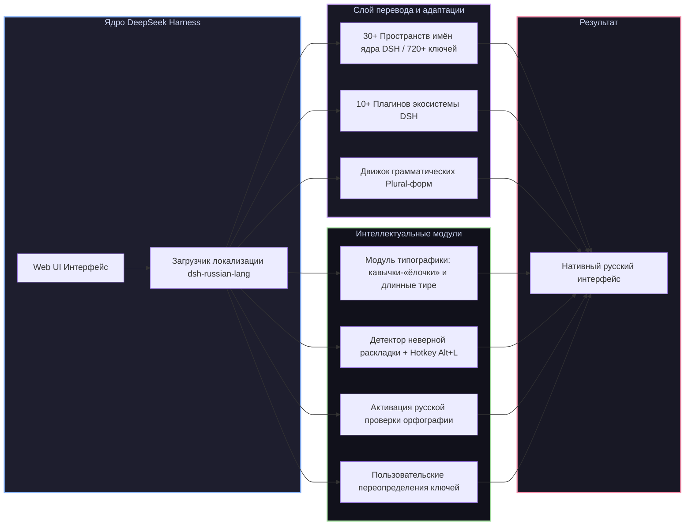

# 📦 @goodandready/dsh-russian-lang

<div align="center">

<h3>Полная русская локализация, умная типографика и исправление раскладки клавиатуры для DeepSeek Harness</h3>

<p align="center">
  <a href="https://www.npmjs.com/package/@goodandready/dsh-russian-lang"></a>
  <a href="LICENSE"></a>
  <a href="https://github.com/topics/dsh-plugin"></a>
  <a href="https://nodejs.org"></a>
</p>

<p align="center">
  <a href="https://goodandready.app/"></a>
</p>

</div>

---

## ⚡ Обзор

**`dsh-russian-lang`** — официальный, всеобъемлющий пакет русской локализации для веб-интерфейса [DeepSeek Harness](https://github.com/deepseek-ai/deepseek-harness) (dsh).

Пакет не просто переводит интерфейс ядра и популярных плагинов, но и добавляет интеллектуальные функции для комфортной русскоязычной работы: **грамматические формы множественного числа (plural)**, автоматическую **расстановку типографики** («ёлочки», длинные тире, неразрывные пробелы) и **исправление ошибочно набранного текста** на неверной раскладке по горячей клавише <kbd>Alt+L</kbd>.



---

## ✨ Полный обзор возможностей

### 1. 🌐 Полное покрытие ядра DSH (30+ Пространств имён, 720+ ключей)
* **Диалоги и переписка (`conversation`)**: лента сообщений, ветки обсуждений, карточки вызова инструментов, статус генерации и рассуждений (thinking traces).
* **Модели и провайдеры (`settings.models`)**: каталог моделей, параметры инференса, управление токенами и ключами API.
* **Настройки ядра (`settings`, `common`)**: интерфейс настроек, горячие клавиши, системные уведомления, модальные окна и подтверждения.
* **Рабочие области (`workspace`, `subagent`)**: дерево файлов, управление контекстом, запуск и координация субагентов.
* **Системные статусы (`status`, `reference`)**: индикаторы сетевого подключения, загрузка файлов и ошибки.

> **О качестве перевода.** Все 2899 ключей интерфейса переведены — непереведённых строк нет.
> Из них около **64 % вычитаны вручную**, остальные — черновой машинный перевод (`status: draft`
> в `mt-registry.json`), который постепенно заменяется ручным. Актуальную раскладку
> печатает `python3 check-coverage.py`, очередь на вычитку лежит в
> [`upstream/review-queue.md`](upstream/review-queue.md). Нашли неудачную формулировку —
> кнопка «Сообщить о проблеме перевода» в карточке настроек создаёт готовый issue.

### 2. 🧩 Встроенный перевод 10+ плагинов экосистемы DSH
Локализация автоматически распространяется на сторонние и экосистемные плагины:
* `token-dashboard` — аналитика и графики расхода токенов;
* `subscriptions` (`dsh-subscriptions`) — карточки подключения персональных подписок;
* `dshmarket` и `dshmarket-1.13` — маркетплейс моделей и каталоги провайдеров;
* `better-sidebar` — улучшенное боковое меню навигации;
* `task-board` и `kanban` — доски управления задачами и канбан-планировщик;
* `im-hub` — шлюзы интеграции с мессенджерами;
* `context-doctor` и `plugins-store` — диагностика контекста и магазин расширений.

### 3. 🔢 Русские грамматические формы числительных (Plural)
Английский язык различает только `1` и `other`. Русский язык требует 3 грамматические формы числительных (`1 файл`, `2 файла`, `5 файлов` / `1 секунда`, `3 секунды`, `10 секунд`). Движок локализации автоматически подставляет правильные окончания в зависимости от числового значения.

### 4. ✍️ Интеллектуальный модуль типографики (`russian-lang.typography`)
Автоматически приводит тексты сообщений и описаний к правилам русской экранной типографики:
* Заменяет прямые "лапки" на правильные кавычки-«ёлочки» (а вложенные — на „лапки“);
* Заменяет дефисы между словами на длинные тире (—);
* Добавляет неразрывные пробелы после коротких союзов и предлогов, предотвращая висячие строки;
* **Безопасность кода**: типографика строго изолирована и никогда не затрагивает блоки исходного кода, формулы LaTeX и моноширинные поля ввода.

### 5. ⌨️ Исправление ошибочной раскладки клавиатуры (<kbd>Alt+L</kbd>)
Если вы забыли переключить раскладку и набрали текст латиницей (например, `ghjtrn d gzkmt` вместо `проект в пальто`), плагин мгновенно:
* Определяет ошибочный ввод в реальном времени;
* Показывает ненавязчивую плавающую подсказку над полем ввода;
* При нажатии горячей клавиши <kbd>Alt+L</kbd> мгновенно конвертирует набранный текст в правильную кириллицу.

### 6. ⚙️ Пользовательские переопределения (`russian-lang.overrides`)
Вы можете переопределить абсолютно любой системный ключ перевода под терминологию вашей команды в **Настройки → Плагины → Russian Lang → Переопределения** без редактирования исходного кода.

### 7. 🔤 Нативная интеграция в ядро
Плагин нативно регистрирует пункт **«Русский»** в меню **Настройки → Общие → Язык**, переключает атрибут `<html lang="ru-RU">` и активирует встроенный браузерный словарь проверки орфографии (`spellcheck`).

---

## 📦 Установка

```bash
dsh plugin --profile web add @goodandready/dsh-russian-lang
```

После установки откройте веб-интерфейс, перейдите в **Настройки → Общие → Язык**, выберите **«Русский»** и обновите страницу.

---

## ⚙️ Параметры конфигурации (`settings.yaml`)

Пространство настроек — `russian-lang`. Схема объявлена в [`lib/index.js`](lib/index.js),
все поля необязательные:

```yaml
russian-lang:
  enabled: true          # Русский язык интерфейса
  typography:
    enabled: true        # Ёлочки, длинные тире, неразрывные пробелы
    yo: false            # Восстанавливать «ё» (по умолчанию выключено)
  agentPrompt: false     # Просить агента отвечать по-русски
  overrides: {}          # Свои значения для любых ключей перевода
```

Проще то же самое — в **Настройки → Плагины → Русская локализация**.

Исправление раскладки (<kbd>Alt+L</kbd>) и браузерный спелчек включаются вместе с
русским языком и отдельных ключей не имеют.

---

## 📄 Лицензия

MIT © [GooDAnDReaDY](https://github.com/GooDAnDReaDY)
