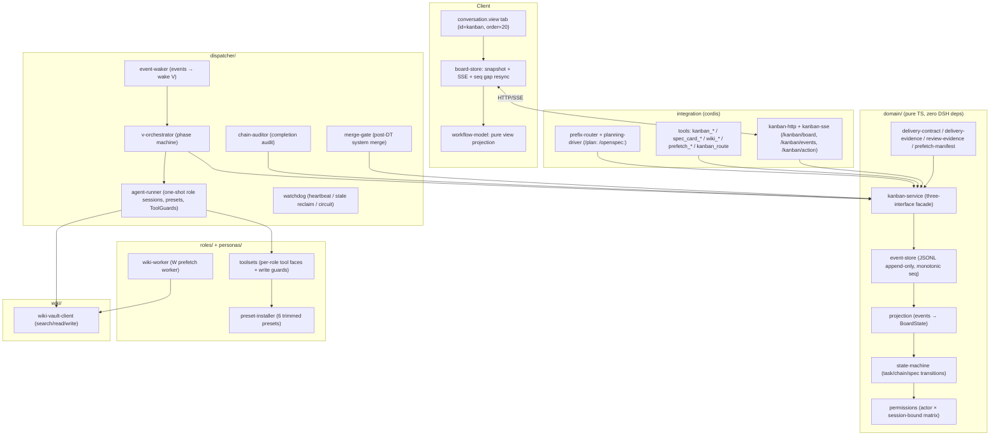

# dsh-swarm

[简体中文](README.zh-CN.md) · [English](README.md)

---

**A governed swarm of six specialist DSH agents that turns one requirement into a strict, evidence-verified pipeline.**

An orchestrator (V) decomposes an approved spec into a strictly ordered phase chain (`p → (pt?) → w2 → d → dt → w3 → summary`); six single-purpose roles (V / P / W / D / PT / DT) run each phase with isolated, permission-gated tool faces; every handoff is machine-verified against an evidence contract; failures recover through idempotent retry and human-gated reviews; and a live Workflow kanban tab streams all state to the browser via SSE. Design inspired by the [Hermes Agent kanban](https://github.com/NousResearch/hermes-agent).


---

## Why

Coordinating several AI agents on one task typically fails in three ways:

1. **Role drift** — a "planner" starts writing code, an "executor" reviews its own work, and nobody owns the outcome.
2. **Unverifiable handoffs** — an agent claims "done" with no reproducible evidence, and the next agent builds on sand.
3. **Silent deadlocks** — an agent stops without finishing and the pipeline hangs, or bad code is merged before anyone reviewed it.

dsh-swarm encodes a *contract* against all three: one machine-enforced responsibility per role; every handoff must carry structured evidence or the phase will not close; and every stall or review failure lands in a visible, recoverable state with a human as the trust anchor. It is built **correctness-first** — deterministic state machines, append-only event sourcing, idempotent schedulers, and a red-team test suite that replays the event log and rejects any illegal transition.

---

## Roles & the execution pipeline

Six roles are dispatched by the scheduler as one-shot agent sessions (deterministic session id `kbn-<taskId>`, resumed on retry/rework via `resumeSessionId`). Each role-agent session is bound to exactly one task (`boundTaskId`) and gets a trimmed tool face. V is the exception: a chain-scoped orchestrator session (`kbn-v-<chainId>`) with no `boundTaskId`.

| Role | Alias | Responsibility | Tool face (highlights) |
|---|---|---|---|
| **V** | Orchestrator | Drives the phase machine, creates one card per phase, posts `[blocked-review]` guidance on stalls. Never executes. | `kanban_create` + task tools + spec view |
| **P** | Planner | Reads spec + repo facts (incl. read-only self-checks), writes an OpenSpec implementation plan, opts into PT via `pt_decision.needed`. Never executes. | Task tools + spec view, read-only (writes only `openspec/changes/`) |
| **PT** | Plan reviewer | Read-only review of P's plan (requirements alignment, completeness, logic). Outputs verdict + issues. | Task tools + spec view, **read-only ToolGuard** |
| **W** | Wiki bridge | W2/W3 KB sync (`w:kb`). Never touches code/git. | Task tools + `wiki_search/read/write` + read-only spec view |
| **D** | Executor | The *only* role that writes code: worktree → implement → verify → `[AI-GEN]` commit → push feature branch (merging into the spec-declared target branch is done by the system only after DT passes). | Task tools + wiki read + bash/fs/run_code (full dev) + subagent (spawn/fork/list-agents) + goal |
| **DT** | Implementation reviewer | Empirically verifies D's work (test/build/typecheck/diff/git + open-code-review), writes review page to KB. Read-only against the repo. | Task tools + wiki read/write (review namespace) + bash/fs/run_code, **read-only ToolGuard** |

The pipeline (strictly serial within a chain, parallel across chains):

```text
p ──> (pt?) ──> w2 ──> d ──> dt ──> w3 ──> summary
  |      |        |       |      |       |        |
 plan   plan     plan    impl   impl    KB      wrap-up
 (P)    review   sync    (D)    review  sync     (system)
        (only when P      (W2)   (fixed) (W3)
        opts in)
```

- `pt` is created only when P's handoff delivers `pt_decision = { needed: true, reason }` — V only creates the card, the system never overrides the decision. `needed: false` skips straight to `w2`.
- `dt` is always created after `d`.
- Repo facts are gathered by the phase-0 planning session (`planning_prefetch`, read-only), not by a W phase.
- The chain is completed by a mechanical rule, not by an agent: last completed task is W3 (`w/kb`), the D (`execute`) task is done with delivery evidence, and no open tasks remain.

---

## Install

### Prerequisites

- A working [DSH](https://github.com/deepseek-ai) installation (the `@deepseek-ai/*` runtime packages: cordis, dsh-agent, dsh-tools, dsh-persona, dsh-session).
- Node.js ≥ 22.19 and npm (match DSH's runtime requirement).
- Peer dependencies shipped with DSH: `@deepseek-ai/dsh-tool-bash`, `@deepseek-ai/dsh-tool-fs`, `@deepseek-ai/dsh-tool-fs-search`, `@deepseek-ai/schemastery`.
- An optional wiki-vault HTTP service for W/P/D KB reads and W2/W3 syncs (see [Configuration](#configuration)).

### Build

```bash
npm install
npm run build        # tsc -p tsconfig.build.json (lib/*.js) + client bundle (lib/client.js)
```

### Install as a DSH plugin

```bash
# From npm — a Web profile also adds the kanban browser tab
dsh plugin --profile web add @joekytc/dsh-swarm

# From the local checkout (development)
dsh plugin --profile <name> add ./dsh-swarm
```

> From GitHub source: `dsh plugin --profile web add github:joekytc/dsh-swarm`.
>
> `storageDir` must be set with the **unquoted** `!!js dshHomePath("storages/kanban")`
> form. Quoting it degrades the path into a literal string (a known footgun).

### Quickstart

1. Start a DSH session and type:

   ```
   /plan: <requirement> / <project> / <API>
   ```

   This enters phase-0 planning (zero side effects — no cards yet): `grill-me` asks
   one clarifying question at a time, `planning_prefetch` gathers read-only repo
   facts, and the conversation converges on a planning checklist with the six spec
   sections (`problem / solution / user_stories / impl_decisions / testing /
   out_of_scope`) plus a repo manifest. `planning_checklist_save` schema-validates
   the checklist — an invalid or incomplete one blocks approval.

2. Confirm and launch:

   ```
   /openspec: 确认执行
   ```

   The chain and spec card are created from the saved checklist; the `file-prefetch`
   (repo path) and `kb` (checklist page) attachments are mounted, the spec is
   approved, the chain transitions to `executing`, and the dispatcher wakes the V
   orchestrator, which builds the pipeline one phase at a time.

3. Watch progress in the **kanban tab** (the third tab of the conversation center:
   Conversation → Trajectory → Kanban). Click a card for Overview / Trajectory /
   Handoff / Spec / Comments.

4. When a chain completes, the system audits the workspace for out-of-chain writes
   and (for D chains) merges D's feature branch into the spec-declared target branch. If an audit
   warning is raised, confirm ownership in the GUI before the final summary is shown.

---

## Configuration

All keys are optional; defaults shown. Schema lives in `src/config.ts`.

| Key | Default | Description |
|---|---|---|
| `storageDir` | `$DSH_HOME/storages/kanban` | Event log (`events.jsonl`), orchestration state, per-task workspaces, `dispatcher.log` |
| `wikiVault.baseUrl` | `''` (empty) | wiki-vault HTTP service for KB reads/writes — required for KB features; set to your own server |
| `wikiVault.pagePrefix` | `projects/` | Whitelist prefix for W page writes |
| `roles.models.<role>` | `{}` | Per-role model: `{ provider, model, reasoningEffort?, fallbacks?[] }` |
| `roles.models.<role>.reasoningEffort` | `high` | Default reasoning effort for all roles |
| `roles.models.<role>.fallbacks` | `[]` | Silent fallback candidates (audited via `[model-fallback]` comment) |
| `dispatcher.staleTimeoutSeconds` | `14400` | Heartbeat timeout; running task without heartbeat is reclaimed |
| `dispatcher.maxRetries` | `3` | Failure retries before circuit → `blocked(gave_up)` |
| `dispatcher.heartbeatIntervalSeconds` | `300` | Watchdog heartbeat period |
| `dispatcher.maxProtocolViolations` | `2` | Protocol-violation guardrail: after this many consecutive violations the next one is final (`gave_up`) |
| `dispatcher.maxReworksPerRole` | `{ pt: 2, dt: 3 }` | Max review rework rounds before `review/gave-up` + `[review-final]` |
| `prefixRoutes.plan` | `/plan:` | Phase-0 planning prefix |
| `prefixRoutes.openspec` | `/openspec:` | Approve-and-execute prefix |
| `ui.enabled` | `true` | Enable the kanban web tab |
| `ui.contentMinWidth` | `715` | Minimum kanban content width (px) |
| `ui.contentMaxWidth` | `780` | Maximum kanban content width (px) |
| `ui.sseHeartbeatSeconds` | `20` | SSE heartbeat interval |

---

## Guardrails

### Permission matrix

`can(action, actor, task, { boundTaskId })` in `src/domain/permissions.ts`.
"Bound" means the actor is the role agent session spawned for *that exact task*
(`boundTaskId === task.id` and, for `complete`, also `actor === task.assignee`).

| Action | V | P | W | D | PT | DT | Human | System |
|---|---|---|---|---|---|---|---|---|
| create-chain / create-task | ✅ | ❌ | ❌ | ❌ | ❌ | ❌ | ✅ | ❌ |
| claim | ❌ | ❌ | ❌ | ❌ | ❌ | ❌ | ❌ | ✅ |
| complete | ❌ | bound | bound | bound | bound | bound | ✅ (GUI) | ✅ |
| block | ❌ | bound | bound | bound | bound | bound | ✅ | ✅ |
| heartbeat | ❌ | bound | bound | bound | bound | bound | ❌ | ❌ |
| comment | ✅ | ✅ | ✅ | ✅ | ✅ | ✅ | ✅ | ✅ |
| unblock | ❌ | ❌ | ❌ | ❌ | ❌ | ❌ | ✅ | ❌ |
| archive | ✅ | ❌ | ❌ | ❌ | ❌ | ❌ | ✅ | ❌ |
| spec-approve | ❌ | ❌ | ❌ | ❌ | ❌ | ❌ | ✅ | ❌ |
| spec-edit | ❌ | ❌ | ❌ | ❌ | ❌ | ❌ | ✅ | ❌ |
| spec-attach | ✅ | ❌ | ❌ | ❌ | ❌ | ❌ | ✅ | ❌ |
| update-title | ❌ | ❌ | ❌ | ❌ | ❌ | ❌ | ✅ | ❌ |
| delete-chain | ❌ | ❌ | ❌ | ❌ | ❌ | ❌ | ✅ | ❌ |
| wiki-write | ❌ | ❌ | ✅ | ❌ | ❌ | ✅ (review ns) | ❌ | ❌ |
| wiki-read | ❌ | ❌ | ✅ | ✅ | ❌ | ✅ | ❌ | ❌ |
| prefetch | ❌ | ❌ | ✅ | ❌ | ❌ | ❌ | ❌ | ❌ |
| audit-confirm | ❌ | ❌ | ❌ | ❌ | ❌ | ❌ | ✅ | ❌ |
| create-rework-task | ❌ | ❌ | ❌ | ❌ | ❌ | ❌ | ❌ | ✅ |

Key guarantees (two):

- **The main session cannot execute.** It only gets `kanban_show`/`kanban_list`/
  `kanban_comment` + `spec_card_view` + `kanban_route` — never
  `kanban_create`/`kanban_complete`/`kanban_block`. Chains/specs are created only
  via `/plan:`+`/openspec:`; the GUI observes and mutates task state but never
  creates chains or tasks — "who decided to run what" stays explicit and auditable.
- **Session binding prevents cross-task escalation** (a W agent bound to task A
  cannot complete/block task B even though both are W tasks); DT writes are
  confined to the `projects/<chain>/review/` namespace by a ToolGuard on top of
  the matrix; and no role agent can approve specs, unblock, or confirm audits —
  those are human trust anchors; `system` handles only mechanical bookkeeping.

### Delivery contract (upstream owes downstream)

Each phase's handoff must carry the keys its downstream actually reads
(`src/domain/delivery-contract.ts`). Missing keys block the current role's card
immediately (and the orchestrator never builds a downstream card on a blocked
parent):

| Card | Required handoff keys |
|---|---|
| W2 / W3 (`w:kb`) | `kb_url` + `page_path` |
| P (`p:openspec`) | `artifacts_path` + `pt_decision` (`needed` boolean required; when `needed: true`, `reason` is required) |
| D (`d:execute`) | `changed_files` + (`commit_hash` or `push`) — `hasDeliveryEvidence`; `branch` (feature branch) is expected for the merge gate, not a hard-complete blocker; `tdd` (`test_files` or `skipped.reason`, XOR) |
| PT / DT | `review_evidence` (schema-valid) — `validateReviewEvidence` |

### TDD hard gate (evidence threshold)

D completes only with `tdd` — `test_files` (with `test_first`) or `skipped.reason`
(XOR, `delivery-evidence.ts`). DT's `review_evidence` must carry `tdd`; on a
`pass` verdict the runner must be `vitest` (`test.runner`) and `test_first === true`
must hold (`review-evidence.ts`). This makes "tests actually ran, and were written
first" a machine-checked property rather than a claim.

### Phase-0 planning checklist

`/plan:` runs a read-only planning session (`grill-me` → `planning_prefetch` →
`planning_checklist_save`, `planning-driver.ts`). The checklist carries a structured
manifest (repo facts + file baseline, `prefetch-manifest.ts`); an invalid manifest
blocks the save, and `/openspec:` mounts the checklist as the `file-prefetch` +
`kb` attachments on the spec card (`prefix-router.ts`).

### Review quality chain

- After **P** completes, **PT** is created only when P's handoff delivers
  `pt_decision.needed = true`; the orchestrator never overrides the decision
  (V only creates the card).
- After **D** completes, a **DT** card is *always* created.
- **PT/DT** are read-only: a ToolGuard mechanically denies writes to the repo
  sources, git mutations, and (for DT) wiki writes outside the review namespace.
- **DT** review engine: `open-code-review` (ocr, delegation mode, diff
  `--from <target branch> --to <feature branch>`) → fallback `superpowers
  code-review` → block `review-tool-unavailable` only if both are unavailable.
- `review_evidence` must pass `validateReviewEvidence` or the review card cannot
  complete: PT needs verdict + issues + plan ref; DT additionally needs
  test (exit 0 on pass), build/typecheck, lint, non-empty diff, git,
  ocr/fallback conclusion, and `tdd`.

### Rework (review failure)

A failed review never mutates a `done` card. Instead the system records
`review/failed`, creates a **rework task** (`[返工] ...`) that inherits the source's
session (`resumeSessionId`), `reviewAttempt + 1`, and starts as `todo`
(`reviewStatus: 'pending'`), then re-dispatches a fresh review card for the rework.
When `reviewAttempt` reaches `maxReworksPerRole` (PT 2 / DT 3), the system records
`review/gave-up` and posts a `[review-final]` evidence-chain comment; the pipeline
stalls at the review stage for human intervention.

### Failure recovery

Two orthogonal failure paths, both human-recoverable:

- **Protocol violation** (agent idle without `complete`/`block`): role agent →
  `blocked(protocol_violation)` → V posts idempotent `[blocked-review]` guidance →
  human unblocks → same-session resume (NOT a fresh start). After
  `maxProtocolViolations` (2) recoverable cycles, the next violation →
  `blocked(gave_up)` + system posts `[blocked-final]` evidence chain (block
  timeline + review/comment timeline + final reason).
- **Hard failures & circuit**: `task/failed` increments `attempts`; the dispatcher
  re-dispatches (same-session resume) while `attempts < maxRetries`, then circuits
  to `blocked(gave_up: max retries)`. The watchdog reclaims `running` tasks that
  stop heartbeating after `staleTimeoutSeconds` (heartbeats are a *status* signal,
  never a business mutation; SSE heartbeats never carry board state). Per-role
  model candidates (primary + fallbacks, `reasoningEffort: high` default) fall
  back silently (audited via `[model-fallback]` comment); if *all* candidates fail
  it blocks `model-unavailable` for the human. A single hanging V wake cannot
  stall the scheduler — every dispatch is wrapped in a timeout.

### Chain completion: audit gate + merge gate

When the mechanical chain-complete rule fires, two gates run in the
`chain/completed` hook:

1. **Completion audit gate**: the `ChainAuditor` cross-checks the chain
   workspace for artifacts written outside the known task outputs. Orphaned writes
   emit `chain/audit-warning`; the UI shows a warning banner and blocks the final
   summary until the human confirms ownership (`chain/audit-confirmed`, human-only).
2. **Merge gate (post-DT system merge)**: D never merges to the target branch and
   never pushes it — it only commits to (and optionally pushes) its feature branch,
   carrying `branch` in its handoff. The target branch is the one declared in the
   spec (written by V into the D task body). After DT approves and the chain
   completes, `merge-gate.ts` performs, as `system`: `git checkout <target-branch>
   → git merge --no-ff <feature-branch> → git push`. Outcomes are recorded as
   idempotent comments: `[merge-done]` (with hash), `[merge-skip]` (merge input
   unresolvable), or `[merge-failed]` (checkout/merge/push failed, e.g. a conflict).
   Failures never throw — a bad merge is never performed, which is the safe
   direction; humans can repair afterwards.

---

## Event sourcing & domain model

Every state change is appended to `<storageDir>/events.jsonl`, one JSON event per
line. The `seq` is assigned by the store (re-read from the file tail on every
append, so concurrent instances never collide). The **trajectory is the event log
itself**; restart replays it to rebuild the board.

```jsonc
// one line in events.jsonl
{ "seq": 12, "chainId": "ch_x_...", "taskId": "t_y_...",
  "kind": "task/completed",
  "payload": { "summary": "...", "metadata": { /* handoff evidence */ } },
  "author": "w", "at": 1760000000000 }
```

Event families: `chain/*` (created, executing, completed, aborted, root-task-set,
audit-warning, audit-confirmed, title-updated), `spec-card/*` (created, edited,
approved), `task/*` (created, claimed, heartbeat, commented, completed, blocked,
unblocked, failed, archived, renamed), and `review/*` (passed, failed, gave-up).

Replay is **strict**: the projection applies every event through the state machine
and throws on any illegal transition, so a corrupted or tampered log fails loudly
instead of silently producing an inconsistent board (covered by
`tests/redteam/anti-escalation.test.ts` and `tests/domain/projection.test.ts`).

The service emits events through a serialized queue (append-then-publish), and
subscribers (SSE) receive every event exactly once in order. UI and dispatcher both
consume the same persisted events — there is no secondary source of truth.

---

## Web client (Workflow kanban tab)

A browser-half React tab registered as the third `conversation.view` slot
(`id=kanban`, `order=20`, after Conversation and Trajectory). It registers **no
shell-level overlays, sidebars, or detail panes**.

- **Data path**: initial snapshot (`GET /kanban/board`) → SSE stream
  (`GET /kanban/events?after=<seq>`) → board-store applies events incrementally,
  deduplicates by `seq`, and re-pulls the full snapshot on any gap. **No business
  polling.**
- **Layout**: multi-chain vertical rails; fixed content width 715–780 px, full
  height; the active chain is expanded, blocked chains always show a warning
  summary. In-page rename/delete use a lightweight modal (no shell overlays);
  no drag-and-drop, no width memory.
- **Cards**: compact two-line cards with profile-colored nodes; status lines are
  green solid (done) / blue solid (current) / gray dashed (pending) / red broken
  (blocked).
- **Detail drawer**: five sections — Overview / Trajectory / Handoff / Spec /
  Comments; `Esc` or back returns to the list.
- **Actions** (`POST /kanban/action`): block / unblock / retry / complete /
  archive / comment, plus chain-level `confirm-audit`, `rename` (chain or task),
  and `delete` (chain, human-only, double-confirmed in the GUI). Human actions
  apply optimistic updates with rollback; the store reconciles against the
  authoritative snapshot on any divergence.
- **Build**: `npm run build:client` produces `lib/client.js` in the
  `window.__ModuleLoader__.load()` format (identical convention to `dsh-client-*`).
  Adding dsh-swarm to a web profile auto-embeds it into `__DSH_BOOT__`.

---

## Architecture

Five layers, with the domain layer kept **free of any DSH dependency** so it can be
fully unit-tested and replayed in isolation.



### Layer responsibilities

- **Domain** (`src/domain/`) — the entire business model as pure TypeScript:
  event store, state machines, projection, permission matrix, delivery/review/
  manifest validators, and the `KanbanService` facade that routes every write from
  tools, CLI, and UI through one authority. Extensively unit-tested.
- **Integration** (`src/tools/`, `src/routes/`) — cordis tools and routes:
  the role tool faces, main-session tools (`kanban_route` + read-only subset), and
  the `/kanban/*` HTTP/SSE bridge.
- **Dispatcher** (`src/dispatcher/`) — event wake, phase orchestration, one-shot
  agent runner (persona preset mounting, model candidate chain, ToolGuard
  installation), watchdog, chain auditor, and merge gate.
- **Roles** (`src/roles/`, `personas/`) — trimmed agent presets installed into
  `$DSH_HOME/.agent-presets/`, per-role tool assembly, and write-guard logic.
- **Wiki** (`src/wiki/`) — thin HTTP client for wiki-vault.

---

## Development

Quality gates (see `AGENTS.md`):

```bash
npm run typecheck   # tsc -p tsconfig.json --noEmit  (0 errors)
npm test            # npx vitest run  (currently 450 tests / 52 files, all green)
npm run build       # tsc -p tsconfig.build.json + build:client (lib/client.js)
```

GUI verification (only when a dsh web instance is already running on port 3080;
do **not** start a second instance):

```bash
python tests/e2e/gui-check.py --url http://127.0.0.1:3080/
```

> Deploying to a running DSH instance requires a plugin reload/restart; building
> alone does not hot-reload the running plugin.

---

## Roadmap & known limitations

### Implemented (v0.1.0)

- [x] Event-sourced domain + deterministic state machines (red-team replay)
- [x] 6-role phase pipeline with trimmed presets and session-bound permissions
- [x] Delivery contract + review evidence gates + rework lifecycle
- [x] TDD hard gate (D `tdd` handoff + DT `test_first` / `runner=vitest` verification)
- [x] Protocol-violation recovery, heartbeat watchdog, failure circuit
- [x] Chain completion audit gate + human confirm
- [x] Post-DT merge gate (D pushes feature branch only)
- [x] Phase-0 planning checklist + `file-prefetch` attachment
- [x] GUI chain/task rename + chain delete (human-only)
- [x] Model candidate chain with silent fallback + high reasoning effort
- [x] Live SSE kanban tab (Conversation → Trajectory → Kanban)

### Planned

- [ ] Per-task budget guardrails (max tokens / tool calls / wall-clock) and
      failure-classified backoff
- [ ] Reproducible DT verification (replayed commands + stdout evidence) and
      dual-model arbitration on hard flags
- [ ] Structured metrics + per-chain audit trace aggregation
- [ ] V context compaction / state-summary injection + session self-healing
- [ ] End-to-end contract test harness for multi-agent flows
- [ ] More human intervention points (before push / on hard flags) and
      system-assisted hard-flag detection

### Known limitations

- **Write guards are string-heuristic, not hard isolation.** PT/DT ToolGuards
  rely on path/command regex and reviewers get no git credentials; a soft
  constraint plus audit trail, not a mount-level sandbox.
- **`open-code-review` CLI was not available** in the verification environment:
  the fallback path (superpowers `code-review`) is implemented and tested, but
  ocr delegation-mode output parsing awaits verification on a machine with ocr.
- **Review evidence is existence-checked, not replay-proven.** Fields must be
  present and well-formed; proving the tests actually ran is on the Roadmap.
- **Single default wiki-vault host** in the config default — point
  `wikiVault.baseUrl` at your deployment.
- **PT creation depends on P's self-reported `pt_decision.needed`** —
  system-assisted detection from repo signals is on the Roadmap.

---

## License

[MIT](LICENSE)
