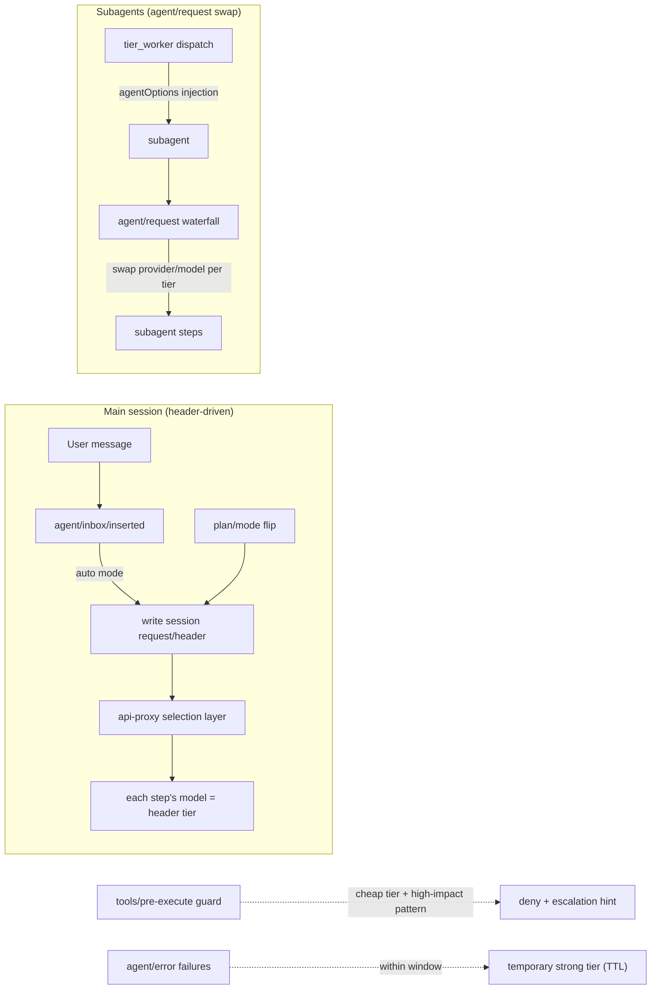
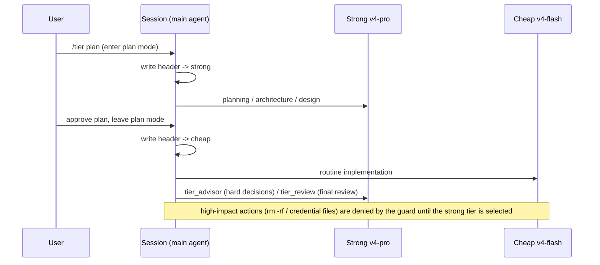

# dsh-tier-router — Tiered model routing for DeepSeek Harness

[](LICENSE)
[](https://github.com/topics/dsh-plugin)

handles planning / architecture / review**, while a **cheap tier (deepseek-v4-flash by
default) handles day-to-day implementation**, with per-tier fallback chains and
task-intensity reasoning effort. Inspired by Claude Code's `/advisor`
(consult a stronger model for hard decisions) and `opusplan` (strong model in plan mode,
cheap model for execution), implemented on DeepSeek Harness through its official seams,
with an escalation gate, failure auto-escalation, and subagent tiering on top.

English · [中文](README.zh.md)

## How it works





## Features

- **Automatic tiered routing (auto mode, opusplan-style)**: steps run on the strong tier
  while plan mode is active and on the cheap tier during execution. Before a loop
  builds its first or resumed request, the router synchronizes the agent's model
  options and durable `request/header`; later route changes preserve unrelated
  request settings such as `maxTokens`.
- **Per-session scoping**: `/tier strong|cheap|auto|delegated|off` affects **only the current
  session**; other sessions in the process keep their own tier (global default `auto`).
  In `delegated` mode the main session stays on its model-picker selection while only
  subagents use tier routing; `/tier auto` remains an explicit per-session override.
  Sessions that should not be managed can opt out with a single `/tier off`.
- **On-demand advice (advisor-style)**: the `/advisor <question>` command and the
  `tier_advisor` tool hand one decision question plus gathered evidence to the strong
  tier and return advice / evidence / risks / acceptance criteria; implementation stays
  on the current tier.
- **Review phase**: the `tier_review` tool and `/tier review <focus>` ask the strong tier
  to review a change set and return an `APPROVE / NEEDS-CHANGES / BLOCKED` verdict with
  issues ranked by severity.
- **Failure auto-escalation**: repeated step errors within a window (default 2 errors /
  60s) temporarily escalate the session to the strong tier (default 180s), expiring via
  TTL; sessions in `off` mode never escalate.
- **Configurable tiers (durable)**: `/tier set <strong|cheap> <provider> <model> [effort]` or the
  `tier_configure` tool can point either tier at any registered provider/model, configure
  the strong tier to follow the session selection, and set ordered fallback chains.
  Configuration persists in the `tier-router` settings namespace and survives restarts
  (pass `sessionOnly: true` for a transient change).
- **WebUI settings**: the Tier routing settings page configures providers, models,
  reasoning effort, follow-session behavior, fallback chains, routing mode, and the
  subagent policy. It uses the live model catalog when available and preserves custom
  routes when it is not.
- **Per-tier fallback chains**: if the primary
  model is unavailable (unknown model, quota, rate limit, missing/invalid credential,
  server/transport error, or any status >= 500 failure), the router changes route at the
  supported request-error boundary and retries the same step on the next entry. Remove
  every entry to disable fallback. Fallback state is per agent and tier, returns to the
  primary after the fallback TTL (default 5 min, `state.fallbackTtlMs`), and never
  crosses from a cheap chain to a strong chain during a plan transition.
- **Task-intensity reasoning effort**: the strong tier follows your session model
  selection by default (`/tier set strong follow-session`); the cheap tier starts at
  `medium` and raises itself to `high`/`max` (bounded by the model's declared efforts,
  e.g. deepseek models declare off/high/max) on cheap-tier retry errors, high-impact guard
  denials, or the `tier_escalate_effort` tool; `/tier effort <medium|high|max>` sets it
  manually. `tier_configure` and `/tier set` validate every effort against
  `llm.resolveModelInfo` when metadata is available.

  (pass `sessionOnly: true` for a transient change).
- **High-impact escalation gate (deterministic guard)**: while the cheap tier executes,
  `tools/pre-execute` denies high-impact tool calls and requires switching to the strong
  tier first — no reliance on model self-discipline. Guard rules (pure logic in
  `lib/pure.js`, unit-tested):
  - every `rm -rf` spelling: combined flags (`-rf`), split flags (`-r -f`), case variants
    (`-R`), long flags (`--recursive --force`), runner prefixes (`sudo rm -rf`, `busybox rm`);
  - destructive commands: `mkfs`, `dd if=`, `sudo`, `shutdown/reboot/halt`,
    `git push --force/-f`, `git clean -f*`, `find ... -delete` / `find ... -exec rm`,
    `python -c` with `shutil.rmtree` / `os.remove`, `curl|sh`, `wget|sh`,
    `chmod` on `.ssh`, `chown`;
  - sensitive paths: `.env` (whitelist for `.env.example/.template`), `credentials`/`secrets`
    with common extensions, `.ssh/`, private keys such as `id_rsa` (case-insensitive),
    `.pem`, `.key`;
  - prose never false-positives: `echo rm -rf`, `grep sudo` do not trigger
    (command-position anchored).
- **Subagent tiering**: `tier_worker` dispatches bounded task packets to a fresh subagent
  on a chosen tier (`agentOptions` model injection), with `outputSchema` (structured
  results), `toolFilter` (restrict worker tools), `maxDepth` (delegation-depth cap),
  `persona` (per-child persona) and `background` (run via the jobs service).
  `/tier subagent <inherit|cheap|strong>` also routes ordinary `subagent` and
  `subagent_fork` children before their first request; an automatic escalation remains
  temporary and never permanently overrides an explicitly selected worker tier.
- **Escalation rules injected into the system prompt**: ambiguity unresolved,
  architecture / security / data integrity, two failed attempts, high-risk completion —
  the model is guided to call `tier_advisor` / `tier_review` at decision points.

## Installation

> **Plane note.** `dsh-tier-router` routing remains **agent-plane**: tools,
> slash commands, prompt sections, and routing listeners mount only when a
> session uses `tiered`. Its profile bundle now has one host-only responsibility:
> synchronize the packaged `tiered` preset into DSH's discovery root on startup.

```sh
# 1. Install into the profile. The host bundle synchronizes the packaged
#    tiered preset into ~/.dsh/.agent-presets on the next DSH startup.
dsh plugin --profile web add dsh-tier-router

# Local development uses the same installation path:
dsh plugin --profile web add .

# 2. Restart DSH, then choose "tiered" in the preset picker
#    for a new session (or make it the profile default through agent-presets).
#    No manual preset copy is required.
```

Uninstall: run `dsh plugin --profile web remove dsh-tier-router`; the next DSH
startup no longer updates the `tiered` preset. Delete
`~/.dsh/.agent-presets/tiered` separately only when it is no longer wanted.

Installation is verified in practice: the package resolves from the profile
store, the shipped `agent-presets/tiered` preset (a `standard` copy plus the
`- id: tier-routing / name: dsh-tier-router` row) passes
`agentPresets.standingKeyFor` mount validation, module loading is smoke-tested,
and `npm pack` ships a clean tarball (lib + patch + preset + README/LICENSE).

### Post-install acceptance checklist

1. **Restart** DSH: kill the process LISTENing on the web port first
   (`lsof -tiTCP:<port> -sTCP:LISTEN | xargs kill -9`), then start it again.
2. **Open a NEW session** — existing sessions keep the preset they were created
   with (this is by design).
3. Run `/tier status` — it must report:
   - `config persisted: yes (tier-router settings namespace)`,
   - both tiers with their provider/model/effort,
   - a non-empty `diag:` line with live counters.
4. The `tier_status`, `tier_route`, `tier_configure`, `tier_advisor`,
   `tier_review`, and `tier_worker` tools must be callable in that session.
5. While executing on the cheap tier, a high-impact command (e.g. `rm -rf`,
   `sudo …`) must be denied by the guard with an escalation hint.
6. `/tier set strong <provider> <model> [effort]` must reply `Saved to
   tier-router settings.` and survive a restart.

If `/tier status` is unavailable, the row is missing from the session's preset
(see Installation) or the session predates the preset switch.

## Usage

### Slash commands (typed in the composer; they affect only the current session)

```
/advisor <question>                          # one strong-tier consultation
/tier status                                # routing state, escalation state, diagnostics
/tier strong | cheap                        # force one tier for this session (optionally persist as session default)
/tier auto                                  # restore auto for this session (plan -> strong, execution -> cheap)
/tier delegated                             # keep the main session on the model picker; tier only subagents
/tier off                                   # disable routing for this session, restore its default model (other sessions unaffected)
/tier plan                                  # auto + enter plan mode, apply the strong header immediately
/tier models                                # list registered providers and their models
/tier set <strong|cheap> <provider> <model> [effort]
/tier subagent <inherit|cheap|strong>       # policy used to classify subagent execution (guard)
/tier review <focus>                        # strong-tier review
```

Sample output (`/tier status`):

```
Tiered model routing
  mode: global=auto, this session=auto (per-session via /tier strong|cheap|auto|delegated|off; escalate: 2 errors / 60s window -> 180s strong)
  strong: deepseek-official/deepseek-v4-pro (max)
  cheap:  deepseek-official/deepseek-v4-flash (medium)
  subagents: inherit
  diag: requestSteps=42 guardChecks=31 guardDenies=3 headerWrites=4 errorsSeen=0 escalations=0
  session default: deepseek-official/deepseek-v4-pro (max)
  providers: deepseek-official, opencode-go, minimax
```

### Model tools (called by the model when needed)

| Tool | Purpose |
| --- | --- |
| `tier_advisor` | Strong-tier consultation: one question + evidence -> advice / risks / acceptance criteria |
| `tier_review` | Strong-tier review: change set + validation results -> verdict with ranked issues |
| `tier_route` | Set **this session's** tier (strong/cheap/auto/delegated/off, optionally persisted) |
| `tier_configure` | Reconfigure either tier's provider/model/effort and the subagent policy |
| `tier_worker` | Dispatch a bounded task packet to a subagent on a chosen tier; supports outputSchema / toolFilter / maxDepth / persona |
| `tier_status` | Read-only diagnostics: global & session tiers, escalation state, listener counters, effective tier |

## Configuration

Runtime configuration (no restart needed):

```sh
/tier set strong deepseek-official deepseek-v4-pro max
/tier set cheap deepseek-official deepseek-v4-flash medium
```

`/tier set` and `tier_configure` persist the tier configuration in the `tier-router`
settings namespace (survives restarts; pass `sessionOnly: true` for a transient change).
`tier_route strong|cheap|delegated` scopes to the current session and does NOT persist by default;
pass `persist: true` to also write the session default model (`agent-default-model`).
Failure auto-escalation parameters (threshold / window / TTL) are currently built-in
constants; configurable in a later version.

## Tests

```sh
npm test        # node:test — 20 cases: guard positive/negative matrix, tier decision precedence, per-session overrides
npm run check   # syntax check for lib/index.js and lib/pure.js
```

Verified in live multi-round sessions (dynamic-plugin form):

| Area | Result |
| --- | --- |
| Main-session per-step routing (durable log evidence) | ✅ `request/header` events show the pro -> flash switch |
| Guard matrix (auto/strong/off) | ✅ auto denies / strong allows / off allows + restores default / auto-restored denies |
| Guard hardening (split flags, runner prefixes, prose, .env whitelist, case) | ✅ 7/7 live probes |
| Tools, positive paths | ✅ advisor/review hit the strong tier; route modes; configure; worker on both spawn and fork providers |
| Worker options | ✅ outputSchema structured result, toolFilter restriction, maxDepth rejection, invalid filter error |
| Tools, negative paths | ✅ invalid provider rejected, invalid subagent provider error |
| Subagent tiering | ✅ cheap tier on flash, strong tier on pro (child logs + return values) |
| Failure-escalation event path | ✅ `agent/error` fires, counters increment, off mode correctly skips |
| Lifecycle | ✅ stop removes guard & tools; re-run restores everything and the guard works |
| Persistence | ✅ `agent-default-model` written |
| Cross-turn listener survival | ✅ diagnostic counters keep incrementing across turns |

## FAQ

**Q: Why was another session's model switched automatically?**
Early versions were process-global. Since v0.3.0 `/tier` commands scope to the **current
session** only; other sessions default to `auto` independently. A session that should not
be managed runs `/tier off` to opt out.

**Q: The tier switch did not take effect immediately?**
Tier switches are written to the session header before the step is built, so they apply
from the **next step** (one-step delay).

**Q: How do I use subscription-channel models (OpenCode Go / MiniMax)?**
Run `/tier models` to confirm the provider is registered and its models are configured,
then `/tier set cheap opencode-go deepseek-v4-flash`. pi-ai-style providers must declare
`baseURL` / `api` / `models` in settings.yaml, otherwise every model id is rejected.

**Q: A high-impact action was blocked. What now?**
The guard's message tells you: switch to the strong tier first (`tier_route strong` or
`/tier strong`) and re-issue — the block exists precisely to keep the cheap tier from
running destructive actions directly.

**Q: `/tier` does not appear after installing the bundle?**
The package is an agent-plane plugin: it must be a row in the agent preset your
session uses (see Installation). A host bundle row alone activates nothing —
agent-plane services (`tools`, `commands`, `systemPrompt`) are only reachable
from the preset scope, and this package ships no host insert by design. After
adding the row, restart `dsh web` and verify with `/tier status`. (The
dynamic-plugin form is a process-local temporary instance and disappears on
restart.)

## Known limitations

- Tier switches take effect from the next step (the header is written before the step builds).
- The subagent policy (`/tier subagent`) is process-wide and classifies child execution
  for the guard. A worker's tier is fixed at creation (`tier_worker` agentOptions); built-in
  `subagent`/`subagent_fork` children inherit the parent's model route.
- The full live "fail -> self-heal" sequence for failure auto-escalation has been verified
  at the event path and unit-logic level; trigger it live per the FAQ if desired.

## License

MIT