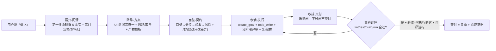

<div align="center">
  <h3>🔥 智子不只是设计 copilot——它还要「开口即干 · 眼随人动」</h3>
  <p>
    <b>🎙 语音实时交互</b>（内置 / 本地大模型 whisper+Ollama+Piper，三驱动下拉可选） ·
    <b>👁 视觉实时交互</b>（眼球跟随摄像头人形，对接 uvc-camera） ·
    <b>🧠 产品设计 copilot</b>（五策 + 质量闸，不过闸不交付）
  </p>
  <sub>↑ 规划中亮点，落地中</sub>
</div>

# 👁️ 三体智子 dsh-ui-three-body — 给 DeepSeek Harness 装上「产品设计 copilot」

<p align="center">
  
  
  
  
  
</p>

> **把一句话人话，逼成一份可评审、可执行、可落地、可验收的产品方案；并且不过闸不交付。**
> **🎙 语音实时交互（规划中）**：内置 / 本地大模型（whisper + Ollama + Piper）三驱动下拉可选，开口即可指挥智子在 DSH 上实时开发、跨工作区干活。
> **👁 视觉实时交互（规划中）**：眼球实时跟随摄像头里的人形移动（视觉跟踪，对接 uvc-camera）。
> 全自研、零第三方记忆框架、不改 DSH 源码、一条命令安装——为你装一个「自己说了算」的、可 git 管理的本地交付流水线。

<p align="center"><strong>⭐ 觉得好用就点个 Star</strong>，让更多被「AI 交付不放心」困扰的人用上它。<br/><sub>一条命令：<code>dsh plugin --profile web add dsh-ui-three-body</code></sub></p>

---

<p align="center">
  
  <br/><em>悬浮智子：11 款动态皮肤 · 瞳孔旋转 · 幽灵闪现（动态演示）</em>
</p>

---

## 🔥 痛点：用 AGENT 产品的人，为什么会「失望」？

| # | 痛点（绝大多数 AI 产品共通的硬伤） | 没有流程/验收的后果 |
|---|---|---|
| 1 | **需求一上来就写代码** | 理解错方向，写完才发现返工，白烧一轮 token |
| 2 | **方案长啥样都看不见** | 只能脑补，评审靠猜，改来改去没准头 |
| 3 | **输出格式漂移** | 结构乱、无法复用、没法进流程 |
| 4 | **过度工程** | 写了一堆不该写的，越改越复杂 |
| 5 | **AI 说「完成了」，但不知对不对** | 无验收、无验证证据，你敢直接用吗？ |
| 6 | **token 白烧，越聊越贵** | 上下文增长失控，成本不可控 |
| 7 | **小改动也走大流程** | 杀鸡用牛刀，繁琐到不想用 |

> 这不是模型不够聪明，是**没流程、没结构、没验收**。而解法，正是——**按规模定策略 + 契约过审 + 可执行验收**。

---

## 🚀 装上它之后：痛点逐一被解决

| 痛点 | 装上智子后 | 靠什么实现 |
|---|---|---|
| ① 需求理解错 | 先第一性原理拆 5 可核事实，一次问清 | 智子展开（一次问齐，绝不脑补） |
| ② 方案看不见 | UI 前置三选一 + **HTML 样板**，点着定版 | 降维定版（4 样板/1 样板/仅 markdown，按 dsh-theme） |
| ③ 格式漂移 | 契约输出成**可解析对象** + 产物模板 | 面壁契约（Instructor 式结构化） |
| ④ 过度工程 | **按规模路由 S/M/L**，小任务走最懒原则 | 规模三问定档（YAGNI） |
| ⑤ 无法验收 | **验收=可执行断言** + 真实验证环 + 自评达标 | 质量闸（不过闸不交付） |
| ⑥ token 白烧 | **AI 模式 = token 总闸**（关=每轮零 token） | 零消耗保证 |
| ⑦ 小改动大流程 | **S/M/L 自适应**，过程跟着任务大小走 | 规模路由 + 边做边升/降档 |
| ⑧ 想开口指挥，不想打字 | **语音实时交互**（规划中）：内置 / 本地大模型 / 其他三驱动 | 语音驱动下拉配置 + whisper/Ollama/Piper |



---

## 🧬 核心内核设计：为什么是「五策 + 质量闸」，且借鉴了主流 star 项目

智子的内核不是一个孤例，而是**吸收了当前主流 agent 工程的方法论**。每一层都有出处：

| 内核模块 | 自研实现 | 借鉴（热门项目） | 借了什么 |
|---|---|---|---|
| **规模路由（S/M/L）** | 三问定档（改动面/风险面/交付面） | T-shirt sizing（PM/工程通用） | 按任务大小选策略，流程跟着规模走 |
| **最懒编码（S 档）** | YAGNI、stdlib 优先、不加未请求抽象（**源自 Karpathy**） | [ponytail](https://github.com/DietrichGebert/ponytail)（~5k+） | 小任务只写该写的，消灭过度工程 |
| **外科手术式 diff（铁律 4）** | 外科手术式修改：只改必须改的；不改无关代码/注释/格式；不重构没坏的部分；只清自己造成的孤儿；每行 diff 必须可回溯到{{master}}需求 | [multica-ai/andrej-karpathy-skills](https://github.com/multica-ai/andrej-karpathy-skills)（**207K★ / 21K fork**，现象级；Karpathy #3） | 编码洁癖：消除 drive-by 重构、随手优化、孤儿不删 |
| **计划过审（M 档）** | 契约准/驳门，改只改差异 | [superpowers](https://github.com/obra/superpowers)（~30k+） | 先「计划→过审→实现」再动手 |
| **编排/状态机（L 档）** | 可循环/分支/重试/持久化 | [LangGraph](https://github.com/langchain-ai/langgraph)（~15k+） | 长任务可控、可断点续 |
| **可度量优化（L 档）** | 声明式 + 可迭代 | [DSPy](https://github.com/stanfordnlp/dspy)（~22k+） | 方案可量化、可 benchmark 驱动 |
| **结构化产物** | 契约/产物输出成可解析对象 | [Instructor](https://github.com/567-labs/instructor) / [Outlines](https://github.com/outlines-dev/outlines)（~10k/~13k） | 格式零漂移，不再靠「文字想象」 |
| **可测验收** | 验收=可执行断言 + 自评达标 | [promptfoo](https://github.com/promptfoo/promptfoo) / [DeepEval](https://github.com/confident-ai/deepeval)（~8k/~6k） | 把「不写空话」变真可测，达标才交付 |
| **自主执行（L 档）** | 真写码/跑测/提 PR | [OpenHands](https://github.com/All-Hands-AI/OpenHands)（~45k+） | 真干活而非空谈 |

> **与其他热门流程方案的思路同向（拆解→定版→过审→验证），但定位不同**：主打「产品设计 + 人机硬审核 + 可评审产物 + token 经济」的 **DSH 原生交付流水线**，不改源码、零第三方运行时。

---

## ✨ 功能总览

<details>
<summary><b>🧠 智子内核：五策 + 规模路由 + 质量闸</b></summary>

- **三铁律**：第一性原理 / 目标导向 / 惜 token
- **智子五策**：展开·问清 → 降维·方案 → 面壁·契约 → 水滴·执行 → 收拢·交付（一次问清、一次定稿、绝不反复问）
- **规模路由（S/M/L）**：三问定档，小任务最懒、大任务全量；边做边升/降档
- **质量闸**：①真验证环 ②验收=可执行断言 ③自评达标(有benchmark才启用) ④人审+回滚+契约外停手——**不过闸不交付**
- 三档 × 双语（minimal/balanced/full × zh/en × 语气/自称/称呼）

</details>

<details>
<summary><b>🎨 UI 交付前置定版 + 方案呈现规范</b></summary>

- **UI 前置三选一**（GUI/Web/手机端必做）：每套 UI **4 样板 / 1 样板 / 仅 markdown**（开发架构+生产流程+拓扑图，规范参考 dsh-theme），一次问清、定版后不再打扰
- **方案呈现**：可见可点 HTML 样板 + 设计 token（配色/字体/间距/圆角）+ 组件清单 + 审美锚点；套真实 `--dsw-alias-*`，绝不硬编码色值
- **反 AI 味**：拒绝居中对称、卡片矩阵、左文右图、emoji 泛滥——出的是作品，不是模版

</details>

<details>
<summary><b>👁️ 悬浮智子：11 款动态皮肤 + 行为 + 进度显示</b></summary>

- **11 款皮肤**：原色（人眼）/ 深渊 / 宇宙死瞳 / **写轮眼 / 万花筒 / 轮回眼 / 三体智子** / 白眼 / 血瞳 / 尸瞳 / 魔瞳——瞳孔旋转/脉冲、光晕脉冲、血雾/灰烬/火舌/幽灵光带全动态
- **行为**：随机眨眼、眼睛跟随鼠标（命令式 GPU 合成，零 re-render）、东张西望（rAF 丝滑）
- **幽灵模式**：鼠标静止 n 秒 → 100% 闪现到随机点位；东张西望/原地休息可配
- **头顶进度 + 短标题**：常驻进度条 + 简短目标标题，悬浮/点击展开完整步骤列表（可开关）
- **三体台词**：每隔 5-10 秒随机说一句《三体》名句（"给岁月以文明""弱小和无知不是生存的障碍，傲慢才是"等，可关）

</details>

<details>
<summary><b>🎙 语音实时交互 + 跨会话工作区（规划中，热点）</b></summary>

- **三驱动下拉可配**：`内置(浏览器 Web Speech)` / `本地(whisper.cpp + Ollama + Piper)` / `其他(自定义服务)`
- **开口即干**：语音 → `/tame 指令` → 智子五策执行；应答 TTS 播报 + 头顶进度同步
- **跨工作区**：语音切会话工作区，在对应会话里指挥智子开发
- **阶段③**：本地大模型全双工实时语音 + 打断 + 多轮

</details>

<details>
<summary><b>👁 视觉实时交互 · 眼球跟随摄像头人形（规划中，对接 uvc-camera）</b></summary>

- **三驱动下拉**：`uvc-camera(本地检测)` / `内置(浏览器 getUserMedia)` / `其他(自定义坐标源)`
- **视觉跟踪**：眼球实时跟随摄像头里的人形移动（OpenCV/MediaPipe/YOLO 检测 → 坐标 → 眼球 transform 跟随）
- **可配**：摄像头 / 灵敏度 / 平滑 / 置信阈值；语音说「看着那个人」联动切换

</details>

<p align="center">
  
  <br/><em>智子核心：悬停展开「目标显示」——头顶进度 + 智子五策，任务步列表实时同步</em>
</p>
<p align="center">
  
  <br/><em>智子三体台词：紫色智子 + 《三体》名句「给岁月以文明，而不是给文明以岁月。」</em>
</p>

---

## 🚀 安装（一条命令）

```bash
# 已发布后（npm）—— 跨平台通用
dsh plugin --profile web add dsh-ui-three-body

# 从 GitHub
dsh plugin --profile web add github:EternalNight996/dsh-ui-three-body

# 本地联调（改代码即时生效）
dsh plugin --profile web add F:/MyApp/eternal/dsh-ui-three-body
```

> 提示：
> - `dsh` 为 DSH CLI（`npm i -g @deepseek-ai/dsh`）。
> - 要**官方最新**（避免 npmmirror 滞后）：`npm_config_registry=https://registry.npmjs.org/ dsh plugin --profile web add dsh-ui-three-body`。
> - **profile 是 pnpm workspace**：`cd ~/.dsh/profiles/web && pnpm add dsh-ui-three-body@latest`（`npm install` 会报 `EUNSUPPORTEDPROTOCOL`）。
> - 推荐搭配 [**dsh-desktop**](https://github.com/EternalNight996/dsh-desktop) 桌面壳使用。

装完**重启 dsh web**：悬浮智子出现在屏幕右侧，点击弹菜单、长按拖拽；设置 → 三体 可配全部选项。

### 🧭 插件发现 / 收录标准

仓库已打 **GitHub `dsh-plugin` topic** 并符合社区标准结构，**自动被以下机制发现**（无需手动 PR）：

| 机制 | 收录方式 | 状态 |
|---|---|---|
| **dsh-marketplace**（ouyangyipeng） | 实时读 `topic:dsh-plugin` | ✅ topic 已打 |
| **dsh-find-plugin**（awesome-dsh-plugin） | 会话内按 topic+星数搜索 | ✅ |
| **dsh-plugin-marketplace**（YELEBAI） | 每 2h 自动扫描 + 静态验证进入 Registry | ✅ 已声明 `dsh.marketplace` 元数据 |

---

## 🔧 设置（设置 → 三体）

| 设置项 | 默认 | 说明 |
|---|---|---|
| 智子活动（内核开智） | 开 | 总开关 |
| **AI 模式** | 开 | **token 总闸**：关 = 每轮零内核 token（纯装饰） |
| 悬浮智子 | 开 | 显示智子，点击开关内核、长按拖拽 |
| 尺寸 | 微 | 极微/微/小/中/大 |
| 皮肤 | 原色 | 11 款分段选择 |
| 幽灵模式 | 关 | 开关 / 间隔秒数 / 东张西望 / 闪现 |
| 目标显示 | 开 | 头顶「进度 + 短标题」，悬浮展开完整步骤 |
| 三体台词 | 开 | 每隔 5-10 秒随机说一句《三体》名句 |
| 内核档位 | balanced | minimal / balanced / full |
| 语言 / 语气 / 自称 / 称呼 | zh / 傲慢 / 本尊 / 主上 | 内核人设可配 |
| 需求剖析工具 | 关 | `beast_analyze`（每次调用多一次模型请求） |
| 内核覆盖 | 空 | 自定义内核文本（优先级最高） |

---

## 🛠 开发 / 构建 / 测试

```bash
pnpm i
pnpm build        # 只改 client（src/client）时需要
# 改 index.js / lib/kernel.js 无需构建，重启即生效
```

```
dsh-ui-three-body/
├── index.js              # host 插件：内核注入 + settings 命名空间（无构建，即装即用）
├── lib/
│   ├── kernel.js         # 智子内核文案（minimal/balanced/full × zh/en × 语气）
│   └── client.js         # client bundle（构建产物，__ModuleLoader__ 格式）
├── src/client/index.tsx  # client 源码：悬浮智子 + 皮肤系统 + 幽灵模式 + 设置分区
├── assets/screen/        # README 演示素材（sophon-demo.gif 等）
├── cordis.patch.yml      # bundle 补丁层（host 行，安装自动挂载）
├── build.mjs             # esbuild 构建脚本（TSX → lib/client.js）
└── package.json          # bundle/client 清单（dsh.bundle.patch + dsh.client）
```

---

## 🗺 Roadmap / 待办（功能性优先）

**已实现**：
- 目标显示开关（进度 + 短标题，头顶文本已加宽）
- 三体台词（每隔 5-10 秒随机《三体》名句）+ 移除自主意识/反人类台词
- 皮肤炫光升级（旋转能量环 + 双层脉冲强光）
- skill-catalog 瘦身（`~/.agents/skills` 110 → 51）
- **自愈续跑**：API 失败自动退避重试/换 provider、等待不假死、断点续跑（已落地内核）

**待办（核心功能优化）**：
- [x] **规模路由（三问定档）**：S/M/L 选五策深度 + 质量闸，边做边升/降档（已落地内核）
- [x] **契约结构化**：把「目标/分步/验收/风险」输出成可解析对象（已落地：`{goal,steps,acceptance,risks}`）
- [x] **验收可测**：验收=可执行断言；质量闸已入库
- [x] **自愈续跑**：半途不死停（API 重试/换 provider/等待兜底/断点续跑）——已落地
- [ ] **产物模板规范化**：四节 markdown（架构/流程/拓扑图）模板化，按 dsh-theme
- [ ] **可度量 benchmark**：五策 vs 无内核小样本对比（质量/轮次/token）
- [ ] **本地大模型语音实时对话 + 跨会话工作区开发**（分阶段，可行性详见正文）

<details>
<summary><b>🎙 语音实时对话 + 跨会话工作区（详细待办）</b></summary>

**核心设置（语音驱动方式，下拉可配置）**：
- `voiceEnabled`（语音总开关）
- `voiceDriver` **下拉**：`内置(浏览器 Web Speech)` / `本地(whisper.cpp + Ollama + Piper)` / `其他(自定义/第三方服务)`
- `voiceEndpoint` / `voiceModel`（本地/其他方式所需的端点与模型配置）

**阶段① 语音 → 文本指令 → 智子执行（单会话）**
- [ ] 前端：`MediaRecorder` 录音 + VAD 活动检测 + 打断（说「停」可中止）
- [ ] 驱动落地：`内置` 走浏览器 Web Speech；`本地` 走 WS 接 whisper(STT) → Ollama(LLM 驱动智子内核) → Piper(TTS)；`其他` 走自定义服务
- [ ] 语义层：语音 → `/tame 指令` → 智子五策执行（复用现有内核，受 aiMode 管控）
- [ ] 反馈：智子应答 TTS 播报 + 头顶进度/气泡同步

**阶段② 跨会话工作区切换（需 DSH 会话 API）**
- [ ] 读会话列表 → 语音切工作区 → 在对应会话注入并执行开发任务

**阶段③ 本地大模型双向实时语音**
- [ ] 本地服务：whisper.cpp(STT) + Ollama(LLM) + Piper(TTS)，一条命令起
- [ ] 全双工流式 + 打断 + 连续多轮对话

</details>

- [ ] **视觉实时交互：眼球跟随摄像头人形移动（视觉跟踪，对接 uvc-camera）**

<details>
<summary><b>🎥 视觉实时交互 · 眼球跟随摄像头人形（详细待办，对接 uvc-camera）</b></summary>

**核心设置（视觉驱动，下拉可配置）**：
- `visionEnabled`（视觉跟踪总开关）
- `visionDriver` **下拉**：`uvc-camera(本地检测)` / `内置(浏览器 getUserMedia + 检测)` / `其他(自定义坐标源)`
- `cameraDevice`（摄像头选择）、`trackSensitivity`（跟随灵敏度/平滑）、`detectConfidence`（检测置信阈值）

**链路细分（uvc-camera 已提供帧源，检测层需补）**：
- [ ] **帧源**（uvc-camera，已有）：枚举 UVC 相机 + 后台预览流取帧（非阻塞 `frame()`）
- [ ] **人形/人脸检测**（需加）：对帧做人形/人脸/姿态检测（OpenCV Haar / MediaPipe Pose+Face / 可选 YOLO）→ 输出目标中心坐标（本地服务；或 uvc-camera 加可选 `detect` feature）
- [ ] **通道**：本地检测服务 → DSH 智子 client（WS/HTTP）实时坐标流
- [ ] **智子跟随**：眼球 `transform` 跟随目标坐标（复用现有命令式 GPU 合成；无目标回退跟随鼠标）
- [ ] **可配**：开关 / 摄像头 / 灵敏度 / 平滑 / 置信阈值；语音说「看着那个人」联动切换到视觉跟踪
- [ ] **依赖**：uvc-camera(帧)、本地检测(MediaPipe/OpenCV/YOLO)；**无需 DSH 改造**（复用 client 眼球跟随）

</details>

---

## 📦 发布记录

- **v0.2.7**：**仓库清理 + 资产压缩 + npm 包瘦身**：删 snake.html / restart-dsh.ps1 / assets/pet.svg / docs/{ANALYZE,ARCHITECTURE,MASCOT,CHARACTER360_CODE,DEEP_THEME_SPEC,TRAINING}.md / .dsh-vision-router；4 张演示图转 webp（**3.8MB → 1.1MB，-71%**）；npm 包 **3.9MB → 1.2MB（-69%）**；`files` 白名单 11 文件。
- **v0.2.6**：README 追补 v0.2.5 硬化说明；内核权威背书表加入 [multica-ai/andrej-karpathy-skills](https://github.com/multica-ai/andrej-karpathy-skills)（**207K star / 21K fork**，现象级）。
- **v0.2.5**：内核系统性硬化 9 项：A1 tone minimal 修复 / A2 契约 status 枚举 / B1 EN 契约禁词修正 / B2 S 档实际轻量化 / **B3 EN 全文同步 ZH** / **C1 新增铁律 4 外科手术式 diff**（源自 Karpathy #3）/ C2 L 无 benchmark 硬闸回退明确 / D1 persona 注入防护(长度≤16+剥控制字符) / E1 质量闸诚实边界。
- **v0.2.4**：README 总标题上方加「视觉与语言交互」热点横幅。
- **v0.2.3**：**语音实时交互 + 跨会话工作区**立项并列入热点卖点（三驱动下拉配置/whisper+Ollama+Piper 规划）；设置「内核档位」移到顶部；内置 18 条《三体》名句问候；头顶进度文本加宽；内核新增**自愈续跑**(API 重试/换provider/等待兜底/断点续跑) + **契约结构化** + **验收=可执行断言**；README 重构为 dsh-memory 排版（痛点/内核权威背书/五策质量闸）。
- **v0.2.2**：问候扩充 18 条《三体》名句(含微调) / 头顶文本加宽 / 自愈续跑落地 / 契约结构化 / 语音待办立项。
- **v0.2.1**：目标显示精简(进度+短标题) / 问候改《三体》名句(去自主意识词) / 内核五步改名「智子五策」+ UI 前置三选一 / 皮肤炫光升级 / skill-catalog 瘦身 / README 重构(痛点+内核权威背书+五策质量闸)。
- **v0.2**：皮肤系统大改 11 款 / 幽灵模式 / AI 模式 token 总闸 / 设置顶层分区 + 浮层一键直达 / 菜单命令 / 渲染性能 / 背景透明。
- **v0.1.0**：首个可用版本（五步内核 + 悬浮智子 + 基础皮肤 + 首次唤醒弹窗）。

---

## 📄 License

MIT

---

> **让 DSH 真正听懂并交付：需求一次问清，产物可看可评，验收不过闸不交付。**　⭐ 觉得有用就点个 Star，Let's make AI deliver.
