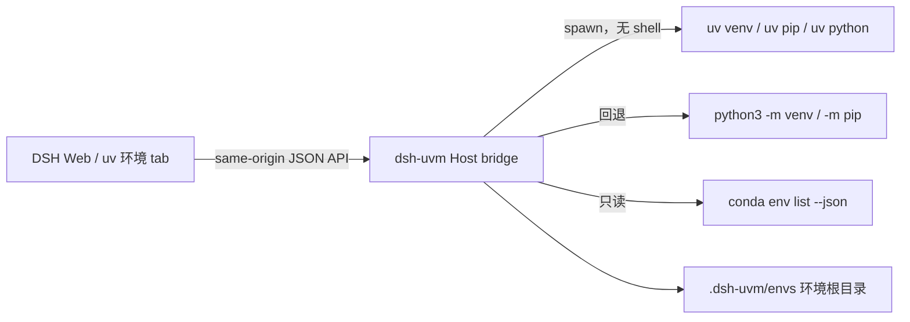

<h1 align="center">dsh-uvm</h1>

<p align="center">
  <strong>DSH 原生 uv 环境管理器：在 DSH Web 里创建、安装、同步、运行 Python 虚拟环境。</strong><br />
  uv 为主管理器，pip 作为回退适配器，conda 环境只读可见。
</p>

<p align="center">
  
  
  
  <a href="LICENSE"></a>
</p>

> [!IMPORTANT]
> 这是面向 DeepSeek Harness (DSH) 的独立、非官方插件。所有命令只在本机执行，任何写入都限制在插件管理的环境根目录内。

## 这是什么

DSH 原生标签页（`设置 → 插件 → uv 环境`），把 uv 的 venv 生命周期搬进 DSH Web：

- **工具链医生（doctor）**：自动探测本机 `uv` / `pip`（经 `python -m pip`）/ `conda` 的路径与版本，`uv python list --only-installed` 提供可选 Python 版本。
- **环境列表**：读取插件管理目录下的全部 `pyvenv.cfg`，标注每个环境的 Python 版本与创建来源（uv / pip）。
- **创建 / 删除**：`uv venv <root>/<name> --python <版本>`；无 uv 时回退 `python -m venv`。删除前二次确认，路径严格限制在环境根目录内。
- **安装 / 卸载**：`uv pip install|uninstall --python <venv>`；回退 `python -m pip`。
- **同步**：把 requirements 内容经 stdin 写入 `uv pip install -r -`（等价 `uv pip sync` 语义，锁定文件同步在路线图中）。
- **项目同步（M2）**：指向本地项目，静态解析 `pyproject.toml` 依赖声明与 `uv.lock` 锁定版本，和环境已装包做差异预览（已满足 / 缺失 / 版本漂移），确认后再应用；预览不访问网络，无变更时自动跳过。
- **运行**：在环境内运行 `python <args>` 或 `python -m pip <args>`，60 秒超时、输出上限 512 KB。
- **conda 只读**：`conda env list --json` 仅展示，插件不修改 conda 环境。

设计理念借鉴 [AgentWorkOS](https://github.com/Harzva/AgentWorkOS)：环境是可声明、可体检、可同步的工作区资产，而不是散落在磁盘上的隐式状态。



DSH 始终是宿主与 UI；uv 继续拥有真实的虚拟环境、缓存与 Python 版本管理。插件不打包 uv，不上传任何环境数据，也不修改 conda 或全局 pip 状态。

## 安全边界

- 所有路由只接受 **loopback + 同源** 请求，其余一律 403。
- 子进程全部经 `spawn` 参数数组调用，**不经过 shell**；包规格、环境名、运行参数均有白名单校验。
- 环境名必须匹配 `[A-Za-z0-9][A-Za-z0-9._-]{0,63}`；路径先校验再解析，并复核必须位于环境根目录内。
- 单次请求体积、包数量、参数数量、输出体积、执行时长均有上限。
- 插件不会读取 DSH 会话、凭据或用户其它目录；`pyvenv.cfg` 原始内容（含 home 路径）不会返回给客户端。

## 快速开始

### 1. 准备工具链（任一即可）

```powershell
uv --version        # 首选：uv 0.5+
python3 -m pip --version  # 回退路径
conda --version     # 可选，只读可见
```

### 2. 构建并打包插件

```powershell
git clone https://github.com/Harzva/dsh-uvm.git
cd dsh-uvm
pnpm install --frozen-lockfile
pnpm check
pnpm run pack:dsh
```

### 3. 安装进 DSH Web 配置文件

```powershell
dsh plugin --profile web add ./artifacts/harness-flow-dsh-uvm-0.1.0-alpha.1.tgz
dsh web
```

也可以直接安装 GitHub Release 产物或仓库地址：

```powershell
dsh plugin --profile web add https://github.com/Harzva/dsh-uvm/releases/latest/download/harness-flow-dsh-uvm-0.1.0-alpha.1.tgz
dsh plugin --profile web add github:Harzva/dsh-uvm
```

环境根目录默认为 `~/.dsh-uvm/envs`。可用环境变量覆盖（`dsh web` 启动前设置）：

```powershell
$env:DSH_UVM_ENV_ROOT    = 'D:\venvs'       # 环境根目录
$env:DSH_UVM_UV_PATH     = 'C:\tools\uv.exe' # 显式 uv 路径
$env:DSH_UVM_PYTHON_PATH = 'C:\Python\python.exe' # 回退解释器
```

## 开发

```powershell
pnpm check              # 构建 + 类型检查 + 18 项测试
pnpm run pack:dsh       # 打包 npm tarball
pnpm run verify:dsh-offline  # 隔离 DSH 配置实测
```

`verify:dsh-offline` 创建临时 DSH Home，把打包产物安装进真实 DSH `0.1.0-rc.6` Web 配置文件，启动本地 Web 并检查 `/dsh-uvm/api/bootstrap` 与客户端模块，随后删除临时配置。**不读取、不修改用户的 DSH 配置**。

## 项目边界

| 仓库 | 职责 |
|---|---|
| [`astral-sh/uv`](https://github.com/astral-sh/uv) | 上游 Python 包与环境管理器 |
| [`Harzva/AgentWorkOS`](https://github.com/Harzva/AgentWorkOS) | 工作区资产管理理念参考 |
| `Harzva/dsh-uvm` | 独立的 DSH 桥与原生 UI |

架构与兼容边界见 [`docs/ARCHITECTURE.md`](docs/ARCHITECTURE.md)，剩余路线见 [`ROADMAP.md`](ROADMAP.md)。

## License

[MIT](LICENSE) © 2026 Harzva
