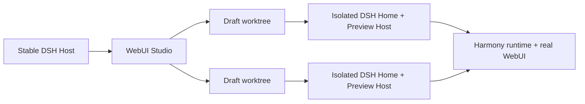

<div align="center">
  <a href="https://github.com/CH4ACKO3/dsh-harmony">
    
  </a>

  <h1>DeepSeek WebUI Studio</h1>

  <p>
    <strong>A visual-first studio for building DSH WebUI plugins.</strong>
    <br />
    Inspect the real interface, edit source, run builds, and validate patches without loading unfinished code into your stable DSH Host.
    <br />
    Powered by <a href="https://github.com/CH4ACKO3/dsh-harmony"><strong>dsh-harmony</strong></a>.
  </p>

  <p>
    <a href="#getting-started"><strong>Get started</strong></a>
    ·
    <a href="https://github.com/memorax-ai/dsh-webui-studio/issues">Report a bug</a>
    ·
    <a href="https://github.com/memorax-ai/dsh-webui-studio/issues">Request a feature</a>
  </p>

  [](LICENSE)
  [](https://github.com/memorax-ai/dsh-webui-studio/actions/workflows/ci.yml)
  [](https://www.npmjs.com/package/dsh-webui-studio)
  [](package.json)
  [](https://github.com/memorax-ai/dsh-webui-studio/stargazers)
  [](https://memorax-ai.github.io/dsh-harmony/)

  [简体中文](README.zh-CN.md) / [English](README.md)
</div>

## A visual workspace for the real DSH WebUI

WebUI Studio is not a mock page builder. It runs against the official DSH WebUI
and its real plugin graph, then turns visual inspection and source edits into
distributable plugin-owned artifacts.

Studio is an independent downstream application of
[`dsh-harmony`](https://github.com/CH4ACKO3/dsh-harmony). It uses Harmony's
public runtime, Patch engine, service API, and CLI control surface together with the
generic React registration API from
[`dsh-harmony-react`](https://github.com/CH4ACKO3/dsh-harmony/tree/main/packages/react).
The dependency direction stays one-way: Studio depends on Harmony; Harmony does
not depend on Studio.

## What you can do

- [x] Create a minimal DSH Web Client plugin or import an existing local plugin folder
- [x] Give every Draft its own Git worktree, `DSH_HOME`, profile, dependencies, and child Host
- [x] Preview the official WebUI without loading Draft code into the stable Host
- [x] Browse normally or inspect DOM, React owners, source candidates, and Patch traces
- [x] Surface plugin-registered Element controls automatically; save defaults and subtree-scoped CSS back to Draft source
- [x] Review Component declaration matches and generate CSS decorators without changing existing call-site props
- [x] Reorder and toggle both Harmony providers and individual Patches through one transactional reload
- [x] Edit Draft source with CodeMirror and protect installed dependency sources as read-only
- [x] Build, apply through Harmony, reload, and confirm the live Client graph revision
- [x] Start a Draft-scoped Agent or continue an existing DSH session with temporary Studio tools, skill, and context
- [x] Let an external Agent inspect the running WebUI through a local read-only Streamable HTTP MCP endpoint
- [x] Answer one-shot tool approvals, structured questions, and plan reviews without leaving Studio
- [x] Check package exports, artifacts, Patch state, ordering, dependencies, and pack output
- [x] Run multiple isolated Draft Preview Hosts at the same time
- [x] Snapshot the current WebUI profile or another local profile into each isolated Draft runtime
- [x] Reorder plugins and enable or disable Harmony Providers through one transactional hot reload

## How it works



The stable Host owns the Studio interface, Draft registry, and Agent sessions.
Each Draft owns an isolated worktree and child Preview Host. A build becomes
active only after the Preview confirms the new live Client graph revision.
Stopping a Draft terminates its child Host but preserves its files and state.
An existing ordinary DSH session can enter Studio mode without losing its
history or identity. Leaving Studio removes the scoped Draft tools, skill, and
context so the session resumes through its ordinary DSH composition.

Studio is served locally at:

```text
http://127.0.0.1:<dsh-port>/studio
```

External Agents can connect to the running instance through MCP at:

```text
http://127.0.0.1:<dsh-port>/studio/mcp
```

A typical MCP client entry is:

```json
{
  "mcpServers": {
    "dsh-webui-studio": {
      "type": "http",
      "url": "http://127.0.0.1:<dsh-port>/studio/mcp"
    }
  }
}
```

Add that URL as a Streamable HTTP MCP server in the external Agent. It exposes
`studio_get_context`, `studio_get_selection`, `studio_get_harmony_profile`,
`studio_inspect_harmony_target`, `studio_read_dependency_source`, and
`studio_preview_status`. These tools inspect the current Host only; the external
Agent remains responsible for editing and building its own WebUI project. Harmony
profile, Patch, and dependency-source inspection work directly from the Host.
DOM selection is available while Studio is open and an element is selected in
the current-instance Preview. The endpoint follows Studio's existing loopback-only
boundary, including access through an SSH loopback tunnel.

Its managed data lives under `$DSH_HOME/studio/`:

```text
studio/
├── workspace.json
├── drafts/<draft-id>.json
├── repositories/<draft-id>/
├── worktrees/<draft-id>/
└── runtimes/<draft-id>/dsh-home/profiles/web/
```

Creating a new plugin initializes and commits a minimal DSH Web Client package.
New plugins stay inside Studio by default. Creation can optionally record an
absolute destination for a new or empty local folder; Studio does not create
or modify that folder until **Save plugin to folder** is used from the instance
panel. Later saves synchronize the Studio-owned project snapshot while leaving
destination-only files such as `node_modules` untouched.
Importing an existing plugin accepts an absolute local folder after validating
its Web Client manifest, then copies an isolated snapshot without `.git` or
`node_modules` into a Studio-owned Git repository. Symbolic links are rejected,
and the original folder is never modified.

Each Draft can start from the stable Host's current `web` profile or from
another local DSH profile selected by absolute folder path. Studio copies that
profile's manifest and configuration into the isolated runtime and resolves
relative `link:` dependencies against the selected source folder. The source
profile remains untouched.

Draft display names are independent from npm package identities and can be
renamed in the instance panel. Studio persists the ordered open tabs and active
Draft in `workspace.json`; closing a tab only removes it from the current
workspace and never stops or deletes the Draft. Unsaved Source changes must be saved with `Ctrl+S` or
`Command+S` before switching or closing tabs.

## Getting started

> [!IMPORTANT]
> Studio requires the public Harmony service and CLI APIs documented in
> [`docs/harmony-api-requirements.md`](docs/harmony-api-requirements.md).
> `dsh-harmony@0.8.7` is the minimum compatible release.

```sh
dsh plugin --profile web add dsh-webui-studio
dsh web
```

Studio includes Harmony as a transitive dependency. On the first visit to
`/studio`, approve **Install Harmony and restart**; the page installs the
launcher and returns to Studio after the local DSH process restarts. No second
package command is required. An existing Harmony launcher skips this setup.

To develop Studio itself from source:

```sh
git clone https://github.com/memorax-ai/dsh-webui-studio.git
cd dsh-webui-studio
npm install
npm run check

dsh plugin --profile web add link:$(pwd)
dsh web
```

To exercise the same single-package installation path as a release artifact:

```sh
studio_tarball="$(npm pack --silent --ignore-scripts)"
dsh plugin --profile web add "file:$(pwd)/${studio_tarball}"
```

Open the Studio URL printed by the local `dsh web` process, create or import a
Draft, and start its Preview Host.

A Draft package must:

- declare `dsh.client.platform: "web"`;
- export `.`, `./client`, and `./package.json`;
- define a non-empty `scripts.build` command.

## Development

| Command | Purpose |
| --- | --- |
| `npm run typecheck` | Check the Host, browser app, and Preview bridge |
| `npm test` | Run the unit and component test suite |
| `npm run build` | Build the Host, Studio UI, and Preview bridge |
| `npm run check` | Run typecheck, tests, build, and packed fresh-install integration |
| `npm run test:integration` | Pack and install the tarball in a fresh DSH home, then exercise Host, Draft, Preview, build, activation, and shutdown end to end |

For isolated Agent environments on a remote Docker host, see
[`docs/remote-development.md`](docs/remote-development.md).

The integration test requires a Harmony build that exposes the APIs described
in the compatibility note above.

## Design boundaries

- The official WebUI keeps its own-origin `/api` and WebSockets; Studio does not proxy them.
- The Preview bridge requires the exact parent origin and a per-start capability.
- Preview DOM, React, source, Patch, and comment data is treated as untrusted evidence.
- Source writes stay inside the selected Draft package and never follow symbolic links outside it.
- Registered element boundaries and Patch traces are candidate evidence, not claims of exact DOM ownership.
- Element controls change the live Preview through plugin bindings. **Save to plugin source** updates declared default initializers and generated subtree-scoped CSS inside the Draft worktree; it never rewrites component use sites or freezes the runtime binding.
- Automatic CSS Patch creation uses a Harmony React Component decorator. Studio shows every matching declaration before writing, adds an immediately available Draft client export, and leaves all existing JSX calls and Props intact.

## Frequently asked questions

### How is Studio different from other WYSIWYG tools?

DSH WebUI changes are delivered through plugins rather than direct edits to
the upstream source. Its interface elements also participate in Cordis plugin
lifecycle and control logic, so the problem extends beyond manipulating static
DOM and CSS. Those constraints call for a dedicated toolkit that understands
the DSH plugin system from preview through distribution.

### Why not simply ask an Agent to edit the source?

Studio still connects to the real Agent inside DSH. It gives that Agent richer
project context, integrated previews, purpose-built tools and skills, and a
tighter edit-build-inspect-validate loop. Studio does not replace the Agent; it
turns source editing into a more capable interactive workflow for both the
Agent and the developer.

### What is Harmony, and why use it?

The DSH WebUI exposes many useful slots, but Studio aims for deeper and more
flexible changes—including UI and behavior introduced by other plugins—while
keeping independently authored modifications as compatible as possible.
[`dsh-harmony`](https://github.com/CH4ACKO3/dsh-harmony) provides the runtime
patching and runtime model that makes this possible.

## Related projects

- [`dsh-harmony`](https://github.com/CH4ACKO3/dsh-harmony) - runtime patching, transactional plugin reloads, and Patch inspection
- [`dsh-harmony-react`](https://github.com/CH4ACKO3/dsh-harmony/tree/main/packages/react) - React-aware Patch factories and Studio element/variable registration

## License

Distributed under the [MIT License](LICENSE).
