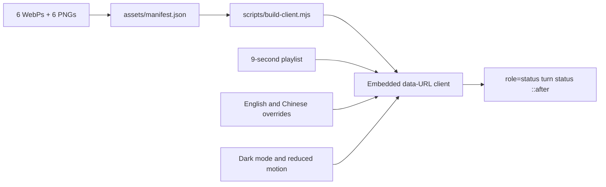

<p align="center">
  
</p>

<p align="center">
  <a href="https://awesome.re"></a>
  <a href="https://awesome-dsh-plugin.com"></a>
  <a href="LICENSE"></a>
  
  
  
</p>

<p align="center">
  <strong>Six original whale loops and a lightweight animation director for the DeepSeek Harness Web turn status.</strong><br />
  Timed rotation, keyword overrides, dark-theme support, zero runtime requests, and a static fallback for every state.
</p>

<p align="center">
  English · <a href="README.zh-CN.md">简体中文</a>
</p>

## Preview

<p align="center">
  
</p>

v0.4.0 replaces the single permanent dive clip with a multi-state system. The current Harness turn surface normally keeps the same `Deep diving...` label throughout a running turn, so the plugin rotates through `dive → sonar → work → compose → idle` every **9 seconds**. If a future or customized UI exposes recognizable search, tool, writing, waiting, or error text, keyword detection overrides the timed playlist immediately.

## Six states

<p align="center">
  
</p>

| State | Motion language | Trigger logic |
|---|---|---|
| **Deep Dive** | Breach, roll, and return below the surface | Playlist; thinking, reasoning, analysis, planning |
| **Sonar** | Echolocation rings propagating from the snout | Playlist; search, browse, lookup, research |
| **Tool Run** | Fast tail cadence, speed trails, and work particles | Playlist; tool, execute, shell, build, test |
| **Stream** | Token-like particles flowing forward | Playlist; writing, generating, responding, streaming |
| **Calm** | Low-amplitude breathing and rising bubbles | Playlist; waiting, queued, paused |
| **Retry** | Restrained body wobble and attention pulse | Error, failure, exception, and retry keywords only |

English and Chinese keywords are included. The ordinary `Deep diving...` label is deliberately not treated as an explicit state, allowing the current UI to show the complete five-state playlist.

## Highlights

| | Feature | What it means |
|---|---|---|
| 🐋 | **Six original frame animations** | Every state uses a 352 × 352 canvas, 48 frames, 40 ms per frame, and a 1.92-second loop. |
| 🎬 | **Dual-track animation director** | The current fixed label uses timed rotation; future status labels use immediate keyword overrides. |
| ♿ | **Per-state reduced motion** | `prefers-reduced-motion` stops playlist rotation and uses the matching PNG frame. |
| 🌗 | **Theme and viewport aware** | System dark mode, `html.dark`, and `data-theme="dark"` invert the monochrome artwork; sizing steps down through 84 / 72 / 60 px. |
| 📦 | **Completely self-contained** | Six WebPs and six PNGs are embedded in `lib/client.js`; activation makes no external request. |
| 🧩 | **Stronger mount selector** | Combines semantic `role="status"` targeting with the `_turnStatus` class fallback. |
| 🫧 | **Lower style intrusion** | Owns only the status element's `::after`; it no longer clears `::before` or changes the label. |
| ♻️ | **Idempotent and lifecycle-clean** | Re-activation removes stale ownership; disposal removes styles, timer, observer, and data attributes. |
| 🔒 | **Strictly visual scope** | No accounts, model tools, storage, workspace reads, networking, or user-content processing. |

## Install

Install the latest release into the DSH Web profile:

```powershell
dsh plugin --profile web add github:LeemanCheung/dsh-whale-animation#v0.4.0
```

Follow the main branch:

```powershell
dsh plugin --profile web add github:LeemanCheung/dsh-whale-animation
```

Hard-refresh DSH Web after installation. Restart DSH if the active profile has already cached its client bundle.

### Upgrade

```powershell
dsh plugin --profile web remove dsh-whale-animation
dsh plugin --profile web add github:LeemanCheung/dsh-whale-animation#v0.4.0
```

### Uninstall

```powershell
dsh plugin --profile web remove dsh-whale-animation
```

## Animation profile

| Property | Value |
|---|---:|
| Animation states | 6 |
| Automatic playlist states | 5 |
| Source canvas | 352 × 352 px |
| Frames per state | 48 |
| Frame duration | 40 ms |
| Loop duration | 1.920 s |
| Playlist interval | 9 seconds |
| CSS display sizes | 84 / 72 / 60 px |
| Animated source total | 1,206,950 bytes |
| Static source total | 54,957 bytes |
| Prebuilt client | about 1.69 MB |
| Runtime asset requests | 0 |

## How it works



`lib/index.js` remains an intentional no-op Host entry. All behavior runs in the browser through `dsh.client`. A MutationObserver handles Harness subtree replacement, while a one-second timer performs only state selection; the browser's animated-WebP decoder handles frame playback.

The current target is:

```css
.Md3f7G_turnStatus[role="status"],
[class*="_turnStatus"][role="status"]
```

The client writes `data-dsh-whale-host` and `data-dsh-whale-state` to the status element, and CSS paints the selected asset through `::after`. Dark mode inverts the monochrome image. Reduced-motion mode selects the corresponding PNG and stays on the default or explicit keyword state instead of rotating.

## Development and verification

Requirements: **Node.js 20+**. Regenerating animation and documentation assets additionally requires Python 3 and Pillow:

```powershell
python -m pip install Pillow
npm run build:assets
npm run build
npm run check
```

| Command | Purpose |
|---|---|
| `npm run build:assets` | Generate six WebPs, six PNGs, the manifest, hero, preview, and gallery |
| `npm run build` | Embed every manifest asset into `lib/client.js` |
| `npm run check` | Validate assets, bundle, director logic, lifecycle, and README artwork |
| `npm run check:browser` | Mount the committed bundle in headless Chromium and capture light/dark smoke screenshots |
| `npm run verify` | Rebuild the client and run the deterministic non-browser check suite |

Checks cover:

- format, size, and SHA-256 for all 12 state assets;
- 48 frames, 40 ms frame duration, and a 1.92-second loop for each WebP;
- exact agreement among source files, manifest entries, and embedded data URLs;
- timed rotation, keyword overrides, error priority, and reduced-motion freezing;
- style installation, MutationObserver, timer disposal, and host-attribute cleanup;
- hero dimensions, the 50-frame README preview, gallery dimensions, and local links;
- prebuilt-client reproducibility, real Chromium state mapping, light/dark screenshots, and `npm pack` in CI.

The design rationale and future roadmap are documented in [`docs/ANIMATION_ROADMAP.zh-CN.md`](docs/ANIMATION_ROADMAP.zh-CN.md).

## Repository layout

```text
assets/
  manifest.json          State timing, sizes, and SHA-256 checksums
  whale-*.webp           Six animated assets
  whale-*.png            Six reduced-motion frames
src/
  client-runtime.js      Director and browser lifecycle source
lib/
  index.js               No-op Host entry
  client.js              Prebuilt DSH Web client with embedded assets
scripts/
  build-whale-assets.py  Generates animation and README visuals
  build-client.mjs       Builds the browser client from the manifest
  check.mjs              Validates assets, bundle, and runtime behavior
  check-readme-assets.py Validates documentation visuals and links
  browser-smoke.html     Browser fixture covering all six resolved states
  check-browser.sh       Runs Chromium smoke checks and light/dark captures
docs/
  hero.png               README hero
  preview.webp           Five-state animated preview
  state-gallery.png      Six-state static gallery
  ANIMATION_ROADMAP.zh-CN.md Design rationale and roadmap
```

`lib/client.js` is committed intentionally so GitHub installation requires neither a build step nor runtime asset downloads.

## Compatibility and limitations

- Targets the **DeepSeek Harness Web UI** and requires a DSH version compatible with `@deepseek-ai/dsh-client-runtime ^0.1.0-rc.6`.
- A Shell change that removes both `_turnStatus` and `role="status"` will require a selector update.
- The plugin still owns the target's `::after`; another plugin using the same pseudo-element may conflict.
- Timed rotation is a compatibility strategy for the current fixed status label, not a claim about actual model phases. Stable DSH phase events should replace it when available.
- Embedding assets avoids runtime networking at the cost of a roughly 1.69 MB client file.

## Attribution

This project is independent and is not affiliated with or endorsed by DeepSeek. The animations are original UI illustrations designed to complement the whale-themed DeepSeek Harness status experience. See [NOTICE.md](NOTICE.md) for visual-design and trademark notes.

## License

Released under the [MIT License](LICENSE). See [CHANGELOG.md](CHANGELOG.md) for version history.
