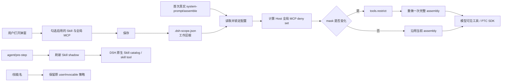

# dsh-workspace-scope

[](https://github.com/Ri0n72Y/dsh-workspace-scope/actions/workflows/ci.yml) [](https://www.npmjs.com/package/dsh-workspace-scope) [](https://github.com/Ri0n72Y/dsh-workspace-scope/blob/main/LICENSE) [](https://github.com/Ri0n72Y/dsh-workspace-scope/releases)

## 插件正在积极开发中，版本更新频繁

DeepSeek Harness 插件：按工作区（工程）启停 Skill 与 Host 全局 MCP。

安装的技能和全局 MCP 服务器越多，每个新会话的启动上下文就越大。这个插件让每个工程只启用自己需要的部分，效果类似 VS Code 装了多种语言插件，但每个工程只打开用得到的那几个。

这里的 MCP 范围明确指 Host 全局注册、由 Agent 继承的 MCP 工具；Agent / Preset 自己作用域内注册的 MCP 不由本插件管理。

English version: [README.en.md](README.en.md)

## 用法

入口在新建会话界面：输入卡右侧工具行里的「工作区能力」按钮。已进行的对话不显示入口。配置会在该会话第一次真正开始模型请求时锁定，因此新建界面中的改动仍能作用于即将开始的对话，之后再修改文件不会改变已经锁定的会话。

弹窗按「技能」和「全局 MCP 服务器」两个分组列出全部可管理条目，每组标题可以单独折叠：

- 搜索框过滤条目
- 每行一个开关，打开即启用
- 点行本身展开详情（技能显示描述，全局 MCP 显示工具数量）
- 底部有「全部启用」「全部禁用」快捷按钮，所有改动即时保存

保存后配置写入当前工作区根目录的 `.dsh-scope.json`。第一次带模型 turn 的 prompt assembly 会读取并锁定这份配置。若 Host 全局 MCP 的有效排除集合发生变化，插件先更新 Agent 的原生 `tools.restrict()`，再让 DSH 重做一次完整 prompt assembly，所以 native 与 PTC 两种工具呈现都使用同一策略。Skill 在每个 pre-step 根据锁定配置刷新；被排除但原本允许用户调用的技能仍可用 `/技能名` 手势临时加载。

## 配置

文件在工作区根目录，名为 `.dsh-scope.json`：

```json
{
  "default": {
    "mode": "whitelist",
    "skills": ["<skill-name>"],
    "mcps": ["<server-name>"]
  }
}
```

| 字段 | 类型 | 说明 |
|---|---|---|
| `mode` | `string` | 保存时固定为 `whitelist`；读取兼容 `default`（全部启用）与 `blacklist`（列表为排除集） |
| `skills` | `string[]` | 启用的技能名列表 |
| `mcps` | `string[]` | 启用的 Host 全局 MCP 服务器名列表 |

## 数据流



## 贡献

发现 bug 或有想法，直接开 issue；想动手改，先读 [CONTRIBUTING.md](CONTRIBUTING.md) 再提 PR。提交即表示同意按 MIT 许可授权。

## License

MIT
