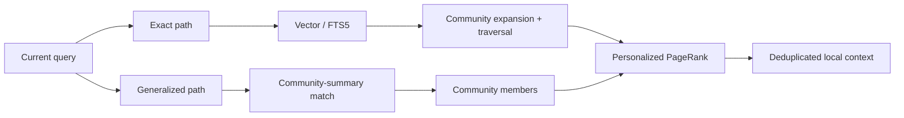
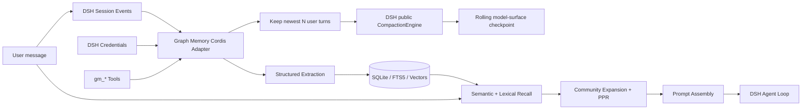
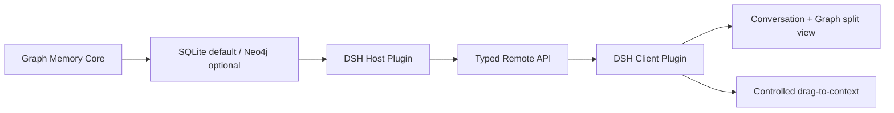

# Graph Memory


<p align="center">
  <strong>Traceable, searchable, cross-session memory for AI agents.</strong><br>
  One memory core, native to DeepSeek Harness, with the OpenClaw plugin entry retained.
</p>

<p align="center">
  <a href="https://www.dsh.so/artifact/graph-memory"></a>
  <a href="https://www.dsh.so/artifact/graph-memory"></a>
</p>

<p align="center">
  <a href="README_CN.md">中文</a> ·
  <a href="#core-advantages">Advantages</a> ·
  <a href="#graph-memory-architecture">Architecture</a> ·
  <a href="#install-on-deepseek-harness">DSH Install</a> ·
  <a href="#graph-memory-pro-as-a-dsh-plugin">Pro Plugin</a> ·
  <a href="docs/DSH_NATIVE_PLAN.md">Technical Report (Chinese)</a>
</p>

Compaction answers “how much of this conversation still fits?” Graph Memory answers “which past knowledge is worth recalling now?”

Reusable conversation knowledge becomes typed nodes:

- `TASK`: goals, execution, and outcomes;
- `SKILL`: validated reusable methods;
- `EVENT`: errors, fixes, decisions, changes, and facts.

Typed edges such as `USED_SKILL`, `SOLVED_BY`, `REQUIRES`, `PATCHES`, and `CONFLICTS_WITH` preserve relationships. A new question retrieves a relevant local subgraph instead of replaying the complete history.

## Core advantages

### Native host integration

- Loaded by the DSH/Cordis plugin lifecycle, not simulated through an MCP side channel.
- Integrates Session, Tool, Agent Loop, Prompt Assembly, LLM, and Credentials seams.
- Disposes database, cache, and event listeners with its plugin fiber.
- Does not fork or modify DeepSeek Harness core.

### Durable cross-session memory

- Knowledge from Session A can be recalled automatically in Session B.
- Memory survives DSH restarts.
- Stable event IDs make resume and HMR ingestion idempotent.
- Source sessions and graph edges explain why a memory was recalled.

### Smaller, cleaner context

- Keeps the newest real user turns verbatim (`freshTurnCount`, default `5`).
- Uses the agent-scoped public DSH compaction service to replace the older model-facing prefix with one rolling checkpoint; the durable source event log remains intact.
- Indexes each landed checkpoint and preserves exact source-message provenance for later dereferencing.
- Semantic vector retrieval with FTS5 lexical fallback.
- Community detection, PageRank, personalized PageRank, and bounded graph traversal.
- Only a relevant cross-session subgraph enters the current prompt, within `recallTokenBudget` (default `4096`).
- Automatic injection uses a high-precision semantic gate (`autoRecallMinScore`, default `0.6`) and never falls back to query-independent community representatives; explicit `gm_search` remains broad.
- Recalled history is marked as untrusted reference material and cannot override current user instructions.

### Local-first and lightweight

- Community uses SQLite by default; no graph database deployment is required.
- Embeddings are optional. Without them, recall falls back to FTS5.
- Data remains in the user's local profile by default.
- OpenAI-compatible embeddings support DashScope, OpenAI, and local providers.

### Observable and verifiable

- `gm_status` reports store path, graph counts, vector coverage, mode, and dimensions.
- Model or dimension changes trigger re-embedding.
- Vectors with different dimensions are never silently compared.
- Critical knowledge can be recorded deterministically with `gm_record`.

### Scoped token benchmark

The original OpenClaw adapter was measured in a seven-turn workflow that installed, authenticated, and queried `bilibili-mcp`:

<p align="center">
  
</p>

| Turn | Without Graph Memory | With Graph Memory |
|---|---:|---:|
| R1 | 14,957 | 14,957 |
| R4 | 81,632 | 29,175 |
| R7 | **95,187** | **23,977** |

The measured reduction at R7 was approximately **75%** in that specific workflow. This is a scenario-level comparison, not a universal savings guarantee; the mechanism is replacing indiscriminate history replay with a relevant knowledge subgraph.

## Project evolution

The DSH integration does not discard the original project. Graph Memory is evolving from an OpenClaw memory plugin into a graph-memory core that different agent harnesses can load natively.

| Stage | Deliverable | Status |
|---|---|---|
| OpenClaw origin | Context Engine, cross-session graph memory, dual-path recall | Maintained |
| Community graph engine | SQLite, FTS5, vectors, graph ranking, provenance | Available |
| DeepSeek Harness | Cordis adapter, native tools, auto-recall, Credentials | Implemented and tested |
| Graph Memory Pro | Visual graph workbench, controlled drag-and-drop, optional Neo4j | Pro Lite read-only Host + Client implemented; 2D/3D and drag pending |

On March 15, 2026, the project owner presented Graph Memory's architecture at the CLAW program event held in Tsinghua Science Park. The following owner-supplied materials and the [Sina Finance event report](https://cj.sina.com.cn/articles/view/7984421895/1dbe89c0700101nnpq) document that development.

<p align="center">
  
  
</p>

- [Community cross-session memory demo](https://www.bilibili.com/video/BV1xUcZzfEaB/)
- [Graph Memory Pro technical presentation](https://www.bilibili.com/video/BV1KwwzzGEvD/)

The image below is the existing OpenClaw / ClawX-era Pro graph prototype. It demonstrates a previously explored interaction direction; it is not a shipped DSH frontend.

<p align="center">
  
</p>

Names and venue information document project history only and do not imply endorsement by Tsinghua University, Sina Finance, DeepSeek, or OpenClaw.

## Graph Memory architecture

### Typed knowledge graph

```text
TASK   ──USED_SKILL──▶ SKILL
TASK   ──SOLVED_BY───▶ EVENT
SKILL  ──REQUIRES────▶ SKILL
EVENT  ──PATCHES─────▶ SKILL
SKILL  ──CONFLICTS_WITH──▶ SKILL
```

Nodes retain episodic user/assistant provenance. This preserves the context in which knowledge was created, not only a lossy summary.

### Dual-path recall



### Host data flow



The code follows a host-neutral core plus host adapters:

```text
graph-memory/
├── dsh.ts                 # DeepSeek Harness / Cordis adapter
├── index.ts               # OpenClaw adapter
├── cordis.patch.yml       # DSH bundle entry
└── src/
    ├── extractor/         # conversation → TASK / SKILL / EVENT
    ├── recaller/          # vector, FTS5, graph expansion and recall
    ├── graph/             # PageRank, communities and deduplication
    ├── store/             # SQLite schema and queries
    ├── format/            # safe context assembly
    └── engine/            # LLM and embedding providers
```

## Native DeepSeek Harness status

| Capability | Status | Notes |
|---|---|---|
| Native Cordis loading | **Done** | No DSH fork required |
| Rolling context ownership | **Done** | Configurable newest N turns; older surface prefix becomes a checkpoint |
| Cross-session auto-recall | **Done** | Injected during Prompt Assembly |
| Explicit record and search | **Done** | `gm_record`, `gm_search` |
| Vector backfill and migration | **Done** | Model, dimension, and fingerprint tracked |
| Visible plugin state | **Done** | Active in Plugin Inventory |
| Pro visual workbench | **Experimental** | Separate DSH Client Plugin with a read-only card snapshot |

Current beta: `1.6.0-beta.9`. Functional acceptance used DeepSeek Harness `0.1.0-rc.8`; script-free Git installation and profile config composition were subsequently reverified against `0.1.1-rc.2`. Testing covered script-free Git and tarball installation, Web profile loading, configurable five-turn rolling compaction through the public agent-preset compaction service, exact source provenance, token-budget enforcement, high-precision automatic recall, FTS5 fallback, and the Pro Lite Host, Typed Remote, and Client bundle boundaries. All 130 automated tests passed. Real model-backed acceptance also verified rolling checkpoint replacement, 1024-dimensional `text-embedding-v4` vectors, and automatic cross-project recall without an explicit memory tool call.

<p align="center">
  <strong>Plugin enabled: graph-memory/dsh is active in the DSH plugin list</strong><br>
  
</p>

<p align="center">
  <strong>Cross-session semantic recall in a fresh Session</strong><br>
  
</p>

## Install on DeepSeek Harness

Prerequisite: Node.js `22.13+`. The current beta is not yet published to npm, but the repository ships its prebuilt runtime and can be installed without authorizing install scripts:

```bash
npx @deepseek-ai/dsh plugin --profile web add github:adoresever/graph-memory
npx @deepseek-ai/dsh --profile web --dump-config
npx @deepseek-ai/dsh web
```

Alternatively, build and install a tarball from a checkout:

```bash
git clone https://github.com/adoresever/graph-memory.git
cd graph-memory
npm install
npm test
npm pack
npx @deepseek-ai/dsh plugin --profile web add /absolute/path/to/graph-memory-1.6.0-beta.9.tgz
```

After installation, verify that `graph-memory/dsh` is enabled under **Settings → Plugins → Plugin list**.

Default store:

```text
$DSH_HOME/graph-memory/graph-memory.db
```

Without `DSH_HOME`, this is normally `~/.dsh/graph-memory/graph-memory.db`.

## Optional vector retrieval

Do not send secrets in chat. Cordis stores only a credential reference; DSH `credentials` resolves the real value for each embedding operation.

DashScope example:

```bash
export GRAPH_MEMORY_EMBEDDING_API_KEY='replace-with-your-key'
export GRAPH_MEMORY_EMBEDDING_BASE_URL='https://dashscope.aliyuncs.com/compatible-mode/v1'
export GRAPH_MEMORY_EMBEDDING_MODEL='text-embedding-v4'
export GRAPH_MEMORY_EMBEDDING_DIMENSIONS='1024'
dsh web
```

Without embeddings, Graph Memory continues with FTS5 and does not block conversation.


## DSH tools

| Tool | Purpose |
|---|---|
| `gm_status` | Plugin, store, extraction, recall, and vector state |
| `gm_search` | Explicit long-term graph search |
| `gm_record` | Persist a TASK, SKILL, or EVENT |
| `gm_stats` | Node, edge, type, and community statistics |

Automatic recall does not require an explicit `gm_search` tool call. The plugin retrieves relevant memory during Prompt Assembly.

## Graph Memory Pro as a DSH plugin

**The old `desktop-2.0` Pro cannot be installed into DSH directly, but the new Pro Lite now has a minimal, separately installable DSH plugin loop.** The old branch remains an OpenClaw + Neo4j implementation. The new `dsh-pro/` package reads Community SQLite on the Host, exposes only bounded snapshots over Typed Remote, and registers a read-only entry in the DSH Web sidebar.

The reviewed `desktop-2.0` code includes Neo4j Driver, GDS, APOC, vector indexes, graph maintenance tools, and CRUD routes. Today it also:

- imports `openclaw/plugin-sdk` at the entry;
- registers OpenClaw Gateway HTTP routes;
- writes OpenClaw configuration and restarts its Gateway during installation;
- exposes Neo4j connection details through `/graph-memory-pro/neo4j-config`;
- contains no installable DSH Client Plugin.

The correct plugin architecture is:



The first Pro plugin does not need mandatory Neo4j:

- **Pro Lite:** SQLite plus a 2D/3D DSH graph client;
- **Neo4j adapter:** optional storage plugin for large graphs, GDS, and advanced analytics;
- the browser receives bounded `GraphSnapshot` data, never database passwords or arbitrary Cypher access;
- drag operations submit node IDs and intent; the Host validates them and writes visible, reversible Session context.

Pro should therefore be an optional Graph Memory DSH plugin module, not a separate standalone product.

### Recommended package split

```text
graph-memory                          # Community: current native Host Plugin
graph-memory-pro-dsh                 # Pro Lite: local beta Host + Client Plugin
@adoresever/graph-memory-store-neo4j # Optional large-graph adapter, to be built
```

The first milestone should be **Pro Lite**: reuse the existing SQLite graph and add the DSH graph workbench, so users do not need Neo4j. Neo4j stays optional for larger graphs, GDS, and advanced analysis. **This is a planned architecture; the existing `desktop-2.0` Pro is still Neo4j-only and does not yet implement a switchable SQLite / Neo4j `GraphStore`.**

### Current local installation

The npm package `graph-memory@1.5.8` is still the OpenClaw release. The new Community beta can be installed from GitHub; `graph-memory-pro-dsh` still installs from a checkout:

```bash
dsh plugin --profile web add \
  git+https://github.com/adoresever/graph-memory.git

dsh plugin --profile web add \
  /absolute/path/to/graph-memory/dsh-pro

dsh web
```

Both plugins share `~/.dsh/graph-memory/graph-memory.db` by default. The current entry provides bounded SQLite `GraphSnapshot`, `gm_graph_snapshot`, `gm_graph_node`, a strict Typed Remote, and a read-only sidebar snapshot/search view. It does not yet provide a 2D/3D renderer, full split view, drag-to-context, or node editing.

### Four required integration layers

1. **Core contracts:** bounded SQLite `GraphSnapshot` and node detail are implemented; a Neo4j provider and unified writable contract remain.
2. **Host Plugin:** the Pro Lite Host service, two bounded tools, and read-only Typed Remote are implemented; write actions and finer permissions remain.
3. **Client Plugin:** the DSH sidebar entry, card snapshot, search, and refresh are implemented; 2D/3D graphs and split-view conversations remain.
4. **Controlled context actions:** drag-and-drop sends only a node ID and an intent; the Host validates it and writes visible, reversible Session Context.

The old Pro `/graph-memory-pro/neo4j-config` route returns connection details to the browser; the new implementation removes that security flaw. Pro Lite sends only a strictly validated, bounded `GraphSnapshot`, never a database path, Session ID, Bolt password, SQL, or unrestricted Cypher. Future write actions must preserve this Host boundary.

## OpenClaw compatibility

Existing OpenClaw users retain the original entry:

```bash
openclaw plugins install graph-memory
openclaw plugins enable graph-memory
openclaw gateway restart
```

The Context Engine slot must also be activated in `~/.openclaw/openclaw.json`; otherwise the package may appear installed without running the full ingestion and extraction pipeline:

```json
{
  "plugins": {
    "slots": {
      "contextEngine": "graph-memory"
    },
    "entries": {
      "graph-memory": {
        "enabled": true
      }
    }
  }
}
```

The Community memory core is host-neutral. DSH development does not require OpenClaw users to abandon their entry or data.

## Development

```bash
npm install
npm test
npm run build
npm pack
```

Release checks:

- tests and TypeScript build pass;
- tarball contains `dist/dsh.js` and `cordis.patch.yml`;
- no API keys, local databases, or environment files enter the repository;
- planned Pro features are never presented as shipped Community behavior.

## Current limitations

- Automatic extraction depends on auxiliary-model output stability. Use `gm_record` for critical beta knowledge.
- DSH does not yet expose `gm_update` and `gm_maintain`; those remain OpenClaw-entry tools.
- Pro Lite currently has a read-only card client; 2D/3D, split view, and controlled drag-to-context are not implemented.
- npm registry publication is pending; install the current beta from a GitHub-built tarball.

## Privacy and security

- Memory remains in local SQLite by default.
- API keys come from host credentials or environment variables, not the database or Cordis patch.
- Recalled history is reference material; current user instructions always take precedence.
- Rotate any secret that has appeared in chat, logs, or screenshots.

## License

[MIT](LICENSE) © 2026 adoresever

See [docs/ATTRIBUTIONS.md](docs/ATTRIBUTIONS.md) for asset, logo, and trademark notes.
