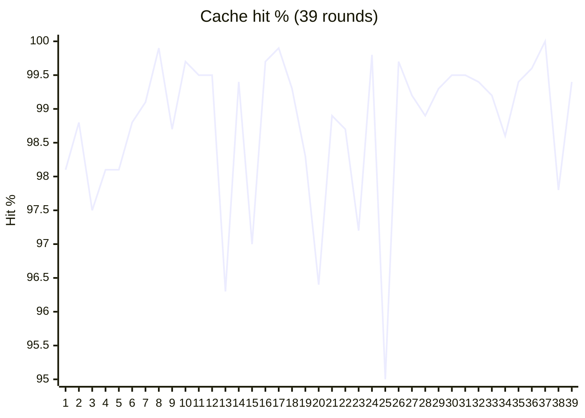

**[English](README.md) | [中文](README.zh-CN.md)**

<p align="center">
  
</p>

<p align="center">
  <a href="https://github.com/pulseaiclub/phi/blob/main/LICENSE"></a>
  <a href="https://github.com/pulseaiclub/phi/actions"></a>
  <a href="https://go.dev"></a>
  <a href="https://github.com/pulseaiclub/phi/releases"></a>
  <a href="https://getmerged.abhishekco.de/pulseaiclub/phi"></a>
</p>

A minimal terminal coding agent harness in Go — a sibling to Pi.

- **Sub-agents** — spawn isolated jobs and watch the full run unfold in the TUI / job logs, without stuffing every turn into the parent context
- **Hashline edits** — edit by whole-file `@file path#TAG` plus line `LINE#HASH` anchors (same idea as [oh-my-pi](https://github.com/can1357/oh-my-pi)): the model points at anchors instead of rewriting whole files; stale tags/hashes are rejected so over-edits and silent corruption stop here
- **Permission gate** — Gate / Ask before destructive tools fire; safety is not optional when an agent can touch your tree
- **MCP without context death** — configure as many MCP servers as you want; their tool schemas **never** enter the model prompt. The system prompt lists **server names** only (like the Skills catalog); the agent uses three meta-tools (`mcp_list` / `mcp_inspect` / `mcp_call`) to discover and call on demand. Same Gate / Ask / Hooks path as built-in tools. See [MCP](#mcp)
- **Extensions (Go or Rust)** — native binaries speak the **PXB** binary protocol over stdin/stdout; official author SDKs for Go ([`ext/go`](ext/go)) and a zero-dependency Rust port ([`ext/rust`](ext/rust)): LLM tools, slash commands, event intercepts, confirm dialogs — no JSON, no reflection. See [Extensions](#extensions)
- **Any model** — OpenAI-compatible or Anthropic, no vendor lock-in


- [Quick start](#quick-start)
- [Footprint](#footprint)
- [Configuration](#configuration)
- [Interactive mode](#interactive-mode)
- [Commands](#commands)
- [Sessions](#sessions)
- [Headless mode](#headless-mode)
- [Skills](#skills)
- [Permissions](#permissions)
- [Hooks](#hooks)
- [MCP](#mcp)
- [Tools](#tools)
- [Project layout](doc/project-layout.md)

## Quick start

Install the latest release (macOS / Linux):

```sh
curl -fsSL https://raw.githubusercontent.com/pulseaiclub/phi/main/scripts/install.sh | bash
```

Windows (PowerShell 5.1+):

```powershell
irm https://raw.githubusercontent.com/pulseaiclub/phi/main/scripts/install.ps1 | iex
```

First launch needs a model. Open the config editor (creates `~/.phi` layout
and writes `~/.phi/config.yaml`):

```sh
phi config
```

Or set env vars for a one-off run:

```sh
export PHI_MODEL=gpt-4o
export PHI_API_KEY=sk-...
```

Then start the TUI:

```sh
phi
```

Or build from source (Go 1.26.3+, see `go.mod`):

```sh
make build          # produces ./phi
make install        # build and install into $GOBIN
```

On first start, phi automatically creates `~/.phi/{bin,skills,hooks,session}`. Search
tools (`fd`, `rg`) download into `~/.phi/bin` in the background when missing.

The TUI gives the model four core tools — `read`, `write`, `edit`, and
`bash` — plus `grep`, `find`, and `ls`. The model uses these to
fulfill your requests. External HTTP fetch is available via MCP when configured.

## Footprint

phi aims to stay cheap to run and cheap to hack on. Numbers below are for a
stripped release build (`CGO_ENABLED=0`, `-ldflags="-s -w"`), measured on
macOS arm64 unless noted.

| Metric | phi |
| --- | ---: |
| Release binary | **~12 MB** |
| Idle RSS (1 session) | **~21 MB** |
| 10 idle sessions (total RSS) | **~196 MB** (~20 MB each) |
| Time to first frame | **~40 ms** (27–65 ms) |
| Cold `go build` (empty `GOCACHE`) | **~5.5 s** |
| Warm rebuild | **~0.7 s** |
| Go source (excl. tests) | **~22k LOC** / 107 files |
| Go packages | **32** |
| Direct module deps | **6** (15 modules total) |
| Linked runtimes | system libs only (no Node / Electron / Python) |

## Configuration

phi reads `~/.phi/config.yaml` (standard YAML). Environment variables
override it for one-off runs. `phi config` opens an HTML editor for the same
file in your browser.


```yaml
# ~/.phi/config.yaml
models:
  - name: gpt-4o            # model name; "claude-*" routes to the Anthropic API
    api_key: sk-...         # or set PHI_API_KEY
    base_url: https://api.openai.com/v1   # default; PHI_BASE_URL overrides
    context_window: 128000  # optional
    default: true           # the model used at startup; first entry wins if absent
  - name: claude-sonnet-4-20250514   # extra models; switchable at runtime
    api_key: sk-ant-...
    base_url: https://api.anthropic.com
    context_window: 200000

skill_path: ~/.phi/skills # where SKILL.md files are loaded from

agents:
  enabled: true           # default; set false to disable agent_* sub-agent tools

permissions:
  mode: interactive       # interactive | readonly | autopilot | headless-strict
  bash:
    default: ask          # ask | allow | deny
    allow:
      - "go test ./..."
    deny:
      - "rm -rf *"
```

### Recommended model: DeepSeek Flash

phi + DeepSeek Flash — the best pairing: grounded, low hallucination, cache hit rates near 100%.

Measured data:

39 LLM rounds, same session — prompt **16k→40k**, hit rate **95–100%** (avg **98.7%**).

| Round | Prompt tokens | Cached tokens | Cache hit |
| ---: | ---: | ---: | ---: |
| 1 | 16,176 | 15,872 | **98.1%** |
| 10 | 20,163 | 20,096 | **99.7%** |
| 20 | 27,604 | 26,624 | **96.4%** |
| 30 | 35,245 | 35,072 | **99.5%** |
| 39 | 39,794 | 39,552 | **99.4%** |



Environment overrides:

| Variable         | Overrides          |
| ---------------- | ------------------ |
| `PHI_API_KEY`    | `models[].api_key` (default model) |
| `PHI_MODEL`      | `models[].name` (default model) |
| `PHI_BASE_URL`   | `models[].base_url` (default model) |
| `PHI_SKILL_PATH` | `skill_path`       |

Provider routing: a base URL containing `anthropic` or a model name starting
with `claude` uses the Anthropic Messages API; everything else uses the
OpenAI-compatible `/chat/completions` path.

### Workspace layout

```
~/.phi/
├── config.yaml   # global configuration
├── bin/          # downloaded search tools (fd, ripgrep)
├── skills/       # SKILL.md skill directories
├── extensions/   # PXB binaries + phi.yaml
├── jobs/         # sub-agent job artifacts (meta, logs, result.md)
└── session/      # persisted sessions, one dir per working directory
    └── <encoded-cwd>/
```

## Interactive mode

`phi` (or `phi tui`) starts the TUI: a chat transcript on top, an editor at
the bottom, and a footer with the current activity. When a newer release is
available, the footer shows a hint like `0.2.0 available · phi update`.

Assistant output is rendered as Markdown (CommonMark/GFM): headings, emphasis,
strikethrough, links, blockquotes, lists, task checkboxes, and tables are
styled with the active theme; fenced code blocks get a muted language caption and per-language
syntax highlighting. Structural markers (`#`, `` ` ``, `*`) are stripped.

The editor supports:

- `@` — fuzzy file mention picker (type `@` and start typing a path)
- `/` — slash command picker (`/sessions`, `/resume`, `/clear`)
- `?` — shortcut help picker (lists `/`, `!`, `@`, and key bindings; `Esc` closes)
- `!command` — run a shell command locally and stream its output into the
  transcript (see [Commands](#commands))
- `Ctrl+K` — command palette: settings → model / theme / permissions / agents, skills, hooks

### Keyboard shortcuts

| Key            | Action                          |
| -------------- | ------------------------------- |
| `Ctrl+C`       | Quit phi                        |
| `Esc`          | Cancel the running agent / close pickers |
| `Ctrl+K`       | Toggle the command palette      |
| `Ctrl+A`       | Jump to the start of the line   |
| `Ctrl+E`       | Jump to the end of the line     |
| `Ctrl+U`       | Clear the composer input, images, and skills |
| `Ctrl+Shift+C` | Copy the selected transcript text |

Themes: `Dark`, `Darcula`, `Pink`, and `Terminal` (default), switchable from
the palette under settings → theme.

## Commands

| Command            | Description                                   |
| ------------------ | --------------------------------------------- |
| `phi` / `phi tui`  | Start the interactive TUI                     |
| `phi run -p "…"`   | Run one agent loop headlessly (see below)     |
| `phi update`       | Download and install the latest GitHub release |
| `phi update --check` | Query the latest release without installing |
| `phi sessions list`| List persisted sessions for this directory    |
| `/sessions`        | List sessions for this directory (TUI)        |
| `/resume <id>`     | Resume a session by id or unique prefix (TUI) |
| `/clear`           | Start a fresh empty session (TUI)             |
| `!command`         | Run a shell command locally, stream output into the transcript; `Esc` cancels it |

In the TUI, `!command` runs locally via `bash -c` — outside the agent loop. It
doesn't count toward agent busy state, and the running command can be cancelled
with `Esc` without touching an in-flight agent turn.

## Sessions

Sessions persist automatically per working directory under
`~/.phi/session/<encoded-cwd>/` as JSONL trajectories.

- `phi sessions list` — list session id, mtime, and preview for the current
  directory
- `/sessions` in the TUI — same, in-app
- `/resume <id>` — continue a session (id or unique prefix)
- `/clear` — start a fresh session (new id, empty transcript)
- `phi run --session <id>` / `phi run --continue-last` — resume headlessly

## Headless mode

```sh
phi run -p "fix the failing test in internal/tools"
```

Runs one agent loop without a TUI. Human logs go to stderr; with `--jsonl`,
machine-readable events go to stdout, one JSON object per line.

Flags:

| Flag                 | Description                                    |
| -------------------- | ---------------------------------------------- |
| `-p, --prompt STRING`| Prompt to run (required)                       |
| `--jsonl`            | Emit JSONL events to stdout                    |
| `--yolo`             | Skip all permission checks for this run (benchmarks / CI only) |
| `--max-rounds N`     | Cap tool rounds (default 64)                   |
| `--timeout DURATION` | Limit the agent run wall-clock time (e.g. `10m`; disabled by default) |
| `--session ID`       | Resume a persisted session by id or unique prefix |
| `--continue-last`    | Resume the newest persisted session for this directory |
| `--session-dir DIR`  | Override the session storage directory         |
| `--tools LIST`       | Enable only these comma-separated built-in tools |

`--tools` accepts built-in names such as `read,ls,grep`. MCP and agent tools
still append when configured; the flag only scopes the built-in toolset.

Exit codes: `0` success · `1` runtime/LLM error · `2` max rounds reached ·
`3` config/usage error.

In the interactive TUI, exhausting the tool-round budget prompts Continue /
Stop. Headless `phi run` has no confirmation UI, so it exits with code 2.

In headless mode, permission `ask` decisions are denied (there is no approval
UI), so `readonly`-style safety applies without extra flags. For benchmarks
that need arbitrary shell (`pytest`, `npm test`, …), pass `--yolo` to skip the
permission gate for that run only.

## Skills

Skills are directories containing a `SKILL.md` file with YAML frontmatter and
a Markdown body. They are loaded from `~/.phi/skills/` (or `skill_path` /
`PHI_SKILL_PATH`) and injected into the agent's context, letting you give the
model reusable procedures:

```markdown
---
name: My Skill
 description: What this skill does
license: MIT
compatibility: claude, openai
---
Instructions the agent should follow when this skill is relevant.
```

In the TUI, add skills from the palette (skills → list), then submit the
message with the selected skills applied.

## Permissions

Tool execution is gated by a permission policy, so the agent can run read-only
by default and ask before anything destructive. Configure it under
`permissions:` in `~/.phi/config.yaml`.

Modes:

| Mode               | Behavior                                            |
| ------------------ | --------------------------------------------------- |
| `interactive`      | Default. `ask` decisions prompt in the TUI.         |
| `readonly`         | Deny writes / bash; read tools still work.          |
| `autopilot`        | Fold `ask` → allow, run unattended.                 |
| `headless-strict`  | Fold `ask` → deny (used by `phi run`).              |

Per-tool rules: `bash.default` / `bash.allow` / `bash.deny` (exact command
prefix matching). Global keys:
`workspace_only_writes` (default true), `ask_timeout_sec`, and
`dangerously_allow_all` (default false).

In the TUI, an approval dialog replaces the editor with options to approve,
deny with feedback, or allow all for the session / for every session. The
palette's settings → permissions entry toggles session-wide bypass.

## Extensions

Extensions are native binaries speaking the **PXB** binary protocol over
stdin/stdout (author SDKs: Go `github.com/pulseaiclub/phi/ext/phi` and Rust
[`ext/rust`](ext/rust), `phi-ext`). They
subscribe to tool/session events, register LLM tools, and add slash commands.

```bash
go get github.com/pulseaiclub/phi/ext@v0.19.0
```

```go
package main

import (
	"github.com/pulseaiclub/phi/ext"
	"github.com/pulseaiclub/phi/ext/phi"
)

func main() {
	m := phi.New("hello", "0.1.0")
	m.OnToolCall(func(ev ext.ToolCallEvent) *ext.ToolCallResult {
		// return &ext.ToolCallResult{Block: true, Reason: "..."}
		return nil
	})
	_ = m.Run()
}
```

Install under `~/.phi/extensions/<name>/` with a `phi.yaml` pointing at the
binary. In the TUI: `Ctrl+K` → **extensions**. Disable with
`PHI_EXTENSIONS=off`. Full guide: [doc/extensions.md](doc/extensions.md).

Codec throughput on Apple Silicon (release, single-threaded):

| Implementation | Hello encode+decode | Frame write+read (in-memory) | Allocs |
|---|---|---|---|
| Rust PXB (`phi-ext`) | ~0.12 µs | ~0.06 µs | — |
| Go PXB (`ext/go/pxb`) | ~0.11 µs | ~0.05 µs | 3 / op |
| Go JSON lines | ~1.2 µs | — | 15 / op |

The ~10× gap over JSON lines is the protocol (fixed header + tagged fields), not
the language — Rust and Go are within noise on the same codec work. Real
extension latency is dominated by process spawn and pipe RTT anyway. Re-probe:
`cargo run --release --example bench` in [`ext/rust`](ext/rust).

## MCP

**Configure 100 MCP servers. Pay ~0 schema tokens until you call one.**

Most MCP hosts dump every `tools/list` schema into the model context before
you ask a question — browser stacks alone can burn 50k+ tokens. phi does not.

Instead the agent gets three meta-tools, and the system prompt lists configured **server names** (no schemas):

| Tool | Role |
| --- | --- |
| `mcp_list` | List tool **names** on one server (compact text) |
| `mcp_inspect` | Fetch a slim parameter summary for one tool |
| `mcp_call` | Run `server` + `tool` + `args` |

Flow: pick a server from the prompt → `mcp_list(server=…)` → `mcp_inspect` → `mcp_call`. Subprocesses start **lazily** on first use.
Calls still go through PreHooks → Gate / Ask → Run → PostHooks.

```sh
phi mcp add browsermcp -- npx @browsermcp/mcp@latest
phi mcp doctor
# In the TUI, the model can use configured servers without guessing MCP exists
```

Config: `~/.phi/mcp.json` (project `<cwd>/.phi/mcp.json` overrides by name).
Disable with `PHI_MCP=off`. Stdio and HTTP in v1.

Full guide: [doc/mcp.md](doc/mcp.md).

## Sub-agents

Sub-agent tools (`agent_spawn`, `agent_wait`, …) are **on by default**. To
keep a session lean, disable them in `~/.phi/config.yaml`:

```yaml
agents:
  enabled: false
```

Or toggle for the current session via the palette: settings → agents.
When disabled, those tools are not registered and the model cannot spawn jobs.

Sub-agents themselves use a **role** (`explore` default | `review` | `worker`):

| Role | Tools | Use for |
|------|--------|---------|
| `explore` | read-only (+ allowlisted bash) | Search / map structure |
| `review` | read-only (+ allowlisted bash) | Diffs / checks; no edits |
| `worker` | full tools except nesting | Planned, independent edits |

Default stays explore (read-only). Prefer worker only after the parent has a concrete plan.

## Tools

Built-in tools the model can call (see `internal/tools/`):

| Tool           | Purpose                                      |
| -------------- | -------------------------------------------- |
| `bash`         | Run a shell command in the working directory |
| `read`         | Read a file                                  |
| `write`        | Write a file (gated by permissions)          |
| `edit`         | Targeted edit of a file                      |
| `grep`         | Regex search across files                    |
| `find`         | File patterns (fd)                           |
| `ls`           | Directory listing                            |
| `agent_spawn`  | Start an isolated sub-agent job (async)      |
| `agent_wait`   | Wait for a job; returns short summary only   |
| `agent_list`   | List jobs                                    |
| `agent_cancel` | Cancel a running job                         |

Sub-agent transcripts live under `~/.phi/jobs/<id>/` and are **not** injected
into the parent context — only the wait/task summary is.

Fast search tools (`fd`, `ripgrep`) are downloaded on first startup into
`~/.phi/bin` when missing.

See [Project layout](doc/project-layout.md) for the source tree map.

See [CONTRIBUTING.md](CONTRIBUTING.md) for development setup, code style, and
commit conventions.
