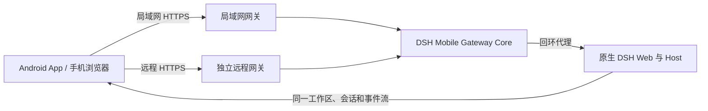

<p align="center">
  
</p>

<h1 align="center">DSH Mobile</h1>

<p align="center">在手机上安全、实时地使用电脑中的 DeepSeek Harness。</p>

<p align="center">
  <a href="https://www.npmjs.com/package/dsh-mobile"></a>
  <a href="https://www.npmjs.com/package/dsh-mobile"></a>
  <a href="https://github.com/saya-ch/dsh-mobile/actions/workflows/ci.yml"></a>
  <a href="https://github.com/saya-ch/dsh-mobile/releases"></a>
  <a href="LICENSE"></a>
  <a href="https://github.com/awesome-dsh-plugin/awesome-dsh-plugin"></a>
</p>

<p align="center">
  <a href="#能做什么">能做什么</a> ·
  <a href="#快速开始">快速开始</a> ·
  <a href="#连接教程">连接教程</a> ·
  <a href="#扩展与自定义">扩展与自定义</a> ·
  <a href="CHANGELOG.md">更新记录</a> ·
  <a href="README.en.md">English</a>
</p>

> DSH Mobile 是 DeepSeek Harness 社区插件，原生 App 仅支持 Android。
>
> **0.3.6 更新**：取消 DSH 精确版本白名单，已验证兼容 0.1.2-alpha.3/alpha.4；今后接口兼容的新版本不会再仅因版本号而阻止插件启动。[详细记录](CHANGELOG.md)。
>
> **升级提醒**：DSH 0.1.2-alpha.3/alpha.4 请使用 Mobile 插件 0.3.6 或更高版本；现有 0.3.3-0.3.5 App 与配对无需重建。[兼容说明](#兼容性)。

<p align="center">
  <a href="https://github.com/saya-ch/dsh-mobile/releases/download/v0.3.6/dsh-mobile-android-v0.3.6.apk"></a><br>
  <a href="https://github.com/saya-ch/dsh-mobile/releases/download/v0.3.6/dsh-mobile-android-v0.3.6.apk"><strong>下载 Android App 0.3.6</strong></a><br>
  <sub><a href="https://github.com/saya-ch/dsh-mobile/releases/tag/v0.3.6">版本说明与校验文件</a></sub>
</p>

DSH Mobile 是一个 DeepSeek Harness 插件，让手机浏览器或 Android App 通过局域网，或可选的 Tailscale Funnel、cpolar、自建 FRP 远程通道连接电脑，继续使用同一份会话、工作区、消息和工具。局域网与远程访问分别启停、分别管理设备，且都不修改 DeepSeek Harness 源码。

移动访问使用独立的 HTTPS 与证书固定，只有配对过的设备能通过校验接入。

它还能在 DSH 对话里用 `/mobile <需求>` 定制手机端。

## 能做什么

- **在手机上继续电脑端的工作**：同一份会话、工作区、消息和工具，实时同步。
- **用对话定制手机端**：直接在 DSH 对话里改手机页面的布局、交互和功能，几秒内刷新。
- **专属触屏布局**：会话抽屉、工具详情、设置、提问卡片和输入栏都按手机重新组织。App 原生页面跟随系统显示简体中文、英文或意大利文；插件界面跟随 DSH 的语言设置，意大利语资源已为 DSH 后续支持预留。
- **图片附件**：在已打开会话的输入栏加号菜单顶部选择图片或拍照；支持 PNG、JPEG、WebP、GIF（不超过 8 MiB）和完整分辨率 JPEG。
- **自动发现、无需重新配对**：切换 Wi-Fi、热点或 IP 后通常自动恢复。
- **一键连接诊断**：检查版本、网关、网卡、防火墙和远程通道；稳定的原因码在界面中本地化，并生成不含凭据与完整地址的脱敏报告。
- **更快恢复连接**：远程重开会并行恢复可信连接、复用版本化资源，并压缩移动端启动批次。
- **三种配对方式**：扫码、配对链接、密钥。

配对设备被视为完全信任，可以操作电脑上的 DSH；建议只在可信的家庭、办公局域网或可信 VPN 中使用。

## 快速开始

已经安装 `dsh` 命令：

```powershell
dsh plugin --profile web add dsh-mobile@latest
dsh plugin --profile web exec dsh-mobile setup
dsh --profile web
```

直接使用 DeepSeek Harness 源码：

```powershell
corepack enable; pnpm install
pnpm dsh plugin --profile web add dsh-mobile@latest
pnpm dsh plugin --profile web exec dsh-mobile setup
pnpm dsh --profile web
```

也可以通过插件市场安装（可选）：

```powershell
dsh plugin --profile web add dshmarket
```

重启 DSH 后，在 **设置 → 插件市场** 里搜索 dsh-mobile，一键安装即可。

`setup` 会自动选择并记住当前局域网，切换 Wi-Fi、热点或 IP 后通常自动恢复；仅在自动选择失败时使用 `--address 192.168.x.x`。设置、证书、设备和自定义文件保存在 `$DSH_HOME/mobile-access/`。

安装并启动 DSH 后，按照下一节选择局域网或远程连接。

通过 npm 安装的插件会在桌面界面加载时检查新版本，有更新时在访问面板标题右侧显示“更新插件”，安装后需重启 DSH。App 下载入口展示最新版本；本地开发包不会被自动覆盖，Android App 暂无主动更新通知。

## 连接教程

局域网和远程访问是两套相互独立的连接：在电脑附近优先使用局域网，延迟最低；离开当前网络时再启用远程访问。两边分别管理开关、设备和登录状态，互不影响。

### 局域网访问

适合同一 Wi-Fi、以太网或手机热点，是默认且最简单的连接方式。

<p align="center">
  
</p>

1. 让手机和电脑连接同一个局域网，在 DeepSeek Harness 左下角打开 **移动访问 → 局域网**。
2. 如果尚未开启，点击 **开启局域网访问**；随后点击 **生成并复制密钥**，面板会显示配对二维码。
3. 在 Android App 中进入 **局域网访问**，扫描发现电脑并点击设备，再扫描二维码或粘贴配对密钥。
4. 配对完成后会建立持久设备信任。以后打开 App 会自动发现并连接，切换 Wi-Fi、热点或 DHCP 地址通常不需要重新配对。

不安装 App 也可以访问：点击 **复制配对链接**，在手机浏览器中打开；首次访问需要按浏览器提示手动信任插件证书。

### 远程访问

适合手机离开电脑所在网络后使用。远程访问默认关闭，手机不需要另外安装 Tailscale、cpolar 或 FRP。

远程服务可能受带宽和连接限额影响：[cpolar 免费方案](https://svip.cpolar.com/pricing) 当前为 1 Mbps，[Tailscale Funnel](https://tailscale.com/docs/features/tailscale-funnel#requirements-and-limitations) 也存在不可配置的带宽限制。DSH Mobile 通过 10 条分页、顶部按需加载、gzip 和 WebSocket 长连接减少流量与等待，但无法突破服务商限额。

<p align="center">
  
</p>

1. 在 DeepSeek Harness 左下角打开 **移动访问 → 远程**，选择一种连接方式：
   - **Tailscale Funnel**：点击 **启用远程访问**，在打开的官方页面完成一次 Tailscale 登录；按面板提示继续允许 Funnel，然后返回 DSH 等待连接就绪。
   - **cpolar**：点击 **安装官方组件**，登录 cpolar 控制台取得 Authtoken，粘贴后点击 **保存并连接**。组件只会在确认后下载到插件私有目录。
   - **自建 FRP（高级）**：展开 **自建连接**，填写 VPS、frps 端口、共享 Token 和自己的 HTTPS 域名；复制插件生成的受限 frps + Caddy 模板到 VPS，再按提示安装官方 `frpc` 并验证连接。需要 Android App 0.3.3 或更高版本。
2. 状态变为“远程访问已就绪”后，点击 **生成远程配对二维码**。
3. 在 Android App 中进入 **远程访问**，扫描二维码完成独立配对。
4. 此后 App 会保存设备信任并自动重连；不使用时可以关闭远程访问，局域网连接不会受影响。

Tailscale Funnel 覆盖范围广，但在中国大陆网络下可能不稳定。其运行组件把公开监听生命周期绑定到父进程和受限控制通道；父进程退出、控制通道关闭或显式停止时会结束当前代次并清理资源。cpolar 更适合国内网络；自建 FRP 适合已有 VPS 和域名、希望避开公共服务带宽限制的用户。插件会校验按需下载的固定版本组件，配置与程序均保存在 `$DSH_HOME/mobile-access/`，可随时在面板中彻底清除。

自建 FRP 只生成一个指向 DSH 回环网关的 HTTP vhost，不提供任意 FRP 配置、TCP/UDP 代理或 FRP 插件。VPS 的明文 vhost 必须只监听 `127.0.0.1`，由 Caddy 提供公网 HTTPS；插件会拒绝可从公网访问的明文端口，并在公开发现接口确认连接到当前电脑后才显示“已就绪”。

远程公开地址仍受 DSH 设备配对保护。内置 Funnel 与托管 cpolar 当前支持 Windows x64；按需安装的 FRP 0.70.1 支持 Windows、Linux、macOS 的 x64 与 arm64。

## 扩展与自定义

在 DSH 对话里输入 `/mobile <需求>`，DSH 会直接修改手机端的文件，几秒内生效。例如：

```text
/mobile 把手机端做成老式终端的样子，让消息像终端输出一样逐行滚动
```

也可以让手机端调用电脑端的能力，比如实时读取电脑状态：

```text
/mobile 为手机端添加赛博朋克风格的电脑监控面板，实时显示电脑的 CPU、内存和磁盘占用
```

`/mobile` 把需求交给 DSH 对话中的 agent，由它直接修改本机 `$DSH_HOME/mobile-access/` 下的文件，保存后手机端自动生效。改动分两类：界面和交互在 `mobile.css`/`mobile.js`；需要电脑能力时用 `extensions/` 下的扩展，其 `host.mjs` 以本机用户权限在电脑上运行。不修改 DeepSeek Harness 源码。

扩展清单及其脚本、样式和资源按版本标识刷新。插件监听到 `/mobile` 或扩展文件变化后，会通过已认证连接通知手机立即更新；页面可见时每 45 秒、隐藏时每 5 分钟的检查只作为断线兜底。Host 暂存失败会继续使用现有版本；若 Host 已更新但新手机界面激活失败，则关闭该扩展并自动重试，避免混用新旧能力。

<sub>你甚至可以通过扩展连接电脑上运行的酒馆（</sub>

> `host.mjs` 与本机程序拥有相同权限；仅创建和运行你理解并信任的电脑端扩展。

示例的实际效果：

<p align="center">
  
  
  
  
</p>

## App 与手机浏览器


| 方式        | 适合场景         | 说明                                                                        |
| ------------- | ------------------ | ----------------------------------------------------------------------------- |
| Android App | 日常使用         | 首屏分开显示局域网与远程入口；局域网自动发现，远程使用系统信任的 HTTPS 通道 |
| 手机浏览器  | 临时或跨平台访问 | 打开“移动访问”卡片显示的 HTTPS 地址；首次连接需在浏览器手动信任该证书     |

Android App 只是 Kotlin WebView 薄壳，不内置另一份网页；手机浏览器访问的是同一页面。需要排查兼容性时，可在浏览器地址后追加 `?frontend=stock`，临时回到旧的桌面页面适配模式。

## 工作原理



插件包含三层：Host face 负责发现、配对、HTTPS、回环代理和扩展注册表；Client face 提供独立的移动布局与扩展 SDK；Android App 提供受限的原生 Bridge。Bridge 使用 `androidx.webkit` WebMessage，每条消息都校验精确顶层 Origin 和主 Frame，并限制消息大小；不使用 `addJavascriptInterface`。DeepSeek Harness 的源码和 3080 桌面页面都不会被修改，安装和卸载完全通过插件机制完成。

## 安全

- 局域网监听只用于可信家庭、办公网络或可信热点；不要自行做端口转发。
- 远程地址可从公网到达，但未配对请求无法进入 DSH；不使用时应关闭远程开关。
- cpolar 仅在用户确认后下载固定官方版本并校验大小和 SHA-256；不会安装系统服务、写入 PATH 或设置开机启动，插件清理会删除其托管文件。
- 自建 FRP 仅在用户确认后从官方 Release 下载固定版本 `frpc`，校验来源、精确大小、SHA-256、压缩包路径和可执行文件版本；共享 Token 不会出现在状态、诊断或日志中。复制服务器模板时 Token 会进入系统剪贴板，请粘贴后及时清除；清理只删除插件管理的本机文件，不会修改 VPS。
- 配对设备拥有控制电脑端 DeepSeek Harness 的能力，应视为完全可信设备；丢失手机后应在电脑端撤销设备。
- 移动网关开启时才监听局域网；关闭后 DeepSeek Harness 仍正常在电脑本机运行。

完整说明见 [SECURITY.md](SECURITY.md)。

## 兼容性

DSH Mobile 0.3.6 不再按 DSH 精确版本号阻止启动，并已验证 DSH 0.1.2-alpha.3/alpha.4 的移动前端与连接接口。现有 0.3.3-0.3.5 App 无需重新配对；0.3.6 Android App 仅同步版本信息，功能行为不变。更早的 App 使用不同的状态栏策略，建议同步升级；App 0.1.3 及更早版本需卸载重装并重新配对。

| DSH Mobile | 已验证的 DeepSeek Harness                                               |
| ------------ | ------------------------------------------------------------------------- |
| `0.3.6` | `0.1.0-rc.5`、`0.1.0-rc.6`、`0.1.0-rc.7`、`0.1.1-rc.2`、`0.1.2-alpha.1` 至 `alpha.4`；未列版本不再仅因版本号被拒绝 |
| `0.3.5` | `0.1.0-rc.5`、`0.1.0-rc.6`、`0.1.0-rc.7`、`0.1.1-rc.2`、`0.1.2-alpha.1`、`0.1.2-alpha.2` |
| `0.3.4` | `0.1.0-rc.5`、`0.1.0-rc.6`、`0.1.0-rc.7`、`0.1.1-rc.2`、`0.1.2-alpha.1`、`0.1.2-alpha.2` |
| `0.3.3` | `0.1.0-rc.5`、`0.1.0-rc.6`、`0.1.0-rc.7`、`0.1.1-rc.2`、`0.1.2-alpha.1` |
| `0.3.2`    | `0.1.0-rc.5`、`0.1.0-rc.6`、`0.1.0-rc.7`、`0.1.1-rc.2`、`0.1.2-alpha.1` |
| `0.3.1`    | `0.1.0-rc.5`、`0.1.0-rc.6`、`0.1.0-rc.7`、`0.1.1-rc.2`、`0.1.2-alpha.1` |
| `0.3.0`    | `0.1.0-rc.5`、`0.1.0-rc.6`、`0.1.0-rc.7`、`0.1.1-rc.2`、`0.1.2-alpha.1` |
| `0.2.2`    | `0.1.0-rc.5`、`0.1.0-rc.6`、`0.1.0-rc.7`、`0.1.1-rc.2`                  |
| `0.2.1`    | `0.1.0-rc.5`、`0.1.0-rc.6`、`0.1.0-rc.7`、`0.1.1-rc.2`                  |
| `0.2.0`    | `0.1.0-rc.5`、`0.1.0-rc.6`、`0.1.0-rc.7`、`0.1.1-rc.2`                  |
| `0.1.4`    | `0.1.0-rc.5`、`0.1.0-rc.6`、`0.1.0-rc.7`、`0.1.1-rc.2`                  |

插件不再使用运行时版本白名单；CI 会持续检查 DSH 主分支真实使用的前端、连接与信任接口，只有接口变化才需要适配。未来 DSH 更新若出现实际显示或连接异常，请升级 DSH Mobile 并提交诊断信息。

0.3.4 修复 Windows [DSH Desktop](https://github.com/anywhere-labs/dsh-desktop) 的目录选择器重复注册问题：复用桌面宿主的页面内目录浏览器，普通 Web 启动仍保留手机选择电脑工作区的能力。Desktop 连接手机时需使用兼容模式并启用浏览器访问，Mobile 的上游地址应与 Desktop 的监听端口一致。

## 卸载

```powershell
dsh plugin --profile web remove dsh-mobile
```

同时清除插件数据：

```powershell
dsh plugin --profile web exec dsh-mobile purge --yes
dsh plugin --profile web remove dsh-mobile
```

源码模式把上述 `dsh` 换成 `pnpm dsh`。

## 开发

```powershell
npm ci
npm run verify
```

Android 构建见 [App 文档](apps/mobile/README.zh-CN.md)。

Apache-2.0，详见 [LICENSE](LICENSE)。
