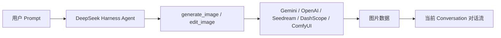

<div align="center">


<br /><br />

# 🎨 dsh-image-gen

**为 DeepSeek Harness 提供完整的对话图像能力：文生图、图生图、多图参考、连续编辑、本地 ComfyUI 与画廊管理。**

[](https://www.npmjs.com/package/dsh-image-gen)
[](https://github.com/deepseek-ai)
[](https://www.npmjs.com/package/dsh-image-gen)
[](LICENSE)
[](https://linux.do/)

[English](README.en.md) | **简体中文**

<br />

<p align="center">💬 <b>直接对你的 DeepSeek Harness Agent 发送以下提示词：</b></p>

```text
帮我安装生图插件，执行命令：pnpm dsh plugin --profile web add dsh-image-gen@latest
```

<p align="center"><sub>（也可以手动在终端执行：<code>pnpm dsh plugin --profile web add dsh-image-gen@latest</code>）</sub></p>

<br />

<p align="center">安装完成后，在 DSH 设置中填入自己的 API Key 或配置本地 ComfyUI，就可以直接对 Agent 说：</p>

```text
帮我画一张雨夜霓虹街头的赛博朋克猫咪。
```

<p align="center">Agent 会自动完成图片生成，也可以直接基于上一张图片继续修改。</p>

<br />

<div align="center">
  
  
</div>

</div>

---

## 💡 它解决什么问题？

**`dsh-image-gen` 是专为 DeepSeek Harness (DSH) 打造的开源图像生成与编辑插件。**

DeepSeek Harness 已经可以让 Agent 调用不同工具完成任务，本项目为它补上了原生的**图像生成与编辑能力**：



---

## 🚀 快速安装与使用

### 1. 安装插件

在你的 DeepSeek Harness 项目根目录下运行：

```bash
# 推荐方式：安装或升级到最新版本
pnpm dsh plugin --profile web add dsh-image-gen@latest

# 若已将 dsh 安装为系统全局命令：
dsh plugin --profile web add dsh-image-gen@latest
```

<details>
<summary><b>🛠️ 其他安装方式（Git 仓库直装 / 本地调试）</b></summary>

```bash
# 方式 B：从 GitHub 仓库直接安装最新代码
pnpm dsh plugin --profile web add git+https://github.com/shanliuling/dsh-image-gen.git

# 方式 C：本地克隆源码开发安装
git clone https://github.com/shanliuling/dsh-image-gen.git
pnpm dsh plugin --profile web add ./dsh-image-gen
```

</details>

### 2. 配置 Provider 与工作区设置

打开 DSH Web 页面（默认 `http://localhost:3080`）：

1. 进入 **Settings → Plugins → Image generation**。
2. 选择 Provider；云端 Provider 填写 API Key，本地 ComfyUI 填写地址并导入 API Format Workflow JSON（提示词位置使用 `{{prompt}}`，种子可选用 `{{seed}}`）。
3. 可按需开启 **保存到工作区**（默认开启）并自定义子目录，点击 **保存** 即可。

<div align="center">
  
</div>

### 3. 开始对话生图

现在直接在聊天框输入：

```text
生成一张极简主义的现代建筑客厅插画。
```

当前 Agent 就会自动调用 `generate_image` 工具并在对话流中返回图片。

也可以继续基于上一张图进行编辑：

```text
给刚才那张图加上落地窗，并把窗外改成雪山。
```

Agent 会调用 `edit_image`，复用当前会话中的图片继续修改。

### 4. 查看原生生图画廊

点击会话顶栏的 **`[画廊]`** Tab，即可集中查看和搜索所有对话生成的历史图片：

<div align="center">
  
</div>

---

## ✨ 主要能力

- 💬 **原生对话生图与编辑**：直接在 DeepSeek Harness 对话中生成图片，也可以基于已有图片继续修改。
- 🔁 **连续多轮编辑**：支持复用当前会话中的上传图片、历史生成图和上一轮编辑结果继续迭代。
- 🖼️ **画廊与图片工具**：自动汇总历史图片，支持搜索、筛选、全屏预览、复制、下载与删除。
- 🎨 **多 Provider 支持**：兼容 Google Gemini、OpenAI Images / Compatible、Seedream、DashScope Qwen Image，以及用户本地的 ComfyUI 工作流。
- 🔑 **BYOK + 原生设置**：API Key、Provider、模型和 Endpoint 都可以直接在 DSH 设置中配置。
- 💾 **会话与工作区保存**：图片接入 DSH Attachment / Conversation，并可自动保存到当前工作区。

---

## 📦 支持的 Provider

| Provider | 默认模型 | 默认 Endpoint / Base URL |
| :--- | :--- | :--- |
| **Google Gemini** | `gemini-3.1-flash-image` | `https://generativelanguage.googleapis.com/v1beta/interactions` |
| **OpenAI Images** | `gpt-image-2` | `https://api.openai.com/v1` |
| **OpenAI Compatible** | 自定义 | 自定义 Base URL |
| **ByteDance Seedream / 火山方舟** | `doubao-seedream-5-0-260128` | `https://ark.cn-beijing.volces.com/api/v3` |
| **Aliyun DashScope / Qwen Image** | `qwen-image-3.0` | `https://dashscope.aliyuncs.com/api/v1` |
| **Local ComfyUI（仅文生图）** | 用户导入的 API Format Workflow | `http://127.0.0.1:8188` |

---

## 🛠️ 本地开发 (Development)

```bash
# 克隆仓库
git clone https://github.com/shanliuling/dsh-image-gen.git
cd dsh-image-gen

# 安装依赖与构建
pnpm install
pnpm run typecheck
pnpm run test
pnpm run build

# 检查 npm 打包内容
pnpm run pack:check
```

---

## 📄 开源协议 (License)

本项目基于 [MIT License](LICENSE) 开源。

如果这个插件对你有用，欢迎点一个 ⭐️ **Star** 支持！
