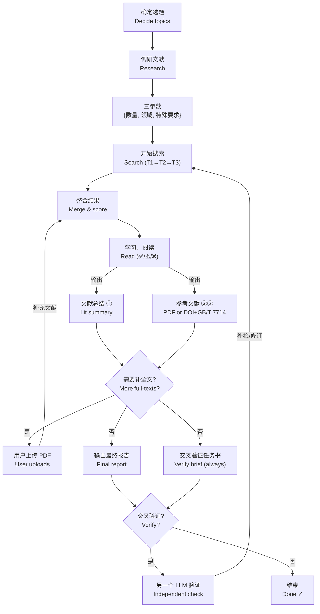

# 师弟 · shidi — 科研愿望实现器 🧑‍🔬
### *Your junior lab mate in an Agent Skill — ideas in, files out*

[](LICENSE)
[](https://github.com/IcyCreamDAS/shidi-skill/releases)
[](https://github.com/IcyCreamDAS/shidi-skill/stargazers)
[](README.md)
[](README.md)
[](https://github.com/IcyCreamDAS/shidi-skill/pulls)

中文 | [English](./README_EN.md)

> **师兄说想法，师弟跑断腿。** — *You bring the ideas, shidi does the legwork.*
>
> shidi 不是填模板的自动化——它是一条跑在 AI IDE 里的完整科研工作流：把脑海中的想法丢给它（文献调研 / 实验方案 / 作图 / 精读 / 数据整理），它在你的机器上跑完脏活累活，交付**真实可用的文件**，数据留在本地，不锁任何平台或模型。
>
> *shidi is a complete research workflow living inside your AI IDE — not a prompt template. Hand it an idea (literature research / experiment design / figures / paper reading / data chores), and it returns **real deliverable files**. Your data stays local. No platform or model lock-in.*

> **它不是放养型的。** 师弟是一个你一边忙别的、一边顺手使唤的 skill：喊一嗓子"师弟，帮我……"，它该问就问、该跑就跑，跑完把文件递到你手上。
>
> *It's not fire-and-forget, either — shidi is meant to be bossed around while you do something else. Yell "shidi, help me with …", and it asks when it must, runs the rest, and hands you the files.*

> **为 AI for Science 与科研 Agent 而生** — 面向 AI4S 场景、理工科研究生与所有用 Agent 辅助科研的人：文献调研、实验方案、作图、精读,从"聊天答案"变成可交付、可交叉验证的文件。
> *Built for AI for Science workflows, grad students and researchers using agentic AI — deliverable, cross-verifiable files instead of chat answers.*

<p align="center">
  <a href="#-whats-new--更新日志"><strong>What's New</strong></a> ·
  <a href="#-deliverables--交付物"><strong>Deliverables</strong></a> ·
  <a href="#-why-shidi--为什么用它"><strong>Why shidi</strong></a> ·
  <a href="#-quick-start--快速开始"><strong>Quick Start</strong></a> ·
  <a href="#-demo--示例预览"><strong>Demo</strong></a> ·
  <a href="#-guardrails--防护机制"><strong>Guardrails</strong></a>
</p>

---

## 👀 Demo · 示例预览

> 下图是**结构示例**(内容脱敏)——真实交付按你的课题动态生成,每次跑完都是新文件。
> *Screenshots below are **illustrative** (content redacted) — real runs produce fresh files for your own topic.*

<p align="center">
  
  
</p>

---

## ✨ What's New · 更新日志

- **2026-08** — 📥 **PDF 批量下载**（OpenAlex/Unpaywall 自动定位 OA 直链，失败分类报告，不静默跳过）· *batch PDF download with honest failure reports*
- **2026-08** — 📄 **多格式报告**（Markdown → HTML → PDF，Edge 无头打印，零依赖）· *MD → HTML → PDF rendering, zero deps*
- **2026-08** — 🔍 **PDF 抽取层**（文本型转 Markdown 省上下文，扫描件自动标 needs_vision 走视觉路径）· *PDF extraction layer: text → Markdown, scans → vision route*
- **2026-08** — 🗂 **分角度中间报告**（多角度并行调研每角度落盘独立文件，汇总只读文件、主上下文不炸）· *per-angle intermediate reports for parallel multi-agent research*

## 📤 Deliverables · 交付物

每一单活都交付**实打实的文件**——不是聊天记录里的文字。
*Every job ends in real files — not chat text.*

<table>
  <tr>
    <td align="center" width="50%">
      <b>📄 Final Report 最终报告</b>（`~/shidi-output/`）<br/>
      <sub>Markdown / Word · 完整方案或调研报告</sub>
      <pre><code>shidi_&lt;主题&gt;_v3_20260814.md
├── 一、任务背景与选定方案
├── 二、实验原理（文献锚定）
├── 三、操作步骤和细节
├── 四、注意事项
├── 五、漏洞清单（不掩饰）
├── 六、文献总结（按角度分组）
├── 七、参考文献（阅读深度 ✅/⚠/❌ 标注）
└── 八、变更记录（v1→v2→v3）</code></pre>
    </td>
    <td align="center" width="50%">
      <b>✅ Cross-Verification Brief 交叉验证任务书</b>（`~/shidi-verify/`）<br/>
      <sub>交给另一个 LLM 的"任务书"，也是自查清单</sub>
      <pre><code>shidi-verify_&lt;主题&gt;_v3_20260814.md
├── 1. 任务说明
├── 2. 原始问题（一字不改）
├── 3. 完整输出（含阅读深度）
├── 4. 验证重点（逐项检查清单）
└── 5. 输出格式要求</code></pre>
    </td>
  </tr>
</table>

> 每次交付都长这样。你可以拿去给**另一个 LLM** 做独立交叉验证，验证意见逐条回应，回环迭代到满意为止。
> *Every delivery looks like this. Take the brief to another LLM for independent verification — every comment gets an adopt/reject + reason, loop until you're satisfied.*

## ✨ Why shidi · 为什么用它

| 直接跟模型聊天 | 师弟 shidi |
|:--|:--|
| 答案在聊天记录里 | 交付**文件**：报告 / 任务书 / 图 / 数据 CSV，可直接归档、引用、发给别人 |
| 你盯着一步步催 | 完整工作流内置（检索→评分→阅读→报告→验证），问完三个参数就开跑 |
| 幻觉靠自觉 | 六维评分、DOI 三级去重、**不编造**红线、阅读深度标注，验证任务书强制输出 |
| 换个模型就换套行为 | 纯 SKILL.md + Markdown，Claude Code / Codex / OpenClaw 都能用 |

*Left: chatting with a raw model. Right: shidi — file-based deliverables, built-in workflow, anti-hallucination guardrails, agent-agnostic.*

## 🚀 Capabilities · 它能干什么

| Capability 能力 | 说明 Description |
|:--|:--|
| 📚 **文献调研** *Lit research* | 三参数一次问完 → 发散 3×3=9 角度 → 顶刊定向检索+降级链 → 六维评分 → 分级阅读 → PDF 批量下载 → 文件报告 |
| 🧪 **实验方案设计** *Experiment design* | 自由发散方案 → 文献支撑 → 原理/步骤/注意事项/**漏洞清单**（不掩饰） |
| 📈 **科研作图** *Figures* | CSV/TXT/Excel → 清洗 → 计算（numpy/scipy/sympy）→ 出版级渲染，附 Origin 复刻说明 |
| 🔬 **论文精读** *Paper reading* | source-map 六步精读 → 16 节论文卡片 → 术语表 |
| 🔄 **交叉验证门（灵魂）** *Cross-verification* | 必出验证任务书 → 交给另一个 LLM 独立验证 → 回环迭代 |
| 📋 **实验记录** *Lab notes* | 实验 ID / 批次 ID 标准化，YAML frontmatter 归档 |

## 🧭 Flow · 流程图



## 🚀 Quick Start · 快速开始

```bash
git clone https://github.com/IcyCreamDAS/shidi-skill.git
cp -r shidi-skill/skills/shidi ~/.claude/skills/
```

然后直接说 / *then just say*：

```text
师弟，帮我查一下 XX 主题的文献，要 20 篇
师弟，设计一个 XX 实验方案
师弟，把这个数据画成图
师弟，帮我把这篇论文精读一下
```

只喊"师弟"也行——它会先跟你确认任务类型再开工。兼容任何支持 SKILL.md 规范的 agent（Claude Code / Codex / OpenClaw / OpenCode 等）。
*Just "shidi" works too — it confirms the task type before starting. Compatible with any agent that follows the SKILL.md spec.*

> [!IMPORTANT]
> ### 这是执行者，不是许愿池 *An executor, not a genie*
> `harness + model = agent`——师弟只拥有工作流，模型决定天花板。更重要的是：**师弟不替你做决定**——角度选择、参数确认、方向取舍全部返回给你。脏活累活它拿走，但那个"想法"和"判断"，永远是师兄你的。
> *shidi owns the workflow, the model sets the ceiling. And it never decides for you — angle selection, parameters, trade-offs all bounce back to you. It takes the grunt work; the ideas and judgment stay yours.*

## 🤖 Persona · 人设

- 称呼你为**师兄**（默认；你表明女性身份时称师姐）*calls you "senior" by default*
- 低年级师弟口吻：谦逊有分寸、自然亲近——"师兄，这是我做的 XXXX，你看要不要 XXXX" *a humble, slightly cheeky junior — "here's what I made, what do you think?"*
- 被你指出问题时略带崇拜（"还是师兄眼尖"），但科研判断就事论事 *praises you when corrected, never bends on science*
- 人设仅在"师弟"触发时生效 *persona activates only on the trigger word*

*整个过程中你输入的轮次会比较多——只有保留了师弟没事就爱问问题的特性，你才知道你用的确实是师弟 skill :)*
*Yes, it asks a lot of questions — that's how you know it's really shidi.*

## ⚙️ Dependencies · 依赖

- **零外部依赖** *Zero external deps*：纯 SKILL.md + Markdown，无需安装任何包
- 可选增强 *Optional*：作图分支 numpy/scipy/matplotlib/pandas/sympy（3D 用 pyvista）；PDF 抽取层 pdf-inspector
- 检索降级链 *Search fallback chain*：WebSearch → 开放学术 API（OpenAlex/Crossref/arXiv，无需 key）

## 🛡 Guardrails · 防护机制

1. 六维评分每维封顶，总分重算 *capped six-dim scoring, recomputed totals*
2. 主题匹配 <10 分一票否决 *topic-match <10 → veto*
3. DOI / arXiv ID / URL 三级去重 *triple dedup*
4. **不编造**：无法核验的引用/DOI/数据一律标"未验证" *no fabrication — unverifiable claims are labeled "unverified"*
5. 阅读状态透明：全文 ✅ / 仅摘要 ⚠ / 不可获取 ❌ *honest reading-depth labels*
6. 交叉验证意见逐条回应（采纳/不采纳+理由），不盲从 *every verification comment gets adopt/reject + reason*

## 📜 Credits · 致谢

设计理念借鉴 [nature-skills](https://github.com/Yuan1z0825/nature-skills)（袁一哲团队）：Router 分层、六维评分、检索降级链、论文卡片等机制。
*Design ideas borrowed from nature-skills (Yuan1z0825 team): routing, scoring, search fallback, paper cards.*

## 📄 License · 许可证

[MIT License](LICENSE) — 随便用，记得请师弟喝奶茶 🧋 *Free to use — just buy shidi a bubble tea.*
