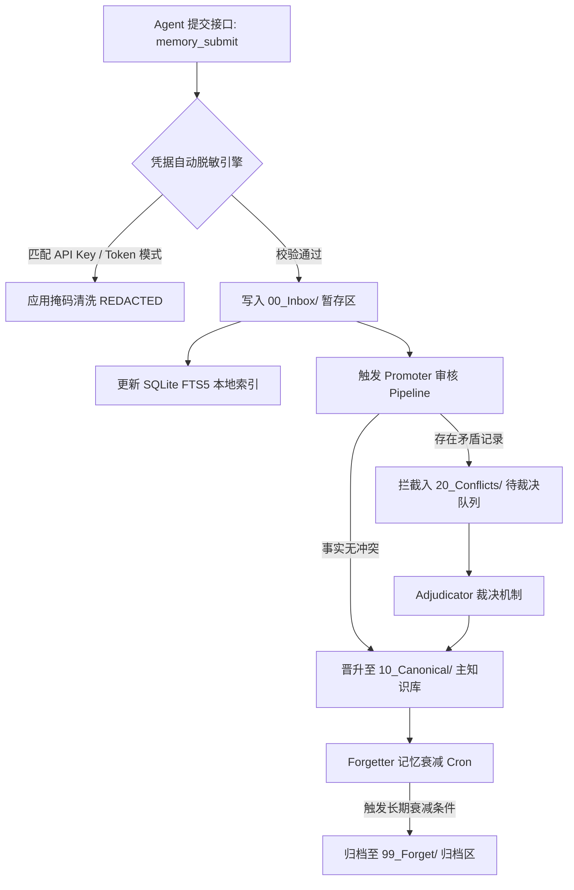
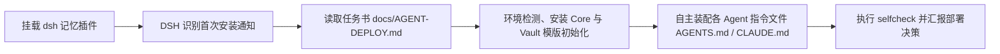

<div align="center">

# 🧠 unified-agent-memory

### *Unified Fleet-Wide Agent Memory System for DeepSeek Harness & Multi-Agent Runtimes*

*跨 Agent 统一持久化记忆系统 — 基于 Obsidian Vault 存储规范与 SQLite FTS5 本地索引的知识生命周期管理基座*

[](https://www.npmjs.com/package/dsh-unified-agent-memory)
[](LICENSE)
[](#)
[](#)
[](#)

[产品定位与问题定义](#-产品定位与问题定义) • [核心技术优势](#-核心技术优势) • [Obsidian 存储规范](#-obsidian-vault-存储结构规范) • [Agent 全流程自动部署](#-agent-全流程自动部署流程) • [生命周期控制流](#-知识生命周期控制流) • [安全隔离与防护机制](#-安全隔离与凭据脱敏机制)

</div>

---

## 📌 产品定位与问题定义

传统 Agent 记忆插件多数绑定于特定的 Agent 运行时（Single-Agent Scope），其存储空间与会话相互隔离，缺乏统一的状态持久化与跨代理知识共享能力。

**`unified-agent-memory` 架构旨在为多 Agent 舰队提供统一的知识管理基座**：它允许 `dsh`、`Codex`、`Claude Code` 与 `Hermes` 等多个独立代理共享基于 Markdown 规范的 Obsidian Vault 知识仓库，配合纯 Python 标准库核心与 SQLite FTS5 本地索引，构建涵盖**知识摄取 (Ingestion)、知识晋升 (Promotion)、冲突裁决 (Adjudication) 与衰减遗忘 (Decay/Retention)** 的全闭环生命周期管理系统。

核心与 DSH 适配器分层维护，具体职责和写入边界见
[docs/DSH-MEMORY-ADAPTERS.md](docs/DSH-MEMORY-ADAPTERS.md)。该文档明确区分
`unified-agent-memory`、`dsh-hermes-memory` 与 `dsh-memory-discipline`。

---

## 🚀 核心技术优势

- **统一单一真理来源 (Shared Source of Truth)**  
  全 Fleet 代理共享一致的 Markdown 知识库规范。开发者与用户可直接借助 Obsidian 等编辑器可视化审计、人工校验或修改代理积累的知识节点。
- **纯 Python 标准库核心 (Zero-Dependency Engine)**  
  `core/` 模块完全基于 Python 标准库（`sqlite3`, `json`, `hashlib`, `argparse`, `os`）实现，无外部依赖开销，具备毫秒级冷启动性能。
- **SQLite FTS5 本地全文索引 (Local-First High-Performance Search)**  
  检索索引持久化存储于本地 `~/.unified-memory/index-<vault-hash>.db`，按 Vault 隔离；基于 SQLite FTS5 引擎实现毫秒级全文匹配与相关度计算，数据隐私完全归属于本地宿主机。
- **提示词隔离防护与凭据脱敏 (Prompt Injection Defense & Redaction)**  
  检索输出强制采用 `<memory-data>` 安全隔离标记包装，明确提示 LLM 区分数据上下文与系统指令；知识摄取前自动对敏感凭据（API Keys/Tokens）执行掩码清洗。
- **完整知识生命周期控制 (Full Lifecycle Pipeline)**  
  内置完整的状态流转机制：包含写收件箱暂存、Promoter 知识审核归纳、Adjudicator 冲突事实裁决、Atomic Lock 并发文件锁与 Forgetter 定期记忆衰减归档。
- **混合检索 (Hybrid Retrieval)**  
  `memory search --hybrid` 融合三重流：BM25 词法 + 语义向量 + 概念图谱，加权 RRF 融合、同文档多样化、Token 预算裁剪。无向量时自动回退纯 BM25。
- **语义向量层 (Semantic Embeddings, 可选)**  
  `memory embed` 用 SiliconFlow `Qwen/Qwen3-Embedding-4B`(1024 维)给每条记忆生成向量，本地 SQLite 存储；搜索“换措辞”也能命中同义事实。API key 存于 `~/.unified-memory/secrets.yaml`(0600/用户 ACL)，失败静默降级。
- **会话自动提炼 (Session Digest, 默认开启)**  
  `memory digest` 用轻量 LLM 从历史会话归档提炼持久事实，脱敏后写入提交区，经 Promoter 正常晋升；按日期游标幂等，可 `--dry-run` 预览、`--off` 关闭。
- **版本化取代 (Supersession)**  
  Promoter 识别“改用/迁移到/instead of”等取代信号时，把旧事实移入该笔记 `已取代` 小节并保留历史，索引标记旧行 `superseded`，检索只返回最新。
- **智能遗忘评分 (Salience × Decay × Reinforcement)**  
  Forgetter 从“90 天未用”升级为 `重要性 × (持久地板 + 时间衰减) + 访问强化`：偏好/架构/规则等高价值记忆长期保留，普通事实随时间衰减，始终可逆。

---

## ⚖️ 系统特性对比 (Feature Matrix)

| 特性维度 | 🧠 unified-agent-memory | ❌ 单 Agent 存储插件 (dsh-mnemon 等) | ❌ 外部向量桥接器 (sgme 等) |
|---|---|---|---|
| **跨 Agent 共享粒度** | 全 Fleet 共享 (dsh/Codex/Claude/Hermes) | 强绑定单一 Harness 运行时 | 依赖集中式向量数据库中转 |
| **核心组件依赖** | 纯 Python 标准库，无第三方依赖 | 依赖 Host 宿主插件环境 | 需要部署额外的数据库中间件 |
| **生命周期控制能力** | 包含 摄取/晋升/裁决/遗忘 全链路 | 通常仅具备 存储+召回 基础功能 | 仅实现向量空间映射 |
| **知识可视化与可介入性** | Obsidian 原生 Markdown，人类直接可读 | 数据库黑盒 / 私有 JSON 格式 | 向量数据结构不可直观校验 |
| **安全审计与防护机制** | 标签隔离包装 + 凭据正则自动脱敏 | 依赖上层应用手工干预 | 易在向量库中泄露明文凭据 |

---

## 📂 Obsidian Vault 存储结构规范

系统自动在指定目录生成标准化 Obsidian Vault 存储层层级。事实总库位于 `50-Agent-Context/`：

```text
50-Agent-Context/
├── 上下文索引.md          # 话题 → 文件映射表（入口）
├── 我的偏好摘要.md         # L3 用户画像：偏好/风格/语言
├── 常用路径与环境.md       # L3 画像：路径/版本/环境/服务器
├── 工程执行规则.md         # L3 画像：工程规则/验证红线
├── UI审美准则.md           # L3 画像：界面与设计偏好
├── 工具可用性检查.md       # L3 画像：工具/服务状态
├── Codex-Claude-Hermes协作规则.md  # L3 画像：多 Agent 协作边界
├── Agent提交区/           # 写入口：<agent>-<时间戳>.md（唯一写入通道）
│   └── 已处理/            # 晋升后归档留痕
├── 情境信息/              # L2：待晋升清单 / 冲突待裁决 / 已裁决 / 未归类
├── 记忆遗忘区/            # 衰减降级（可逆，不删除）
├── 会话归档/              # L0：脱敏会话历史
└── Hermes会话自动归档/     # L0：Hermes 每日会话归档
```

> 记忆数据库（派生副本）在 `~/.unified-memory/index-<vault-hash>.db`：docs / FTS5 /
> memories（逐行记忆，带类型/重要性/版本/来源）/ embeddings（向量，可选）/ 图谱 / 审计。

---

## 🏗️ 知识生命周期控制流



---

## 🤖 Agent 全流程自动部署流程 (Agent-Driven Automated Deployment)

将多 Agent 接入统一记忆系统涉及跨代理配置文件（`AGENTS.md` / `CLAUDE.md` 等）的规则注入与校验。根据项目原生架构设计，**部署工作完全由 AI Agent (DSH) 主导并自动执行**，无需手动修改环境规则文件。



### 1. DSH 自主部署流程 (官方推荐机制)

1. **挂载插件**：在 DSH 环境中执行插件添加：
   ```bash
   dsh plugin --profile web add dsh-unified-agent-memory
   ```
2. **状态感知**：在接下来的 DSH 会话中调用 `memory_status`。全新安装状态下，系统将自动输出部署提示并引导定位至 [docs/AGENT-DEPLOY.md](docs/AGENT-DEPLOY.md)。
3. **全自动装配执行**：由 DSH 自主读取部署任务指南并按顺序完成：
   - 检查并初始化 Obsidian Vault 存储目录与 SQLite FTS5 索引。
   - 安装 Python 核心 Engine 包。
   - 自动将统一记忆规则写入每个已感知的 Agent 配置文件中（包含 `~/.dsh/AGENTS.md`、`~/.codex/AGENTS.md`、`~/.claude/CLAUDE.md` 及 Hermes 规则文件）。
   - 规则注入具备幂等性防护与自动备份机制，装配完成后自动触发 `selfcheck` 进行校验。

### 部署决策决策表 (Agent 自动裁定)

部署任务书中已完备封装决策矩阵，DSH 在无人工干预下可根据环境自主判定：

| # | 部署决策项 (Decision Item) | 默认裁定策略 (Default Strategy) |
|---|---|---|
| 1 | **主控 Agent (Main Agent)** 归属（负责每日晋升 Cron 调度） | 优先分配给 Hermes，若未检测到则分配给部署 Agent |
| 2 | **索引模式 (Indexing Mode)** | 默认采用本地宿主机模式 (`local machine`) |
| 3 | **知识晋升模式 (Promotion Mode)** | 默认采用人工确认模式 (`human-confirmed review`) |
| 4 | **连接 Agent 范围 (Connected Fleet)** | 自动扫描并连接所有已感知的代理（dsh / Codex / Claude / Hermes） |

> **非 DSH 环境部署**：对于通用 AI 编码代理，只需复制 [docs/AGENT-DEPLOY-PROMPT.md](docs/AGENT-DEPLOY-PROMPT.md) 中的 Prompt 发送给 Agent 即可触发全自动部署。

---

## 💻 命令行快速体验 (Manual Quick Start)

```bash
# 1. 克隆仓库并安装 Core
git clone https://github.com/Noelune/unified-agent-memory.git && cd unified-agent-memory
pip install -e ./core

# 2. 初始化 Vault 模版结构
python setup/setup.py init --vault ~/Documents/AgentMemory

# 3. 提交与检索知识测试
memory submit "staging 服务器环境绑定在 127.0.0.1:8080" --agent alpha
memory search "staging 服务器"

# 4. 执行 Promoter 归纳与应用
python -m unified_memory.promoter --review
python -m unified_memory.promoter --apply
```

完整指南：[docs/DEPLOY.md](docs/DEPLOY.md) · 系统架构：[docs/ARCHITECTURE.md](docs/ARCHITECTURE.md) · 安全文档：[docs/SECURITY.md](docs/SECURITY.md)

---

## 🚫 没有 Hermes / 任何 Agent 运行时怎么办？(Standalone — no Hermes required)

**核心完全不依赖 Hermes 或任何 Agent 运行时**——vault、inbox、promoter、forgetter、SQLite FTS5 索引都是纯 Python 标准库，直接当命令行工具用即可：

```bash
# 一个完整的"人肉"工作流，无需任何 agent：
python setup/setup.py init --vault ~/Documents/AgentMemory   # 1. 初始化 vault
memory submit "the build server is at 127.0.0.1:8080" --agent you   # 2. 写一条事实
memory search "build server"                                # 3. 检索（FTS5 本地索引）
python -m unified_memory.promoter --review                   # 4. 生成待晋升清单
python -m unified_memory.promoter --apply                    # 5. 晋升进 canonical
python -m unified_memory.forgetter --apply                   # 6. 定期衰减遗忘（可选）
```

对接你自己的运行时（不一定是 Hermes）只需要三件事：

1. **写**：调 `memory submit`（或 dsh 插件的 `memory_submit`）。
2. **定期晋升（需要 Agent 参与，不是裸脚本）**：在你部署环境里**指定一个带调度/定时功能的 Agent**（dsh、Codex、Claude Code、Hermes 中任一）负责每日晋升——由它运行 `python -m unified_memory.promoter --review` **先审核待晋升清单**、`adjudicate` 裁决冲突、再 `--apply` 晋升，并做错过补跑。只有当部署里**完全没有**带调度能力的 Agent 时，才退回用系统 cron 跑 `daily_cron.py` 脚本兜底。
3. **读/注入**：参考 `integrations/hermes/README.md` 的 hook 草图，把 `memory search` / `memory show` 的输出包进 `<memory-data>` 注入到你的系统提示——那个模式适用于任何 Python 运行时。

Hermes 集成（`integrations/hermes/`）只是"其中一个 Agent 接进来"的可选示例，不是前提条件。详细说明见 [docs/DEPLOY.md](docs/DEPLOY.md) 的 *Full mode* 章节。

---

## 📂 仓库目录结构 (Repository Layout)

| 路径 | 功能说明 |
|---|---|
| `core/` | 零第三方依赖 Python 包：包含 `memory.py` (初始化/检索/查看/提交), `promoter.py` (审核/应用/裁决), `forgetter.py` (衰减归档), `conflict.py` (冲突判定) |
| `vault-template/` | 即用型 Obsidian Vault 模版：包含 7 份标准化 Canonical 笔记、`00_Inbox` 提交区、情境信息与记忆遗忘区 |
| `lib/` | dsh 插件核心：提供 `memory_search` / `memory_show` / `memory_submit` / `memory_status` 工具接口 |
| `integrations/` | 提供 `AGENTS.md` (Codex), `CLAUDE.md` (Claude) 与 Hermes Hook 集成示例 |
| `setup/` | 部署与自检脚本 `setup.py` (init/cron/selfcheck) 与 `selfcheck.py` |
| `docs/` | ARCHITECTURE (系统架构), DEPLOY (部署指南), SECURITY (安全规范) |

---

## 🔧 环境要求 (Requirements)

- Python ≥ 3.10 (核心 Engine，仅需 Python 标准库)
- Node.js ≥ 20 + dsh 0.1.0-rc.6 (仅 dsh 插件需要)
- 推荐使用 Obsidian 浏览和查看 Vault 知识库，但非强制要求 — 所有文件均为标准 Markdown 与 SQLite 数据库。

---

## 📌 维护状态 (Maintenance Status)

- **Maintainer**: [Noelune](https://github.com/Noelune)
- **Community-maintained** — 欢迎提交 Issue 与 Pull Request。缺陷修复通常在 1–2 周内处理，安全问题优先解决。
- **Compatibility**: 基于 **dsh 0.1.0-rc.6** 进行测试验证。上游 API 变更说明记录于 [CHANGELOG.md](CHANGELOG.md)。
- **License**: **MIT License** — 允许商业化使用。

---

## 🛡️ 安全规范 (Security)

详细说明请参阅 [docs/SECURITY.md](docs/SECURITY.md)。

* 存储隔离：Vault 内部存储的所有内容均被视为纯文本数据（Data），绝不可直接作为推理指令执行。
* 凭据保护：敏感凭据在进入 Vault 存储前必须经过脱敏过滤，默认索引数据库仅在本地宿主机进行持久化。
* 审核机制：知识晋升过程默认采用人工确认模式，结合原子文件锁与原子写入确保并发控制安全。

---

## 🤝 贡献指南 (Contributing)

欢迎提交 Pull Request。提交前请确保运行核心测试套件（`python -m unittest discover -s core/tests`）。项目的 CI 流程会在每次 Push 时自动执行测试、代码密钥扫描（gitleaks）与开源许可证合规检查。
