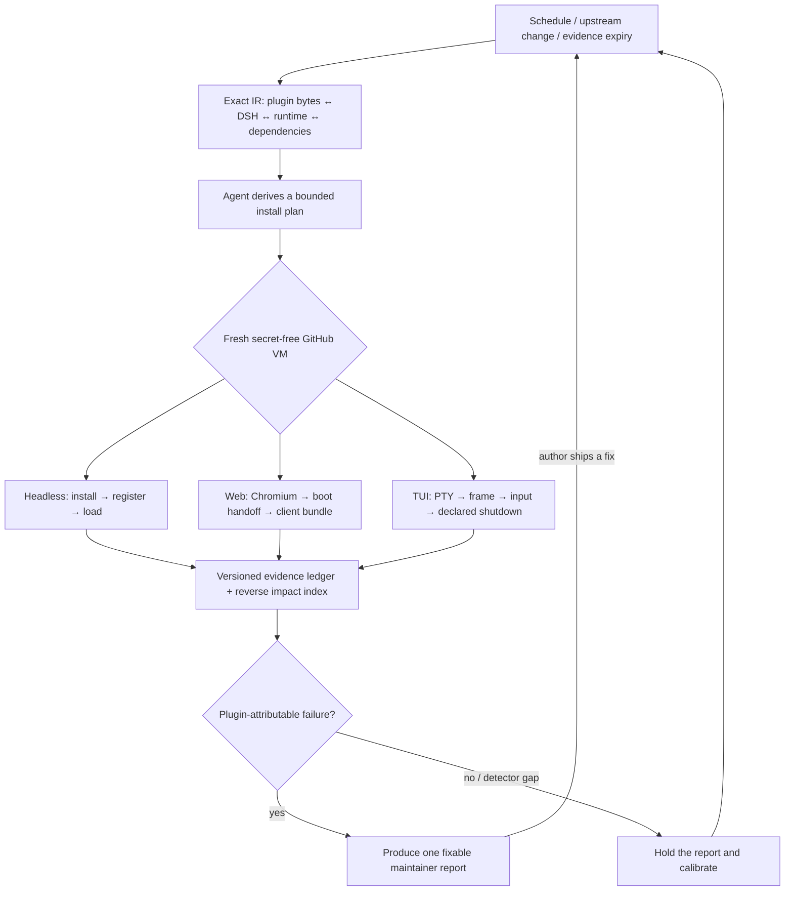

<h1 align="center">Upstream Radar</h1>

<p align="center"><strong>Always-on compatibility testing for DeepSeek Harness plugins—across headless, Web, and TUI.</strong></p>

<p align="center">
  <a href="README-zh-CN.md">简体中文</a> ·
  <a href="https://github.com/MicroMilo/upstream-radar/actions/workflows/ci.yml"></a>
  <a href="https://www.npmjs.com/package/upstream-radar"></a>
  <a href="https://github.com/MicroMilo/upstream-radar/stargazers"></a>
  <a href="LICENSE"></a>
</p>

Upstream Radar binds exact plugin bytes to an exact DSH host and runtime, lets an
Agent derive a bounded environment from repository instructions and prior
evidence, then proves the relationship in disposable GitHub VMs. It runs again
when the ecosystem changes **or evidence expires**, so it tests the current
version—not only the diff.

It is built for the [DeepSeek Harness (DSH)](https://github.com/deepseek-ai/deepseek-harness)
plugin ecosystem. A static review is evidence about a package; an isolated
runtime review is evidence about one exact `plugin × DSH × Node/profile` pair.
Neither is presented as a timeless compatibility badge or a security certificate.

> Listed by the DSH ecosystem in
> [awesome-dsh-plugin](https://github.com/awesome-dsh-plugin/awesome-dsh-plugin/blob/main/data/plugins/MicroMilo__upstream-radar.yml),
> [awesome-deepseek-harness](https://github.com/0xsline/awesome-deepseek-harness), and
> [awesome-deepseek-harness-plugins](https://github.com/imsai-sh/awesome-deepseek-harness-plugins/blob/main/catalog/plugins/micromilo--upstream-radar.json).

## The problem

A source repository can be green while the package users install is not ready
for the current DSH host:

- the README advertises a version that was never published;
- a plugin imports a newer DSH package than its peer range allows;
- `package.json` and the lockfile describe different releases;
- an install-time build or dependency script needs tools the user does not have;
- a DSH host dependency is missing, so the dependency graph cannot be completed.

These are ecosystem relationship problems. They are easy to miss when the two
repositories are checked separately.

## What Radar does

1. **Build one exact compatibility record (IR).** Align the npm artifact,
   source commit, DSH host, runtime/profile, dependency paths, and advisories.
2. **Derive the environment.** An Agent reads declared installation guidance
   and failed evidence, then emits only a bounded install plan.
3. **Prove each execution plane.** Fresh, secret-free runners exercise headless
   load, Chromium Web boot, or a real PTY TUI interaction.
4. **Keep the result alive.** DSH/plugin/dependency changes and evidence expiry
   trigger retests; confirmed failures become fixable reports and clean retests
   close the loop.



The Agent may choose declared build packages, profile setup, and the next bounded
retry. Exact fingerprints decide which cell a report can satisfy, and the
disposable runner—not the model—establishes the result. Missing evidence can
never become a pass.

## Try a real check

No local DSH profile is needed for this first check. It reviews one exact
published artifact without executing plugin code:

```bash
npx --yes upstream-radar@0.45.0 inspect \
  @sanqi-normal/dsh-webui-market-plugin@0.5.4 \
  --deep --fail-on never
```

This historical DSH plugin release returns `review / incomplete` because its
published host dependency chain reaches an unavailable package. That is a
useful, reproducible release/host-contract report—not a claim of malicious
behavior. See the [full evidence report](examples/dsh/reports/sanqi-market-plugin-dependency-resolution.md).

To review your own public repository without installing it:

```bash
npx --yes upstream-radar@0.45.0 scan \
  https://github.com/owner/dsh-plugin \
  --fail-on never
```

The repository scan reads source manifests, DSH metadata, and lockfiles. It does
not install dependencies, run lifecycle scripts, load the plugin, start DSH, or
call an LLM.

## Run it on every change

Copy one of the maintained workflows into your repository:

- [Review one exact plugin across DSH versions](examples/github-actions/dsh-plugin-review-minimal.yml)
  — a manual check with artifact evidence and an isolated load matrix.
- [Observe one plugin repository every day](examples/github-actions/upstream-observer-minimal.yml)
  — compares commits, published versions, manifests, and dependency graphs, then
  wakes an Agent only when there is a meaningful change.
- [Run the dependency gate in CI](examples/github-actions/upstream-radar.yml)
  — checks the lockfile or reviewed Radar configuration before merge.

The isolated [headless](.github/workflows/observe-dsh-plugin-install.yml) and
[Web/TUI](.github/workflows/observe-dsh-plugin-surface.yml) observers use fresh
GitHub-hosted runners. They are not your workstation and receive no project or
model secrets.

## Evidence from the ecosystem

The current [100-plugin compatibility feed](feeds/dsh-plugin-compatibility.md)
records **87 observed compatible, 9 needs review, 0 reproduced incompatible,
and 4 not observed**. Its execution-plane ledger contains 22 exact Web/TUI
cells; all 22 now pass in isolated GitHub VMs.

The nine review cells are not hidden failures. Seven have a green Web proof but
retain separate headless host/peer-contract evidence; two retain known old DSH
host-package ranges tracked by existing maintainer issues. Radar keeps those
facts visible without calling a working browser plugin broken.

The first non-headless cells now run in GitHub-hosted VMs:

| Exact cell | Observed proof | Result |
| --- | --- | --- |
| [`dsh-univer-office@0.2.9 × DSH 0.1.1-rc.2 × Web`](https://github.com/MicroMilo/upstream-radar/actions/runs/32823035297/job/97726205358) | HTTP 200, DSH boot handoff, declared client bundle fetched, no browser/page errors | **Compatible** |
| [`@deepseek-harness-tui/dsh-tui@0.9.2 × DSH 0.1.1-rc.2 × TUI`](https://github.com/MicroMilo/upstream-radar/actions/runs/32823035297/job/97726205289) | Real PTY frame, keyboard input, documented double-Ctrl-C exit, code 0 | **Compatible** |
| [`@linxin666/dsh-web-all@0.3.3 × DSH 0.1.1-rc.2 × Web`](https://github.com/MicroMilo/upstream-radar/actions/runs/32828788296/job/97742850608) | Agent-approved four dependency builds; aggregate client bundle returned 200; boot manifest, app mount, and plugin materialization matched | **Compatible** |
| [`dsh-better-sidebar@0.16.1 × DSH 0.1.1-rc.2 × Web`](https://github.com/MicroMilo/upstream-radar/actions/runs/32835449819/job/97763410354) | VM observed a `node-pty` build gate; DeepSeek approved only that exact dependency; the secret-free retry passed install, host, browser interaction, and shutdown | **Compatible** |

The `better-sidebar` run demonstrates the closed loop: dynamic evidence found a
build requirement absent from the headless plan; DeepSeek checked the exact
manifest, README, and VM log; a fingerprint-bound policy approved only
`node-pty`; then a separate runner with no model secrets established the pass.
This was Radar's environment gap, so no plugin issue was filed. Earlier TUI and
Web detector mistakes were handled the same way: held, corrected, and rerun
instead of being sent to authors.

As of 2026-08-25, Radar has filed 13 maintainer-facing reports. The outcome is
more useful than the raw count:

| Outcome | Reports |
| --- | --- |
| **Fix shipped and rechecked (5)** | [Sanqi #5](https://github.com/Sanqi-normal/dsh-webui-market-plugin/issues/5) (`0.5.5`), [HDC #3](https://github.com/1na-ko/dsh-hdc-bridge/issues/3) (`0.7.3`), [Voice #2](https://github.com/3274375092/dsh-voice/issues/2) (`0.2.6`), [Msg Hub #1](https://github.com/AbcdefgXW/dsh-msg-hub/issues/1), [Toolbox Web #1](https://github.com/AbcdefgXW/dsh-toolbox-web/issues/1) |
| **Boundary reviewed or documented (3)** | [Msg Hub #3](https://github.com/AbcdefgXW/dsh-msg-hub/issues/3), [Spotlight #5 / PR #7](https://github.com/0xsline/dsh-spotlight/pull/7), [WSL Workspace #6](https://github.com/6Mikao9/dsh-wsl-workspace/issues/6) — closed without claiming a runtime fix |
| **Still open (5)** | [Anan #1](https://github.com/AmeKrance/anan-thermal-monitor/issues/1), [Verification Receipt #3](https://github.com/030611/dsh-verification-receipt/issues/3), [dshscan #1](https://github.com/shaoshi20/dshscan/issues/1), [OAuth #14](https://github.com/lninghaha/dsh-coding-subscription-oauth/issues/14), [Composer Expand #1](https://github.com/13071301808/dsh-composer-expand/issues/1) |

“Closed” is not automatically “fixed.” The [full domain report index](docs/domain-reports.md)
records the evidence, validation level, PR coverage, and remaining boundary for
every report.

<p align="center">
  <strong>If Upstream Radar helps the DSH ecosystem stay compatible, <a href="https://github.com/MicroMilo/upstream-radar">please give it a Star</a> ⭐</strong>
</p>
