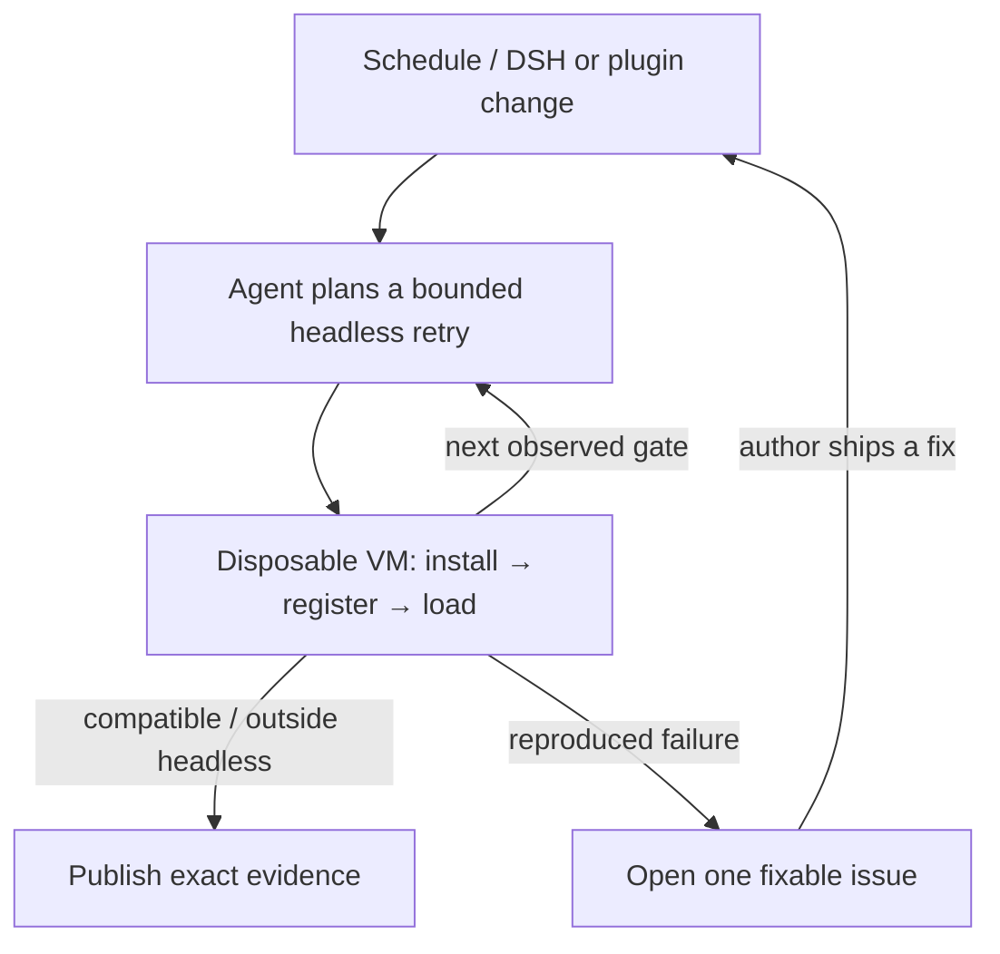

<h1 align="center">Upstream Radar</h1>

<p align="center"><strong>Know which DeepSeek Harness plugins break after every release—before users do.</strong></p>

<p align="center">
  English · <a href="README.zh-CN.md">简体中文</a>
</p>

<p align="center">
  <a href="https://github.com/MicroMilo/upstream-radar/actions/workflows/ci.yml"></a>
  <a href="https://www.npmjs.com/package/upstream-radar"></a>
  <a href="https://github.com/MicroMilo/upstream-radar/stargazers"></a>
  <a href="LICENSE"></a>
</p>

Upstream Radar continuously retests a maintained fleet of exact published
plugins against changing
[DeepSeek Harness (DSH)](https://github.com/deepseek-ai/deepseek-harness)
releases in disposable runners. When a pair breaks, it produces a reproducible
issue; when the author ships a fix, it retests and closes the loop.

**100 maintained install/load targets · 100 catalog entries across all 21 categories · 4 upstream reports closed**

[Latest Agent-driven headless run](https://github.com/MicroMilo/upstream-radar/actions/runs/32684879130):
**96 executable catalog cells observed · 74 compatible · 22 need review · 0 reproduced incompatibilities · 4 source-only**.
Review signals are never advertised as plugin failures.

The first live loop started with 29 review cells. The Agent selected nine
bounded retries; seven became compatible, while two stopped at an explicit Web
client dependency boundary instead of being mislabeled as broken.

## Why it exists

A healthy repository does not prove that its published plugin still works.
The artifact users install must resolve against a specific DSH host, Node
runtime, profile, and dependency set—and any of them can change overnight.

Upstream Radar checks the relationship, not just the two repositories. A local
pre-publish check asks, “does this plugin pass today?” Radar asks, “which
maintained plugins stopped passing after the ecosystem changed?”

## The loop



The Agent interprets repository instructions and the latest runtime evidence,
then chooses whether and how headless should retry. The disposable runner—not
the model—establishes the result. A model cannot invent a build package, execute
inside the target VM, or turn missing evidence into a pass.

## What you get

- An exact result for `plugin version × DSH version × Node/profile`, not a
  timeless “compatible” badge.
- Agent-planned follow-ups joined with real install/register/load evidence from
  the published artifact.
- A maintained result that is retested when DSH or the plugin changes.
- One managed issue that is updated on repeat failures, reopened on regression,
  and closed after a clean retest.

## Upstream reports now closed

We opened the following reports; their upstream maintainers have now closed
them:

- [Sanqi-normal/dsh-webui-market-plugin#5](https://github.com/Sanqi-normal/dsh-webui-market-plugin/issues/5)
- [1na-ko/dsh-hdc-bridge#3](https://github.com/1na-ko/dsh-hdc-bridge/issues/3)
- [6Mikao9/dsh-wsl-workspace#6](https://github.com/6Mikao9/dsh-wsl-workspace/issues/6)
- [3274375092/dsh-voice#2](https://github.com/3274375092/dsh-voice/issues/2)

## Run one check

```bash
npx --yes upstream-radar@0.43.0 review dsh-plugin \
  <package>@<version> \
  --dsh-version <dsh-version>
```

For code-executing checks, use the maintained
[isolated observer workflow](.github/workflows/observe-dsh-plugin-install.yml):
each pair receives a fresh, secret-free GitHub-hosted VM and restricted
container.

Inspect the [live compatibility matrix](examples/dsh/install-observer/README.md),
the [directory-consumable evidence feed](feeds/dsh-plugin-compatibility.md),
the [first 50-plugin corpus](examples/dsh/first-batch/README.md), or the
[architecture notes](docs/architecture.md).

<p align="center">
  <strong>If Upstream Radar helps the DSH ecosystem stay compatible, <a href="https://github.com/MicroMilo/upstream-radar">please give it a Star</a> ⭐</strong>
</p>
